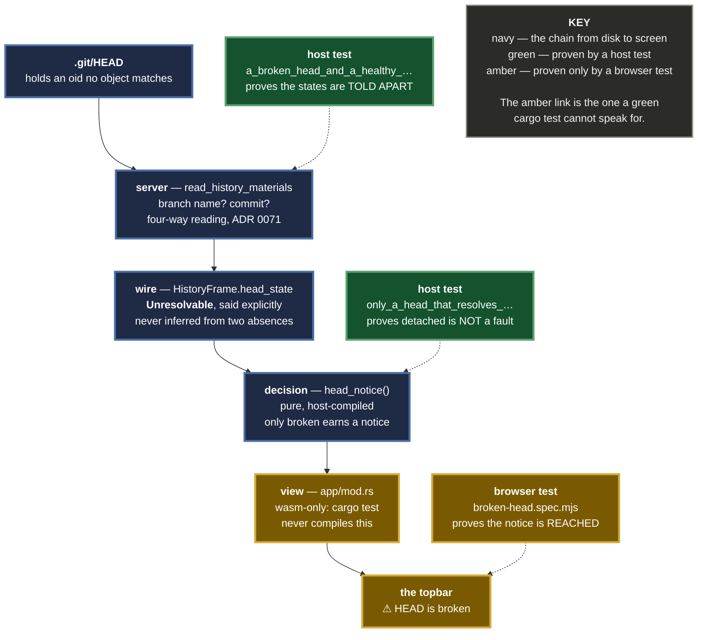

# 0072 — HEAD's state is said on the wire, because an absent branch name means two opposite things

**Status:** Accepted — implemented and tested
**Date:** 2026-08-24
**Issue:** [#473](https://github.com/tom2025b/Git-Vista/issues/473) · the gap [ADR 0071](0071-a-badge-is-a-claim-about-a-commit.md) recorded and deferred

---

## Context

ADR 0071 settled that a HEAD which resolves to nothing is **recorded** (`HeadAtEvent::Unresolvable`) rather than **badged**. It also recorded, plainly, that this was *option B for everything the user sees* — because `HeadAtEvent` never leaves the journal-capture path, and the live payload could not carry the distinction.

That left one field doing two jobs:

| Repository state | `head_branch` | What the topbar drew |
|---|---|---|
| detached at a real commit — **normal** | `null` | nothing |
| HEAD resolves to nothing — **broken** | `null` | nothing |

The user most needs to be told in the second row, and the app was at its quietest there. A dangling HEAD is what a repository looks like mid-recovery, after a bad manual ref write, or when the object a detached HEAD pointed at has been garbage-collected.

---

## Decision

### D1 — The state is a field, not an inference

`HistoryFrame` gains `head_state: HeadState` — `OnBranch`, `Detached`, `Unborn`, `Unresolvable`, `Unknown`.

After ADR 0071 the client *could* infer it: no branch name **and** no `Head` ref means unresolvable, because a dangling HEAD is no longer badged. That inference is rejected. It is the shape ADR 0068 refuses — a state read from the absence of two other things is a state nobody can find when it is wrong, and it silently couples the topbar to a badging rule that exists for unrelated reasons.

### D2 — The vocabulary lives in the protocol crate

`git-vista-protocol` is pure and wasm-safe and deliberately carries no dependency on `git-vista-core`; the envelopes are generic over their domain types for exactly that reason. So `HeadAtEvent` — which lives in core, and is journal-shaped, carrying oids — is not the type to put on this wire.

`HeadState` is its own small enum with no oids: the frame already carries `head_branch` and the refs. The server maps between them in four lines, with the same four-way reading `read_refs_at` applies (ADR 0071).

### D3 — `Unreadable` is deliberately absent

When `.git/HEAD` itself will not read, `read_history_materials` fails the whole request: the user gets an error, not a frame. There is no frame in which that state could be reported, so there is no variant for it. **A variant that cannot occur is vocabulary nobody can trust** — the same reasoning ADR 0070 applied to capture fields that must not claim more than they observed.

### D4 — A missing field reads as `Unknown`, never as healthy

`#[serde(default)]` with `Unknown` as `Default`. The frontend ships compiled into the server, so skew is narrow — but a browser holding a stale bundle is a real state on this box, and the failure must be "say nothing", never "claim HEAD is fine".

### D5 — Only the broken state earns a notice

`Detached` is ordinary and deliberate and gets no label. A warning that fires on healthy repositories is a warning nobody reads, and labelling every branchless HEAD would have satisfied a naive test while making the app worse.

### D6 — The decision is host-tested; the wiring is browser-tested

`head_notice` is a pure function in its own module, **not** a `match` inside the view: `mod app` is `#[cfg(target_arch = "wasm32")]`, so anything decided inside it can never be host-tested — and "renders nothing" is precisely the defect being fixed. The same posture as `hook_policy_disclosure`.

A host test cannot prove the decision is *reached*, so a fifth browser fixture — a repository whose `.git/HEAD` holds an oid nothing resolves — proves the notice appears there and **does not** appear on a healthy repository.

The diagram at the end of this section shows where each layer is proven.

---

## Alternatives considered

| Option | Why not |
|---|---|
| **Infer it client-side** from "no branch and no HEAD ref" | Works today only because ADR 0071 stopped badging a dangling HEAD. Couples the topbar to a badging rule that exists for other reasons, and ADR 0068 refuses states read from absences. |
| **Put `HeadAtEvent` on the wire** | It lives in `git-vista-core`, which the protocol crate deliberately does not depend on, and it is journal-shaped — it carries oids the frame already has. |
| **A `head_unresolvable: bool`** | Answers one question and forecloses the others. The issue's own requirement was that the three `null` rows be *distinguishable*, not that one be flagged. |
| **Label detached too** | Cries wolf on an ordinary state. See D5. |
| **Decide inside the view** | Untestable on the host, which is how the original defect survived. See D6. |

---

## Consequences

**Good**

- A broken repository says it is broken, in the place the user is already looking.
- The three states that share `head_branch: null` are distinguishable on the wire, so future surfaces need no new server work.
- The wire change is additive: one field, defaulted. Old clients ignore it; new clients tolerate its absence.

**Bad, and accepted**

- One more field on a frame fetched once per view. It is a short enum string.
- `Unreadable` remains unreportable in a frame (D3). If that request-level error is ever softened, this enum will need the variant — and that is the moment to add it, not before.
- The notice is text in the topbar, not a guided explanation. #141's status-chip panel is where a fuller "here is what happened and what to do" belongs.

---

## Evidence

- Golden wire fixture regenerated deliberately; the diff is exactly one additive line, `"head_state": "on_branch"`.
- Two mutations, both `caught`, conclusive, failing in **different layers**:

| Mutation | Fails on |
|---|---|
| server maps `(None, None)` to `Detached` | the states collapse — `assert_ne!` on the frame |
| `head_notice` returns the notice for `Detached` too | an ordinary state reported as a fault |

- Browser: the notice appears on the broken fixture and is absent on the healthy one. The second assertion is the load-bearing one.
- `./dev gate` green, all six legs.
