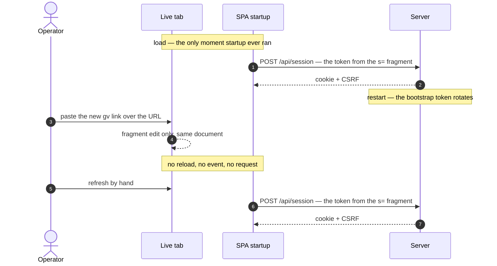
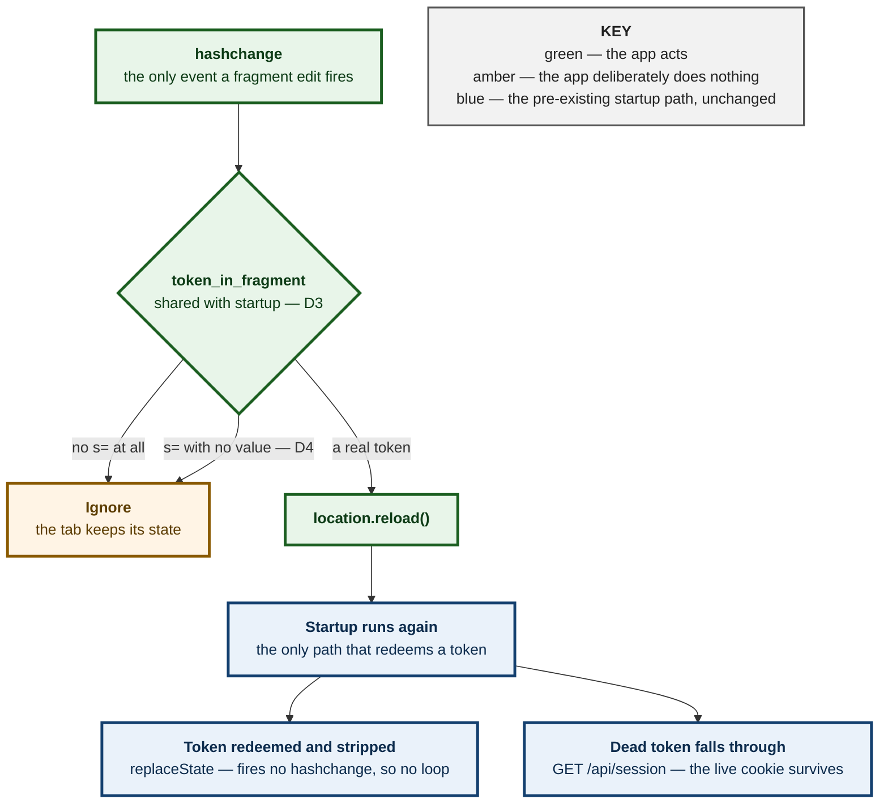
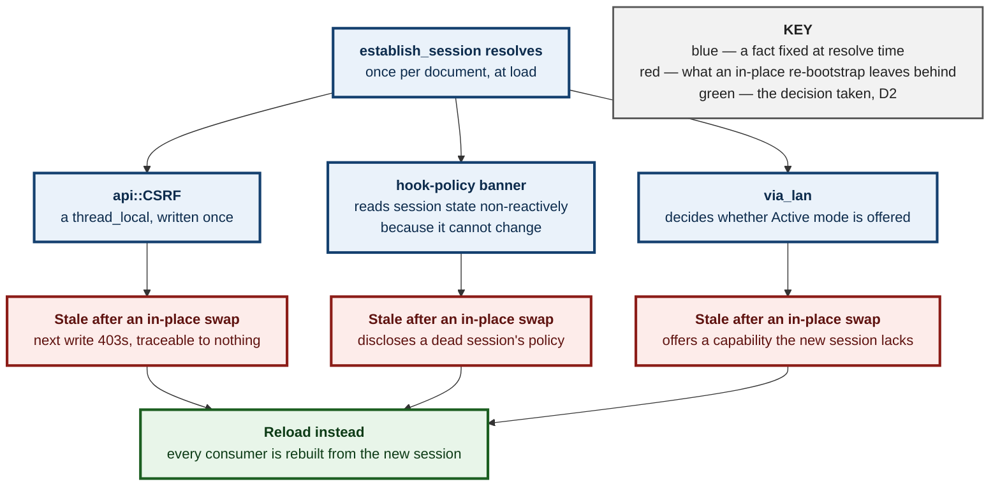

# 0073 — A pasted token re-runs startup, because a fragment edit is not a navigation

**Status:** Accepted — implemented and tested
**Date:** 2026-08-25
**Issue:** [#392](https://github.com/tom2025b/Git-Vista/issues/392) · builds on [ADR 0005](0005-lan-view-profile.md) (the session shape) and the M1.04 bootstrap flow

---

## Context

The `gv` launcher prints `http://localhost:8080/#s=<token>`. The token rides in the URL **fragment**, which the browser never sends to the server — that is the whole reason it is a fragment and not a query parameter. The SPA reads it once, exchanges it for an HttpOnly session cookie, and strips it from the address bar.

"Once" is the defect. Pasting a fresh link over the URL of a tab that is **already open** edits only the fragment, and a fragment edit is a *same-document navigation*: nothing reloads, no code runs, and `establish_session` — which ran at load and resolved long ago — is never asked again. The token sits visibly in the address bar and the app does nothing at all.

Three things made this cost an hour of the owner's time rather than a minute:

- **The workaround looks like the fix.** A manual refresh re-runs startup with whatever fragment is present, so the *second* thing you try appears to be the answer, and the first thing (pasting) appears to have worked eventually.
- **Opening the link in a new tab works**, which reads as "the link is fine, something is flaky" rather than "the app ignores pasted links".
- **It only bites after a server restart** — and a restart is exactly what rotates the token, so the one moment the operator must paste a new link is the one moment pasting does nothing.

Nothing was broken in the sense of erroring. There was no request, no console message, no failed exchange to find in a log. The app was silent in precisely the way it is silent when everything is fine, which is the same failure shape [ADR 0072](0072-head-state-is-said-on-the-wire.md) recorded in its Consequences.

---

## Decision

### D1 — A `hashchange` carrying a token reloads the page

The app listens for `hashchange`. When the new fragment carries a usable bootstrap token, it calls `location.reload()`. The reload re-runs startup with the fragment intact, and startup does what it has always done: redeem, strip, sign in.

This is deliberately the *user's own workaround*, automated. It adds no new way to authenticate — it adds a way for the existing one to be reached.

### D2 — Reload, never re-bootstrap in place

The alternative is to re-resolve the session while the app is mounted. It is rejected, and the reason is a documented invariant rather than a preference.

`session.rs` states that the per-tab session facts — `via_lan`, the CSRF token, the hook policy — are **fixed once `establish_session` resolves**. Consumers were built on that. `api`'s CSRF token is a `thread_local`; the hook-policy banner reads session state *non-reactively*, with a comment saying it may do so precisely because the value cannot change. A second, in-flight `Established` event would leave each of them holding values belonging to a session that no longer exists — a half-swapped identity on the sign-in path, which is a worse thing to own than a page reload.

A reload has one cost (the tab's transient UI state) and it is the cost the operator already pays today, by hand.

### D3 — One parser, host-tested, shared by both askers

The `#s=` parse moves out of `session.rs` into `bootstrap_fragment.rs`, which is **not** wasm-gated. `mod session` is `#[cfg(target_arch = "wasm32")]`, so the single decision the whole sign-in path turns on had no host test and structurally could not have one.

Two places now ask the question — startup, which redeems, and the listener, which decides whether to reload. Had they each carried their own parse they could disagree, and the disagreement is silent in **both** directions: a listener stricter than startup ignores a usable token, and one looser reloads the page over a fragment startup will then discard. Same posture as `head_notice` (ADR 0072 D6) and `hook_policy_disclosure`.

### D4 — An empty `s=` is not a token

`token_in_fragment("s=")` is `None`, not `Some("")`. The server would refuse the empty string anyway; the caller that matters is the listener, where `Some("")` means destroying a working tab's state over a fragment that could never have signed anyone in.

### D5 — The negative is the load-bearing test

"A pasted token reloads" passes against an app that reloads on *every* fragment change — which would make the address bar unusable for anything else and would be a regression dressed as a fix. The tests that carry weight are the ones asserting a tokenless fragment and an empty `s=` leave the tab alone, and each of those ends by driving a real token through the same detector, so "nothing happened" can never be a broken detector reporting success.

---

## Alternatives considered

**Re-bootstrap in place, without reloading.** The tab keeps its scroll position, its open panel, its selected commit. Rejected per D2: it breaks the "fixed once resolved" invariant that three separate consumers were written against, and each of them fails *quietly* — a stale CSRF token produces a 403 on the next write, not an error anyone can trace back to a paste.

**Re-use the existing retry counter.** `session_attempt` already keys a resource: attempt 0 bootstraps, every attempt after it re-checks. Bumping it on `hashchange` would need a *third* state, because a re-check is a `GET` that deliberately does not redeem a token — that asymmetry exists so a flaky network cannot spend the LAN listener's five-per-minute sign-in budget. Threading "sometimes attempt N is a bootstrap after all" through that resource re-introduces exactly the confusion the two-function split (`establish_session` / `recheck_session`) was written to remove.

**Show a banner: "a token is in the URL — press reload".** Honest, and it changes no code on the security boundary. Rejected as the worse end state: it tells the operator to do the thing the app could have done, at the moment they have already told the app what they want by pasting the link.

**Accept a token from a message, a prompt, or a paste box in the app.** A genuinely new way to authenticate, on a boundary whose whole design is that the token arrives out-of-band through a `0600` file only the same user can read. Out of scope for a defect about a link that already works everywhere else.

---

## Consequences

- **A pasted link now works the way every other link works.** The motion a server restart forces stops being the motion that fails.
- **A reload discards the tab's transient UI state** — open panel, scroll position, selected commit. This is the accepted cost of D2, and it is the cost already being paid manually.
- **A dead or spent token does not sign the tab out.** Startup falls through to `GET /api/session`, the cookie is still live, and the app comes back. Asserted directly, because the alternative — a stray paste locking the operator out of a working session — would be worse than the defect.
- **This cannot loop.** `history.replaceState` does not fire `hashchange`, so the strip that follows redemption is silent, and nothing else in the crate writes `location.hash`. The only source of the event is a person pasting a URL.
- **One stated dependency:** repeated pastes of the *same* link work only because that `replaceState` succeeds. It is best-effort by its own comment; if it fails the fragment lingers, and re-pasting an identical URL is a no-op navigation the browser never reports. Named rather than papered over.
- **Two questions the issue raised are deliberately unchanged.** A token arriving in a tab already authenticated as something else, and a consumed token left in `history`, are whatever startup already makes them — which is the point of choosing reload over a second, parallel sign-in path. Neither is made worse here; neither is settled here.
- **The parse is now host-tested for the first time**, retroactively covering the startup path that has carried it since M1.04.

---

## Evidence

- **Two mutations of the shared parser, both `caught`, conclusive, failing in different layers:**

| Mutation | Fails on |
|---|---|
| drop the `!value.is_empty()` guard | `"s="` yields `Some("")` — an empty token read as real |
| match `key.starts_with('s')` instead of `key == "s"` | `"sort=date"` read as a token |

- **Browser, four assertions:** the paste reloads *and* the reload carries the pasted token in a `POST /api/session`; a tokenless fragment and an empty `s=` each leave the tab alone, each followed by a real token through the same detector; the fragment is empty afterwards, so the token does not linger.
- **The spec was run against a bundle built from the pre-fix commit and fails there**, which is what separates it from a test that merely agrees with the code it was written beside.
- **`harness-selfcheck.spec.mjs` gained the matching entry:** the reload assertion is required to go red when the tab does not reload — the exact shape #392 had for every fragment.
- A reload is detected by a sentinel on `window`, not by a navigation event: Playwright reports same-document navigations too, so an assertion built on those would have passed against the unfixed app.

---

**Signed:** max · 2026-08-25T06:40:00-04:00
