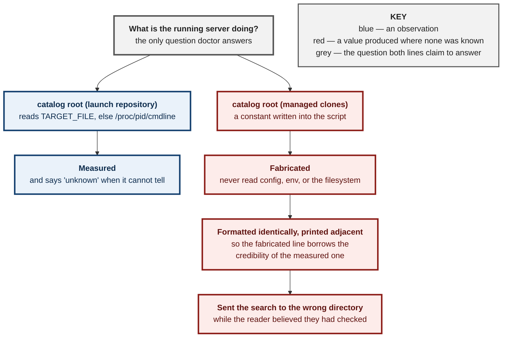

# 0074 — A diagnostic may not fabricate: `doctor` measures, or it says `unknown`

**Status:** Accepted — implemented, tested, and driven against the live server
**Date:** 2026-08-25
**Issue:** [#476](https://github.com/tom2025b/Git-Vista/issues/476)

---

## Context

`gv doctor` exists to answer one question without printing secrets: *what is the running server actually doing?* Two adjacent lines answered it about the catalog roots, formatted identically:

```
  catalog root (launch repository): /home/tom/projects/Git-Vista
  catalog root (managed clones): /tmp/git-vista-clones
```

The first is **measured** — it reads `$TARGET_FILE`, falling back to `/proc/$pid/cmdline` of the live listener. The second was a **constant**: `${TMPDIR:-/tmp}/git-vista-clones`, written once into the script. It never read the server's configuration, never read the server's environment, and never checked whether the path existed.

On this machine that path has never been correct. The real root resolves the way `state.rs::resolve_clones_root` resolves it — `GIT_VISTA_CLONES_ROOT`, else `XDG_DATA_HOME`, else `$HOME/.local/share`, else a temp fallback — which here is `~/.local/share/git-vista/clones`, a directory that exists and holds a registered clone.

It cost real time. Chasing why a correctly-placed repository did not appear in the picker, the doctor named `/tmp/git-vista-clones`, which pointed at *moving a repository that was already in the right place*. Reading `/proc/<pid>/environ` is what settled it.

The two lines sitting together is what made it expensive rather than merely wrong. **A fabricated value inherits the credibility of the measured line above it.** That is the failure mode this tool exists to prevent, reproduced inside the tool itself.



---

## Decision

### D1 — The value is read from the **running listener's** environment

`clones_root_from_environ` resolves the root from `/proc/$pid/environ` — the same source of truth the launch-repository line already uses for `cmdline`.

Not from `gv`'s own environment, and this distinction is the whole reason the rule is worth writing down. The server is normally started by `git-vista.service`, whose `Environment=` lines are **absent from an interactive shell**. So even a faithful reimplementation of `resolve_clones_root` reading `gv`'s env would be capable of disagreeing with the server it is describing — a *different* wrong answer, arrived at more convincingly.

### D2 — When it cannot tell, it says `unknown`

`clones_root_from_environ` returns non-zero and prints nothing when the environ cannot be read. The caller then prints `unknown — the listener's environment could not be read`, the shape the line above already uses.

**An omitted value sends you to read the code. A fabricated one sends you somewhere wrong believing you checked.** Silence is the honest failure, and it is cheap; a guess is expensive precisely because the tool's job is to be trusted.

### D3 — It also says whether the root exists

The clones root is created on demand, so "configured but not yet created" and "configured and populated" are different answers to the question being asked. The line now distinguishes them.

### D4 — Empty counts as unset, at every step

`resolve_clones_root` filters empty values out (`.filter(|p| !p.as_os_str().is_empty())`). The shell mirror does the same. A presence check would turn `XDG_DATA_HOME=` into a root of `/git-vista/clones` — an absolute path at the filesystem root, which is exactly the class of confidently-wrong answer this whole change is about.

### D5 — `gv` is source-safe, so the guard test drives the real function

Sourcing `gv` now defines its functions and runs nothing else; executing it is unchanged. Without this the test would have to model the resolution rather than run it, and a model of a function is not a test of it — the same posture `gate_errexit_test.sh` and `testbed_target_test.sh` already take toward `dev`.

---

## Alternatives considered

**Reimplement `resolve_clones_root` against `gv`'s own environment.** Simpler, and wrong for the reason in D1: the systemd unit's environment is not the shell's, so the two could disagree while both looked measured. It would replace a constant that is obviously suspect with a computation that is not.

**Ask the server.** A `/api/` endpoint reporting its own resolved paths would be authoritative and need no `/proc` at all. Rejected here as scope: it is a wire-contract change (ADR-worthy in its own right) for one diagnostic line, and `doctor` must keep working when the server is *unhealthy*, which is when it is most needed — an endpoint answers only while the server answers.

**Delete the line.** Honest, and better than what was there. Rejected because the question is real: it was asked in anger, once, and the wrong answer is what cost the time.

---

## Consequences

- **`doctor` now has one voice.** Every line either observes or says `unknown`; none asserts.
- **The shell duplicates a Rust resolution rule**, and duplication can drift. Bounded deliberately: the mirror is one function with the Rust one named in its comment, and the guard test pins all four branches — override, `XDG_DATA_HOME`, `HOME`, and empty-counts-as-unset. If `resolve_clones_root` changes, the guard is where the drift shows up.
- **`gv` is sourceable.** A small new obligation: everything above the guard must stay a definition or a plain assignment. The guard's own comment says so.
- **Linux-specific, and it always was.** `/proc/<pid>/environ` is how both root lines are measured; on a system without `/proc` the answer is `unknown`, which is correct rather than degraded.
- **One line in `doctor` was left alone deliberately.** The `tunnel:` block gives iPad/SSH instructions the operator no longer uses. It is stale *advice*, not a fabricated *measurement* — a different defect, and the iPad work is on hold rather than abandoned. Removing it here would be scope creep dressed as tidiness.

---

## Evidence

- **Two mutations, both `caught`, conclusive, failing in different ways:**

| Mutation | Fails on |
|---|---|
| the unreadable-environ refusal returns a guess instead of non-zero | "an unreadable environ must return non-zero" — D2 gone |
| `[[ -n "$xdg" ]]` weakened to a presence check | `HOME=/home/someone` resolves to `/git-vista/clones` — D4 gone |

- **`ci/doctor_clones_root_test.sh`** — seven assertions, run by `cargo test` through `tests/dev_script_guards.rs` so it cannot become a guard nobody invokes (the gap #469 closed). Two are load-bearing: the refusal, and a grep proving the constant is gone from `gv` rather than paraphrased.
- **Driven against the live server, 2026-08-25 03:20.** `./dev doctor` reported `/home/tom/.local/share/git-vista/clones (exists)`; the listener's own environ (pid 686620) carries `HOME=/home/tom` and neither override, and the directory is there. The old code printed `/tmp/git-vista-clones`, which is not.
- **Stated gap:** the guard does not drive `doctor` end to end — that needs a live listener, and the operator's own server is not a fixture. The composition of the output line is covered only by the grep. The end-to-end proof is the human run above, which is why #476 could not be sent to a cloud session.

---

**Signed:** max · 2026-08-25T07:35:00-04:00
