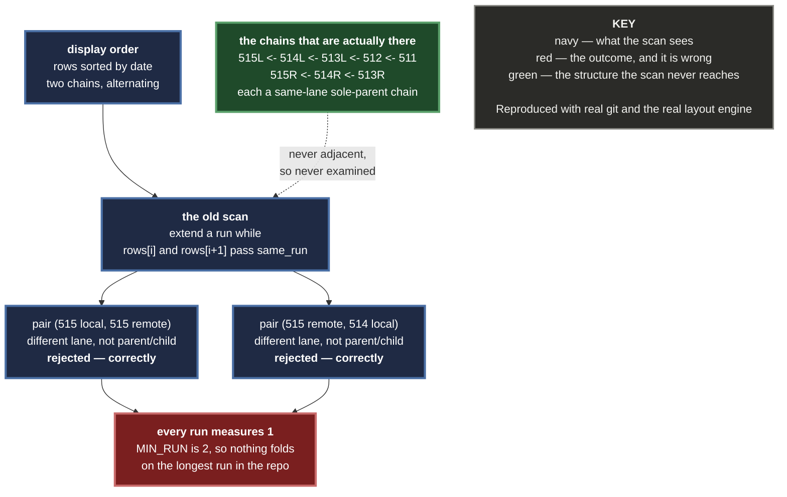

# 0074 — A WIP run is a chain, not a neighbourhood

**Status:** Accepted — implemented and tested
**Date:** 2026-08-25
**Issue:** [#478](https://github.com/tom2025b/Git-Vista/issues/478) · follow-up to #374
**Supersedes nothing.** Corrects an assumption ADR-less #374 wrote into a comment in `collapse.rs` and never tested.

---

## Context

`collapse::project` folds runs of `wip(#N): auto-checkpoint M` commits into one
marker. It found those runs by walking `rows` in **display order** and extending
a run only while *display-adjacent* rows satisfied `same_run`.

Found by driving the app against real history: a stretch of checkpoints 511–517
rendered as individual rows while the topbar reported **"WIP: folded · 25 rows"**.
Folding was on and working elsewhere, and declined to fold one of the longest
checkpoint runs in the repository.

The rows alternated between two lanes, and every checkpoint number appeared
twice. The two lanes were a branch and its **diverged remote-tracking twin** —
same summaries, different commits, different ancestry. The graph orders rows by
date, so the two chains interleave perfectly.

Reproduced here from scratch with real git before any code was written: five
checkpoints pushed, the last three rewritten, then `git fetch`. Fed through the
real layout engine (`layout_with_refs`), the rows come out as

```
row  0 lane 1  f93a43f  wip(#66): auto-checkpoint 515      <- feature/sandbox
row  1 lane 2  b7d6dbf  wip(#66): auto-checkpoint 515      <- origin/feature/sandbox
row  2 lane 1  35bd528  wip(#66): auto-checkpoint 514
row  3 lane 2  275451a  wip(#66): auto-checkpoint 514
row  4 lane 1  3c0ec91  wip(#66): auto-checkpoint 513
row  5 lane 2  21b27eb  wip(#66): auto-checkpoint 513
row  6 lane 1  573b05d  wip(#66): auto-checkpoint 512      <- the fork point
row  7 lane 1  7977167  wip(#66): auto-checkpoint 511
row  8 lane 0  09c6564  seed: base
```

and the old projection folded **one pair** out of eight checkpoints — the tail,
the only place two same-chain rows happened to land next to each other.

**The predicate was correct about every pair it was shown.** It was simply never
shown a pair from the same chain.



**The assumption was already written down**, in `collapse.rs`:

> `lane`/`color` are copied from the first member — arbitrary but consistent,
> since every member shares a lane

That holds for a *run*. It does not hold for the *scan that finds runs*, and the
diverged twin is the case that separates the two.

**This is not an exotic shape.** Any branch that has been pushed and then
rewritten produces it. It is what a checkpointed branch looks like after any
force-push.

---

## Decision

**A run is identified by ancestry, never by proximity.** `find_runs` builds an
`Oid -> row` map, links each checkpoint to its sole parent's row when `same_run`
accepts that exact pair, cuts any link into a commit two checkpoints both claim,
and reads each chain off head to tail. Display order plays no part in it.

`same_run` is unchanged and is still the sole judge of membership. The change
widens which pairs the predicate is **shown** — child and sole parent, wherever
they sit — never what it accepts.

A folded run then takes the display slot of its **newest** member, and its other
members leave display space wherever they are. `WipGroup.count` is therefore a
member count and not a row span; `WipRun` carries its members as a list; and
`display_of_row` reads a `row -> slot` map built during the projection walk,
because a group no longer covers a range that could be searched.

---

## Decisions in detail

### D1 — The lane check is not relaxed

The one-line version of this fix is to drop `newer.lane == older.lane` so that
display-adjacent rows match. It is refused.

It would fold two different branches' checkpoints into one group and claim a
chain that does not exist — a visible annoyance traded for a quiet lie. The
graph's whole job is to say what the ancestry is.

**The load-bearing acceptance criterion is therefore the negative one:**
checkpoints from two different chains are never folded together, *even when
adjacent*. A test that only checks "the interleaved case now folds" passes
against exactly the wrong fix, so the negative is tested on its own fixture and
the mutation that implements the forbidden fix is one of the two that must kill
it.

### D2 — A parent two checkpoints claim breaks the chain

Two branches can descend from one checkpoint commit. Picking a winner would
splice one branch's history into the other's group — D1 again in a different
costume — so both links are cut and the fork point keeps a row of its own.

In the reproduced shape above the lane check already separates them (the fork
point 512 sits in lane 1 with the local chain, and remote 513's link to it
crosses lanes). The guard is for the case where it does not, and is tested on a
single-lane fixture where only parent identity can tell the chains apart.

### D3 — The field is renamed so consumers cannot be missed

`start_row_index` + `count` reads as a range, and `display_of_row` decided
membership with `row >= start && row < start + count`. Left in place, that range
check silently mis-maps the moment members are not adjacent — it would compile
and be wrong. Renaming to `anchor_row_index` makes the compiler walk every
consumer: `render/nodes.rs`, `render/edges.rs`, `app/canvas.rs`, `menu.rs`.

### D4 — A display edge may now point upward

An edge from the tail of the lower chain to a fork point that folded into the
*upper* chain's marker is redrawn between the two markers, and the upper marker
sits above. In the reproduced repository this is a real edge, not a hypothesis:
`from_display: 1 -> to_display: 0`.

`geometry::edge_path` draws it correctly already — its maths is symmetric. The
culler did not: `visible_edges` compared `from_display < end && to_display >=
start` and dropped such an edge wherever the viewport was. It now culls on
`DisplayEdge::span`, which is host-tested, so the decision is not left inside the
wasm-only render module where `cargo test` could never reach it.

### D5 — `WipRun` stops being `Copy`

An open run's members are a list, so `WipRun` carries `rows: Vec<usize>` and
`MenuData.wip_run` is cloned rather than copied. A `run_id` index into the
projection would have kept `Copy`, and was refused: `nodes.rs` already documents
that this value must be read at tap time because a re-projection can move it, and
an index into a table that has since been rebuilt is precisely the staleness that
comment exists to prevent. Self-contained data cannot go stale.

### D6 — The row -> slot map replaces a linear search

`display_of_row` scanned `items` per call, once per edge. Backing it with a
`Vec<Option<usize>>` built during the walk is what makes membership correct for
scattered runs; that it also removes a quadratic edge remap over a history with
1,604 checkpoints is a welcome side effect, not the reason.

---

## Alternatives considered

| Option | Why not |
|---|---|
| **Relax the lane check so adjacent rows match** | Folds two branches into one group and claims a chain that does not exist. See D1; the negative test exists to stop it. |
| **Group by message text within a window** | Same lie, wider. Two chains carry identical summaries by construction — the message is what makes them look alike, not what makes them related. |
| **Sort rows so a chain is contiguous, then keep the adjacency scan** | Display order is date order, which is a product decision the graph makes elsewhere; re-sorting for one feature's convenience changes every row's position to fix a marker. |
| **Keep `start_row_index` and add a members list beside it** | Two sources of truth for membership, one of which reads like a range. D3. |
| **Give `WipRun` a `run_id` into the projection** | Keeps `Copy` at the cost of a handle that goes stale across a re-projection — the exact failure `nodes.rs` documents. D5. |
| **Leave it; the shape is rare** | It is what any pushed-then-rewritten branch looks like. 1,604 checkpoint commits exist across refs in this repository. |

---

## Consequences

**Good**

- A checkpoint run folds because it *is* a run, not because it happens to be drawn without interruption.
- The negative guarantee is now explicit and tested rather than an accident of the scan being conservative.
- Edge remapping is linear instead of quadratic in the number of rows.
- A culler no longer assumes display edges arrive in order; the assumption it replaced was undocumented and untested.

**Bad, and accepted**

- A folded group's marker now stands for members that may be pages apart on screen. "⋯ N WIP commits ⋯" says how many, not where — the same claim it made before, over a set that is no longer visibly contiguous.
- Two markers can sit on adjacent rows with an edge running upward between them. That is the topology; it is unusual to look at, and it is true.
- **A pre-existing, unrelated gap this work surfaced and did not fix:** `render/stubs.rs` positions branch stubs with `stub_node_cy(s.anchor_row, …)`, a **raw** row index, and never consults the projection. Any stub anchored at or below a folded run therefore draws at the wrong height. That has been true since #374 for contiguous runs; this change makes folding succeed more often, so it will be seen more often. Filed separately rather than widened into here.

---

## Evidence

- The interleave was reproduced from scratch with real git (push, rewrite, fetch) and fed through the real layout engine before and after the change. Before: 8 display rows, one pair folded. After: 3 display rows, two groups of 5 and 3. The upward edge in D4 came out of that run, not out of reasoning.
- Every new test was shown failing **two different ways by hand** (the local `failure-atlas` MCP is not reachable from a cloud session): apply mutation, run, record, revert. Thirteen mutations in all; the matrix is in the pull request.
- The three existing tests named as the regression guard — `a_run_of_three_wips_folds_into_one_group`, `a_lone_wip_commit_is_not_grouped`, `a_run_broken_by_a_real_commit_becomes_two_groups` — assert the same behaviour over the same fixtures; only the renamed field in their `match` patterns changed. Reverting `find_runs` to the old scan leaves all three green, which is what "no regression" means here.
- `cargo test -p git-vista`: 705 passed, 0 failed. `cargo clippy --all-targets`, host and `wasm32-unknown-unknown`: clean.
- **The browser leg did not run.** The server refuses to start without Landlock ABI ≥ 6 (INV-13, no degraded mode), and this cloud kernel returns `ENOSYS` for the `landlock_create_ruleset` syscall — a missing kernel feature, not a missing package. `bubblewrap` was installed and the verdict narrowed to `missing=["landlock_abi>=6"]` and stopped there. No browser assertion in this change has been observed going red or green.

---

**Signed:** max · 2026-08-25T04:05:00-04:00
