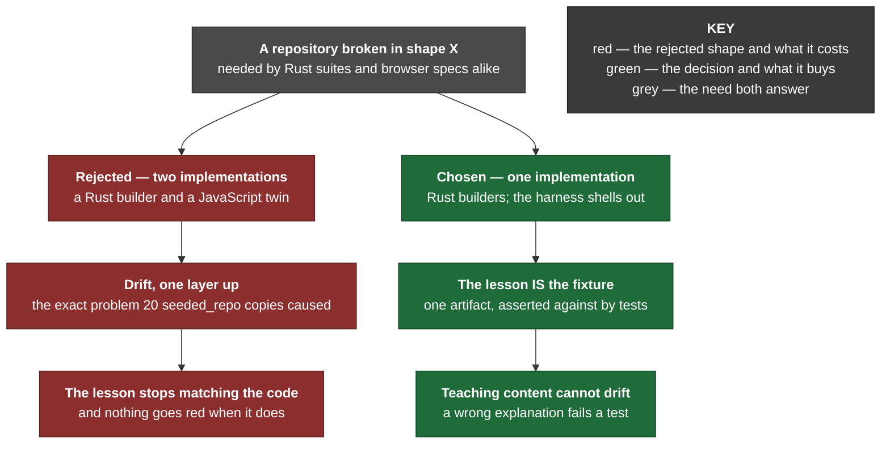

# 0076 — One fixture catalogue, in Rust, shelled out to by the browser harness

**Status:** Accepted — implemented and tested; the browser leg is unrun in this environment (see Consequences)
**Date:** 2026-08-25
**Issue:** [#448](https://github.com/tom2025b/Git-Vista/issues/448)

---

## Context

A survey of the tree found **twenty `seeded_repo()` implementations across eighteen files**, and **three independent builders of a conflicted repository** — `conflicts.rs`, `handlers/conflicts.rs`, and the browser harness's `ci/browser/fixture.mjs`. Every suite rolled its own.

They had already drifted, in both of the ways duplicated fixtures drift.

**Quietly.** Sixteen of the twenty seed `a.txt` with `"a\n"`; one seeds `a.txt` *and* `b.txt`; one writes `"seed\n"`; one uses `f.txt` and names the commit `base` instead of `seed`. None of those differences reads as deliberate, and each had a suite depending on it.

**Loudly.** The browser harness needed a *third* conflict fixture, `buildNonTextConflictFixture` (#432), because extending the second would have broken specs asserting an exact conflicted count. A new fixture was cheaper than touching a shared one — which is the moment duplication stops being an untidiness and starts being a design.

The ordinary fix is one shared builder. The interesting question was **in what language**, because the browser harness builds its repositories in JavaScript and the Rust suites build theirs in Rust, and both build "a repository broken in shape X".

## Decision

**Rust `std::process::Command` is the single implementation. The browser harness shells out to it.**

One crate, `git-vista-fixtures`, holds every shape as a named function. The Rust suites depend on it under `[dev-dependencies]`. The browser harness invokes the `gv-fixture` binary rather than building repositories in JavaScript.

**Each shape carries a doc comment stating what is wrong, what git actually put on disk, and why it matters — written for a reader who does not already know.** That documentation is not a comment on the fixture; it is the point of the crate.

### Why a JavaScript twin was refused

Two implementations of "a repository broken in shape X" is the drift problem one layer up. That alone would be reason enough, but it is not the real reason.

The real reason is what the catalogue is *for*.

git-vista wants to explain git to people who find it baffling. The obvious way to do that was #93 — an isolated Git simulator, with trainers built on it (#94). Both were cut, and the argument that cut them was: **a parallel fake Git is a second system to maintain, and it can teach something the real product does not do.** A lesson that has drifted from the code is worse than no lesson, because the reader has no way to tell.

A catalogue of *real* repositories, broken in *real* ways, has no such gap. The `conflict_delete_modify()` a test asserts against is the same artifact a lesson opens. If the explanation stops matching what git puts on disk, a test goes red — a property no documentation file sitting beside the code can ever have.

A JavaScript twin would reintroduce exactly the gap that reasoning closed, one level down. The teaching fixture and the test fixture would be two artifacts again, and nothing would notice when they diverged.

### Identity is passed per invocation

Every builder passes `-c user.name`, `-c user.email`, `-c commit.gpgsign=false` and `-c tag.gpgsign=false` on the command line, with `GIT_CONFIG_GLOBAL` and `GIT_CONFIG_SYSTEM` at `/dev/null`. A bare `git commit` reads identity, signing configuration, hook paths and template directories from the developer's own global config: a fixture built that way is a different repository on every machine, and on a box with `commit.gpgsign = true` it does not build at all.

The builders **also** write `user.name` and `user.email` into the fixture's local config. That is not belt-and-braces for its own sake — the suites go on to run their own bare `git commit` against these repositories through their own helpers, which pass no identity. Dropping the local config would leave those follow-up commits with no author, and roughly a dozen suites would fail for a reason unrelated to what they test.

The identity is `t <t@example.invalid>`, which is what all twenty replaced implementations used. Two suites assert on the literal string, so it is part of the contract, not a detail.

## Consequences

**The duplication is gone.** No suite builds a repository by hand; both `conflicted_repo()` builders are deleted; 259 lines of hand-rolled setup were removed against 55 added.

**A dead permission surfaced and was removed.** With its fixtures gone, `src/conflicts.rs` no longer constructs a `Command` at all, so its entry in the argv-boundary allowlist became a raw-spawn permission granted to nothing. `argv_boundary::every_allowlist_entry_names_a_live_spawn_site` caught it on the first full run after the change and named the fix in its own failure message. The entry is removed; the file is now one fewer place permitted to spawn.

**Two claims in #448's own text turned out to be wrong**, and both were corrected against source rather than carried forward:

- The issue describes the baseline as *"three commits, one file"*. No implementation in the tree ever made three commits — all twenty made exactly one. `seeded()` makes one, because a consolidation must not change what twenty suites see.
- The `broken_head()` shape was documented as one where `git rev-parse HEAD` fails. It does not: `--verify` checks that its argument names one revision in well-formed *syntax*, not that an object exists, so it prints the forty zeroes straight back and exits 0. Only `HEAD^{commit}`, which forces a peel to a real commit, fails. The cheapest liveness probe a tool can write therefore reports that repository as healthy while every other command fails — a better lesson than the one first written, and now pinned by a test.

**The consolidation is checkable, and was checked.** Test totals before and after are identical for every pre-existing binary, and the set of failing test *names* is byte-identical, so no behaviour moved. The only added line is the catalogue's own tests.

**The browser leg was not run.** This environment cannot provide the strict sandbox tier — Landlock reports ABI `-1`, so the syscall is unavailable, and per ADR 0029 the server refuses to start rather than run in a weaker tier. Installing `bwrap` does not help; the missing capability is the kernel's. The JavaScript builders were therefore verified a different way: each is executed under Node alongside its Rust replacement, and the two repositories are compared on full git state — commit graph, index including conflict stages, working-tree contents, untracked files, `HEAD` and `MERGE_HEAD`. That proves the builders agree; it does not prove the specs still pass, and it is not a substitute for running the gate.

---

**Signed:** max
