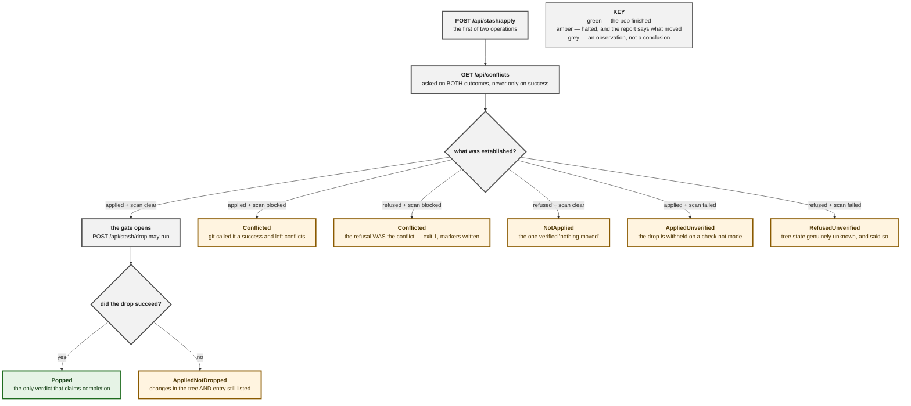

# 0077 — A pop is two operations, and its report never outruns what was checked

**Status:** Accepted — implemented and tested (frontend); **the browser leg has
since been executed, and it found three defects this ADR's own slice shipped
with.** See "What running it actually found", below.
**Date:** 2026-08-25
**Issue:** [#77](https://github.com/tom2025b/Git-Vista/issues/77)

---

## Context

M3.24's fifth acceptance criterion is *"pop is not reported complete while conflicts remain."* The server side of #77 shipped first and made the shape of the client's problem inevitable: **there is no `POST /api/stash/pop`.**

That absence is deliberate and already argued in `crates/git-vista-server/src/main.rs` beside the three write routes, and at length in `docs/superpowers/specs/m3.24-stash.md` §5. A pop is apply-then-drop. One durable operation row carries one state, one message and one recovery strategy, so when the apply succeeds and the drop fails the record says only `Failed` — indistinguishable from "nothing ran" while the user's changes are actually in the tree. Two independent operations produce two rows, and two rows can tell the truth.

So the client composes it. The question this ADR settles is what the client is allowed to *say* about the result, because that is where a UI can most cheaply claim something untrue about a user's working tree.

Two things make it easy to get wrong, and this branch got the second one wrong first.

**One: an empty conflict list is not the same as a conflict list that was never read.** `Continuation::from_files`' own doc comment states the precondition — *"An empty input means `Clear`, and that is only safe because the caller is required to have actually looked."* A client that mapped a failed `GET /api/conflicts` to an empty vector would hand the gate a green light meaning "I did not check", and the drop would destroy the entry on the strength of it.

**Two: a refused apply is not proof that nothing was applied.** Measured against git 2.43.0, on this branch's own browser fixture:

```
$ git stash apply 'stash@{0}'        # an entry that cannot merge
CONFLICT (content): Merge conflict in collision.txt
$ echo $?
1
$ git status --porcelain
UU collision.txt
```

Exit 1, and the conflict markers are already in the working tree. `exec_apply_stash` branches on the exit status alone, so the client sees a 4xx. The first version of this design concluded "nothing was applied" from that and said so to the user — the same class of false claim as the one A4 exists to prevent, pointing the other way. It was found by *running* the fixture, not by reading.



## Decision

**D1 — The destructive half runs on exactly one input, and there is exactly one door to it.**

`features::stash::core::drop_gate(&ApplyOutcome, &ConflictScan) -> DropGate` is the only thing that may authorise `POST /api/stash/drop` on a pop's behalf. It opens for one combination: the apply reported success *and* a conflict scan that actually ran came back `Clear`. No other pair opens it.

There is deliberately no second entry point — no "has the apply already settled this?" helper a caller could reach for instead. The cost is one wasted `GET /api/conflicts` on a path that had already failed, which is cheaper than a second door.

**D2 — "Failed to check" has no spelling that also reads as "clear".**

`ConflictScan` is `Read(Continuation)` or `Failed(String)`. A failed fetch cannot become an empty `Vec<ConflictedFile>` on the way in, so `Continuation::from_files`' precondition is kept structurally rather than by a comment.

**D3 — The scan is consulted on both apply outcomes.**

Not only on success. Only the scan can tell a refusal that left work behind from one that did not, and the refused-with-conflicts case is the *most likely* failure this slice will ever see — it is what a stash that no longer applies looks like.

**D4 — Exactly one verdict claims completion, and `is_complete()` is the only way to ask.**

`PopVerdict` has seven inhabitants and `PopVerdict::Popped` is the only one for which `is_complete()` is true. No view may conclude completion from an HTTP status, a `WriteReceipt`, or `!matches!(…)`. In particular a `WriteReceipt` is *not* a success: `send_write_with_key` returns `Ok` for any answered request, 409 included, and the status lives in `receipt.ok`.

**D5 — The report states what is true of the user's data, in three states, not two.**

`tree() -> TreeState` is `Changed`, `Untouched`, or `Unknown`. `Unknown` exists because after a refused apply whose scan also failed, neither fact was established — and a `bool` has nowhere to put that, so it would have to guess. `Untouched` is a *verified* claim, reachable only from a refusal plus a scan that really ran.

**D6 — `Conflicted` remembers which route reached it.**

`Conflicted { apply_refusal: Option<String>, … }`. `None` means git reported the apply a success and left conflicts anyway; `Some(sentence)` means the apply itself reported failure. Both leave the entry in place and both must not read as complete, but they are different events and the headline says which: *"The changes were applied but left conflicts"* versus *"Applying the stash hit conflicts"*.

**D7 — Conflicts route into the existing conflict workflow, never a stash-shaped copy of it.**

The verdict carries paths (`conflicted_paths()`), not markup. The view opens `ViewerDoc::Conflict`, the same four-pane view (#428/#429/#432) the working-tree section's conflicted cards open. Paths whose sides could not be read (`unreadable_paths()`) get no "Resolve" control at all — there is nothing to choose between, and offering the choice would be the lie.

**D8 — Every one of these decisions lives in a host-compiled module.**

`mod app` and every view module are `#[cfg(target_arch = "wasm32")]`, so `cargo test --workspace` never compiles them and nothing decided inside markup can be host-tested. `features/stash/core.rs` therefore holds all of the above and `features/stash/view.rs` holds none of it — every arm in the view is a one-to-one mapping from a value the core already computed.

## Alternatives considered, and why they lost

**Register `/api/stash/pop` and let the server do it in one call.** `GitOperation::PopStash` already exists, is wired through the planner, the sandbox dispatcher and the contract suite, and its executor re-reads the conflict state in both branches. Only the route is missing. **Rejected, and not ours to reverse:** `main.rs` and `handlers/stash.rs` argue the absence, and the spec's §5 names the two prerequisites that must ship first (composite outcomes persisted on the row, or `PopStash` as durable orchestration over linked child records). Neither exists. See § Findings — the state of `PopStash` in the tree is itself worth a conversation, but it is an ADR and a conversation, not a commit on a frontend branch.

**Decide the refused case on the apply alone, before consulting the scan.** Simpler, one fewer request, and it reads naturally: a refusal means it did not happen. **Rejected because it is false** — see § Context, measured. This was the shipped shape for two commits on this branch and the fixture caught it.

**A `bool applied` instead of `TreeState`.** Two states, less to explain. **Rejected because the refused-and-unscannable case has no honest bool.** Picking `false` claims a verified-untouched tree from two failed observations; picking `true` claims changes landed when the apply was refused. This is the same argument ADR 0068 makes against flag pairs that can represent nothing real, and ADR 0074's against a fabricated value sitting beside a measured one.

**One `Conflicted` variant with no `apply_refusal`.** Fewer fields, and both routes do share the two facts that matter most (entry retained, not complete). **Rejected because the wording would have to cover both** and the only phrasing true of each is vague enough to be useless. "The changes were applied but left conflicts" is a false claim when the apply reported failure.

**Let the view read the HTTP results and decide.** No new types at all. **Rejected under D8:** it is the wasm-only path, so the decision would be checked by the compiler and nothing else — and "reports success on a conflicted pop" is exactly the defect that presents as a green suite.

**Build a stash-specific conflict resolver.** The drawer knows which paths conflicted; it could show them inline. **Rejected as the drift argument from #448 in a different place.** There is one conflict UI, and a second would diverge from it.

## Consequences

- A pop costs two or three round trips instead of one, and one of them is wasted when the apply fails. Named in `compose_pop`'s doc comment rather than optimised away, because the alternative is a second door past the gate (D1).
- Two durable operation rows per pop, not one. That is the point — it is what lets the record say "applied, then the drop failed".
- The client now depends on `GET /api/conflicts` for a *stash* operation. If that endpoint is unavailable, a pop cannot complete: it halts at `AppliedUnverified` with the entry intact. Refusing to drop on a check that could not be made is the intended behaviour, and it is strictly safer than the alternative.
- `PopVerdict` has seven variants and will grow if the drop path gains states. `exactly_one_verdict_means_the_pop_finished` is the guard: a new variant cannot quietly inherit a permissive `is_complete()`.
- Nothing here makes `/api/stash/pop` harder to add later. If the route ships, `compose_pop` collapses to one request and `drop_gate` becomes the server's own logic — the verdict vocabulary is what survives, and it is the part worth keeping.

## Findings recorded while implementing

**F1 — `GitOperation::PopStash` is fully wired and completely unreachable.** `plan.rs:1175` defines it with a doc comment citing `/api/stash/pop` as its route; `planner.rs:2610` dispatches it; `planner/stash.rs:242` implements `exec_pop_stash`, which shells out to `git stash pop` and re-reads the conflict state in both branches; `contract_suite.rs:213` names its contract `pop_stash_refuses_to_report_complete_while_conflicted`. No route reaches any of it. Meanwhile `plan.rs:1220-1233` — forty-six lines below the variant's own definition — says `PopStash` "is deliberately ABSENT", and `handlers/stash.rs:12-18` points readers at that comment. Both cannot be true. Additionally, spec §5 says *"Do not shell out to `git stash pop`"*, which is precisely what the executor does. **Not touched on this branch** (the server was to be treated as read-only), and recommended as its own issue: either the route ships with the prerequisites §5 names, or the variant and its executor come out, but the tree should not carry an enum arm whose doc comment advertises a route that does not exist beside a comment saying it never will.

**F2 — `exec_apply_stash` does not re-read the conflict state; `exec_pop_stash` does.** The latter's own comment says why it asks in both branches: *"a pop git called successful while leaving conflicted paths behind is precisely the case this criterion is about."* That case is unguarded on the apply path. It does not bite today, because git exits non-zero for a content conflict (§ Context) — but the guard exists on the sibling path for a reason, and the asymmetry is worth closing. The client compensates by scanning itself (D3), so this is a robustness gap rather than a live defect. Recommended as its own issue.

**F3 — the stash endpoints share no DTOs with the client.** `handlers::stash::stash_list` builds its JSON object by hand and each write handler declares its own `Deserialize` struct, so every field name exists twice in the workspace with nothing forcing them to agree. A rename on either side presents as an empty drawer. Pinned from the client side by `the_listing_shape_the_server_actually_sends`, which asserts against a JSON literal transcribed from that handler — weaker than one type serving both ends, and recorded as weaker in `StashEntry`'s own doc comment.

**F4 — `offline_guard_audit`'s `API_SRC` was blind to `api/conflicts.rs`.** Fixed on this branch (it is frontend code): the file was never added to the hand-maintained `include_str!` list when the `api/` split created it, so `resolve_conflict_request` and `resolve_conflict_content_request` reached the write transport with nothing in that census watching them. Both were correctly guarded in fact, but a deleted guard would have passed every test in the module. `api_src_concatenates_every_api_submodule` now walks the directory, because a hand-maintained list cannot notice its own gap.

## What running it actually found (added 2026-08-25)

This ADR shipped with its browser leg written but unexecuted — a cloud session
cannot run it, because the server refuses to start without the strict sandbox
tier and that container's kernel has no Landlock. The leg was run on the
operator's box a few hours later, against the exact head being merged. **It
failed, three times, for three unrelated reasons**, and every one of them was
invisible to the seven CI checks that had already passed.

**1. The drawer's "Show changes" control was dead on arrival.** The server's
`ShowStashQuery` shipped `#[serde(deny_unknown_fields)]`, while the frontend
appends a `?t=<millis>` cache-buster to every GET it makes. Every click
answered `unknown field \`t\`, expected \`entry\``, and the drawer rendered that
JSON where the patch belonged. `read.rs`'s `PageQuery` documents the rule this
broke, in a comment, and had done for months.

**2. Every outcome notice was destroyed one frame after it appeared** — this
ADR's D6 sentence included. `StashDrawer` was created inside a reactive child
that tracks the graph epoch; every drawer write ends `set_notice(...)` then
`force_bump()`, so the bump rebuilt the child and threw away the message it had
just written. A conflicted pop left conflict markers in the user's tree and
said **nothing at all**. The verdict logic this ADR specifies was correct
throughout; it simply never reached the screen.

**3. Two spec locators could never have matched** — `getByText(/^\+.../m)`
inside a `<pre>` (Playwright normalises newlines to spaces before matching),
and a text match that also hit the preview sentence naming its own checkbox.

**The lesson this ADR should carry forward, because it is more general than the
stash drawer:** a verdict that is computed correctly and never rendered is
indistinguishable, to the user, from a verdict that was never computed. D6 says
a report must not outrun what was checked. It should also say that a report
which does not survive the refresh its own operation triggers has not been made
at all.

Both defects 1 and 2 are fixed on `main` (commit `e270350c`), each
mutation-proved two different ways, and A4 now additionally asserts that the
notice survives the panel's own Refresh.
