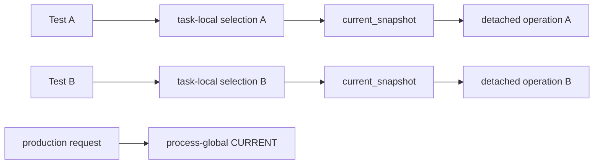

# 0083 — Test repository selection is task-local; production selection remains process-global

**Status:** Accepted — implemented and tested
**Date:** 2026-08-25
**Issue:** [#438](https://github.com/tom2025b/Git-Vista/issues/438)

---

## Context

The server has one mutable default repository selection:

```rust
static CURRENT: OnceLock<RwLock<Current>> = OnceLock::new();
```

That is the production model. A request without an explicit repository acts on
the repository selected for the running server, and clone/select operations may
replace it.

It was not a valid test model. Rust executes unit tests concurrently inside one
process. `state::tests::selection_flow_carries_mode_and_gates_writes` and
`recovery_center::tests::a_stale_claimed_undo_is_refused_and_the_branch_is_left_alone`
both installed unrelated temporary repositories in `CURRENT`. If the state test
replaced the recovery test's selection between its setup and request, recovery
resolved the offered ref against the wrong repository. The test then received
"recovery point no longer available" instead of the required "offer changed"
refusal.

On the same host and commit, the server test binary failed in 5 of 12 runs with
`--test-threads=16`; every failing run included the stale-offer recovery test.
The same binary passed 3 of 3 runs with `--test-threads=1`. A barrier-controlled
regression then made the overwrite deterministic: two tasks installed literal,
different path/mode pairs and one read back the other's pair.

The rival explanations do not fit that evidence. The involved repositories are
created under independent `tempfile::tempdir` roots, neither test opens a
listener or claims a port, and the stale-offer decision compares repository and
ref identity rather than elapsed wall time. Serialization removes the failure
because it removes concurrent writes to `CURRENT`, not because it changes any
of those inputs.

## Decision

Production keeps `CURRENT` unchanged. Test builds add an explicit Tokio
task-local override, `TEST_CURRENT`, containing `Option<Current>`.

- A test that selects a repository must run its body through
  `with_isolated_test_current`. In test builds, `set_current_resolved` writes
  only that scope and panics when no scope exists. A future test cannot silently
  reintroduce the process-global race by calling the existing setter.
- Every accessor goes through one `current_snapshot` seam. Inside a test scope
  it reads the task-local selection; outside a test scope, and in all production
  builds, it reads `CURRENT`.
- The scope contains `Option<Current>` deliberately. A present but not-yet-set
  test scope returns no selection; it never falls through to a repository left
  in the process global by another context.
- Tokio task locals are not inherited by `tokio::spawn`. The planner therefore
  passes its detached operation future through `inherit_test_current`, which
  snapshots the parent scope synchronously before spawning and scopes the whole
  detached future with that snapshot. It distinguishes "no test scope" from
  "test scope with no selection". Production compiles this helper to an
  identity function.
- Tests that only read production-independent state need no wrapper. Tests that
  call `set_current`, or a helper that successfully selects and therefore
  reaches it, own one explicit wrapper at the test boundary.

The isolation boundary is therefore visible and enforced:



## Alternatives weighed

**Serialize the known tests with a mutex.** This would stop today's pair but
make every new selection-writing test responsible for remembering an informal
lock. The enforced wrapper makes omission fail at the setter instead.

**Run the whole suite with one test thread.** The serialized control proves this
would hide the race. It would also discard parallelism across 900-plus tests and
leave the shared-state defect intact for any other harness.

**Thread a repository handle through every server function.** That is a cleaner
long-term production architecture, but it changes the request and handler model
far beyond a test-harness defect. The chosen override changes no production
selection semantics and keeps that larger decision separate.

**Use a thread-local override.** Tokio futures may move between worker threads,
so thread identity is not test identity. A task-local scope follows awaits; the
one boundary it does not cross, detached spawn, is propagated explicitly.

## Consequences

Parallel tests no longer replace one another's current path, mode, or repository
handle. The two original tests keep all of their assertions; no refusal reason
or expected outcome was weakened.

Selection-writing unit tests now have a small ceremony: wrap once at their
async test boundary. That cost is intentional. An unwrapped writer fails at the
write, rather than becoming a timing-dependent failure elsewhere.

The detached planner call has a test-only context wrapper. Its production
future and process-global lookup are unchanged after conditional compilation.
Nested git subprocess tasks do not need further propagation: they receive the
repository explicitly or only drain process I/O.

## Verification

The barrier-controlled overwrite regression is red when test isolation is
removed and green with it. A second regression is red when the spawn wrapper is
an identity function and green when it captures the parent selection before
`tokio::spawn`.

Both required mutations were exercised three times. Replacing the test scope
with process-global writes failed 3 of 3 runs at the literal path/mode
assertion. Removing only the stale-recovery test's wrapper failed 3 of 3 runs at
the setter's missing-scope guard. Both mutations were then reverted, and both
target tests were rerun green.

The original stale-offer recovery test, the state selection-flow test, the
foreign-worktree recovery test, and all three tag tests that install a current
repository pass individually. The post-fix reproduction campaign passed 12 of
12 full server runs at 16 threads — 0 failures over 851 seconds. Each run
executed all 934 non-ignored tests.

`buildlock cargo fmt --all` and
`buildlock cargo clippy --all-targets -- -D warnings` are green. The first raw
workspace run exposed unrelated host drift in the existing #469 shell fixture:
its "no node" case inherited the host's newly upgraded `/usr/bin/node` v24 and
ran past the assertion's intended boundary. With a `/tmp`-only `BASH_ENV` shim
that hides the host node only inside that fixture's private
`gv-browser-node-*` PATH, `buildlock cargo test --workspace` is green in 97
seconds. The shim changed no repository file. The signed implementation report
records both results rather than presenting the corrected rerun as the raw one.
