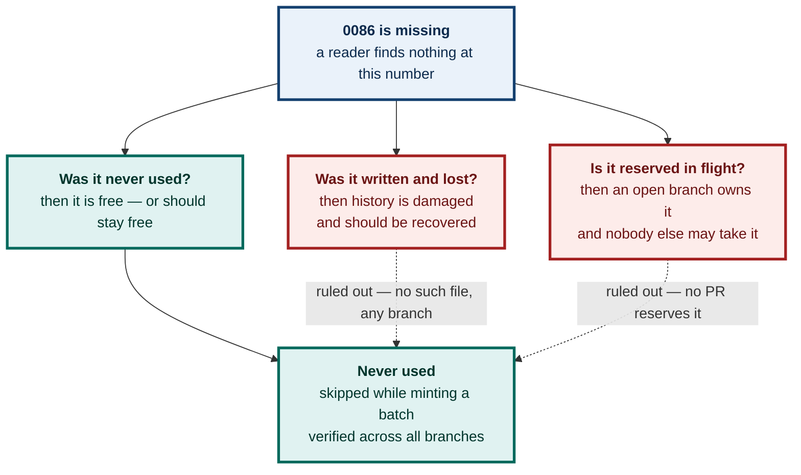

# ADR 0086 — A number left deliberately unused, and the record that says so

**Status:** Accepted — this number is retired; no decision is recorded under it
**Date:** 2026-08-27 (recorded); the gap itself dates from 2026-08-26
**Issue:** none — this is a bookkeeping record
**Supersedes:** nothing · **Superseded by:** nothing

---

## Context

On 2026-08-26 a batch of five decisions was numbered ahead of being written, and the sequence came out as **0084, 0085, 0087, 0088**. Nothing was ever filed as 0086. It exists in no branch, no PR, no stash, and no commit — verified across the full repository history, not just `main`.

So the gap is not a lost file. Nothing was written and then deleted; a number was simply skipped while several records were being minted at once.

That left a small, real problem. A reader walking `docs/adr/` in order hits a missing number and cannot tell which of three things happened:

Only the third is true, and until now nothing in the repository said so. A future session would have had to re-derive that answer by searching every branch — which is exactly the cost this project writes ADRs to avoid.

---

## Decision

**0086 records no architectural decision, and never will. It records that the number was skipped.**

The number is retired rather than backfilled. The next record written after this gap was noticed took **0095**, not 0086.

### Why not simply fill it

Filling the hole was the obvious move and it was considered first. It was rejected because **the numbers would have stopped reading chronologically.** An 0086 dated 2026-08-27 would sit between an 0085 and an 0087 dated 2026-08-26 — so a reader could no longer assume a higher number means a later decision, which is the one property the numbering actually carries.

Trading a *visible* gap for an *invisible* ordering violation is a bad trade. A gap announces itself; a number out of chronological order does not, and quietly poisons every inference anyone later draws from the sequence.

---

## Alternatives considered

### A. Fill 0086 with the next decision written

Give the number to ADR 0095's content and close the gap.

**Rejected** — breaks chronological ordering, as above. The gap is cheap; the broken invariant is not.

### B. Renumber 0087 onward to close the gap

Shift everything down by one so the sequence is dense.

**Rejected, firmly.** ADRs are append-only history. Renumbering rewrites records that other documents, commit messages and PR bodies already cite by number, turning every existing citation into a wrong one. This is the same reasoning behind never rewriting pushed history: a stable identifier that changes is worse than an ugly one that does not.

### C. Leave the gap undocumented

Do nothing. It is only a missing number.

**Rejected.** This is what was in place, and it is why the question had to be asked at all. "Is 0086 lost or free?" was an open item carried across two briefs and two sessions before anyone settled it. An unexplained gap costs a re-derivation every time a new reader meets it — and the cost recurs forever, while this record is written once.

---

## Consequences

- **The sequence is continuous again.** Every number from 0001 upward now resolves to a file, and 0086's file explains itself in one screen.
- **Chronology holds with no exceptions.** A higher ADR number is a later decision, throughout.
- **0086 must never be reused.** If a future session finds this number free-looking, this record is the answer: it is retired, not available.
- **The convention this establishes:** when a number is skipped, write the tombstone rather than backfilling. Cheap, honest, and it keeps ordering meaningful.

### The lesson underneath it

The gap was created by **assigning numbers to a batch of records before writing them.** Four ADRs were minted at once and one was dropped in the shuffle. The same habit produced the other outstanding collision in this repository — **0092 reserved three separate ways** across three open pull requests, each branch believing it owned the number.

The fix is the same in both directions: **a number is claimed when the file exists, not when the intent does.** Reserving in advance only works if one writer holds the whole batch, and on this project that has now failed twice.

---

**Signed:** max · 2026-08-27T08:16:00-04:00
