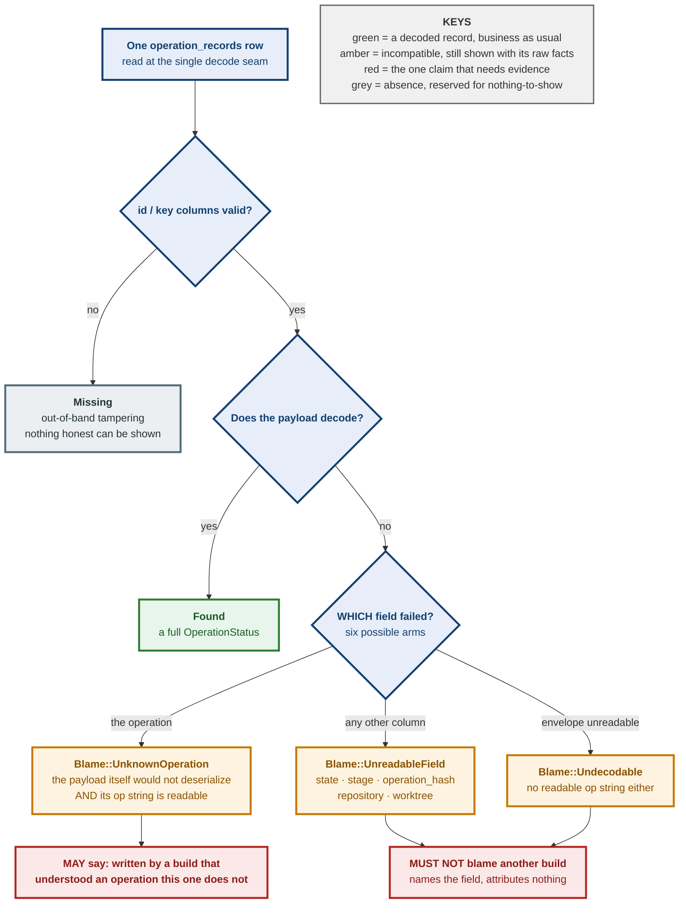

# 0089 — An undecodable operation row is incompatible, not missing; and only an unknown operation may blame another build

**Status:** Accepted — implemented and tested
**Date:** 2026-08-26
**Issue:** [#509](https://github.com/tom2025b/Git-Vista/issues/509)

---

## Context

`PopStash` was removed from `GitOperation` in #501. The removal was correct —
it closed a live reachable path — but it was carried out as though the variant
were dead in every sense. It was live on the wire *and* live in storage: any
`operation_records` row holding a `pop_stash` payload survives in SQLite, and
this build cannot deserialize it.

Before this change, that row did not read as a damaged record. It read as **no
record at all**. `row_to_loaded` turned every payload-decode failure into
`None`, and `load_operation`'s own doc comment admitted the conflation
verbatim: `None` covered "no such id ever existed" and "the row didn't decode"
alike. Four callers inherited the lie in one step:

- single lookup returned `None`, which the handler mapped to **404** — for a
  row sitting in the table;
- the history scan skipped it, so it vanished from the Recovery Centre;
- startup recovery force-failed only rows that *decoded*, so a stranded
  `running` row stayed `running` **forever**;
- `rehydrate` never learned the row's idempotency key, while SQLite kept that
  key `UNIQUE`. Reusing it was admitted as `Fresh`, so a request asking for a
  **replay** executed a brand-new git operation — the idempotency guarantee
  defeated at exactly the point its record went invisible.

The Recovery Centre exists so that an operation which did not finish is
findable and reconcilable. A row that silently becomes invisible is the one
state it is built to prevent.

### The second defect, found in review

The first implementation of this fix introduced `IncompatibleRecord` and had
every message key its explanation on whether the raw JSON envelope carried a
readable `"op"` string:

> "This operation ('pop_stash') was written by a Git-Vista build that
> understood an operation this build does not."

That sentence is a claim about **another binary**, and the evidence did not
support it. A row fails to decode **six** ways — `state`, `stage`, the
operation itself, `operation_hash`, `repository`, `worktree` — and five of them
say nothing whatever about the operation being unknown. They are closed-set
parsers and validating newtypes failing on their own. Meanwhile `op_kind` is
lifted from the envelope *whichever* field failed, so it is readable for rows
this build understands perfectly.

The concrete failure: a later build adds `OperationStage::Verifying` and writes
a `commit_on_head` row with `stage='verifying'`. Downgrade to this build, and
the row fails at `parse_stage` with `op_kind = Some("commit_on_head")`. Startup
then **UPDATEs the sentence above into the `message` column**, permanently. A
later build that *does* understand `commit_on_head` reads its own history
asserting that it does not.

The lane's own test could not catch this: it constructed `IncompatibleRecord`
by hand, so it could never observe which arm had failed.

## Decision

**1. Decode failure is a third outcome, never absence.** `DurableLookup` and
`ScannedPayload` are three-way: `Found` / `Incompatible` / `Missing`. `Missing`
retains only "no such id" and the tampering shape where the row's own `id`/`key`
columns no longer validate — both cases where nothing honest can be shown.

**2. The decode seam names the field that failed.** The closure returns
`Result<OperationStatus, DecodeFailure>`, with `UnknownOperation` for the
payload itself and `UnreadableField(&'static str)` for everything else.

**3. What a message may claim is computed once, from that.**
`IncompatibleRecord::blame()` yields `Blame::UnknownOperation(kind)` — the only
value permitted to attribute the row to another build — or
`UnreadableField(field)`, or `Undecodable`. Every sentence the server writes
about such a row is built from `Blame`, never from `op_kind`: the history note,
the recover refusal, the idempotency-key refusal, and the one persisted to
disk. `Blame` is carried into the key registry too, because that registry
outlives the record.

**4. A non-terminal incompatible row is force-failed at startup, and says so.**
An operation whose semantics this build cannot know cannot be resumed *by this
build*; a terminal record beats an eternal `running`. The persisted message is
prefixed `closed-out-by-incompatible-build:` so a returning build can tell a
close-out from a genuine failure.

**5. A poisoned key is refused, never run fresh.** `rehydrate` loads
incompatible keys into a set the registry never evicts, and `admit()` answers
`Admission::IncompatibleKey`, which the planner maps to **409** naming the
record.

**6. Payload versioning is deliberately NOT done here.** A version stamp wants
a schema-v3 column, a migration arm and a `user_version` bump. That is a
separate decision; this ADR records that it was considered and deferred rather
than overlooked. Related: #521 is answering the same question for the journal.

The three-way seam and what each outcome is allowed to say are drawn at the end
of this section.

## Alternatives considered

**Keep `None` and log louder.** Rejected: the log line already existed and the
Recovery Centre still answered 404. A diagnostic nobody reads is not a
distinction the API makes.

**Delete or archive stranded rows at startup.** Rejected: the payload is the
only evidence of what the operation was, and a build that understands it may
return. The payload bytes are left byte-identical for exactly that reason.

**Leave the row `running`.** Rejected outright — that is the defect.

**Attribute every decode failure to version skew** (the first implementation).
Rejected on review: five of six arms cannot observe skew, and the claim gets
written permanently to disk where a later build reads it back as a statement
about itself.

## Consequences

**Good.** "Cannot decode" and "does not exist" are now different answers
everywhere a caller can ask. A stranded row is visible in the Recovery Centre
with its raw stored facts, terminal instead of eternally running, and its key
can no longer be spent on a fresh execution. Every sentence the server writes
about such a row is bounded by evidence it actually has.

**Costs, stated plainly.**

- The startup close-out **overwrites the lifecycle record**: `state`, `stage`,
  `status`, `message` and `ended_at` all go, including whatever the original
  `message` held. The operation payload survives byte-for-byte, but a returning
  build cannot recover the state it might have reconciled against git. The
  `closed-out-by-incompatible-build:` prefix is the whole of the mitigation.
- `incompatible_keys` is **never evicted**, by design — a spent key must stay
  spent for the process's life. It is bounded by the number of undecodable rows
  in the journal, which is bounded by the journal.
- The `incompatible` array on the history page and the 409 from the recover
  endpoint have **no client consumer today**. The acceptance "surfaces in the
  Recovery Centre" is satisfied at the API layer only; nothing renders it yet.
  That is pre-existing — the Recovery Centre's endpoints were already
  unconsumed — but it is stated here rather than implied.
- `GET /api/operations/by-key/{key}` still answers 404 for a poisoned key with
  text suggesting the write may still be in flight. The POST path's 409 does
  inform the client, so no one is driven to a wrong action, only to a pointless
  poll. Recorded as a follow-up rather than fixed here.

**Verification.** Three mutations against the new blame test, red at two
different assertions — collapse the failure arms; make `blame()` fall back to
skew whenever `op_kind` reads; and leave `blame()` correct while the message
ignores it — each restored byte-identical. The regression drives the **real**
decode path for both shapes rather than hand-building records, which is what
the first implementation's test could not do. 945 server tests green.

---

**Signed:** fable · 2026-08-26T05:02:00-04:00
