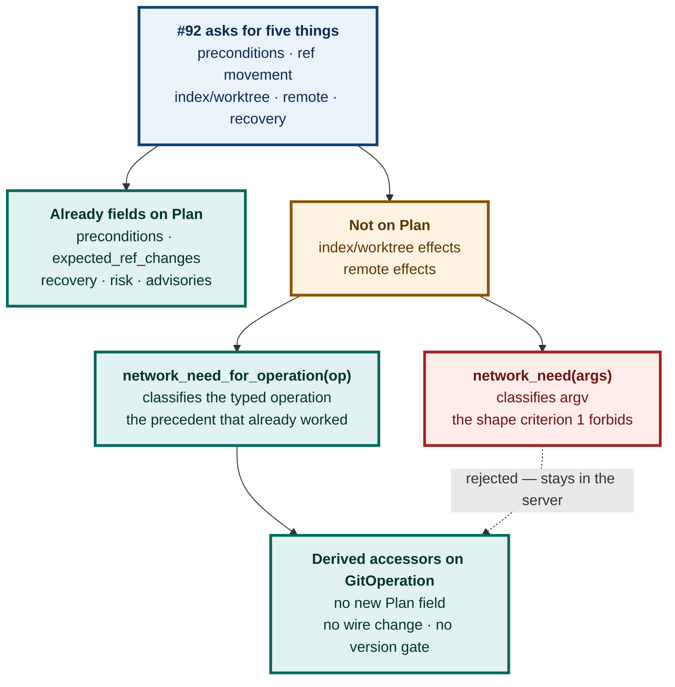
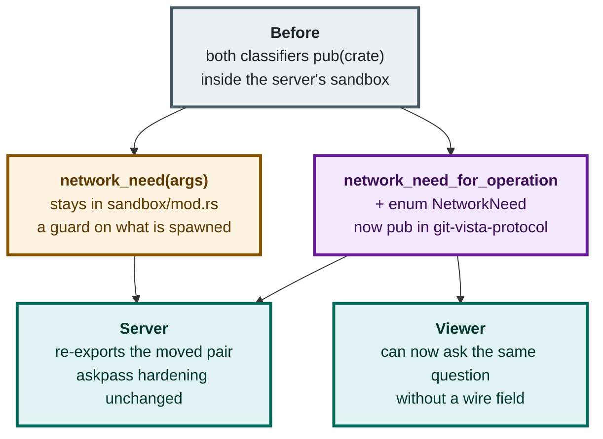
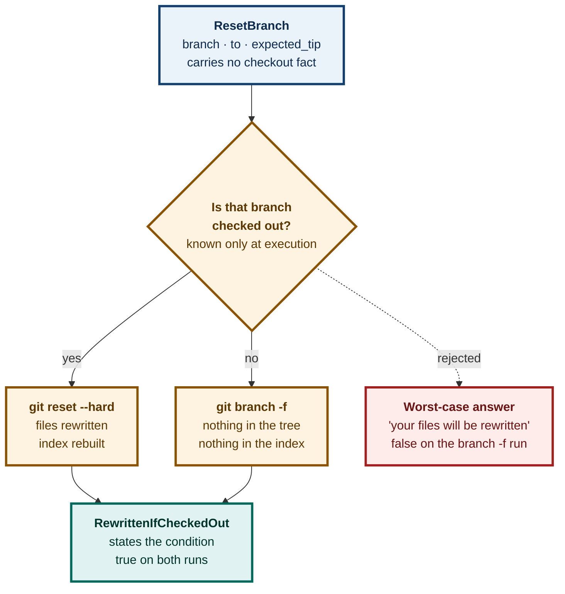
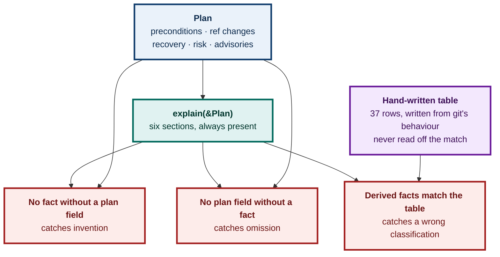

# ADR 0091 — What an operation does to your files is derived, not declared; and the classifier that already knew moves to where both sides can ask it

**Status:** Accepted — implemented and tested; viewer half not yet built
**Date:** 2026-08-26
**Issue:** [#92](https://github.com/tom2025b/git-vista/issues/92) — M6.39, Explain Mode over the typed operation vocabulary
**Supersedes:** nothing · **Superseded by:** nothing

---

## Context

Git-Vista refuses to run a write until it has built a **plan** and the user has approved it. A `Plan` is not a string of shell — it is a typed object carrying preconditions, the refs that will move, a risk level, advisories, and a recovery strategy.

The application shows that plan. It does not explain it.

Issue #92 asks for an explanation covering five things:

> Explain operation preconditions, ref movement, index/worktree effects, remote effects, and recovery using the same typed plans as production workflows.

**Four of those five are already fields on `Plan`.** Preconditions, ref movement and recovery are fields outright; risk and advisories come free alongside them. Two are not: **index/worktree effects** and **remote effects**.

The whole design question is what to do about those two. And the acceptance criterion that governs the answer is criterion 1:

> Explanations derive from typed plans, not endpoint strings.

### The precedent that decided it

Two functions in the server classified network need, and the difference between them is the entire argument:

| Function | Keys on | Verdict |
|---|---|---|
| `network_need(args: &[&str])` | **argv** | the "endpoint string" shape criterion 1 forbids |
| `network_need_for_operation(op: &GitOperation)` | the **typed operation** | the precedent, and proof the pattern already works here |

Both, plus `enum NetworkNeed` itself, were `pub(crate)` inside the **server** crate — invisible to any explain layer and to the frontend.



---

## Decision 1 — Effects are derived accessors on the closed vocabulary, never new `Plan` fields

`GitOperation` gains two accessors in the protocol crate:

```rust
impl GitOperation {
    pub fn worktree_effect(&self) -> WorktreeEffect;
    pub fn index_effect(&self) -> IndexEffect;
}
```

**`Plan` gains no field.** That is the load-bearing half of the decision, and it buys three things at once:

- **No wire-format change and no version gate.** #92 is a feature, not a protocol change followed by a feature. On a project that moved the protocol window twice in one day (v8 for #335, v9 for #514), not moving it is worth something.
- **None of the `#[serde(default)]` hazard** `Plan`'s own doc comment warns about for `advisories` — *"a plan from a build that predates this field is a version mismatch and must fail loudly at the version gate, not arrive with an empty list that reads as 'checked, nothing to report'."* A field that does not exist cannot arrive empty and be misread as checked.
- **One author.** Both server and client compute the same answer from the same input, so there is nothing to keep in sync and nothing to drift.

Both matches are **exhaustive over all 37 variants with no catch-all**. A wildcard is exactly how a newly added operation acquires a wrong explanation silently; an inexhaustive match is a compile error, which is the entire benefit of a closed vocabulary. Adding an operation should stop the build until somebody decides what it does.

### The count is 37, not the 38 the design said

The design document says 38 operations. There are **37**. The compiler is the authority — an exhaustive match accepts exactly the arms that exist — and the committed golden fixture (`tests/fixtures/plan_v1.json`, one plan per variant) holds 37 entries. Recorded here rather than left to be rediscovered.

---

## Decision 2 — `NetworkNeed` relocates into the protocol crate; the argv classifier stays behind

`NetworkNeed` and `network_need_for_operation` move from `git-vista-server/src/sandbox/mod.rs` into `git-vista-protocol/src/effects.rs` and become `pub`. The server re-exports them, so `sandbox/dispatch.rs` and `git_cmd.rs` are untouched.

**This is security-adjacent and was treated as such.** The sandbox uses `NetworkNeed` to decide whether to force askpass hardening for remote operations. So it was done as **pure motion** under #451's discipline:

- match arms byte-identical before and after — diffed, not eyeballed
- workspace test count identical before and after
- no arm's classification changed; nothing loosened
- the two askpass tripwire tests stayed green, untouched

**`network_need(args: &[&str])` does not move.** It is a sandbox concern — a defence-in-depth check on what is actually about to be spawned — and it has no business in a protocol crate that the frontend also compiles. Splitting the pair is deliberate: the typed classifier is shared knowledge, the argv classifier is a guard.



---

## Decision 3 — Where the effect is not a function of the operation, the answer names the condition

Two operations forced a variant the design draft did not anticipate, both for the same reason, and the reason is the one criterion 1 exists to protect.

**`ResetBranch` runs as `git reset --hard <to>` when its branch is the checked-out one, and as `git branch -f` when it is not.** One rewrites the working tree and the index; the other touches neither. The choice is made at execution time from a fact the operation does not carry.

Answering `FilesRewritten` for both would tell a user their files are about to be rewritten on a run where nothing is touched. **That is invention** — the same class of error as an explanation asserting a precondition the plan does not carry, and criterion 1 forbids it in either direction.

So the accessor answers `WorktreeEffect::RewrittenIfCheckedOut` / `IndexEffect::RebuiltIfCheckedOut`: a truthful statement about the operation, naming the condition it depends on. The house precedent is `Advisory::DefaultBranchUnknown`, which exists precisely so a reader can tell *"I checked"* from *"I could not check"*. Same epistemics.

The plan itself resolves the condition — the planner attaches `Precondition::CleanWorktree` **exactly when** the hard-reset path is the one that will run — so a renderer holding the whole plan can say which branch applies. The accessor sees only the operation, and says only what the operation determines.

`IndexEffect::MayGainConflictStages` is the same discipline for `git stash apply`, which this repository runs **without `--index`**: a clean apply leaves the index exactly as it was, and only a conflicting apply writes unmerged stages. `Rebuilt` would claim the staged picture always changes when it usually does not; `Untouched` would promise it never does.



---

## Decision 4 — The parity test's derived half is anchored on a hand-written table, deliberately duplicated

Acceptance criterion 5 says *tests compare explanation facts with plan facts*. The explanation has two kinds of fact, and they need different anchors.

**The plan half** — preconditions, ref moves, recovery, advisories, risk — restates a field of the plan it came from. The plan is the anchor, and the test runs both directions: no fact without a plan field (catches invention), no plan field without a fact (catches omission).

**The derived half** — worktree, index, remote — has **no plan field**. Computing the expected value by calling `worktree_effect()` would assert `f(x) == f(x)` and could not go red no matter what the 37 arms said. That is this repository's own standing caution, written down because it has been paid for here before: *never assert a mapping by calling the function that defines it*.

So the test carries a second, **independent** statement of the same mapping — one row per operation, keyed by the `op` tag serde writes, written from what each git verb does rather than copied from the match. **The duplication is the test.** Without it, that half is decoration.

The table's own vacuity is guarded: it must cover every operation exactly once, name no operation that does not exist, and exercise **every variant of all three effect enums**. A table of 37 identical rows would agree with an accessor stubbed the same way, and that guard is what stops it passing for either of them.

### Mutation evidence

Three mutations, each turning a **different** assertion red. The standing rule is two, because one `caught` only proves the test notices *that* break.

| Mutation | Verdict | Assertion that went red |
|---|---|---|
| Drop the preconditions from the composed explanation | **caught** | `no_plan_field_without_a_fact` — *"create_branch: explanation omits precondition RefAbsent"* |
| Emit `Precondition::SeedRecorded`, which no plan carried | **caught** | `no_fact_without_a_plan_field` — *"create_branch: explanation invented precondition SeedRecorded"* |
| Flip one accessor arm — checkout leaves files untouched | **caught** | `every_derived_effect_matches_the_independent_table` — *"left: Worktree(Untouched), right: Worktree(FilesRewritten)"* |

Run under `failure-atlas`'s `mutation_check` against a clean HEAD, in a throwaway clone; the working checkout was never written to.

The third is the one that mattered. Had it come back `survived`, all 37 hand-written classifications would have been unverified, and the viewer would have been built on top of an untested table.



---

## Decision 5 — Every section is emitted, including empty ones; recovery is emitted even when `NotNeeded`

Six sections, fixed order, always present: what must be true first, what moves, files and index, remote, how to undo, worth knowing.

An operation with no preconditions gets an **empty section, not a missing one**. *"Nothing must be true first"* is itself the teaching sentence; a section that vanishes says nothing, while an empty one says the check was made and came back empty. That is the same `Obs`/`Observed` distinction this crate draws everywhere else. It also keeps one panel shape across all 37 operations, so a reader never has to re-find a heading.

`RecoveryStrategy::NotNeeded` is emitted rather than skipped. Skipping it would force the parity test to carry a carve-out — *"recovery may be absent if and only if it is `NotNeeded`"* — and a carve-out is somewhere a real omission can hide.

The design document's one open question — whether `WorthKnowing` should start collapsed because advisories are often empty — **dissolves**: `Plan::risk` is a plain field, not an `Option`, so that section always carries at least the risk level and can never open on a blank. It starts expanded like the rest.

---

## A design claim this work found to be false

The design document's §4.2 says: *"The viewer already holds a `Plan`. It calls `explain(&plan)` locally. Nothing new crosses the wire."*

**That is true at exactly one place and false in general.** `Plan` reaches the client only in `api/remotes.rs::preview_push`, the force-push preview path. Every other confirmation in the application is a hand-written `ConfirmPrompt` with a `String` body, built from its arguments and never from a plan — `merge_confirm_prompt(branch, into)`, `delete_confirm_prompt(branch, current)`, `worktree_confirm(action, paths, armed)`.

The consequence is scope, not correctness: this ADR's decisions stand exactly as written, and the pure core is finished and proven. But **Explain Mode across all operations in the viewer is not a rendering task** — it needs a generic plan preview call, an extra server round trip before confirmations that currently have none, and a rewrite of every `ConfirmPrompt` construction site to be plan-derived. `/api/plan` passes through the offline and visualize guards and the CSRF gate, so each of those dialogs would gain a network dependency and a failure mode it does not have today.

That is a separate piece of work, filed separately. Recorded here because the claim is load-bearing for the design's "nothing new crosses the wire" argument, and a later reader deserves to find the correction next to the decision rather than discover it again.

---

## Consequences

**Good**

- No wire-format change, no protocol version bump, no `#[serde(default)]` hazard.
- Adding an operation to the vocabulary now fails the build in three places until someone states what it does to the working tree, the index and the network.
- Server and viewer compute identical explanations from identical input; there is no second implementation to drift.
- The bidirectional parity test makes criterion 5 mechanical rather than a judgement call, and three mutations prove each direction can actually fail.
- `NetworkNeed`'s move made a security-relevant classifier readable by the half of the system that has to explain it, without changing a single classification.

**Costs, stated plainly**

- **The effects table is 74 hand-written judgements.** Exhaustiveness stops one from going missing; it cannot stop one from being wrong. The stash and sequence verbs are the ones most worth a second reader.
- **The independent table duplicates the accessors on purpose.** Both must be updated when an operation is added. The compiler catches the accessor half; `effects_table_covers_every_operation_exactly_once` catches the table half.
- **Criteria 2 and 3 are not delivered by this change** — collapse and terminology links live in the viewer, which `cargo test` never compiles. Criteria 1, 4 and 5 are delivered and proven here.
- **A conditional effect variant asks more of the renderer.** `RewrittenIfCheckedOut` is two sentences, not one, and a renderer that ignores the condition would print something less useful than a flat answer. That cost is accepted; the alternative was to be confidently wrong.

**Neutral**

- `Explanation` deliberately derives no `Serialize`. Nothing new crosses the wire, so a serialized form would only be a second copy of facts the plan already carries — and the first thing to drift from it.

---

## Alternatives considered

**Add `index_effect` / `worktree_effect` / `network_need` as `Plan` fields.** Rejected: a wire-format change and a version bump for information already fully determined by a field the plan carries. It would also put three more values under `Plan`'s no-`serde(default)` rule, each able to fail a version gate for no gain.

**Compute effects in the viewer.** Rejected on the strongest available evidence: `cargo test` never compiles the wasm viewer. This is the lesson #432 paid for, and the reason `features/conflicts/markers.rs` is a framework-free core with host tests rather than logic inside the view. Deciding what a plan *means* inside `viewer.rs` would have pinned criterion 5 with nothing but a green gate.

**Reuse `network_need(args)` for the remote dimension.** Rejected as the exact shape criterion 1 forbids, and its own doc comment already concedes a string match on argv cannot be complete — aliases expand, plumbing reaches the network under names no list holds, and a partial clone lazily fetches from otherwise-local commands.

**Worst-case the conditional operations.** Rejected: see Decision 3. Telling a user to expect damage on a run where nothing happens is invention, and invention is what criterion 1 exists to prevent.

**Anchor the derived parity half on the accessors themselves.** Rejected as structurally vacuous — and it is worth naming as an alternative precisely because it is the one a hurried implementation would take, and it would have produced a green suite proving nothing.

---

**Signed:** max · 2026-08-26T15:05:00-04:00
