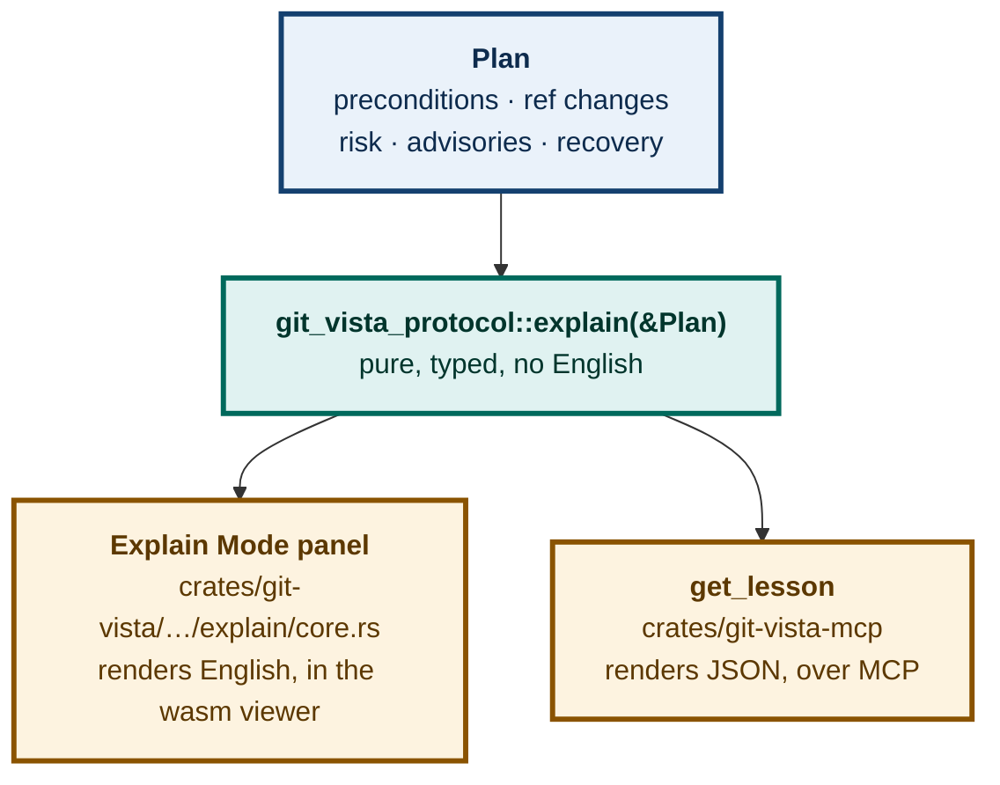
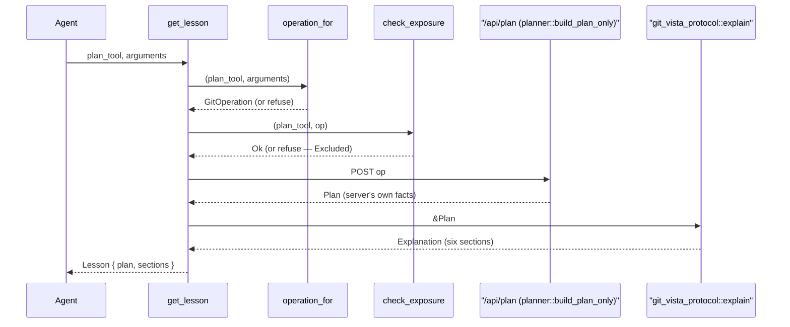
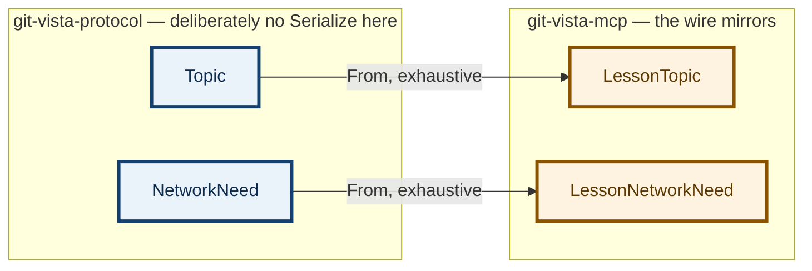

# ADR 0092 — A lesson is explained from a live plan, never a caller-supplied one; and its two wire-only facts stay out of the protocol crate

**Status:** Accepted — implemented and tested; browser leg not applicable (no browser surface)
**Date:** 2026-08-26
**Issue:** [#450](https://github.com/tom2025b/git-vista/issues/450) — a read tool on `git-vista-mcp` emitting structured teaching data from the live repository
**Supersedes:** nothing · **Superseded by:** nothing

---

## Context

#450 asks for a read tool on `git-vista-mcp` that turns "the current repository state — a conflict on disk, a sequence mid-flight, a plan that would run" into a structured lesson document for an agent, `teacher-thing`, or `decksmith` to render, store, or drill. The issue is explicit about the shape: **structured data, not HTML** — transport is not domain, and rendering taste does not belong in a Rust MCP server whose every other tool returns typed DTOs.

It also names the dependency that had to land first: this tool and Explain Mode's browser panel must derive their sentences from **one source**, so the lesson a page shows and the explanation the app shows cannot drift. ADR 0091 (#92, landed the same day) is that source: `git_vista_protocol::explain(&Plan) -> Explanation`, a pure function over the plan's own typed facts, with no English below the viewer that calls it.

That much was settled before this ADR. What #450 left open is **where the `Plan` a lesson explains comes from**, and that turned out not to be a detail — an early draft got it wrong, and the correction is this ADR's whole substance.

## Decision 1 — `get_lesson` builds its plan through the live `/api/plan` round trip, exactly the way a `plan_*` tool does; it never accepts a caller-supplied `Plan`

The first draft of this tool took a `Plan` object as its entire argument and explained it verbatim — zero network calls, trivially confined to the read-only surface. It looked like the cleanest possible reading of "structured data, not HTML": a pure function, no side effects, nothing to authenticate.

It was wrong, for a reason `#450`'s own acceptance criteria state directly:

> Sentences derive from `explain(&Plan)` — one source with the app, provably.
> Mutation-prove: **a lesson never contains a fact the repository did not carry.**

A caller-supplied `Plan` can be fabricated. Nothing stops an agent — or a bug three calls upstream — from inventing preconditions, a risk level, or an advisory that no real repository state produced, and `get_lesson` would turn that fiction into a confident-looking teaching document with no way to tell the difference. Testing that shape can only prove *"no fact the argument didn't carry"* — which is `git-vista-protocol`'s own `explain_parity.rs`, one crate over, proven already. It cannot prove the criterion actually named: no fact the **repository** didn't carry.

`plan_tools.rs` (#248) had already solved exactly this problem for `plan_*` tools, and the solution generalises without modification:

- [`plan_tools::operation_for(name, args)`](../../crates/git-vista-mcp/src/plan_tools.rs) is the closed, audited mapping from a tool name to a `GitOperation` — pure, local, no network.
- [`plan_tools::check_exposure(name, &op)`](../../crates/git-vista-mcp/src/plan_tools.rs) is the second lock: it refuses an operation `exposure_of` classifies `Excluded` even if some future dispatch arm could build one.
- A new `plan_tools::build_plan_typed` — factored out of the existing `build_plan` so both callers share one POST implementation — sends `op` to `POST /api/plan` and returns the typed `Plan` the **server** answered with.

`get_lesson`'s argument is therefore not a `Plan` and not a bespoke operation description. It is the exact `(tool name, arguments)` pair a caller would otherwise give a `plan_*` tool — `{"plan_tool": "plan_merge_branch", "arguments": {"branch": "main"}}` — forwarded through the same two locks, ending at the same one endpoint:

This keeps every guarantee `plan_*` already proved without re-proving it: `/api/plan` reaches only `planner::build_plan_only` (no mutation guard, no executor, no argv — `plan_tools::tests::every_plan_tool_posts_only_to_api_plan` pins this for the existing 23 tools, and `get_lesson` is a second caller of the identical endpoint, not a new one). It also means `get_lesson` reaches **exactly** the 23 operations `plan_*` exposes today — no more, no less. Conflict resolution (`resolve_conflict`, `resolve_conflict_content`) and the sequence/cherry-pick/stash operations are excluded from that set already, for reasons #84 and #77 gave (an agent choosing a side has seen none of the three versions of the file; a stash entry's positional selector has no reader yet). `get_lesson` inherits that boundary rather than reopening it — #450's own text imagines a lesson about "a conflict on disk, a sequence mid-flight," and today that lesson genuinely cannot be built through MCP, for the same reasons a plan for it cannot.

## Decision 2 — The two wire-only mirror types (`LessonTopic`, `LessonNetworkNeed`) live in `git-vista-mcp`, not in `git-vista-protocol`

`Explanation` deliberately derives no `Serialize` (ADR 0091 / `explain.rs`'s own module doc): the browser viewer already holds the `Plan` locally and calls `explain` itself, so serialising the result would be a second copy of facts the plan already carries — "nothing new crosses the wire." `Topic` and `NetworkNeed` inherited that posture because neither ever needed to cross a wire before this issue.

`get_lesson` is the first consumer that genuinely needs both on the wire: an MCP agent is not running Rust or wasm and cannot call `explain` itself, so the *result* — not the `Plan` alone — has to be the thing that travels. That need is a fact about **this transport**, not about the domain `git-vista-protocol` models. Per #450's own ruling ("transport is not domain, and rendering taste does not belong in a Rust MCP server"), the two small wire mirrors — `LessonTopic` (`Topic`'s six values, `snake_case`) and `LessonNetworkNeed` (`NetworkNeed`'s two) — live in `crates/git-vista-mcp/src/lesson.rs`, each with an exhaustive, no-wildcard `From` impl, rather than adding `Serialize` to a protocol type whose module doc explains why it deliberately has none. `Precondition`, `RefChange`, `WorktreeEffect`, `IndexEffect`, `RecoveryStrategy`, `Advisory` and `RiskLevel` already derive `Serialize`/`Deserialize` — they are `Plan`'s own fields and already cross the wire today — so `LessonFact` embeds those seven directly.

## Consequences

- `get_lesson` is confined to the same build-only endpoint every `plan_*` tool already proves it never leaves. No new server route, no viewer change, no HTML.
- A lesson's every fact traces to the `Plan` the live server returned, in the same response, under `plan` — so a consumer (`teacher-thing`, `decksmith`) gets a self-contained document without a second call, and the mutation-proof invariant is checkable directly from the tool's own output.
- The embedded `plan` carries live `operation_hash`/`generation`/`expires_at` — the same execution-binding fields `execute_plan` validates (#145). A lesson stored for later teaching is a snapshot whose `expires_at` will pass; that is harmless (`execute_plan` re-validates against the *live* repository and refuses a stale plan outright), but a consumer rendering a stored lesson later should not read an expired `operation_hash` as still submittable.
- `get_lesson` cannot teach a conflict-resolution or sequence-continuation lesson today. Widening it is gated on the same reader/selection work `plan_*` itself is waiting on (#84, #77) — not something to attempt piecemeal inside this tool.
- A known, pre-existing gap surfaced while building this: the MCP `get_activity` tool advertises "capped at 500," and the server's own cap (`crates/git-vista-server/src/activity.rs`: `DEFAULT_LIMIT = 100`, `MAX_LIMIT = 500`) has no cursor parameter at all — a long journal cannot be paged past its 500th event. Filed as a sibling issue rather than fixed here (see the PR body): it is a wire-contract change shared with the browser's own activity feed, outside `get_lesson`'s scope and outside this crate's allowed paths.

## Alternatives considered

**A tool that takes a `Plan` verbatim, as the first draft did.** Rejected — see Decision 1. It is the shape that looks simplest and is provably wrong against the issue's own stated invariant.

**A tool that builds the `Plan` itself, duplicating `plan_tools::operation_for`'s 23-arm match.** Rejected: a second place for the M4.31/#84 conflict exclusion, the M3.24/#77 stash exclusion and #153's `ResetTestRepo` exclusion to drift out of sync with the audited one. Delegating to `operation_for`/`check_exposure` means a future widening of `plan_*`'s exposure widens `get_lesson`'s automatically, by construction, with nothing to remember to update in two places.

**Adding `Serialize` to `Topic`/`NetworkNeed`/`ExplanationFact` directly.** Rejected — see Decision 2. It would reverse a documented design decision in `explain.rs` for the convenience of one caller, when the transport-specific mapping is a two-`enum`, exhaustive, few-line cost to keep in the crate that actually owns the wire.
