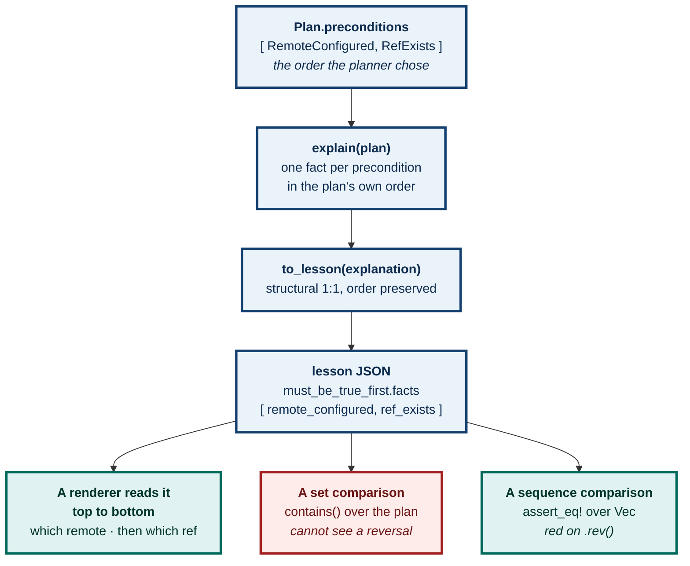
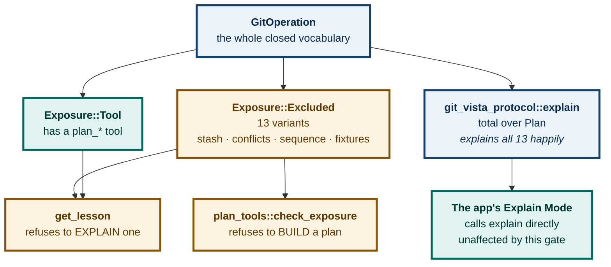

# ADR 0093 — A lesson's payload is a transport-side mirror of `Explanation`, never a second source of what a plan means

**Status:** Accepted — implemented, tested, and mutation-proved four ways
**Date:** 2026-08-26
**Issue:** [#450](https://github.com/tom2025b/git-vista/issues/450) — CLOUD-4, the MCP lesson tool
**Supersedes:** nothing · **Superseded by:** nothing

---

## Context

#450 asks for a **read** tool on `git-vista-mcp` that turns a plan into structured teaching data — the same facts #92's Explain Mode panel shows, reachable by an MCP client instead of only the wasm viewer. The issue's placement decision is explicit and not up for relitigating here: *structured lesson DATA, not HTML*. Rendering taste belongs to whatever renders next (the app's panel today; an artifact pipeline, `teacher-thing`, `decksmith`, tomorrow), not to a Rust MCP server whose every other tool on this surface already returns a typed DTO.

The hard constraint is #92's own: `git_vista_protocol::explain(&Plan) -> Explanation` is the **one** function that decides what a plan means, and `Explanation` deliberately does **not** derive `Serialize` — see `explain.rs`'s module doc, "Nothing new crosses the wire." That decision was made for the wasm viewer, which already holds the `Plan` locally and calls `explain` in-process. `git-vista-mcp` is a different situation: it is a separate binary that receives a `Plan` **as JSON** (from a prior `plan_*` tool call) and must hand a lesson back as JSON too. Something has to serialize.

Three shapes were available for that something:

1. **Derive `Serialize` on `Explanation` and its facts, in the protocol crate.** Rejected outright — it directly reverses the "nothing new crosses the wire" decision that `explain.rs` states as load-bearing, for the convenience of one caller.
2. **Give `git-vista-mcp` a second, hand-written classification of what a plan means**, independent of `explain`, so it can build its own JSON without touching `Explanation` at all. Rejected: that is a second source of truth for exactly the fact #92's acceptance criterion 3 exists to prevent ("the lesson a page shows and the explanation the app shows cannot drift"). Two independent classifiers of the same plan drift the moment one of them gains a case the other does not.
3. **A transport-side mirror, owned by `git-vista-mcp`, that maps `Explanation` structurally.** Chosen.

## Decision

**`crates/git-vista-mcp/src/lesson.rs` defines `Lesson`/`LessonSection`/`LessonTopic`/`LessonFact` — a `Serialize`-only echo of `Explanation`/`Section`/`Topic`/`ExplanationFact`, owned by the transport crate, not the domain crate.** `to_lesson(&Explanation) -> Lesson` is the whole of the mapping: two small exhaustive `match` statements (`lesson_topic`, `lesson_fact`), each arm carrying its source value through by clone or copy, never substituting, computing, or omitting one. Nothing here decides what a plan means; `explain` already decided, once, and `to_lesson` only decides how to spell that decision as JSON.

This keeps *transport is not domain* true in both directions at once: `git-vista-protocol` gains no wire commitment it did not already want, and `git-vista-mcp` gains no second opinion about what a plan means. The parity this buys is mechanical rather than aspirational — `lesson::tests::every_lesson_fact_matches_the_explanation_it_was_built_from` walks every fact `explain()` produces for a battery of plans and asserts the lesson's own serialized `kind`/`value` pair, computed **independently** of `to_lesson` (never by calling the function under test — the standing house rule), matches exactly.

**The `get_lesson` tool takes the exact `plan` object a `plan_*` tool returned, and makes no network call.** A `plan_*` tool's `POST /api/plan` already evaluated every precondition against the live repository at build time; the `Plan` a client holds already *is* live repository state, frozen into a typed value. Re-deriving its lesson is therefore a pure, local, offline function of bytes the caller already has — the same computation `execute_tool`'s `execute_plan` already performs on the identical `plan` argument before it ever builds an HTTP request. This is also why the tool composes with a `git-vista-fixtures` broken repository exactly as readily as with a real one (acceptance criterion 4): nothing in `get_lesson` inspects where the `Plan` came from, only what it contains.

**`get_lesson` applies `plan_tools::exposure_of` before it explains anything.** The first draft of this tool did not, and that was a real hole, not a theoretical one: the `plan` argument is caller-supplied JSON, nothing upstream inspects it (`tools::call_tool` dispatches `"get_lesson"` straight through, and `reject_undeclared_arguments` only compares argument *names* against a schema whose `plan` property is a bare `{"type": "object"}`), and unlike every `plan_*` tool this one makes no request, so the server never sees it either. Measured before the fix: a hand-built `Plan` carrying `GitOperation::ResolveConflict` returned a full six-section lesson. The MCP surface would have been *explaining* the operations it deliberately refuses to *plan* — #84 conflict resolution, #77's stash drawer, #153's `ResetTestRepo`, the sequence controls — while this very ADR restated those exclusions. The fix reuses the identical `exposure_of` table `plan_tools::check_exposure` consults, rather than copying the list here where it could drift, and passes `Exposure::Excluded`'s own stated reason through to the caller verbatim. `lesson::tests::get_lesson_refuses_an_operation_the_plan_surface_does_not_expose` pins the refusal for one plan per exclusion *reason*; `the_exclusion_gate_still_explains_every_exposed_operation` is the other half, so the gate cannot pass by refusing everything.

**`NetworkNeed` gained `#[derive(Serialize, Deserialize)]` in `git-vista-protocol`.** Every other type an `ExplanationFact` can carry (`Precondition`, `RefChange`, `RecoveryStrategy`, `Advisory`, `RiskLevel`, `WorktreeEffect`, `IndexEffect`) was already `Serialize` — each is also a field (or built from one) of `Plan`, which crosses the wire today. `NetworkNeed` was the one exception: an internal classification of remote effect (`network_need_for_operation`) that never previously left the server process. Deriving `Serialize` on it is a capability addition with no behavior change to anything that already exists, and it means `LessonFact::Remote(NetworkNeed)` needs no bespoke mirror enum of its own — the one genuinely shared, minimal change this issue's `allowed_paths` for `git-vista-protocol/src/` anticipates.

**Order is part of the contract, in both directions.** A lesson's sections are `explain()`'s fixed six in `explain()`'s fixed order — that was never in doubt. The addition this record makes explicit is that the **facts within a section keep the plan's own order too**. A lesson is teaching material read top to bottom, and the plan's sequencing is its reading order: the real `PushBranch` planner emits `RemoteConfigured` before `RefExists`, and `merge_branch` emits `BranchCheckedOut` before `RefAt`, because which branch you are on comes before where it points. `explain` already treats fact order as load-bearing and says why in its own doc (risk leads `WorthKnowing`; worktree precedes index, "the files are what the reader can see"), so a transport mirror that preserved membership while shuffling sequence would be re-ordering a lesson's sentences behind the reader's back.

This is a decision, not a restatement, because it was **not** covered until now: the plan-anchored test compared preconditions, ref changes and advisories as *sets* (`Vec::contains` over the plan's own JSON), and adding `.rev()` to `plan.preconditions.iter()` inside `explain` left all thirteen lesson tests green. They are `assert_eq!` over sequences now.

**Wire shape.** `LessonFact` is adjacently tagged (`{"kind": "precondition", "value": {...}}`), matching the convention `RefState` already uses in this same crate for a tagged enum whose payload is a nested tagged struct — not a new convention invented for this issue. `LessonTopic` serializes to the same six `snake_case` names Explain Mode's own topics are, in the same fixed order `explain()` always emits them, empty sections included (see `explain.rs`'s own doc for why a section is never hidden).

**Catalog placement.** `get_lesson` is listed as the eighth entry in `tool_catalog()`, appended after the six live-read tools and before `plan_*`. It is grouped with the reads for the census test's purposes even though it makes no HTTP call at all: it is not a write, and `plan_*`/`execute_plan`'s own census (pinning `execute_plan` as the catalog's last, only-mutating entry) is unaffected by where a second read-shaped tool lands ahead of it.

## Alternatives considered

**Route `get_lesson` through a new `/api/lesson` HTTP endpoint on the server**, mirroring the read-tool pattern the other six use. Rejected: the issue's own forbidden paths exclude `crates/git-vista-server/src/handlers/` for exactly this reason ("this is an MCP tool, not a new HTTP route"), and there is nothing a server round-trip would learn that the client-held `Plan` does not already carry — the server already spent the live-repository read building the plan in the first place.

**Accept the same free-form operation arguments `plan_*` tools take, and build-then-explain in one call.** Rejected: it would duplicate every `plan_*` tool's argument surface a second time inside `lesson.rs`, doubles the exposure surface `plan_tools.rs`'s closed-vocabulary discipline (ADR 0046) already governs once, and gains nothing over simply asking for the `plan` object the caller already has from calling that tool first.

## Consequences

**Good.** One function — `explain(&Plan)` — remains the entire truth about what a plan means, provably: `every_lesson_fact_matches_the_explanation_it_was_built_from` is a mechanical parity check, not a shared assumption, and it is anchored on independently hand-written expectations rather than on `to_lesson` itself. The tool needs no HTTP client wiring, no auth, no retry-on-401 — none of `authed_fetch`'s complexity — because it never leaves the process. It works identically whether the `Plan` it receives was built against a real repository or a `git-vista-fixtures` broken one.

**Costs, stated plainly.**

- `Lesson`'s shape is now a second enum family (`lesson.rs`) that must be kept in exhaustive lockstep with `Topic`/`ExplanationFact` by hand — the two `match` statements in `to_lesson` have no wildcard arm specifically so a new `Topic` or `ExplanationFact` variant fails `git-vista-mcp`'s build until it is mirrored, but that is a second place a future contributor must remember to touch, not zero places.
- **`get_lesson` explains fewer plans than `explain` does, and a future caller will meet that.** This is the exposure gate's price, and it is worth stating in plain words rather than leaving a caller to discover it. `git_vista_protocol::explain` is total over `Plan`: hand it any well-formed plan and it returns six sections. `get_lesson` is not. It refuses **thirteen** of `GitOperation`'s variants — `PushStash`, `ApplyStash`, `BranchFromStash`, `DropStash` (#77, the stash drawer); `ResolveConflict`, `ResolveConflictContent` (#84); `SequenceContinue`, `SequenceSkip`, `SequenceAbort`, `CherryPick`, `CherryPickMerge`, `RevertMerge` (the sequence controls); and `ResetTestRepo` (#153) — with a `ToolError::Execution` carrying `exposure_of`'s own stated reason.

  **No client can currently hit that refusal**, because the only supported way to obtain a `Plan` is a `plan_*` tool call, and `plan_tools::check_exposure` refuses to *build* one for those same thirteen operations from the same table. The narrowing is therefore not a defect today. It becomes visible the moment a plan reaches an MCP client by some other route — a plan built by the app and pasted in, a fixture, a future endpoint — and the honest summary of the trade is: *`get_lesson`'s domain is "operations MCP is allowed to plan", not "operations git-vista can plan"*. Widening it later would mean deciding that explaining an operation is safe where planning it is not, which is a real decision and should be made deliberately, not by deleting a call.

- `get_lesson` cannot explain repository state that never becomes a `Plan` — a conflict sitting on disk with no operation chosen yet, or a sequence mid-flight with nothing queued to continue — because `explain` takes only a `Plan`. A caller wanting a lesson about "what is wrong right now" still has to pick an operation, plan it, and ask for that plan's lesson; there is no bare "explain my repository" call. That follows directly from `explain`'s own signature (a pure function of `&Plan`, deliberately, per its module doc) and is not something this ADR's shape could have changed.
- The known `get_activity` 500-event pagination cap was found again while auditing this surface for guardrail compliance. **Corrected citation:** it does *not* live under `crates/git-vista-server/src/handlers/` — that directory has no activity module at all. The cap is two constants in `crates/git-vista-server/src/activity.rs`, `DEFAULT_LIMIT: usize = 100` (line 41) and `MAX_LIMIT: usize = 500` (line 42), applied by `activity_feed` at line 66 (`params.limit.unwrap_or(DEFAULT_LIMIT).min(MAX_LIMIT)`) and again when the feed is assembled at line 268; the route is registered in `crates/git-vista-server/src/main.rs` line 470. `crates/git-vista-mcp/src/tools.rs:214` is only the `get_activity` tool schema's *description string*, which repeats the number — reading it as the cap's home was the error. It is unrelated to plans or lessons and requires a server-side change outside this issue's allowed paths, so it is filed as [#562](https://github.com/tom2025b/git-vista/issues/562) rather than fixed here.

### Two tests that named a criterion they could not fail on, and the fix

Two independent skeptics reviewed this branch and both found the same class of defect. Recording it here is the point of the record: **a test that names an invariant it cannot actually break is worse than no test**, because the criterion then reads as covered.

**1. #450's "never emits HTML or a bare string" was covered by nothing.** The original `get_lesson_never_emits_html_or_a_bare_string` asserted only that the serialized result contains no `'<'` — an English sentence passes it, an empty payload passes it, a payload of nulls passes it — and this branch replaced it with `every_lesson_fact_value_is_typed_data_never_prose`. That replacement is a real check, and it catches breaks the old one could not (the empty payload, drifted `kind` names). But it checks only that each fact `value` **is an object of the right shape or a scalar from a closed vocabulary**. It never looks *inside* an object, and it reads only the keys it already knows — `kind` and `value`. So the criterion's own words survived intact:

| Break | Old `'<'` test | The shape test | Now |
|---|---|---|---|
| Rendered HTML `heading` added to every section | green (it read the whole string, but the mutation was never tried) | **green** | red |
| Plain-English `sentence` added beside every fact | **green** — no `<` in it at all | **green** | red |
| Markup nested inside a `precondition` payload | red | **green** | red |

Replacing a weak test with a differently-weak one is the failure mode, and swapping one for the other is what let it in. The criterion needs **both legs**, so it now has both. `no_string_a_lesson_carries_is_markup_or_a_rendered_sentence` walks **every string a lesson carries, wherever it sits** — recursively, including nested payloads and including keys no other test knows about — and applies two rules:

- **No markup, anywhere, no exceptions**: none of `<`, `>`, `&#`, `&lt`, `&gt`, `&amp`, a backtick, or `**`.
- **No whitespace**, because everything a lesson can legitimately carry is a machine token — a ref name, a branch name, a remote name, an oid, a worktree path, or a `snake_case` enum name, none of which can contain a space. "Contains whitespace" is therefore a mechanical stand-in for "reads as a rendered sentence" rather than a guess.

**Exactly one string is exempt from the second rule, declared in a `FREE_TEXT` table rather than waved through**: `Advisory::DefaultBranchUnknown`'s `reason`, which `plan.rs` documents as prose "for a human reading the plan, never for a caller to match on". It is the *plan's* prose, carried verbatim, not a sentence this tool composed — and it is still held to the no-markup rule. An anti-vacuity assertion requires that exemption to be exercised exactly once across the fixtures, so a `FREE_TEXT` entry naming a field nothing reaches fails loudly instead of sitting unfalsifiable.

**2. A test name claimed twelve fields and checked five.** `no_lesson_fact_lacks_a_plan_field_and_no_plan_field_lacks_a_lesson_fact` reads as total over `Plan`. `Plan` has **twelve** fields; that test checks **five** of them. It is now `the_five_plan_authored_fields_reach_the_lesson_intact_and_in_the_plans_own_order`, with the other seven enumerated in its doc comment: `operation` reaches a lesson only derived (covered by `derived_facts_match_the_independent_table`), and `repository`, `worktree`, `generation`, `operation_hash`, `issued_at` and `expires_at` are the plan's envelope, which `explain` never reads. Nothing about the coverage changed — only the claim, which now matches it.

### How this round was verified, and the one mutation that survived

`failure-atlas`'s `mutation_check` clones `HEAD`, so it cannot see work an orchestrator has not committed yet. The substitute keeps its discipline: each mutation applied to a **throwaway copy of the worktree** under `/tmp`, the full suite run, the copy destroyed and rebuilt from the branch before the next one. Every invariant was broken **at least two ways that fail differently**, never the same break twice.

| # | Mutation | Site | Result |
|---|---|---|---|
| **A1** | `section["heading"] = "<h2>What must be true first</h2>"` | `get_lesson`, after `to_lesson` | **RED** — and *only* the new test failed; the other **81 passed** |
| **A2** | `fact["sentence"] = "This must be true before the plan is allowed to run."` (no markup at all) | same | **RED** — again the only failure out of 82 |
| **A3** | `fact["value"]["hint"] = "<em>read this first</em>"` (markup *inside* an `OBJECT_FACTS` payload) | same | **RED** on the new test *and* on the plan-anchored one |
| **B** | `.rev()` on `plan.preconditions.iter()` | `explain.rs`, `MustBeTrueFirst` | **RED** — was green before the sequence assertions |
| **B2** | `.rev()` on `plan.advisories.iter()` | `explain.rs`, `WorthKnowing` | **RED** |
| **B3** | `.rev()` on `plan.expected_ref_changes.iter()` | `explain.rs`, `WhatMoves` | **SURVIVED** |

**A1 and A2 are the measurement that makes finding 1 real**, not an opinion: under each, 81 of 82 tests stayed green, including the shape check that was supposed to have replaced the `'<'` assertion. A2 in particular carries no `<` anywhere, so the *original* test would have missed it too. A3 turns out to have been partially covered already — worth recording, because it is the mutation one would reach for first and it would have given a falsely reassuring verdict about the whole class.

**B3 survived, and the honest reading is that the ref-change half of the order claim is not yet falsifiable.** Not because the assertion is wrong, but because **no plan this system can build carries two ref changes** — every arm of `git-vista-server`'s `planner::shape` produces at most a single `RefChange`, so reversing that list is a no-op and no fixture can have two. The assertion is written as a sequence anyway: same contract, no cost, and it starts biting the day an operation moves two refs. It is not evidence today, and the test's own doc comment says so rather than letting a green tick imply otherwise.

**Verification of the earlier round, retained.** Ten hand-applied mutations, each restored and the file's SHA-256 re-checked against its pristine copy afterward. **All ten were caught.** The exposure gate: mechanism removed (`refuse_unexposed_operation` call deleted), weakened (the refusal stops carrying `exposure_of`'s reason), and inverted (exposed operations refused instead) — caught by the two exclusion tests. `to_lesson`'s fidelity: a fact class dropped (advisories filtered out) and facts invented (every fact duplicated) — caught by the plan-anchored test. The derived third: the worktree derivation collapsed to a constant, and mislabelled as an index fact — caught by `derived_facts_match_the_independent_table`; and the `DERIVED` table gutted to a single repeated label — caught by its own anti-vacuity guard. The wire vocabulary: `kind` names drifted off `snake_case`, and the payload emptied entirely — caught by `every_lesson_fact_value_is_typed_data_never_prose`, which the old `'<'` test passed green while `to_lesson` returned zero sections.

`cargo test -p git-vista-mcp`: **83 passed, 0 failed, 7 ignored** — 82 unit tests (14 of them in `lesson`) plus one integration test, with the 7 ignored being the `live_handshake.rs` tests that need a real server on 127.0.0.1:8080.

---

**Signed:** max · 2026-08-26T00:00:00-04:00
**Revised:** max · 2026-08-30 — the `exposure_of` gate, the plan-anchored and hand-written-table tests, and two corrected citations.
**Revised:** max · 2026-08-30T00:00:00-04:00 — after adversarial review: fact order inside a section is part of the contract; the "never emits HTML or a bare string" criterion regained a leg that can actually fail; the plan-anchored test renamed to the five fields it checks; and the exposure gate's narrowing of `get_lesson`'s domain written into the consequences.
