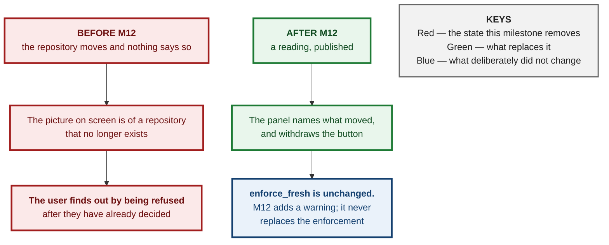
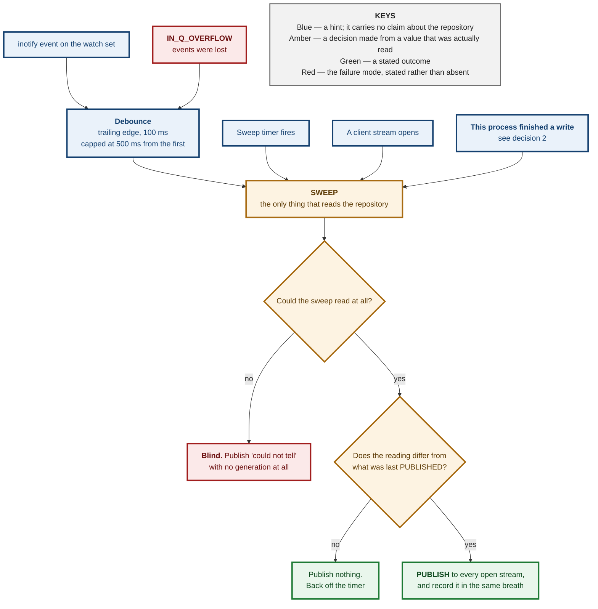
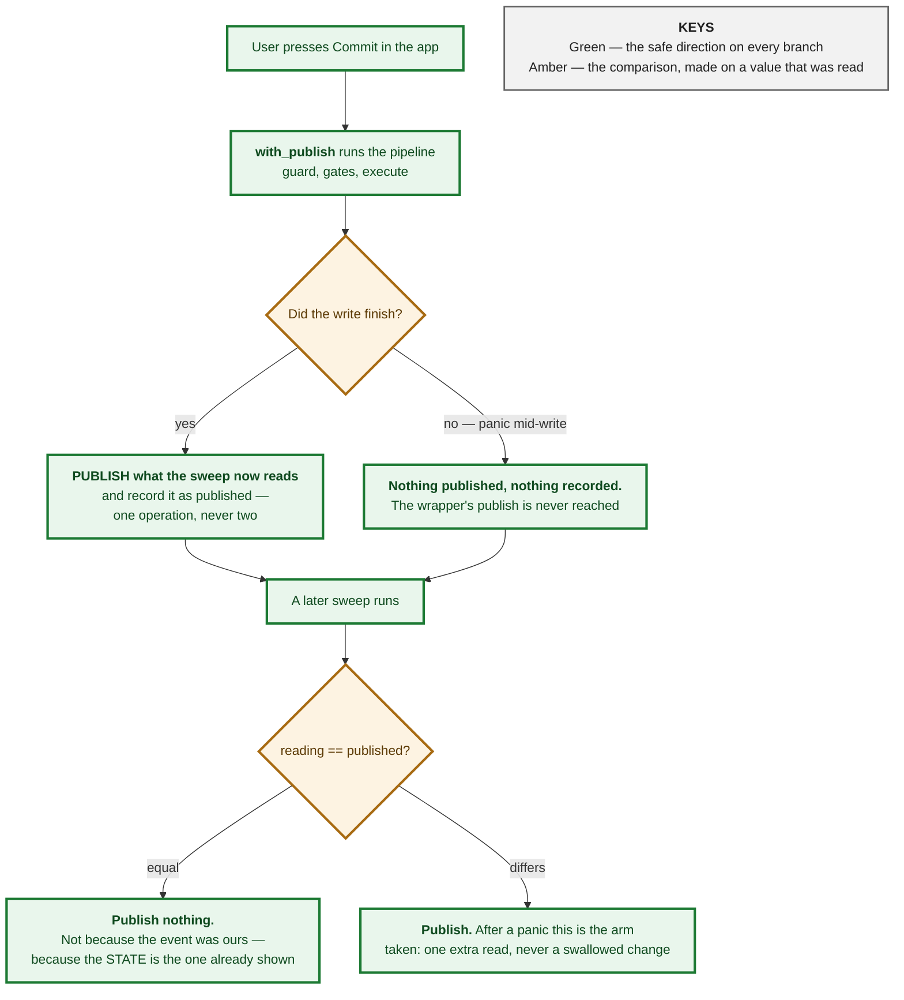
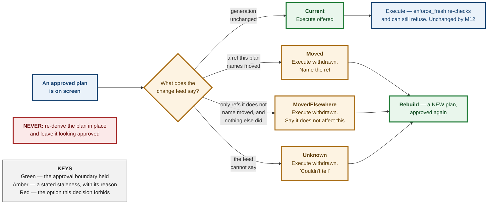
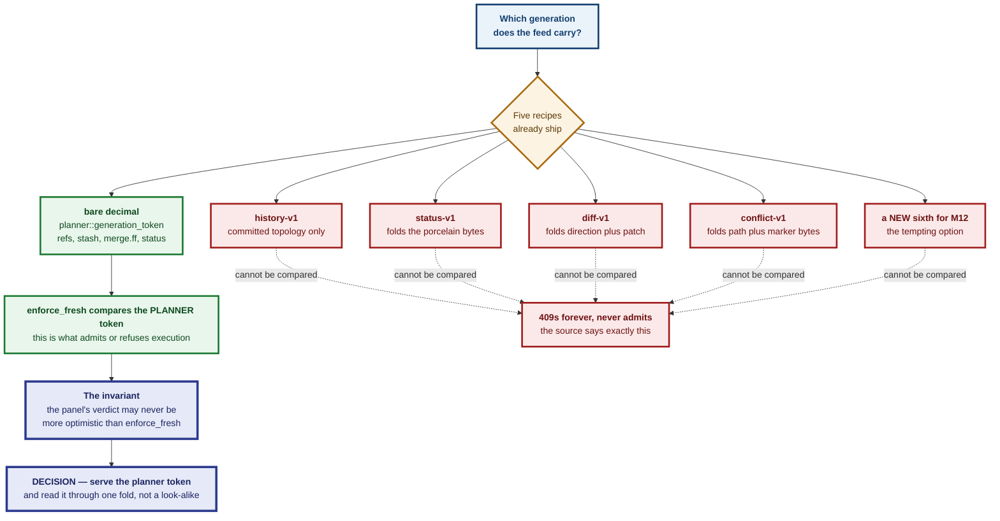
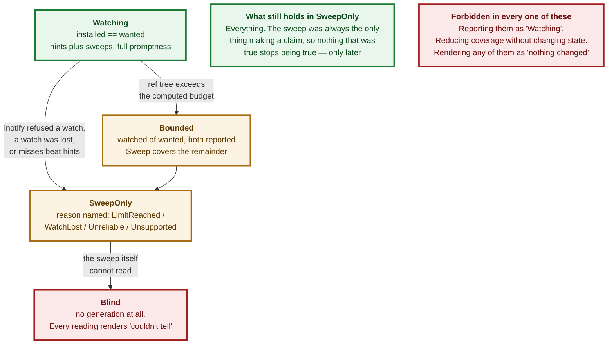

# ADR 0094 — The sweep is the only authority; the watcher is a hint about when to sweep

- **Status:** Accepted — implemented, mutation-proved two ways per invariant, measured on three repositories, browser-verified
- **Date:** 2026-09-05
- **Issue:** #79 (M3.26) → M12: #551 (spec) · #552 (watcher) · #553 (sweep) · #554 (self-writes) · #555 (stale plans) · #556 (the bound)
- **Reserved by:** [ADR 0095](0095-the-viewer-says-when-it-is-ready.md), which allocated 0094 for "watcher authority" before this file existed
- **Extends:** [ADR 0001](0001-repository-generation-token.md) (the generation this feed carries) · [ADR 0055](0055-an-undated-reading-gets-no-benefit-of-the-doubt.md) · [ADR 0005](0005-two-listeners-two-route-tables.md) · [ADR 0115](0115-a-mutation-proof-cannot-see-what-it-does-not-run.md)
- **Supersedes / superseded by:** —

## Context

The app could not tell that the repository had changed underneath it. A user
who ran `git commit` in a terminal, or whose editor stashed, or whose teammate
pushed, was looking at a picture of a repository that no longer existed — and
nothing said so. The only protection was at the far end: `enforce_fresh`
compares the whole generation digest and refuses execution, so the user found
out by being **refused**, having already decided.

Every mechanism that could fix this has a failure mode where it stops seeing
events, and every one of those failure modes looks exactly like a quiet
repository. So the rule that governs all six issues, and every decision below:

> **"I could not tell" must never render as "nothing changed."**

That is not a new principle here. It is what `Obs`, `Advisory::DefaultBranchUnknown`,
`HeadBranch::Unknown` and `Blame::UnknownOperation` already do — and it is the
one thing a watcher design gets wrong by default.

## Decision

### 1. The watcher never makes a claim. The sweep makes every claim.

The watcher reports only *that it is worth looking*. Every statement about the
repository is produced by a sweep — a read, through the same code the execution
gate uses, which computes a generation and compares it for equality.

This is the answer to "which source is authoritative when they disagree", and
the answer is that **the question cannot be asked**: only one of the two ever
makes a claim, so there is nothing to disagree about. That is a stronger
property than picking a winner.

Three defects the conventional design has simply do not exist here:

| what happens | what it costs |
|---|---|
| the watcher **misses** an event | latency, and nothing else — the next sweep reads the world regardless |
| the watcher reports a **spurious** event | one cheap read |
| inotify **queue overflow** (`IN_Q_OVERFLOW`) | nothing — "you missed some events" is what a hint already is |

The rejected alternative is worth naming because it is the obvious one:
**watcher authoritative, sweep as a backstop**. It requires translating an event
into a state delta — "`refs/heads/main` was written, therefore re-read that
ref" — and every such translation is a place where a *miss* becomes a **wrong
answer** rather than a *late* one. inotify hands you a path and a bitmask; it
does not hand you a value.

**Both counts are drawn from the same population**, and that symmetry is what
makes comparing them mean anything: every change the watcher had an opportunity
to announce is counted, whether it announced it or not. Counting only
timer-triggered changes — the first implementation, and the spec's own field
wording — samples misses and near-races while excluding every ordinary success,
so a watcher that had worked twenty times running could be condemned by the
next ten it missed.

**A dead watcher is caught by the free experiment already running.** Because the
sweep also runs on a timer, a timer-triggered sweep that finds a change the
watcher never hinted at is *evidence about the watcher*. It is counted, never
discarded: a hint arriving within `MISS_GRACE` (200 ms, twice the debounce) of
that sweep credits the watcher, and one that never arrives is a miss. Once at
least ten changes have been observed **and** misses outnumber hints, the feed
declares the watcher untrusted **on evidence** and moves to `SweepOnly` — a
visible state, not a quiet reduction.

Both halves of that rule are load-bearing. Without the floor of ten, the first
change a healthy watcher happens to lose reads as `missed > hinted` and condemns
it. Without the comparison, a watcher that misses nothing is never trusted.

### 2. Self-generated writes are recognised by comparing generations. There is no flag.

This is the subtle one, and the decision is to make the question disappear
rather than to answer it well.

**There is no deduplicator.** No "ignore the next event", no suppression window,
no matching of an event against a pending write. There is one value per feed:

> **`published` is written by, and only by, the act of publishing.** It never
> records "what I wrote". It records "what I last told every open stream".

The field name is the specification. Anything that assigns it without also
pushing that generation onto the feed reintroduces exactly the defect this
design exists to remove.

**Why "what I last told them" and not "the generation my write produced".** The
post-execution read happens after the coordinator guard has been released, and
the guard would not help even if it had not: it binds *this process's* writes
only — `coordinator.rs` says so in its own doc, "a git command run from a
terminal is outside it, by construction". So an external change can always land
between a write completing and its post-write read. If it does, that read
observes the **combined** state, and recording it as "what I wrote" would make
the next sweep compare equal and stay silent. **The external change would be
swallowed.** Publishing is what closes it: whatever the read observed, combined
state included, is pushed to every open stream *and then* recorded.

**Four independent reasons this cannot get stuck:**

1. **It is a value, not a mode.** There is no state in which the system is
   "suppressing"; every sweep does the same comparison.
2. **A panic mid-write takes the safe branch.** `with_publish` publishes *after*
   the pipeline returns, so a panic never reaches it, `published` keeps an older
   value, and the next sweep publishes. The failure mode is a redundant read.
3. **There is no write window to be inside of**, so it does not matter how long
   a write took or whether an external change overlapped it.
4. **The one way to swallow a real change is for that change to produce the
   state already on screen** — which ADR 0001 settled is the right answer.

**The repository has already paid for the alternative.** `refuse_if_git_busy`
carries the scar in its own doc: before ADR 0060 a present `index.lock` was read
as a flag-shaped claim, and "once true, that assertion could never become false
again: every following request against the repository was refused, **forever**,
recoverable only by a human with shell access."

### 3. A stale plan is marked stale, named, and never rebuilt without approval.

> **A plan that quietly re-derives itself is a plan the user did not approve.**

So the plan on screen is never re-derived. When the repository moves under it,
the panel says so and the confirm control is withdrawn; rebuilding is the
**user's** next action, and the plan it produces must be approved again.

Freshness is four states, and **execute is offered in exactly one of them** —
not as a UX preference but because `enforce_fresh` compares the *whole* digest,
so a plan whose generation moved for any reason will be refused. Leaving the
button live in the reassuring case would be offering a button whose purpose is
to fail.

| state | what the panel says | execute |
|---|---|---|
| `Current` | nothing at all | offered |
| `Moved { refs }` | "`refs/heads/main` moved while this was on screen." | withdrawn |
| `MovedElsewhere` | "The repository moved, but not in a way this operation depends on." | withdrawn |
| `Unknown` | "Couldn't tell whether this is still current." | withdrawn |

**`MovedElsewhere` is the only reassuring answer, so it has to be earned.** It
is reachable only when every ref that moved since the plan was built could be
named, none of them is one the plan names, and nothing outside the refs moved
either. A gap in what the client saw, a working-tree edit, or a ref the server
could not name all fall to `Moved`, which claims least. This is a change from
the spec, which drew the distinction on `expected_ref_changes` alone: a
working-tree change names no ref and can still change what a commit writes.

`Unknown` is mandatory and is where ADR 0055 lands: `is_stale(None) == true`,
"an undated reading gets no benefit of the doubt". A plan whose freshness was
never checked is not a fresh plan.

### 4. The feed carries the planner's generation. It does not mint a sixth recipe.

Five generation recipes already ship — `planner` (bare decimal), `history-v1:`,
`status-v1:`, `diff-v1:` and `conflict-v1:` — and `staging.rs` records in its own
source what comparing one against another costs: it **"409s forever, never
admits"**. The feed serves the **planner** recipe, because that is the digest
`enforce_fresh` compares, and the invariant a freshness panel rests on is that
the panel may never be more optimistic than the execution gate. Any other
namespace breaks that at the type level.

To make that true rather than merely intended, `generation_token` was split into
*read* and *fold*: `planner::live_reading` calls the same fold, over the same
parts, in one reading — so the refs a delta is computed from are the refs the
token was folded from. Two reads would be two instants, and a delta computed
across them can name a ref that did not move in the interval the token
describes.

**The price is stated rather than fixed:** the planner recipe folds worktree
status and the history recipe does not, so a pure editor save moves this
generation and re-reads a graph that cannot have changed. That is an over-read
— the fail-safe direction — and it is why no sixth recipe was invented to avoid
it.

### 5. The bound is computed from the kernel's own numbers, and hitting it is a state.

`MAX_WATCHES_PER_REPOSITORY = 64` was **picked**, justified against the
historical 8 192 inotify default. This box reports **524 288**. So the bound is
now computed, and the parts that are still chosen say they are chosen:

> `budget = clamp(max_user_watches / max_user_instances, 64, 4096)`

| number | source | honest status |
|---|---|---|
| the dividend | `/proc/sys/fs/inotify/max_user_watches` | **read from the kernel** |
| the divisor | `/proc/sys/fs/inotify/max_user_instances` | **read from the kernel** |
| dividing by it at all | — | **chosen policy**: budget as though every instance the user is permitted were one of ours |
| the floor, 64 | — | **chosen**, 4.5× the largest watch set measured (7 fresh clone / 12 live checkout / 14 linked worktree) |
| the ceiling, 4096 | — | **chosen**, 15× the largest watch shape ever measured |

**"I could not read the limit" must never render as "the limit is large."** If
either file is unreadable the budget falls to the *floor* and says so through a
**distinct variant**, never through the number — because `8192 / 128` is exactly
64, so the number alone cannot tell a computed budget from a defaulted one.

The bound is enforced in `reconcile_watches`, checked before every install, so a
ref tree that grows past it while the process runs is bounded at the same number
as one that was already too large. The two required roots are installed first,
so a starved budget still watches `HEAD`, `index` and `packed-refs`.

**The cadence is bounded by its own measured cost**, not by a guessed interval:
a read never runs sooner than **ten times** the last read's measured duration.
The app's cost is therefore capped at 10 % of one core by construction, on a
tiny repository and a huge one alike, with no size heuristic and no
configuration.

**That floor is a property of the driver, not of the timer, and the difference
is the whole of it.** The first implementation applied it only to the timer
deadline — and every watcher hint and app write then replaced that deadline
with *now*, so the ordinary case bypassed the bound entirely. Measured in
review of this branch: forty real tag writes at ~120 ms spacing produced 39
full reads, **35.0 % read occupancy** on a tiny repository. A bound that holds
only when nothing is happening is not a bound. Hints inside the window are
coalesced rather than dropped: the read they asked for happens the moment the
floor lifts.

### 6. Nothing runs with nobody watching.

A feed exists only while at least one client stream holds it: no stream, no
watcher, no sweep, no inotify watches consumed. It is also the cheapest possible
answer to the storm question.

**The cost is stated rather than hidden:** a tab that reconnects after an hour
learns the current state from its first snapshot, which is correct, but the
server has no history of what it missed — so "three things changed while you
were away" is not offerable. If that is wanted later, the feed has to keep
running and the bounds above start doing real work.

**A stream also ends when the session selects a different repository.** A feed
is bound to one worktree, and a stream that kept publishing the old
repository's generation would be answering a freshness question about a
repository nobody is looking at — *confidently*, which is worse than not
answering. The client reconnects, discards the log it can no longer difference
against, and starts again.

## Measurements

Taken on titan through the **production** read path — a `#[ignore]`d test
calling `planner::live_reading` and the real watcher, not a `git for-each-ref`
standing in for them. A proxy measurement is how the previous bound came to be
justified against a constant that was wrong by a factor of 63.

Budget on this box: `524288 / 256 = 2048`, both sysctls read.

| repository | refs | watches wanted | installed | warm sweep | interval the duty rule sets |
|---|---|---|---|---|---|
| git-vista itself | 779 | 24 | 24 | **298 ms** | 3.0 s |
| 20 001 refs in 2 003 namespaces | 20 002 | 2 004 | 2 004 | **1 990 ms** | 19.9 s |
| 21 201 refs in 3 203 namespaces | 21 202 | 3 204 | **2 048 — Bounded** | **2 160 ms** | 21.6 s |

Three things fall out, and the third is a finding rather than a result:

1. **The bound binds on a real shape.** The per-user ref namespace layout the
   spec predicted would stress it does, at a little over 3 000 namespaces — and
   it is observable, not silent: `installed 2048 of 3204`.
2. **The duty-cycle rule is the binding cadence constraint in all three**,
   including on git-vista itself (298 ms × 10 = 3.0 s, above the 2 s base). The
   self-calibrating rule is doing the work a picked interval could not.
3. **The sweep's cost is not git's.** `git status --porcelain=v2` and
   `git for-each-ref` each take ~10 ms on git-vista here, so ~95 % of that
   298 ms is the app's own read path — four sandboxed `git` spawns and a `gix`
   ref read over 779 refs. Which of those dominates is **not measured**, and
   this milestone records the fact rather than fixing it.

## Alternatives considered

- **Watcher authoritative, sweep as a backstop.** Rejected in decision 1: it
  turns a miss into a wrong answer instead of a late one.
- **Two equal sources, reconciled.** Rejected on the issue's own framing — "the
  difference shows up exactly when something is already wrong", and
  reconciliation logic between two sources of truth only ever runs in the state
  nobody tested.
- **Sweep only, no watcher.** Genuinely defensible and kept as the **degraded
  mode**, which is only possible because the watcher was never load-bearing.
  Rejected as the sole mechanism because "promptly" is #79's criterion.
- **A flag set before the write and cleared after.** Rejected on the evidence in
  decision 2, and it fails a second way that gets less attention: two clients,
  two writes, one flag — the second write's clear releases the first's
  suppression.
- **A time-bounded suppression window.** Strictly better than a flag, and still
  rejected: a window is a guess about duration in *both* directions. A slow
  write outruns it and re-reads; a genuine external change landing inside it is
  **swallowed**.
- **Match the event against what the app wrote (path plus expected oid).**
  Rejected: an inotify event carries a path and a mask, not a value, so the app
  must re-read to learn the oid — and once it has re-read it has the generation,
  and the event has told it nothing the generation does not already say.
- **Suppress by process identity.** Impossible: the writes are made by `git`
  subprocesses, and inotify does not report the writing pid at all.
- **Silently rebuild the plan when the repository moves.** Rejected by the
  governing rule, and it fails a concrete test: `Plan::operation_hash` binds
  approval to that exact operation, so a re-derived plan is a different artifact
  wearing the approval of the old one.
- **Model staleness as a new `Advisory` variant.** Rejected: `Advisory` is a
  build-time field of the immutable plan, and its own doc explains why — a
  warning that arrives after the fact "is not a warning, it is a receipt".
  Freshness is a property of *now*.
- **Scale the sweep interval by repository size.** Rejected in favour of the
  measured duration: a size heuristic is a proxy for cost, while the measured
  duration *is* the cost, and it accounts for a cold cache, a network
  filesystem, or a machine under load from a build — none of which a file count
  knows about.
- **Watch the working tree.** Not done in this slice. External file edits arrive
  at the sweep cadence. Named as a cost, with the bounded design that would fix
  it.

## Consequences

- **`enforce_fresh` and `generation_token` are untouched as decisions.** The
  safety property was already held; M12 adds a warning and never replaces the
  enforcement. `generation_token`'s *shape* changed — read, then fold — and the
  digest it produces is byte-identical, which the existing generation suite
  pins.
- **A new route, no protocol bump.** `GET /api/repository/events` is additive:
  new path, new types, no existing shape changed and no variant added to an
  existing closed enum. A v12 client that never calls it is unaffected.
- **It is the second route allowed to name its protocol version in the query
  string**, because `EventSource` cannot set headers. Matched *exactly* rather
  than by a wildcard, so the exception cannot widen by accident.
- **No path crosses the wire.** A lost watch is named by a git-dir-relative
  label (`refs/heads/team`), never a filesystem path — and a path with no
  recognisable git directory above it discloses nothing at all rather than a
  path with its front cut off.
- **Every snapshot carries its position in the feed's publication sequence.**
  A `RefDelta` is a difference from the *previous publication*, and the
  transport keeps only the latest value — so a slow reader can skip
  publications without ever disconnecting, and a chain of deltas read across a
  gap is not a chain. Reproduced in review: `refs/heads/main` moves, an
  unrelated tag moves before the client polls, and a plan expecting `main` is
  told the repository moved "but not in a way this operation depends on". The
  button stayed correctly withdrawn and the *explanation* was false, which is
  this milestone's own failure shape aimed at itself. A client whose previous
  snapshot is not `seq - 1` keeps the reading and discards the claim.
- **A write waits for its own sweep, not for a publication.** Those are
  different facts: a sweep that correctly publishes nothing — because the
  watcher already announced that generation — has still finished, and waiting
  on a publication instead added a measured 5.0 s to a successful write.
- **A retired notice source is dropped, not re-polled.** A closed channel
  answers instantly and forever, so leaving it in the driver's `select!` makes
  its arm win every iteration: measured at 41 reads in two seconds, and a spin
  even once the reads were stopped.
- **The decisions are host-testable by construction.** The policy is a pure core
  with no tokio and no clock; the client's four-state verdict and every sentence
  it prints are pure. That is ADR 0115's rule applied at the moment the decision
  was written, not retrofitted — and a source census binds the wasm-only callers
  to the core functions they must ask.

  **Applied at the moment, and still missed once.** The rebuild transition was
  first written as two lines inside `preview/signals.rs`, and the mutation that
  collapsed them came back `survived` — not because the test was weak, but
  because `cargo test` never compiles a `#[cfg(target_arch = "wasm32")]` module
  and so could not fail on the defect. ADR 0115's own rule, hit inside the fix
  for a defect that rule describes. The prescribed answer is to move the
  decision rather than reach for the code, so `slot_when_requested` and
  `slot_when_request_failed` are pure functions the wrapper asks.
- **A browser leg proves the whole path runs**, because the census cannot: the
  spec makes an external change with real `git` and requires the panel to change
  what it says and what it offers. It found a real defect the Rust suite could
  not — the feed opened on the launch repository and did not follow the
  session's selection.
- **A stale plan offers Rebuild, and Cancel is Discard.** Rebuild fetches a new
  plan; it never executes and never dismisses. The first slice shipped the
  *sentence* telling the user to rebuild and no control that would — and the
  browser tests, which asserted the wording and the disabled state, passed
  straight over it.

  **The approval boundary is held by the states in between, not by the button
  being there.** The first attempt at this control broke the boundary it was
  added to protect: clearing the plan to make room for its replacement made
  "there is no plan" true, and *that* re-enabled the confirmation — the notice
  gone, nothing to review, and the modal's own dispatch sending a branch-only
  request the execution gate never sees. The user reached that state by acting
  on being told the plan was stale.

  So a plan on screen is a **four-state value**, not an `Option`: `Absent`
  (never had one — #594 leaves these offerable), `Rebuilding`, `RebuildFailed`,
  `Ready`. Only `Absent` leaves a confirmation alone. Collapsing the middle two
  into it is what the first attempt did.

  Two ways to hold a plan means two ways to replace one, and the second did
  nothing at all: `preview_subject(Push)` is `NotPreviewable`, so routing a
  force-with-lease rebuild through `preview_action` resolved to `Clear` while
  the handler served only `Start`. The button was offered, the click issued no
  request. It now re-runs the menu's own two-step lease fetch through one
  shared constructor, because five values have to come off the same plan.

  Both defects live in a **transition**, and every test written for the first
  attempt asserted a resting state. The browser spec waited for the final
  picture, so it saw both ends and never the middle. The current specs hold
  `/api/plan` open and fail it.

  **A third defect, in the same transition, survived both of the above being
  fixed: nothing checked whether the transition itself was still the live
  one.** `rebuild_lease`'s two awaited requests wrote `Preview` state and
  re-opened the confirmation dialog unconditionally on completion — Cancel,
  which closes the dialog and bumps `Preview`'s own generation counter for
  every other path, did nothing to a continuation already in flight. A held
  reply released after Cancel reopened a confirmation the user had already
  discarded, reproduced in a real browser. The two-state fix above and this
  one are different bugs in the same function: the first was about *what*
  the four states mean, this one is about *whether a given transition still
  applies* once its instigating confirmation is gone.

  The review asked directly whether a mechanism should make the mistake
  unrepresentable, rather than a fourth careful reading of the same file, and
  whether a type could do it where a check could not. The honest answer is
  partial. `note_rebuild_started` now returns a `RebuildToken`, and neither
  `note_rebuild_failed` nor `note_rebuild_landed` nor the dialog re-open can
  run without presenting one — the type system genuinely forecloses the
  shape of bug that shipped, a completion with no proof of currency at all,
  because there is no argument-less overload left to call. What the type
  system cannot do is know whether a *presented* token is still fresh:
  freshness here is a fact about wall-clock event ordering (did Cancel or a
  newer rebuild happen before this reply landed), which is exactly the kind
  of question `RiskLevel`/`RecoveryStrategy` case-analysis over static shapes
  elsewhere in this codebase is well-suited to and this is not. So the token
  is checked against `Preview`'s live generation at the moment it is spent —
  a runtime comparison, `rebuild_token_is_current`, moved to
  `preview::core` and host-tested for the same ADR 0115 reason the two-state
  fix above already states, rather than left in the wasm-only wrapper a
  mutation proof cannot reach. The type makes the omission impossible; the
  comparison makes the staleness detectable. Neither alone would have been
  the whole fix.
- **A confirmation can hold a plan two ways, and both are checked.** A
  force-with-lease push has no graph preview (`preview_subject(Push)` is
  `NotPreviewable`) while displaying a server-built plan's explanation, risk and
  lease oid. Freshness taken only from the preview saw nothing there and left
  the most destructive button in the app enabled after the repository moved.

## The operator's five questions

Five were named as the operator's in #551's spec. Four are implemented at the
spec's own recommendation and are cheap to change: the working tree is not
watched; `SWEEP_BASE` is 2 s backing off to 60 s; the feed runs only while a
stream is open; the `Moved` / `MovedElsewhere` distinction is drawn.

### 7. The health affordance is permanent, not conditional (the operator's call)

**Decided 2026-09-05: `ChangeFeedHealth` gets a permanent, quiet affordance in
the topbar** rather than one that appears only when the feed is degraded.

The reasoning is worth recording rather than only implementing, because it is
this milestone's own argument turned on its own user interface:

> An indicator that appears only when something is wrong is indistinguishable,
> at a glance, from an indicator that has stopped working. "Nothing there" can
> only mean "healthy" if the healthy state is also drawn.

That is the same argument decision 5 makes about a watcher that quietly reduces
its coverage, and the same one this whole milestone exists for. A conditional
affordance would have the UI adopt the exact failure shape the backend was built
to avoid — and ADR 0055 already took this position once, for the status chip's
age, on identical grounds: a trust signal that only appears when things are
wrong is a trust signal nobody learns to read.

**Design constraint carried with the decision:** healthy is the resting state and
must be visually unremarkable — not a green badge competing for attention.
Degraded is the thing that *changes*, against a baseline that was always there.

**Not implemented in this record's slice.** The value is on the wire and the plan
panel reads it; nothing renders it in the topbar yet. That is real UI work with
its own a11y pass and its own browser leg, and it arrived at a review boundary —
so it is its own issue rather than a late addition to a branch already being
read. The decision above is settled; only the pixels are outstanding.
