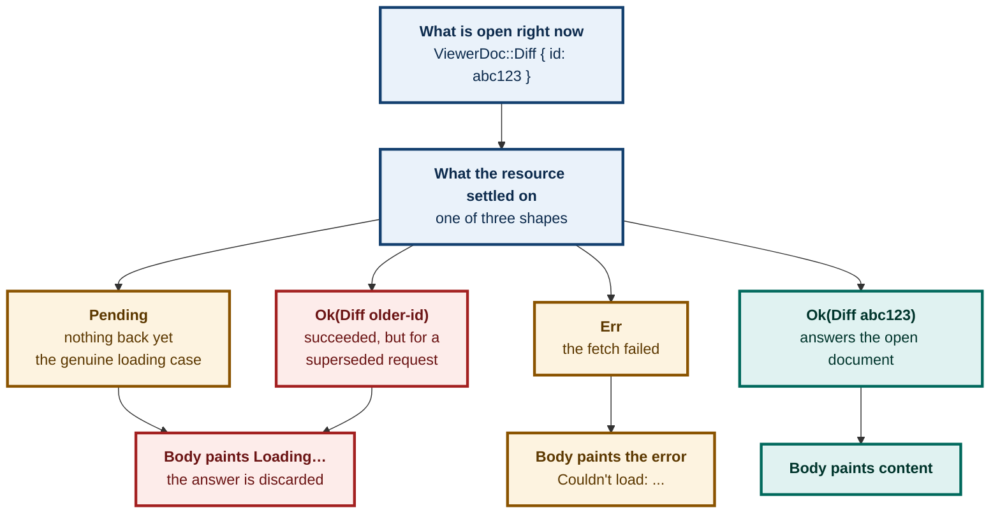
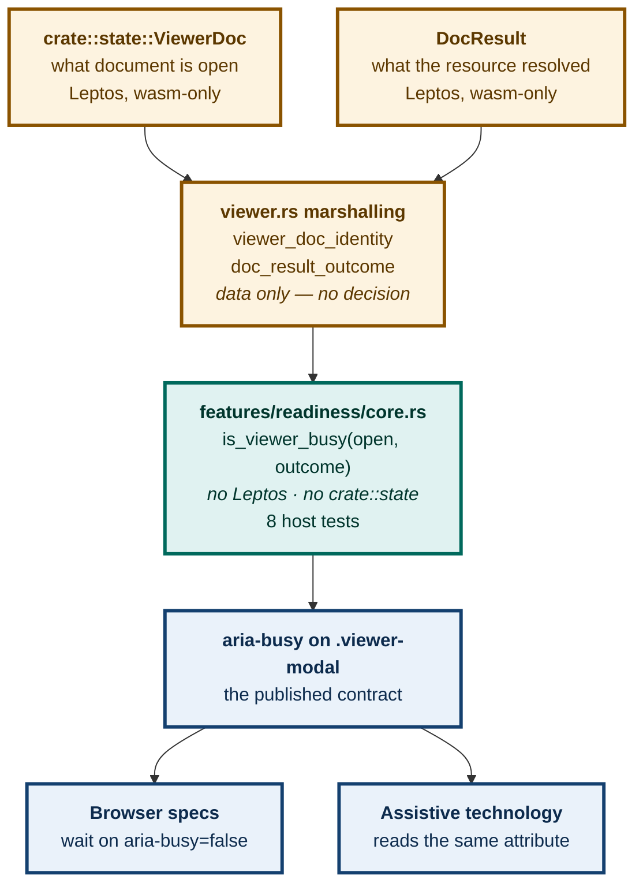

# ADR 0095 — The viewer says when it is ready, and the answer is derived from the decision it was already making

**Status:** Accepted — implemented, browser-verified, mutation-proved two ways
**Date:** 2026-08-27
**Issue:** [#387](https://github.com/tom2025b/git-vista/issues/387) — the app has no readiness signal
**Supersedes:** nothing · **Superseded by:** nothing

---

## Context

Two browser specs needed to know when the full-screen viewer had finished loading. Neither could ask, because nothing in the app answered that question. So both guessed:

```js
await expect
  .poll(async () => (await body.textContent())?.length ?? 0, { timeout: OPEN_BUDGET_MS })
  .toBeGreaterThan(100)
```

That threshold is calibrated against a single fact: the placeholder `"Loading…"` is shorter than 100 characters. It is a stopwatch wearing an assertion's clothes. It answers *"have enough characters appeared?"*, which is not the question anyone wanted answered.

**Three ways it is wrong, in increasing order of seriousness:**

| | Failure | Why the poll cannot see it |
|---|---|---|
| 1 | A genuinely short diff | A 60-character patch never crosses 100 and the spec times out on correct behaviour |
| 2 | An error message | `"Couldn't load: connection refused"` is 33 characters — under the threshold, so it reads as *still loading* forever |
| 3 | **A staleness echo** | A **successful** response for a document no longer open paints nothing, but any residual text can push the count past 100 |

The third is the one that matters, and it is invisible from outside the app.

### The staleness echo, which is the whole reason this is not a one-line fix

`viewer.rs` renders `"Loading…"` in **six** arms of one match. Only one of them is a genuine *"nothing has come back yet"*. The other five are ADR 0053's rule applied once per document kind: a resource that resolved **successfully**, but for a document that is no longer the one open, is **dropped rather than painted**.



**`Ok` and `Pending` land in the same visual place.** A signal derived from "did the fetch succeed?" would clear for a document that was never painted. That is precisely the bug a readiness signal exists to prevent, and it is why the answer has to come from inside the app.

---

## Decision

**The viewer publishes `aria-busy` on `.viewer-modal`, and its value is derived from the same two facts the `body` match already reads — not from a new source of truth.**

Three parts, and the boundary between them is load-bearing:



**1. The predicate is pure and host-tested.** `features/readiness/core.rs` follows the `features/*/core.rs` convention: no Leptos, no `crate::state`, no `#[cfg(target_arch = "wasm32")]`. It compiles and runs under `cargo test`.

```rust
pub fn is_viewer_busy(open: &DocIdentity, outcome: &FetchOutcome) -> bool {
    match outcome {
        FetchOutcome::Pending => true,
        FetchOutcome::Err => false,
        FetchOutcome::Ok(got) => got != open,
    }
}
```

**2. The identity types carry only what the existing check compares.** `DocIdentity` holds an id, a path, a spec — never a `CommitDiff`, `FileContent`, `ConflictPanes` or `StagingDiff`. The staleness check `viewer.rs` already makes never looks past a payload's identity, so neither does this.

**3. The marshalling stays in `viewer.rs` and makes no decision.** `viewer_doc_identity` and `doc_result_outcome` reduce the live Leptos types down to the identity types. `doc_result_outcome` is **exhaustive over `DocResult` with no wildcard arm**, deliberately: a variant added later without a matching arm fails the build rather than silently reading as settled.

### The rule that governs all three

> **Readiness is derived from the same information the render decision uses.**

Not from a parallel signal that could disagree with it. A readiness attribute that says "busy" while the app has painted content — or "ready" while it shows a placeholder — is worse than none, because two consumers now trust it.

---

## Alternatives considered

### A. Tighten the `textContent` threshold

Raise 100 to something larger, or assert on a substring.

**Rejected.** It fixes nothing. Every one of the three failures above survives a bigger number, and failure 3 — the staleness echo — is not expressible as a character count at all. This is the shape of fix that this repository has been burned by six times: a test that gets greener without getting truer.

### B. A bespoke `data-viewer-ready` attribute

Invent an app-private attribute rather than reusing an ARIA one.

**Rejected.** `aria-busy` already means exactly this, is already in the accessibility tree, and is already understood by assistive technology. A private attribute would need a test to depend on it and nothing else would benefit. Reusing the standard one means the fix for the test is simultaneously an accessibility improvement — the viewer now announces its own loading state to a screen reader, which it never did.

### C. Derive readiness from the resource's `Ok`/`Err`/`Pending` alone

The obvious shape, and the one a reader will propose first.

**Rejected — this is the interesting rejection.** It gets the staleness echo exactly backwards. `FetchOutcome::Ok` for a superseded document would clear `aria-busy` for content that was never painted. The comparison against what is *currently open* is not an embellishment; it is the entire difference between a correct signal and a confident lie.

### D. Put the predicate in `viewer.rs` directly

Skip the `features/readiness/` module and inline the match.

**Rejected.** `viewer.rs` is behind a wasm gate that `cargo test` never compiles. A predicate living there would have **zero** host test coverage — and this repository has four recorded defects (#68d, #69c, #210, #350) that lived exactly in that blind spot while a seven-check gate stayed green.

---

## Consequences

### What this buys

- **Two browser specs stopped guessing.** Both now wait on the app's own answer.
- **The viewer became more accessible as a side effect.** `aria-busy` is read by assistive technology; the modal previously announced nothing while loading.
- **Time-to-filled-body in the spec dropped from ~590 ms to 184 ms.** The app did not get faster — the old test spent that time polling.
- **A new `DocResult` variant cannot silently read as settled.** The exhaustive match fails the build instead.

### The surprising part, stated plainly so nobody trips on it

**`is_viewer_busy` returns `false` on `FetchOutcome::Err`.** A viewer displaying `"Couldn't load: …"` and zero diff rows satisfies `aria-busy="false"`.

This is correct — an error is a *settled* state, not a pending one, and `viewer.rs` renders every error as its own message rather than as a placeholder. `Err` deliberately carries no `DocIdentity` for the same reason: the error arm renders unconditionally without checking identity, so staleness never enters into it.

But it means **`aria-busy="false"` is not by itself proof that content painted.** Both browser specs remain sound only because each has real content assertions downstream — `viewer-paint` requires mounted DOM nodes, a scroll range past 10,000 px, and the literal text `line 0 of the large file`; `viewer-print` requires more than 3,900 mounted rows and zero spacer height. **Any future spec that waits on `aria-busy` and asserts nothing further is a vacuous test.** That is the sentence to remember from this record.

### A gap this deliberately does not close

`DocIdentity::Staging` carries **no direction**, because `viewer.rs`'s own staleness check for that arm has none to compare — `StagingDiff`, the response payload, has no direction field to echo back:

```rust
let ViewerDoc::Staging { direction } = which_for_body else {
    return /* Loading… */;
};
```

It asks only *"is a Staging document still open at all"*. So switching Stage↔Unstage while a fetch for the old direction is in flight can paint the wrong diff under the new direction's label. **That is a real defect in `viewer.rs`** — and closing it *here* would be wrong: adding a direction comparison the match itself does not make would report busy for a state the app renders as settled, breaking the governing rule above. It belongs in a fix to `viewer.rs`'s match, with this predicate following it.

### How it was verified, and why "green" was not enough

`cargo test` never compiles `viewer.rs`. Eight passing host tests prove the *predicate* and say nothing about whether the attribute is *reached* — which is the exact failure shape behind #68d, #69c, #210 and #350.

So the browser leg ran (68 passed, 0 failures), and then the wiring was mutated **two ways that fail differently**:

| Mutation | What it breaks | What the specs said |
|---|---|---|
| **B** — `let is_busy = move \|\| true;` | signal wired but always wrong | `Received: "true"` · 20 polls · timeout |
| **A** — delete the `aria-busy` attribute | mechanism absent entirely | `Received: ""` · attribute not present |

Both caught, by both specs. One mutation alone would have given the wrong verdict: **A** cannot see always-false wiring, and **B** cannot see an attribute that was never rendered. Together they establish that the attribute is present, is reactive, and renders its string rather than being coerced away.

---

## Numbering, and the hole below it

This record is **0095**, taken after the three numbers the landing queue has reserved (0092 for the worktree census, 0093 for the lesson tool, 0094 for watcher authority). Chronological order therefore still reads correctly: a higher number is a later decision, with no exceptions in this sequence.

**0086 was left unused deliberately, and [ADR 0086](0086-a-number-left-deliberately-unused.md) is the tombstone that says so.** It existed in no branch and no history; rather than quietly backfilling it with an unrelated 2026-08-27 decision — which would have made the numbers stop reading chronologically — the gap is recorded as a gap. The sequence is now continuous *and* honest about what 0086 is.

---

**Signed:** max · 2026-08-27T08:12:00-04:00
