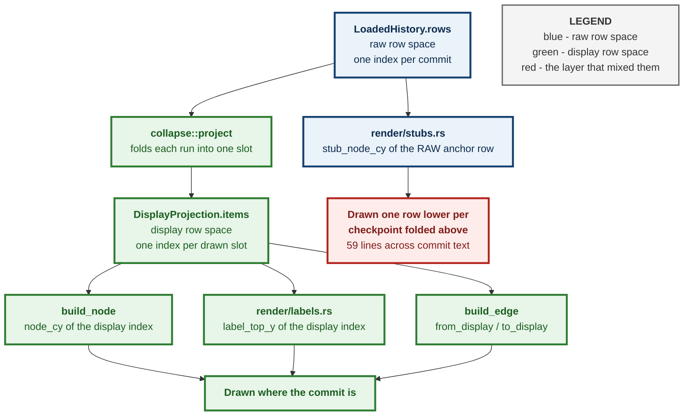
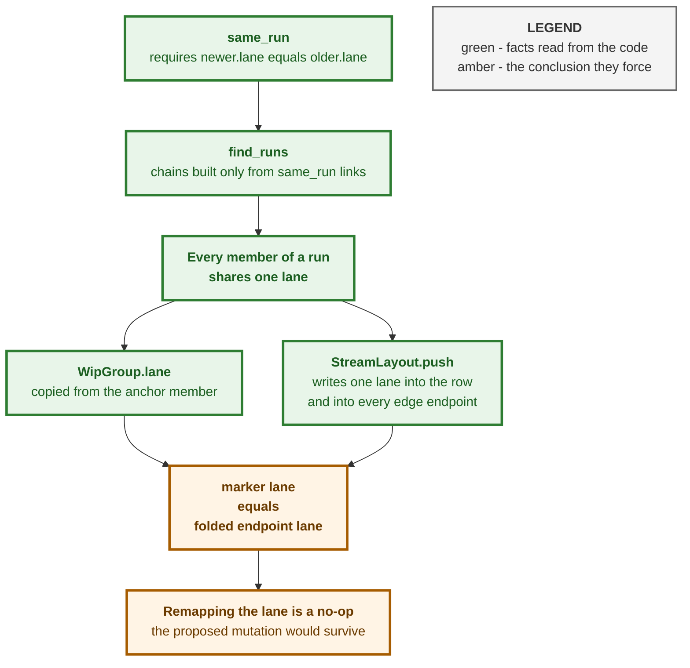
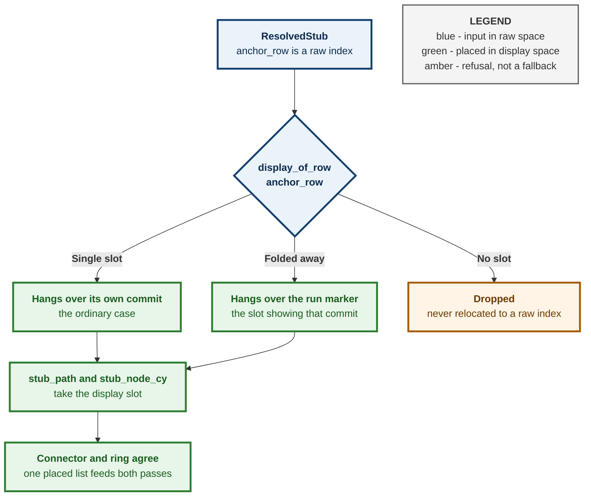
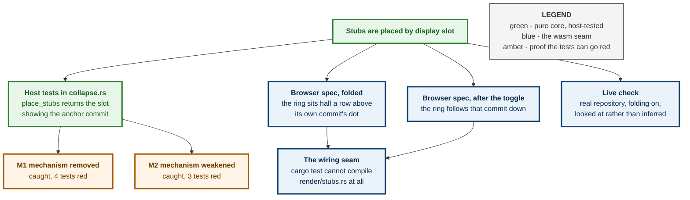

# ADR 0096 — Every layer of the canvas is placed by display slot, and the stub layer was the one that was not

**Status:** Accepted — implemented, mutation-proved two ways, browser-verified
**Date:** 2026-08-28
**Issue:** [#571](https://github.com/tom2025b/git-vista/issues/571) — folded WIP runs draw branch stubs at raw row indices
**Supersedes:** nothing · **Superseded by:** nothing

---

## Context

With WIP folding on — the default — thin coloured lines ran almost perfectly horizontally across the entire canvas, passing straight through commit subject text so they read as strikethroughs rather than as graph edges.

The canvas has two row spaces and has had them since [ADR 0075](0075-a-wip-run-is-a-chain-not-a-neighbourhood.md) gave folding its shape:

* **Raw row space** — an index into `LoadedHistory.rows`. This is what the aggregate keeps, what `oid_to_row` answers in, what `text_x` is indexed by, and what `resolved_stubs()` returns.
* **Display row space** — an index into `DisplayProjection.items`. A folded run's members leave this space entirely; one marker takes the slot the newest member would have had.

Every layer that draws a commit takes the **display** index of the item it is building. `render::build_node` computes `node_cy(i)` from the `<For>` key; both label tiers in `render/labels.rs` take the same `i` for `label_top_y`/`badge_top_y` and use the raw `row_index` only to look up content. The two stub layers did not: `render/stubs.rs` fed `ResolvedStub::anchor_row` — a raw index — into `geometry::stub_path` and `geometry::stub_node_cy`, both of which map a row to a y through `node_cy`.

Below the first fold the two indices differ by exactly the number of checkpoints folded above, so every stub was drawn that many rows too low.

### Why a misplaced stub is a line across the page, not a small offset

A stub's connector rises **half a row** while crossing from its anchor's lane to its own column, and stub columns are allocated *past* the commit lane high-water (`lane_high_water + lane_offset`, cumulative, so no two share one). Replayed against this repository's own history the columns reach **lane 123 — x = 4210px**. A connector is therefore near-horizontal by construction; drawn against the right row it is harmless, because `apply_stub_occupancy` widens the label column for exactly the rows a ring hangs over. Drawn against the wrong row, that protection is applied to rows that are no longer where the stub is, and the line lands across an unrelated commit's subject.

### The measurement

Replaying this repository through `StreamLayout` → `ReplayClassifier` → `collapse::project` and computing, for every stub connector, the rightmost x its cubic reaches inside each display row's label band:

| Mode | Stub lines reaching into commit text | Distinct rows struck | Worst overshoot |
|---|---|---|---|
| Unfolded | 0 | 0 | — |
| Folded (before this ADR) | **59** | 48 | 2838px |
| Folded (after) | 4 | 3 | 1271px |

4507 rows, 5277 edges, 92 stubs, commit lanes 0–31, stub lanes 32–123. The four residuals are described under *Consequences*; all three rows they strike are fold markers, not commits.



## The reported cause was not the cause

The defect arrived with a diagnosis attached: fold-collapsing rewrites the *row* coordinate of a display edge's endpoint but not its *lane*, so an edge crossing into a fold keeps a stale lane and `edge_path` emits a very wide, very flat S-curve. The proposed fix was to give a folded endpoint the lane of the marker it folded into.

That fix is a **no-op**, and it is worth recording why, because the reasoning is short and the conclusion is not obvious:

1. `same_run` requires `newer.lane == older.lane`, and `find_runs` builds a chain only out of `same_run` links — so every member of a run shares one lane, transitively.
2. `DisplayItem::WipGroup` copies `lane` from its anchor row, which is one of those members.
3. `StreamLayout::push` writes the same `lane` into the `GraphRow` and into every `Edge` endpoint it resolves — an edge endpoint's lane *is* its row's lane.

So a folded endpoint's carried-through lane already equals the marker's lane. Remapping it changes nothing, and a mutation reverting the "fix" would have come back `survived` — the exact shape this repository has been burned by before. Measured directly: display edges produce **zero** text collisions in either mode, folded or not. The edge projection was never implicated.



## Decision

**Anything drawn on the canvas is placed by display slot. A layer that holds raw row indices converts them before it computes any geometry.**

Concretely, `collapse.rs` gains one pure function and one small type:

```rust
pub struct PlacedStub { pub index: usize, pub display_row: usize }

pub fn place_stubs(projection: &DisplayProjection, anchor_rows: &[usize]) -> Vec<PlacedStub>
```

`render/stubs.rs` calls it once per pass and both passes iterate the *same* placed list, so a ring and the connector that reaches it cannot disagree about which row the stub hangs over. `canvas.rs` reads `display_epoch` alongside `stub_epoch` in both stub closures: the layers are eager, so without that they stay frozen at the previous projection's geometry when folding is toggled.

Two placement rules are load-bearing and are decisions in their own right:

* **A stub whose anchor is folded away lands on the marker.** The marker *is* the slot showing that commit. The branch has not stopped existing because its commit was folded, and beside the marker is where a reader would look for it.
* **A stub whose anchor has no slot at all is dropped.** This is the same posture `resolved_stubs` already takes for a stub whose anchor commit is not loaded. Falling back to the raw index would put the ring on some other commit's row — which is the defect, not a graceful degradation of it.



## Alternatives considered

**Make the label occupancy display-space too.** This is the more complete fix, and it is the one that would also close the residual described below. It was rejected *for now* on scope: `LoadedHistory.label_occupancy` is monotonic and grown page-incrementally on purpose, and making it a function of the projection means recomputing it whenever a run is opened or the toggle is thrown — a different contract, with its own invariants and its own tests, for four remaining crossings on three marker rows. Recorded here as the known next step rather than as a rejected idea.

**Drop a stub whose anchor is folded away.** Simple, and wrong in the way this project has learned to distrust: a branch would vanish from the canvas because an unrelated display preference was on. The user would have no way to tell "no branch here" from "a branch you cannot see".

**Suppress the whole stub layer while folding is active.** Worse than the above for the same reason, and it trades a rendering bug for a data-hiding one.

**Clamp the geometry instead — refuse to draw a connector flatter than some slope.** This treats the symptom. The line is near-horizontal *by design*; that is what a half-row fork into a far column looks like, and unfolded it is correct and readable. A slope guard would have hidden real stubs in the unfolded view while leaving the folded view drawing against rows that had moved.

## Consequences

**Four crossings remain, on three fold markers.** `build_wip_group` draws its `⋯ N WIP commits ⋯` label at `node_cx(lane) + NODE_RADIUS + 8`, hugging its own dot, and never consults the label occupancy — so nothing protects a marker's label from anything passing through its row. That is a distinct defect from this one and is recorded in [#571](https://github.com/tom2025b/git-vista/issues/571) rather than folded into this change.

**The home camera's stub headroom is still computed from raw rows.** `stub_headroom_for` is fed `(anchor_row, depth)` pairs in `canvas.rs`, one of them before the projection exists. Because folding only moves rows *up*, a raw-row headroom can be smaller than a folded stub needs — bounded by roughly `NODE_RADIUS + STUB_TOP_MARGIN + (depth + 1) × ROW_HEIGHT / 2`, i.e. tens of pixels at the home camera only. Left as it is deliberately: fixing one of the two call sites and not the other would be worse than fixing neither.

**The print sheet is unaffected.** `print.rs` holds no reference to the projection and draws every raw row unfolded, so it is internally consistent in raw space and must stay that way.

**The stub layers now repaint on projection change.** They were previously keyed on `stub_epoch` alone — a paging signal. Adding `display_epoch` means a fold, an expand, or the topbar toggle repaints them, which is a small amount of extra work on an eager layer of a handful of nodes.

## How this is proved

The placement rule is host-tested in `collapse.rs`, and both tests read the answer back through `DisplayProjection.items` rather than through `display_of_row` — asserting a mapping by calling the function that defines it proves nothing.

Two mutations, breaking differently, both `caught`:

| | Mutation | Result |
|---|---|---|
| M1 | `display_row: anchor_row` — the mechanism removed | **caught**, 4 tests red |
| M2 | remap only anchors that are folded *away*, leave the rest raw — the mechanism weakened | **caught**, 3 tests red; the folded-anchor case survives, which is what makes it a different break |

`cargo test` cannot reach `render/stubs.rs` at all — it is wasm-gated, and the host tests say nothing about whether the layer asks `place_stubs`. Two browser specs in `ci/browser/tests/wip-collapse.spec.mjs` close that seam against the real DOM: folded, the fixture's `base` stub must hang exactly half a row above the dot of the commit it is anchored on; after the topbar toggle it must follow that commit down to its new row, which is the assertion that pins the repaint signal rather than the placement.



---

**Signed:** max · 2026-08-28T23:55:00-04:00
