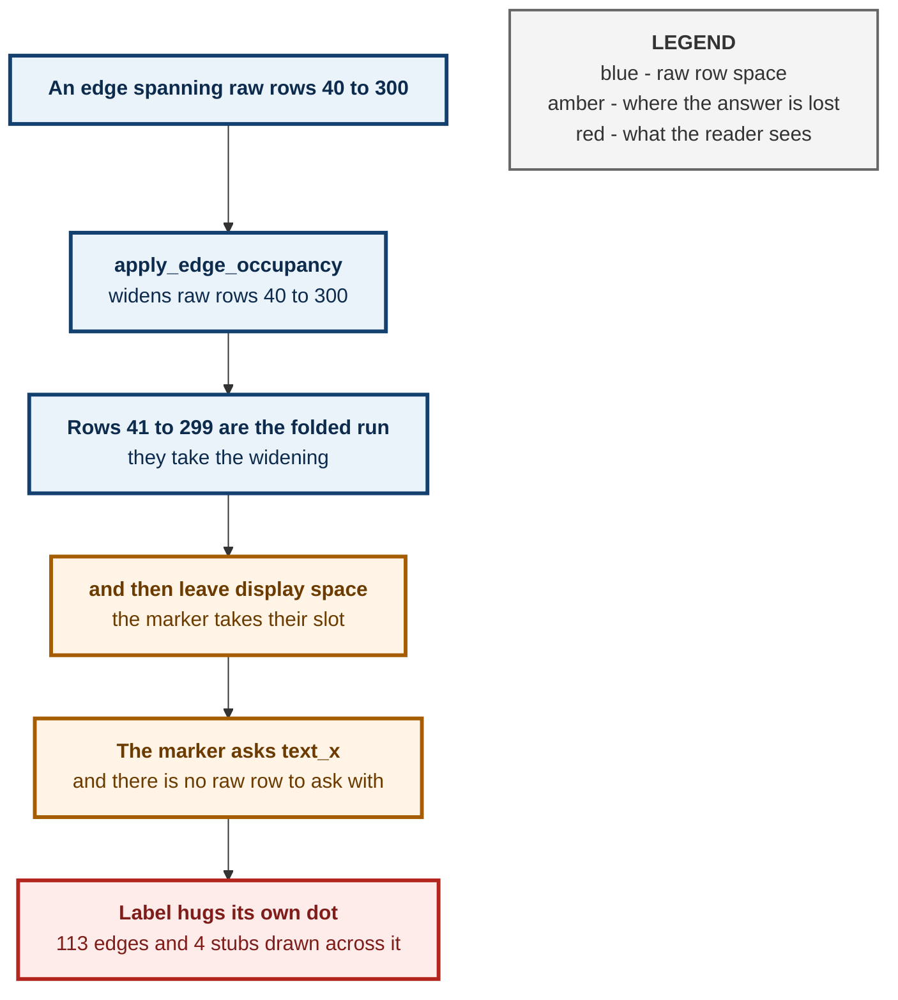
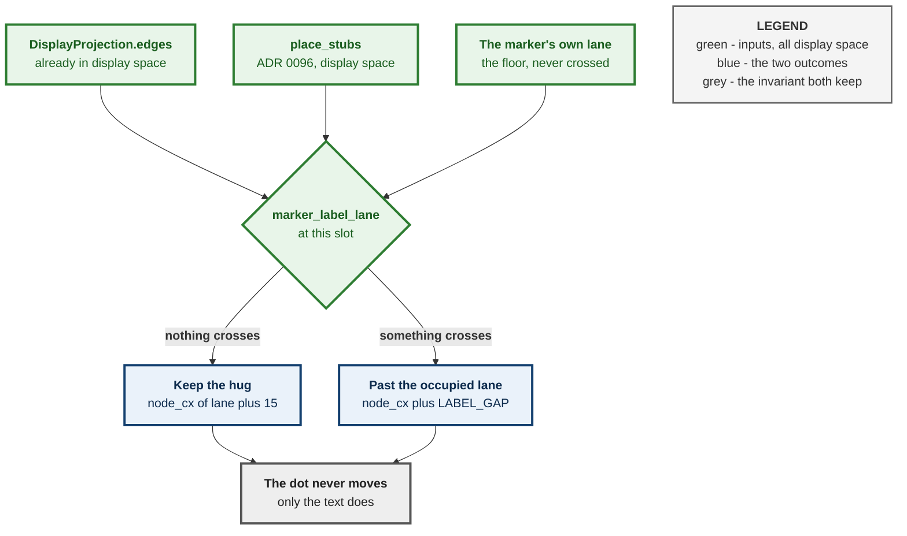
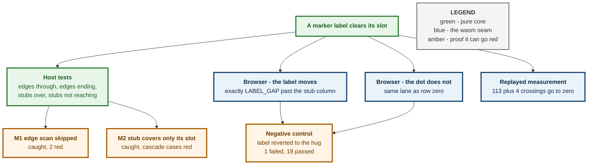

# ADR 0097 — A fold marker's label column is a display-space question, and only the marker's

**Status:** Accepted — implemented, mutation-proved two ways, browser-verified
**Date:** 2026-08-29
**Issue:** [#573](https://github.com/tom2025b/git-vista/issues/573) — a fold marker's label is drawn with no occupancy
**Supersedes:** nothing · **Superseded by:** nothing · **Follows:** [ADR 0096](0096-one-row-space-for-every-layer-of-the-canvas.md)

---

## Context

[ADR 0096](0096-one-row-space-for-every-layer-of-the-canvas.md) put the stub layer into display space and closed 59 of 63 measured crossings. It recorded the remainder as a distinct defect, which this record closes.

Every commit row's label starts past everything drawn at that row: `apply_edge_occupancy` widens the row for each edge passing through, `apply_stub_occupancy` for each stub ring hanging over, and `render/labels.rs` reads the resulting `text_x`. A fold marker had no such column. `build_wip_group` drew `⋯ N WIP commits ⋯` at `node_cx(lane) + NODE_RADIUS + 8` — hugging its own dot, consulting nothing — so whatever crossed the marker's display row was drawn straight across its label.

### The measurement, which is what set the scope

Replaying this repository through `StreamLayout` → `ReplayClassifier` → `collapse::project`, then computing the rightmost x every drawn curve reaches inside every display row's label band — 4513 rows, 5283 edges, 93 stubs, 57 fold markers:

| Crossing into a label | Unfolded | Folded, before | Folded, after |
|---|---|---|---|
| display edges → commit labels | 0 | 0 | 0 |
| display edges → **marker labels** | 0 | **113** | **0** |
| stub connectors → commit labels | 0 | 0 (after 0096) | 0 |
| stub connectors → **marker labels** | 0 | **4** | **0** |

Two facts in that table decided the design. Every crossing lands on a marker and **not one lands on a commit subject** — so the raw-space occupancy serving commit rows is not wrong and does not need to move. And the marker is crossed by *both* edges and stubs, so a stub-only answer would have left 113.

### Why the existing occupancy has no answer to give

It is indexed by raw row and consumed as `text_x[raw_row]`. A marker stands for a whole *run*, so there is no single raw row whose occupancy describes it — and the raw rows that did receive the widening are the folded-away members, which are no longer drawn anywhere. The question is only answerable in the space the marker exists in.

## Decision

**The marker's label column is computed in display space, from the projection's own edges and from the stubs already placed into it — and nothing else moves.**

`collapse::marker_label_lane(projection, stubs, display_row, marker_lane)` returns the rightmost lane anything reaches at that slot, using the same over-approximation of the S-curve that `apply_edge_occupancy` uses: an endpoint row allows one lane of bulge capped at the outer lane, a row strictly between takes the outer lane, and a stub covers its own slot plus the ⌈(depth+1)/2⌉ slots above it. `geometry::marker_label_x(marker_lane, occupied_lane)` turns that into an x.

Three properties are deliberate:

* **It returns the marker's own lane when nothing crosses**, and `marker_label_x` then keeps the original hug byte-for-byte. A graph with no crossings looks exactly as it did — a fix that shifted every marker in every repository to buy a rule would be a worse trade than the defect.
* **When it does move, it lands on the same column a commit row would get** (`node_cx(lane) + LABEL_GAP`), so a pushed marker lines up with the rows around it rather than at some marker-only offset.
* **Only the label moves. The dot does not.** The marker's dot is a graph column; moving it would move the lane every row around it is drawn against.

It is additive. `LoadedHistory`'s monotonic, page-incremental `label_occupancy` is untouched and still serves every commit row and the print sheet, which draws unfolded and is internally consistent in raw space.

## Alternatives considered

**Move the whole label-occupancy pipeline into display space.** The tidy end state, and it was the presumed plan until the measurement came back. It was rejected because the numbers say commit-row labels are not crossed in either mode — raw-space occupancy over-protects them, which is the safe direction — so the change would rewrite `LoadedHistory`'s monotonic page-incremental contract, and its tests, to fix a defect it does not have. Recorded here as available rather than as wrong: if a future layer *does* cross a commit label, this is the answer.

**Give the marker `text_x[anchor_row_index]`.** The cheap version, and it does not work. The measurement names the striking stubs, and their anchors are different raw rows from the marker's anchor — that row never received the widening, so the floor would be the same one that is failing today.

**Suppress or truncate the marker label when something crosses it.** Trades a legible collision for an illegible absence: `⋯ 240 WIP commits ⋯` is the only thing on screen saying how much history is hidden there.

**Push the marker's dot as well, so label and dot stay adjacent.** The dot is a lane position, not decoration; moving it puts the marker in a column that means something else, and every edge terminating on the marker would then point at the wrong place.

## Consequences

**A marker's label can now be indented well past its dot**, up to the stub columns, which on this repository reach lane 124. That is deliberate — it is the same distance a commit row's label is already pushed in the same situation — but it does mean a marker beside a deep stub cascade reads as detached from its dot. The dashed hollow ring is what identifies it; the connection is the row, not the gap.

**Cost is O(edges) per drawn marker**, paid only for markers inside the viewport, and the same walk `apply_edge_occupancy` already performs once per page. No caching was added: measuring first is cheaper than a cache that can go stale against a projection that changes on every fold.

**The print sheet is unchanged.** `print.rs` holds no projection and draws every raw row unfolded.

## How this is proved

The rule is a pure function and is host-tested, including the paired negative that a stub whose cascade does not reach the marker leaves it alone — without which the rule "every stub pushes every marker" passes just as happily and indents the whole graph.

| | Mutation | Result |
|---|---|---|
| M1 | the edge scan skipped entirely — the span guard short-circuited so no edge is ever considered | **caught**, 2 tests red, both the edge cases |
| M2 | a stub covers only its own slot, never the ones above it | **caught**, different tests red — the cascade cases |

The two mutations were chosen to break the rule in the two ways it can be wrong, not twice in the same way. M1 removes the edge half outright; M2 leaves the stub half present but shrinks its reach to a single slot, which is the shape a plausible off-by-one would take. They fail on disjoint tests — M1 on the edge cases, M2 on the cascade cases — and that disjointness is the evidence that the tests pin two independent halves rather than one mechanism twice over.

The wiring is wasm-gated and `cargo test` cannot reach it, so two browser specs assert the drawn SVG: the marker label starts exactly `LABEL_GAP` past the column of the stub hanging over it, and the marker's dot stays in the lane it was in. Run against a build with the label reverted to its hug, the first goes red and the second stays green — which is what says the two assertions are about different things.

The replayed measurement is the third leg, and the only one that speaks about this repository rather than about a five-row fixture. It is not a test and is not committed: it shells out to `git`, rebuilds the layout, and reports crossings per mode. Its numbers are what set this record's scope, and they are quoted in the table above rather than left as a claim.

## Related records

[ADR 0096](0096-one-row-space-for-every-layer-of-the-canvas.md) is the record this one completes. It moved the stub layer into display space and named this residual as the next step; between them the measured crossings on this repository go from 172 to zero, and the split is worth keeping visible — 0096 fixed a defect that struck 48 commit subjects, this one a defect that struck only markers.

[ADR 0075](0075-a-wip-run-is-a-chain-not-a-neighbourhood.md) is why a marker cannot be described by a raw row at all: a run is a chain, its members need not be adjacent, and the marker stands for all of them at once.

The alternative this record declines — moving the whole label-occupancy pipeline into display space — stays available and unowned. Nothing schedules it, and the measurement is the thing that would justify it: the day a commit-row label is measured as crossed, that is the change to make.

---

**Signed:** max · 2026-08-29T04:20:00-04:00
