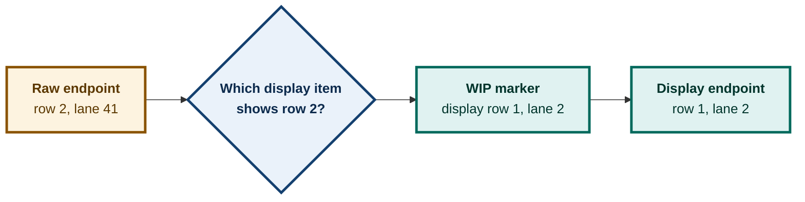

# ADR 0098 — A folded edge lands on the marker that represents its hidden endpoint

**Status:** Accepted — implemented and host-tested; mutation and live verification pending
**Date:** 2026-08-29
**Issues:** [#374](https://github.com/tom2025b/git-vista/issues/374), [#478](https://github.com/tom2025b/git-vista/issues/478) — folded WIP display projection
**Supersedes:** nothing · **Superseded by:** nothing

---

## Context

WIP collapsing is a display projection. A run of raw commit rows becomes one
`WipGroup`, and every raw member maps to the marker's one display row. Internal
edges disappear because both endpoints map to that same slot.

The projection previously transformed only an edge endpoint's row. Its lane was
copied from the raw `Edge` unchanged:

```rust
DisplayEdge {
    from_display,
    from_lane: e.from_lane,
    to_display,
    to_lane: e.to_lane,
}
```

That makes a crossing edge internally inconsistent: its vertical coordinate
names the marker, while its horizontal coordinate can still name a lane used by
the hidden member. A long folded run can bring the two display rows next to each
other without bringing those lanes together. `edge_path` then draws a very wide,
nearly horizontal S-curve through the commit-text column.

Colour already resolves a `WipGroup` through its `anchor_row_index`. Position
did not, so the same visible endpoint had two identities depending on which
attribute was being rendered.

## Decision

**Both coordinates of a folded edge endpoint come from the display item that
represents it.**

- A `Single` keeps the source edge's routing lane.
- A `WipGroup` uses the marker's `lane`, which is the anchor row's lane.
- An edge whose two raw endpoints resolve to the same marker remains suppressed.

The rule is applied independently to `from` and `to`. An edge can enter a fold
or leave one, and either direction must land on the marker.



## Alternatives considered

### Continue toward a nearest visible ancestor

Rejected. It requires a second topology walk during display projection and can
redirect the edge away from the marker that tells the user where the hidden
commits are. It would also have to define which ancestor wins for a folded merge
parent. The anchor rule is local, deterministic, and matches the visible object.

### Suppress every edge with a folded endpoint

Rejected. Suppression is correct only when both endpoints collapse into the same
marker. Suppressing a crossing edge would erase useful topology: a visible merge
whose parent is folded would no longer show that parent relationship at all.

### Keep the raw lane

Rejected. It preserves a coordinate for an object that is no longer displayed
and is the direct source of the row/lane split. A display edge must not be half
raw and half projected.

## Consequences

- Crossing edges terminate on the fold marker instead of a hidden member's lane.
- Ordinary visible-to-visible edges keep their existing routing lanes.
- Internal folded edges remain absent.
- Position and colour now use the same anchor identity for a folded endpoint.
- The projection contract changes, so callers may treat every `DisplayEdge`
  coordinate as display-space geometry.

The regression fixture exercises both endpoint directions. Its visible items
occupy lanes 0 through 2 while the hidden raw endpoints carry lanes 40 and 41.
It asserts:

- **A1:** no surviving edge's absolute lane delta exceeds the visible lane
  high-water;
- **A2:** no adjacent-row edge reaches the commit-text column;
- **A3:** the edge wholly inside the fold is still dropped.

## Decision log

- **D1:** Use the marker anchor lane — it is the only visible representation of a folded endpoint.
- **D2:** Resolve `from` and `to` independently — folds may occur on either side of an edge.
- **D3:** Preserve raw lanes for `Single` items — folding must not perturb ordinary edge routing.
- **D4:** Keep same-slot suppression — an internal edge connects no two visible objects.
- **D5:** Use a three-lane A2 threshold — lane width is 34px while the label gap is 18px, so lane 3 is inside the text column for the fixture's lanes 0 through 2.
- **D6:** Reserve ADR 0098 — open PR #574 already owns 0096 and 0097.

## Verification

- Targeted collapse suite: 39 passed.
- Mutation M1, both lane remaps removed: pending.
- Mutation M2, only `from` remapped: pending.
- Workspace test, Clippy, format, release build, frontend build: pending.
- Rendered SVG visual inspection: pending.

---

**Signed:** codex · 2026-08-29
