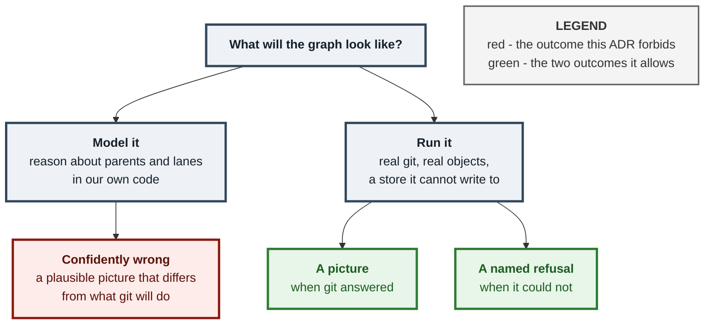
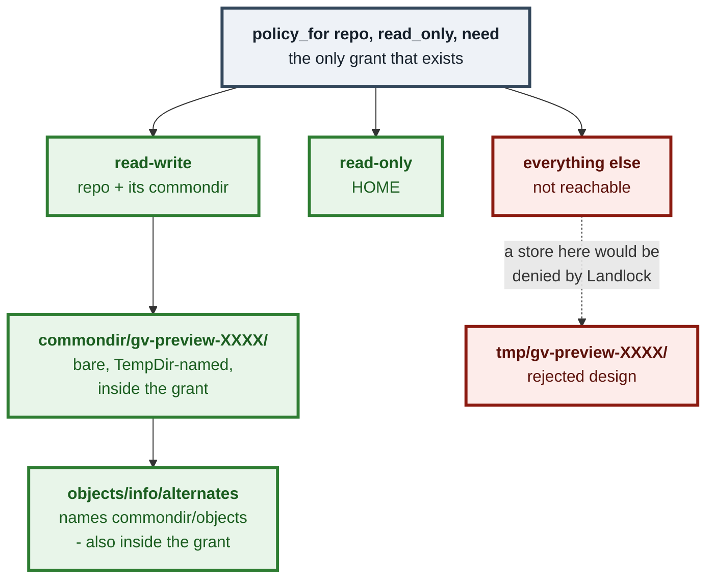
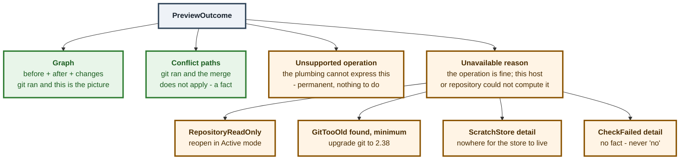

# ADR 0099 — A preview is real git, refusing rather than modelling

**Status:** Accepted — server half implemented, `POST /api/preview` routed; the
web canvas (A6) is a follow-up
**Date:** 2026-08-30
**Issues:** [#576](https://github.com/tom2025b/git-vista/issues/576) — M10.08,
graph preview
**Spec:** `docs/superpowers/specs/2026-08-29-graph-preview-design.md`
(amended 2026-08-30: §4.1b/4.1c placement, §5 comparison, §9b open questions)
**Supersedes:** nothing · **Superseded by:** nothing

---

## Context

A user about to run `revert`, `cherry-pick` or a merge cannot picture what the
graph will look like afterwards. Explain Mode already says what an operation
will do, in words. Nothing shows it.

There are two ways to build that picture, and only one of them is safe.

The tempting way is to **model** git: reason about parents and lanes in our own
code and draw the result. The failure mode of a modelled git is not being
wrong. It is being *confidently* wrong — producing a plausible graph that
quietly differs from what the command will actually do, on exactly the
operations a user cannot check by eye. A user who sees nothing goes and reads
the docs. A user who sees a wrong picture acts on it.

The other way is to **run** git and refuse when it cannot answer. That is what
this ADR decides.



The mechanism that makes "run it" safe was measured before it was designed, and
re-measured on `8ef604d1` on 2026-08-30 with the exact argv composition the
code uses — **provenance flagged, not re-verified, in the 2026-08-30 later
round**: `8ef604d1` is `docs(#551): M12 decision spec …`, a commit unrelated
to #576 or `preview.rs`, so this citation is wrong and the measurement itself
was not re-run to confirm the underlying claim still holds; only the fact of
the wrong hash is established here. A throwaway **bare** repository whose
`objects/info/alternates` names the
served repository's object directory can read every object that repository has
and writes only into itself:

```text
objects under <commondir>/objects before : 9
merge-tree -z --write-tree --merge-base=… : rc=1 (a real conflict)
objects under <commondir>/objects after   : 9      <- unchanged
objects under <scratch>/objects           : 3
commit-tree <tree> -p <head>              : rc=0, commit 6b205017…
objects under <commondir>/objects after   : 9      <- still unchanged
scratch store:    cat-file -t 6b205017…   -> commit
real repository:  cat-file -t 6b205017…   -> fatal: could not get object info
real repository:  show-ref                -> byte-identical before and after
```

---

## Decision

**A preview is computed by real git against the real object store, in a
throwaway store it can read through and cannot write back to, and it refuses
rather than models.**

Six parts, each load-bearing.

### 1. The computation lives in `git-vista-server`, not `git-vista-git`

`git-vista-git` is a pure-`gix` crate that never spawns a process; it carries
its own `ALLOWED_GIT_CRATE_SPAWN_SITES` allowlist precisely to keep it that way.
The sanctioned `git merge-tree --write-tree` path already exists one crate over,
in `activity::revert_would_conflict` (#327), already allowlisted, already going
through the sealed sandbox launcher. `crates/git-vista-server/src/preview.rs`
constructs **no `Command`**: every spawn goes through `git_cmd::git_output`, so
`argv_boundary`'s source scan needs no new entry and its allowlist is untouched.

### 2. The scratch store lives under `<commondir>`, and nowhere else

`git_cmd::sandboxed` derives `read_only` from `state::read_only_for_path(repo)`
and calls `sandbox::policy_for(repo, read_only, need)`, which grants exactly
`repo` and its resolved `commondir` read-write plus `$HOME` read-only. Nothing
else on the filesystem is reachable by the child.

A store in `/tmp` would be created fine and then fail on its own
`objects/info/alternates`, which names a path outside every grant — Landlock
denies the read and the preview fails for a reason that has nothing to do with
git. Inside `commondir` there is exactly one grant and no new policy.

The spawn passes the **real repository** as `repo`, so the grant is built from
it, and selects the store with `--git-dir=<abs>`. `sandbox::network_need` skips
that as a bare flag and classifies `merge-tree`/`commit-tree`/`show` as
`NetworkNeed::Local`. **No security-boundary change; nothing under `sandbox/`
was edited.**



### 3. A2's guarantee is narrower than "the repository is untouched" — say so

**A2 is "no new object under `<commondir>/objects`", not "nothing written under
`.git`".** The scratch store *is* a real directory created inside `commondir`.
A test that counted files under `<commondir>` would count the store's own
objects and go red for exactly the reason the design works. The acceptance test
therefore counts under `<commondir>/objects` specifically, compares every ref
before and after, and asserts no `gv-preview-*` directory survives.

Cleanup is `tempfile::TempDir`'s `Drop`, which fires on the return, the `?`,
the panic — **and a dropped future** (a request timeout, a client
disconnecting mid-preview, the handler's future being cancelled). That is a
wider set than an earlier draft of this section claimed, and the width
matters: `Drop` firing is **not the same as the store going away cleanly**.

`ScratchStore::new`'s `git init` spawn goes through `git_cmd::git_output`,
which does not set `kill_on_drop(true)` — confirmed by reading both
`git_output_for` (a plain `cmd.output().await`, no kill flag set) and
`sandbox::spawn::command_async` (`kill_on_drop` is "left to the caller", its
own doc comment says so) on `8f4b7bb3` (this branch's own #576 commit) on
2026-08-30. So when the surrounding
future is dropped while that spawn is in flight, `dir: tempfile::TempDir` (a
local inside `ScratchStore::new`, not yet moved into a `Self` anyone holds) is
dropped and its `Drop` removes the directory — but the orphaned `git init`
child is not killed. If it is still writing when the directory disappears
under it, it recreates the directory, and there is now no Rust value anywhere
that owns it: `Drop` already ran once and will not run again.

**This is not a peer of `SIGKILL` or a power loss.** Those are rare, abnormal
cases. A dropped future during the `git init` spawn is a *routine* one — an
ordinary request timeout, a client that navigates away — and the current
design does not cover it either. `git_cmd::git_output_bounded` already exists
for exactly this reason, on a different call site (`git tag -s`'s
`gpg`/`gpg-agent` hazard): it sets `.kill_on_drop(true)` so that "the future is
dropped" and "the child dies with it" are the same event. Closing this gap
here would mean routing `ScratchStore::new`'s spawns through an arity that
does the same — not designed here (this ADR does not own `preview.rs`), but
named as what closing it needs.

The stale sweep (`ScratchStore::sweep_stale`, removing `gv-preview-*` siblings
older than an hour) is the only backstop today, for **every** leak this
section describes, this one included. It only ever considers directories
whose name carries the prefix this module chose, and only removes ones older
than the bound; an entry whose age cannot be read is left alone. "We could not
tell how old it is" is not grounds to delete something inside someone's
repository.

**That backstop is not a time bound on the leak — it is conditional on a
future event that may never happen.** `sweep_stale` runs from exactly one
place: the top of `ScratchStore::new`, which is called only on the
`Synthesize` path (a revert, a cherry-pick, or a merge that is neither a
fast-forward nor already up to date). `FastForward` and `AlreadyUpToDate`
never construct a `ScratchStore` and so never sweep. So a leaked directory is
removed by the *next* preview against the same repository that creates a
store, once it is older than the bound — and if no such preview ever runs
again on that repository (every later preview is a fast-forward, or nobody
previews it again at all), the directory persists indefinitely. "An hour" is
the age at which a sweep, if one runs, will remove it — not a guarantee that
one runs.

**The same false enumeration is repeated verbatim in the code**, in two
places this ADR does not own: `STALE_SCRATCH_AGE`'s doc comment and
`ScratchStore`'s own struct doc, both in
`crates/git-vista-server/src/preview.rs`, both currently reading "the return,
the `?` and the panic … does not survive a `SIGKILL`" with no mention of a
dropped future. Correcting this document without correcting those comments
would leave the lie in the place a maintainer is more likely to read next.

The prefix is named rather than `tempfile`'s default `.tmpXXXXXX` for a reason
worth stating: a sweep matching a prefix nothing produces is **inert**, and a
test that hand-created a stale directory would pass anyway.

### 4. Four arms, because there are four different things to say



`Unavailable` is a **fourth arm**, not a `reason` field bolted onto
`Unsupported`. Folding them together would make one variant mean two different
things — "this operation can never be previewed" and "this operation is fine,
this repository cannot host the computation" — which is exactly the shape
`plan.rs` rejects by name in `RevertCommit`'s doc comment ("Modelling it as
`RevertCommit { commit, mainline: Option<u8> }` would have made `None` mean two
different things … Two variants make the second unrepresentable instead of
merely checked"). The two also demand different things of the reader:
`Unsupported` → nothing to do, ever; `Unavailable { RepositoryReadOnly }` →
reopen in Active mode and it works.

The shape is **borrowed, not invented**. `recovery_center.rs` already draws this
exact distinction: `Expired { WouldConflict }` is "a live check ran and returned
a definite negative — a fact, not a guess", while `CheckFailed { detail }` is
"the live check itself could not run. 'No fact', never 'no'." `Conflict { paths }`
here is the `Expired` shape; `Unavailable` is the `CheckFailed` shape.

`Conflict { paths: [] }` is **not representable as an answer**: git reporting a
conflict while we could name no file reads as "conflicted, nothing conflicted",
so it is `CheckFailed`. That rule earned its keep during mutation testing —
deleting the alternates write makes `merge-tree` exit 1 with nothing parseable,
and this is what turns that into a named failure instead of a silent empty
conflict.

### 5. The checks run in a pinned order

1. `Unsupported` — pure, from `plan.operation` alone, no IO. First because it is
   the permanent answer: telling someone to reopen in Active mode does not help
   an operation that can never be previewed.
2. `RepositoryReadOnly` — one catalog lookup, still no spawn.
3. `GitTooOld` — the cached version probe.
4. The git work.

So a read-only repository on an old git reports the read-only fact, which is the
one the user can act on.

### 6. `Unsupported` is the **default** arm

One `match` on `GitOperation` exists in the whole module, in `previewable`, and
its last arm is `_ => None`. A variant added to the protocol later is invisible
here rather than wrong. The name reported to the user is read from serde's own
`"op"` tag, so a later variant is named correctly without anyone editing this
file.

Three operations are supported and two named ones are deliberately not:

| Operation | Base | Ours | Theirs | Parents |
|---|---|---|---|---|
| `RevertCommit { commit }` | `commit` | HEAD | `commit`'s sole parent | `[HEAD]` |
| `CherryPick { commit }` | `commit`'s sole parent | HEAD | `commit` | `[HEAD]` |
| `MergeBranch { branch }` | *git computes it* | HEAD | tip | `[HEAD, tip]` |
| `CherryPickMerge` / `RevertMerge` | — | — | — | **`Unsupported`** |
| rebase / reset / force-push | — | — | — | **`Unsupported`** |

A merge commit or a root commit has no *sole* parent, and `merge-tree` needs one
as `theirs` — so reverting or picking one is `Unsupported` too, at the instance
level. Same fail-closed rule `activity::undoables` already applies.

The revert row is byte-identical to the merge `activity::revert_would_conflict`
already runs, which is what makes this preview and the app's own revert offer
consistent by construction rather than by review.

---

## The three questions §9b left open, answered

### 1. A read-only repository

`PreviewOutcome::Unavailable { reason: PreviewUnavailable::RepositoryReadOnly }`.
Detected with `state::read_only_for_path(repo)` — the **same** function
`git_cmd::sandboxed` derives `read_only` from before calling
`sandbox::policy_for`. One source of truth means the refusal and the Landlock
grant can never disagree.

Honest limit: `read_only_for_path` answers `false` for a path with no catalog
entry, so an unregistered but genuinely unwritable directory reports
`ScratchStore { detail }` rather than `RepositoryReadOnly`. That is the same
answer the sandbox gives it, so nothing is laundered — and both paths are
tested, so the read-only arm cannot rot unnoticed.

`POST /api/preview` deliberately does **not** answer 403 for a read-only
repository, unlike every other write-posture route. Refusing there would make
this arm unreachable in production and exercisable only from a test, which is
how a named reason rots into decoration.

### 2. `color` and `on_remote` for a commit that does not exist

`on_remote` is **`false` on every row of both halves**, because
`git_vista_core::preview::lay_out_preview` is `layout_with_refs` and nothing
else — the server's remote-membership stamping pass is deliberately not part of
that pipeline. Stamping would make the preview-versus-reality comparison red on
its own: the throwaway copy the real half is laid out from is a different
repository object-for-object only in its new commit.

`color` comes from `layout_with_refs`'s own assignment, which is why the
`ref_moves` list is a **precondition and not a decoration**. `layout_with_refs`
reserves lane 0 and seeds colour slot 0 from the ref slice it is handed, so a
`ref_moves` entry that matched nothing puts the hypothetical commit in lane 1
with a synthetic colour — a confidently wrong picture drawn from correct data.
`lay_out_preview` reports **three** ways the `after` graph can disagree with
a real run: two that a caller gets wrong (`unmatched_ref_moves`,
`added_without_ref_moves`) and one that a **correct** caller produces —
`added_claimed_by_no_branch`. On a detached HEAD the operation moves `HEAD`
alone; `assign_branch_colors` seeds only from `is_branch()` refs; so the
hypothetical row falls into the `~<short oid>` synthetic fallback — a colour
keyed on an object id that does not exist yet, against a real run whose
object id is a different one. Five chances in six of differing.

This module treats **any of the three** as `CheckFailed` rather than
returning the damaged graph. Returning it is not an option.
`a_detached_head_refuses_rather_than_colouring_a_commit_no_branch_claims`
pins the refusal, and `the_refusal_says_detached_only_when_head_really_is_detached`
pins that the reason names the state actually found — a single constant
string would satisfy the first test and lie in the second.

**The cost is stated rather than hidden.** On a detached HEAD — mid-bisect,
or on a checked-out tag — revert, cherry-pick and merge-commit previews are
**unavailable**, and #460's plan-review pane inherits that hole. A
fast-forward, which adds no commit, still previews;
`a_detached_head_still_previews_a_fast_forward_because_it_adds_no_commit` is
the over-refusal tripwire, and it goes red the moment the guard is rewritten
as "refuse when HEAD is detached" instead of "refuse when a commit was added
that no branch claims".

**Why this refuses rather than being fixed.** Colouring the detached case
correctly means seeding the colour pass from the detached `HEAD` ref, which
changes what a **real** run is painted too — a change to `layout/color.rs`,
not to the preview. The recommended shape, for whoever takes it: seed from
the `RefKind::Head` ref with key `"HEAD"`, leaving the synthetic fallback
untouched; it is a no-op whenever HEAD's commit is already claimed by a
branch. One trap to carry forward: in `assign_branch_colors`'s
`seeds.sort_by_key`, a `Head`-kind ref computes the same `trunk_rank` as an
ordinary local branch and then sorts by `tip_row`, so a detached HEAD at row
0 could claim a local branch's chain out from under it — the HEAD seed must
sort after **all** branches. The rejected alternative, "an unclaimed row
inherits its first parent's colour", also fires for a merge's second parent
whose first parent is already claimed, flattening a real side branch into
trunk blue.

Consequence a UI must know: **preview lane numbers do not match the live
graph's.** The preview lays out one capped `walk_history(repo, 500)`; the live
view is a windowed, cursor-paginated walk. Both are internally consistent, and
the parity test only ever compares preview-pipeline to preview-pipeline — but a
surface that puts the two side by side will show the same commit in different
columns. That is why `PreviewOutcome::Graph` carries **both** halves and never
`after` alone.

### 3. The git-version floor

`merge-tree --write-tree` needs git ≥ 2.38. The product floor is **2.32 and
stays 2.32** — `docs/SUPPORTED_VERSIONS.md` says so, CI builds and exercises a
real 2.32 binary (#365, ADR 0082), and a host on 2.32–2.37 is a fully supported
host on which everything else works. So this is one feature's floor and it
**degrades**, in the body, to `GitTooOld { found, minimum }`.

The probe runs **per process, lazily, on the first preview** — a
`tokio::sync::OnceCell` in `preview.rs`.

- **Not beside the boot probe.** `sandbox::probe::run_at_startup()`'s own
  comment states its contract: "There is no degrade: a verdict other than
  `Contained` means no server, full stop (ADR 0029)." That gate has exactly one
  non-fatal outcome and must stay that way. Putting a non-fatal *capability*
  question into a fatal gate is how a degrade gets bolted onto a gate whose
  whole argument is that it has none.
- **Not per call.** The git binary a process execs is a property of that
  process's `PATH`, not of the repository or the request.
- **Not inferred from `merge-tree`'s exit code.** Below 2.38 the flag is
  rejected with exit 128 and a usage string — indistinguishable, by exit code,
  from a genuinely bad revision, which is the `_ => Err(stderr)` arm
  `revert_would_conflict` already has. Distinguishing them from stderr *text* is
  exactly the heuristic that function's doc comment rejects ("that contract —
  unlike git's prose — doesn't shift with locale or version"). An explicit probe
  converts an unnameable failure into a named one.

Only a success is cached, so a transient failure to run git does not
permanently disable the feature. Honest limit, stated rather than hidden: an
operator who upgrades git under a running server does not get this feature until
restart. That is the posture `sandbox::capabilities::current()` already takes.

---

## Alternatives considered

### Model the graph in the frontend

Rejected before anything else. #457 commits the terminal UI to drawing "from the
lanes core already computes"; a preview computed in wasm could never serve that
surface, so it would be written twice and drift twice. And it is a model, which
§4.3 of the spec rules out on its own.

### Put `preview()` in `git-vista-git`

The original design said this, **and it was wrong against the code** — corrected
in the spec on 2026-08-30. `git-vista-git` is pure `gix` and never spawns; it
carries an allowlist to keep it that way. Moving the spawn there would have been
a real boundary change dressed up as a file placement.

### A scratch store in `/tmp`

Refused by Landlock at its own `alternates`, as §2 records. `policy_for` does
not enforce the managed root — its doc comment says so, and names the reason —
so pointing a spawn at a scratch directory is not refused *per se*; the store
would be created and then fail to read. Measured, not assumed.

### A `reason` field on `Unsupported` instead of a fourth arm

Rejected: one variant meaning two things, the shape `plan.rs` refuses by name.
See §4.

### Pass `--merge-base` for `MergeBranch` too

**This is a deliberate deviation from the written contract**, which specified
`merge_base: String` with `base = merge-base(HEAD, tip)`. `git merge` computes
its own base with the recursive strategy, which builds a **virtual** merge base
when two branches have more than one. Passing a single `git merge-base` answer
would produce a tree `git merge` would not produce on a criss-cross history — a
confidently wrong picture, the one failure §4.3 exists to make impossible. So
`Recipe::merge_base` is an `Option`, `None` for `MergeBranch`, and git does what
git would do **for the merge-base computation specifically**. Revert and
cherry-pick *are* synthetic three-way merges with a stated base, so they still
pass one.

**"git does what git would do" does not extend to `merge.ff`, and that is the one
place this preview reads config rather than asking git.** `resolve_plumbing`'s
`Previewable::Merge` arm originally classified `AlreadyUpToDate` / `FastForward` /
`Synthesize` from `merge-base(head, tip)` alone and read no git config, while the
real executor (`planner/branch_exec.rs`'s `exec_merge`) runs `git merge --no-edit`,
which **does** obey `merge.ff` — a setting `sandbox/spawn.rs` passes `$HOME` through
for, read-only, into every spawn, in every repository. Measured on 2026-08-30 in
throwaway repositories: with `merge.ff=false` on an otherwise fast-forwardable pair
the preview drew a straight line with no new commit while `git merge --no-edit`
printed "Merge made by the 'ort' strategy" and wrote a real two-parent commit; with
`merge.ff=only` on a divergent pair the preview drew a clean merge commit while
`git merge --no-edit` exited `128` with "Not possible to fast-forward, aborting" and
did nothing. Both are exactly the failure §4.3 exists to make impossible.

**Closed in the same change set that records it.** `fast_forward_policy` asks the
repository — `git config --get merge.ff`, then `git config --type=bool` for the
boolean cases — and returns `Allow` / `Never` / `Only`. Two properties were the point
of doing it this way rather than reimplementing git's rules:

- The value is read through the **same sandboxed path** the executor's merge is run
  through, so the two cannot see different configs. A verifier tried to make them
  diverge and could not.
- The fast-forward decision exists in **exactly one place**. A second encoding of
  git's ff rules would drift from git the first time git changed them, which is the
  modelling failure this whole ADR is against.

**Where it still refuses rather than guesses.** A `merge.ff` value that is neither
`only` nor boolean — `merge.ff = banana` — makes git *ignore the setting* and keep
the default (`builtin/merge.c`, "do not barf on values from future versions of git";
measured, such a merge fast-forwards normally). This preview returns
`Unavailable { CheckFailed }` instead. That is deliberately **stricter than git**, in
the only direction that is safe: the user sees no picture rather than a picture drawn
from a value neither of us understood — and it is precisely the case a future git
could give a meaning to, at which point silently defaulting would become silently
wrong.

### Two `merge-base --is-ancestor` spawns to detect fast-forward

Unnecessary. `merge-base(head, tip)` equals `tip` exactly when `tip` is an
ancestor of `head` (already up to date) and equals `head` exactly when `head` is
an ancestor of `tip` (fast-forward). One spawn answers all three questions.
Both cases must be caught **before** any `commit-tree` call, or the preview
invents a merge commit git would never write.

### Pin `GIT_AUTHOR_DATE` / `GIT_COMMITTER_DATE` on the hypothetical commit

Not possible: `git_cmd` exposes no arity that adds an environment variable, and
widening the sealed launcher for a preview is not a trade worth making. So the
hypothetical commit's oid is **not reproducible, by construction**, and nothing
downstream may compare it by identity. The parity test maps it onto the real
commit by position instead.

---

## Consequences

- **The merge arm reads `merge.ff`, and that is the one config this preview reads.**
  It was a measured correctness defect and it is closed; see the
  "Pass `--merge-base` for `MergeBranch` too" alternative above for the two
  measurements and for why the read is a single call through the executor's own
  sandboxed path rather than a reimplementation of git's rules. The cost of the
  decision is that `preview.rs` now has one place that must track a git setting; the
  mitigation is that an unrecognised value refuses instead of defaulting.
- **The scratch store survives a runtime teardown, and only a runtime teardown.**
  Dropping the caller's future is handled — measured across 260 cancellations in a
  dense 0–130 ms sweep, in a plain repository and in a linked worktree, residue was
  always cleared. What is *not* handled is the tokio runtime itself being torn down
  mid-preview, which leaves a `gv-preview-*` directory inside the served `.git`.
  That is the same class as `SIGKILL` and power loss — the process stops before any
  cleanup can run — but unlike those it is reachable from an ordinary server
  shutdown, so it is named here rather than folded into "abnormal termination". A
  later sweep of stale `gv-preview-*` directories at startup would close it; nothing
  in this change set does.
- **A2's guarantee is exactly "no new object under `<commondir>/objects`"**, and
  a scratch *directory* does appear under `commondir` for the life of a call.
  Anyone tightening that assertion must count under `objects`, not `commondir`.
- **`git init --bare` copies `init.templateDir`**, so `hooks/` would arrive
  populated with git's 14 `.sample` files. Inert today — `merge-tree` and
  `commit-tree` fire no hooks — but `policy_for` sets `HookMode::Run`
  regardless, so `-c init.templateDir=` is pinned **now**, not the day a future
  step here fires a hook. Measured: with the flag, the store has no `hooks`
  directory at all.
- **The object format is inherited from the served repository.** Measured: a
  `--object-format=sha1` store answers `fatal: Not a valid object name` for a
  SHA-256 repository's own HEAD, while `--object-format=sha256` answers
  `commit`. Only the hash format crosses an alternates boundary, which is why it
  is the only thing inherited; `refStorage` needs no matching because this store
  never holds a ref.
- **A whole-product limitation, found while testing that:** `git-vista-git`
  opens every repository with `gix`, and `gix` refuses a SHA-256 repository
  outright — `read_refs` answers
  `Open { message: "Failed to load the git configuration" }`. So `preview()`
  end-to-end answers `Unavailable { CheckFailed }` on such a repository today,
  and the object-format inheritance is correct-but-not-yet-reachable. That is
  `git-vista-git`'s to fix, not this module's, and it is recorded here rather
  than papered over.
- **Seven git spawns per preview** for a revert or cherry-pick, eight for a
  merge, plus one more on the first call of the process — each through bwrap and
  the shim. (`--version` once, `rev-parse --show-object-format`, `init`,
  `rev-parse HEAD`, `show -s` on the named commit or `merge-base`, `merge-tree`,
  `commit-tree`, `show -s` read-back.) Fine for a user-initiated preview; **not**
  fine per keystroke or per row. A surface that wants it live needs its own
  caching decision.
- **`POST /api/preview` sits at the full write posture** (`SessionAndCsrf`,
  loopback router only) despite mutating nothing: `security.rs` keys on the HTTP
  method, and a LAN visualize session must never see the plan-review surface
  (ADR 0005). `planner/contract_suite.rs` classifies it as a non-git-write and
  pins the inverse requirement — the handler must reach `preview(` and must
  reach no execution entry point at all.
- **The merge message omits git's ` into <branch>` clause.** Cosmetic: the
  parity test compares parent topology, lane and row order, never message text.

---

## Decision log

- Placement moved from `git-vista-git` to `git-vista-server` after reading the
  crate, not after a test failure — the original spec claim was false.
- Scratch store placed under `commondir` after measuring `policy_for`'s grants,
  not after a Landlock denial.
- `Conflict { paths: [] }` made unrepresentable *before* it was needed; the
  alternates mutation later proved it was the thing that turned a silent empty
  conflict into a named failure.
- `merge_base` widened to `Option` against the written contract, for the
  criss-cross fidelity reason above. Named as a deviation.
- `%ct` chosen over the contract's `%at` after reading
  `git_vista_git::history`'s `time: info.commit_time()`. Author time would have
  put the hypothetical row on a different clock from every other row in the same
  graph, and `stable_topo_order` sorts on that field.
- The scratch prefix was made explicit (`gv-preview-`) rather than `tempfile`'s
  default specifically so the stale sweep is not inert.
- The route was wired rather than deferred, because deferring would have left
  `RepositoryReadOnly` reachable only from a test.
- **2026-08-30, later round:** three independent reviewers ran, rather than
  reasoned about, this document's claims and found the §3 cleanup enumeration
  false by omission (a dropped future during the `git init` spawn leaks, and
  is a routine case, not a peer of `SIGKILL`/power-loss) and the A5
  Verification row overstated as "the merge matches reality" what was in fact
  one row's parent identity and order on one fixture. Both corrected in place
  rather than left standing next to the evidence that contradicts them. The
  `merge.ff` gap (§"Pass `--merge-base` for `MergeBranch` too") and the
  cherry-pick-tree-identity gap (Verification, "Not verified") were measured
  in the same round and added as named, un-closed defects — this document
  does not own `preview.rs` and did not attempt to fix either.
- **2026-08-30, round three, correcting the round above.** The `merge.ff` defect and
  the cherry-pick-tree-identity gap were **closed** in `preview.rs` in the very change
  set the round-two note called them un-closed in. That note was written by a lane
  that ran *before* the repair lane and could not have known; two independent
  verifiers then caught this document asserting, in the present tense, defects its own
  commit had fixed. Corrected here rather than left standing. The lesson is an
  ordering one and it belongs in the record: **a document lane must run after the code
  lane it describes, never beside it.**

---

## Verification

`buildlock cargo test -p git-vista-server --bin git-vista-server` →
**1080 passed, 0 failed, 4 ignored**;
`buildlock cargo clippy -p git-vista-server --all-targets -- -D warnings` → clean.
46 of those tests are `preview::suite`.

**Corrected 2026-08-31.** This section previously read *1077 passed, 1 failed*, and
said `a2_a_cancelled_preview_leaves_nothing_behind` was "carried red on purpose"
because its pass condition was "residue cleared within 150 ms" while the
runtime-teardown case stayed open. Two things about that were wrong, and the second
one matters more than the tally.

**The test is green, and it got there the right way.** The name was kept and the
*assertion* was raised to meet it, rather than the name being lowered to meet the
assertion. The fixed 150 ms sleep became a settle-wait — a 150 ms floor, then polling
every 20 ms to a 10 s ceiling — so it now asserts that **nothing survives**, which is
what its name says and what A2 requires. `SETTLE_CEILING` is sized off the measured
spawn (`git init --bare` recorded at 128 ms and 1.16 s on this host); the slowest
settle observed across five full-suite runs was 462 ms, and the figure is printed
every run so drift stays visible.

**The stated reason for the redness was wrong, and it was wrong in the direction that
blames the wrong mechanism.** Teardown was never what made it red. The residue
signature was `HEAD`, `config`, `refs/heads/` and `refs/tags/` with **no `objects/`
at all**, appearing at 84–88 ms, on 3 of 3 runs under full-suite load and 0 of 5 in
isolation. That is `git init` caught **part-way through its own work** — it creates
the ref directories, `HEAD` and `config` before `objects/` — i.e. an in-flight spawn,
not an abandoned store surviving a teardown. The runtime-teardown consequence
recorded above remains true and remains open; it simply was not this failure.

Deleting a red test to reach a green tally is what happened once already in this work
— a block of five stricter A2 tests was removed mid-session and the suite went green
by deletion. That is why the route to green here is recorded as carefully as the
result.

Mutations were run by hand (patch → run → restore), because
`failure-atlas`'s `mutation_check` clones **HEAD** and none of these files are
committed yet. Every pair below was executed and the stated verdict observed:

| Property | Mutation 1 (removes) | Mutation 2 (weakens) | Result |
|---|---|---|---|
| **A2** — nothing written, nothing left | delete the `alternates` write | `mem::forget` the `TempDir` | caught; **different assertions** — 1 fails at `expect_graph` (`CheckFailed`), 2 passes the object/ref checks and fails only on the surviving `gv-preview-j9LoII` |
| **A3** — a conflict is an answer | classify exit 1 as `Clean` | read past `-z`'s empty record | caught; 1 returns a `Graph`, 2 reports `atab.txt` and `atab.txt\n` beside the real path |
| **A4** — `Unsupported` is the default | `_ => Some(Merge)` | `operation_name` → constant | caught; 1 draws a graph for a rebase, 2 keeps the arm and fails the literal name |
| **A5** — the merge's *parent identity and order* match reality, on `merge_clean_two_branch` only | drop the second parent | transpose the parents | caught; 1 fails on row 0's commit, 2 on row 0's parent order — see the correction below the table for what this row does **not** cover |
| **Object format** | drop `--object-format` | hardcode `sha256` | caught; 1 fails the SHA-256 test, 2 passes it and takes **seven SHA-1 tests** down instead |
| **The route runs nothing** | `preview_plan` calls `plan_and_execute` | the needle stops matching a real call | caught; different assertion lines in `contract_suite` |

**Correction to the A5 row, from a later review round (2026-08-30): the
headline "the merge matches reality" overstated what was proven.** Three
independent reviewers, each running rather than reasoning, established that
`assert_parity` (the function backing every A5 case, including this one)
never compares the hypothetical commit's **tree**, never compares **edges**,
and never compares **refs or colour** — all confirmed by mutating the
production code and watching the whole `git-vista-server` suite, all 1064
tests, stay green:

- a revert preview that reverts nothing passes every A5 test;
- a merge preview that merges nothing passes all of them — and because
  `theirs == ours` can never conflict under that break, **every** conflicting
  merge would draw a clean graph, with nothing in the suite to notice;
- dropping every edge from both graphs in the same run keeps the whole binary
  green;
- row-position parity — which row a commit lands on — is genuinely pinned
  only on the **cherry-pick** leg, because the revert and merge after-windows
  each have exactly one topologically-ready commit, so there is no second
  candidate for the stable-sort tiebreak to place wrong;
- there was, at the time this ADR was first written, **no conflicting-merge
  fixture or test at all** — A3 covered cherry-pick conflicts only, and
  nothing exercised `PreviewOutcome::Conflict` reached through
  `GitOperation::MergeBranch`.

What the A5 table row above *is* true of, narrowly: on `main`'s specific
fast-forward-then-diverge topology, `assert_parity` does compare the
hypothetical commit's own two parent ids, in order, against what the row's
context expects. It does not follow from that one row that "the merge matches
reality" in any broader sense, and this document should not have implied it
did. `git-vista-fixtures` now carries `merge_conflict` (a pre-merge, provably
conflicting shape) and `cherry_pick_already_applied` (a shape whose merged
tree is provably identical to `HEAD`'s) for a later round to build the missing
tree/edge/ref/colour and conflicting-merge assertions against.

**That round has now run (2026-08-31).** All five previously-unconsumed fixtures are
wired into `preview_suite.rs` — `cherry_pick_clean`, `cherry_pick_already_applied`,
`merge_conflict`, `divergent_merge_ff_only` and `fast_forward_merge_ff_false` — and
none was deleted. Every rewired test was **re-**mutation-proven on its new fixture,
because swapping a fixture can silently cost a test its ability to express failure:
breaking `fast_forward_policy`'s config read reddened the two `merge.ff` tests and the
unparseable-value test; dropping the no-op refusal reddened the already-applied
cherry-pick; classifying `merge-tree` exit 1 as clean reddened the conflicting-merge
test. `assert_parity` now compares tree, edges, ref badges and colour, and asserts
three non-triviality facts about the *oracle* before trusting it.

**One mutation survived and the test was fixed.** The first version of
`parse_merge_tree_conflicts`' suite asserted the stop-at-the-empty-record rule
against a fixture whose informational records were `1`, `c.txt`,
`Auto-merging`, `Auto-merging c.txt` — **none of which contains a tab** — so
replacing `break` with `continue` changed nothing and the test stayed green. The
fixture was replaced with git 2.43.0's real output for a file named
`has<TAB>atab.txt`, measured on this host, where every informational record
carries a tab. Both mutations then fail, differently. The mechanism was never
wrong; the test could not express the failure it claimed to pin.

**Not verified, and named rather than claimed:**

- `GitTooOld` end to end. The probe is process-cached and this host runs 2.43.0,
  so only the pure `version_gate` is pinned — with literal versions on both
  sides of the floor.
- The criss-cross/virtual-base path that motivates `merge_base: None`. No
  fixture in the catalogue has two merge bases.
- A detached HEAD.
- `POST /api/preview` over real HTTP. The route registration, its authorization
  classification and its inverse requirement are pinned by source scans; no test
  drives the endpoint through the router.
- A6, the web canvas. Not in this slice; no frontend file was touched.
- **`resolve_plumbing`'s cherry-pick arm never compares the merged tree
  against `HEAD`'s own tree.** Measured, 2026-08-30: a cherry-pick whose
  change is already present on the target branch computes `merge-tree` exit
  `0` with a tree identical to `HEAD`'s, and this code would draw it as a
  clean added commit; the real `git cherry-pick --quiet` on the same
  repository exits non-zero with "The previous cherry-pick is now empty",
  leaves `.git/CHERRY_PICK_HEAD` on disk, and leaves the working tree clean —
  a mid-sequence state a user must resolve, not the row a tree-blind checker
  would draw. `git-vista-fixtures::cherry_pick_already_applied` proves this
  exact shape. **Precise as of 2026-08-31:** `preview_suite.rs` now drives
  `a_cherry_pick_that_is_already_applied_must_not_be_drawn_as_a_clean_commit` off that
  fixture, and the refusal it pins is implemented — so the *test* consumes it. The
  sentence that remains true is narrower: no **production** path in `preview.rs` reads
  the fixture, and none should, since fixtures are test-only. Stated this way so a
  later reader does not go looking for the wrong half.

---

**Signed:** max · 2026-08-30
**Corrected:** max · 2026-08-31T01:40:00-04:00 — Verification tally and the reason for
the one red test (it was an in-flight `git init`, not a teardown); the fixture round
that was deferred has now run; and the `cherry_pick_already_applied` consumer sentence
split into its test half and its production half.
