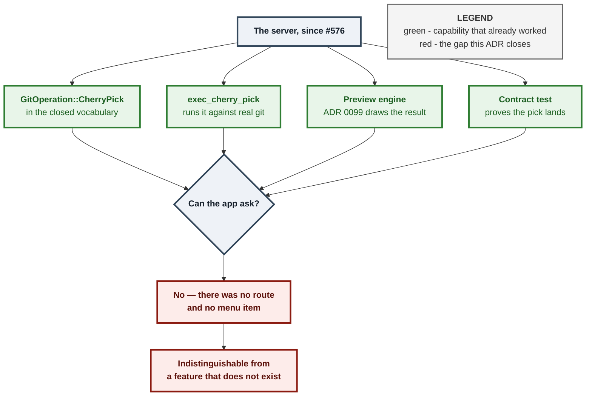
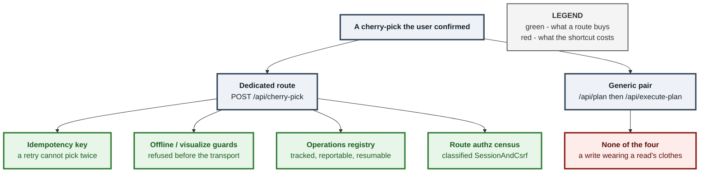
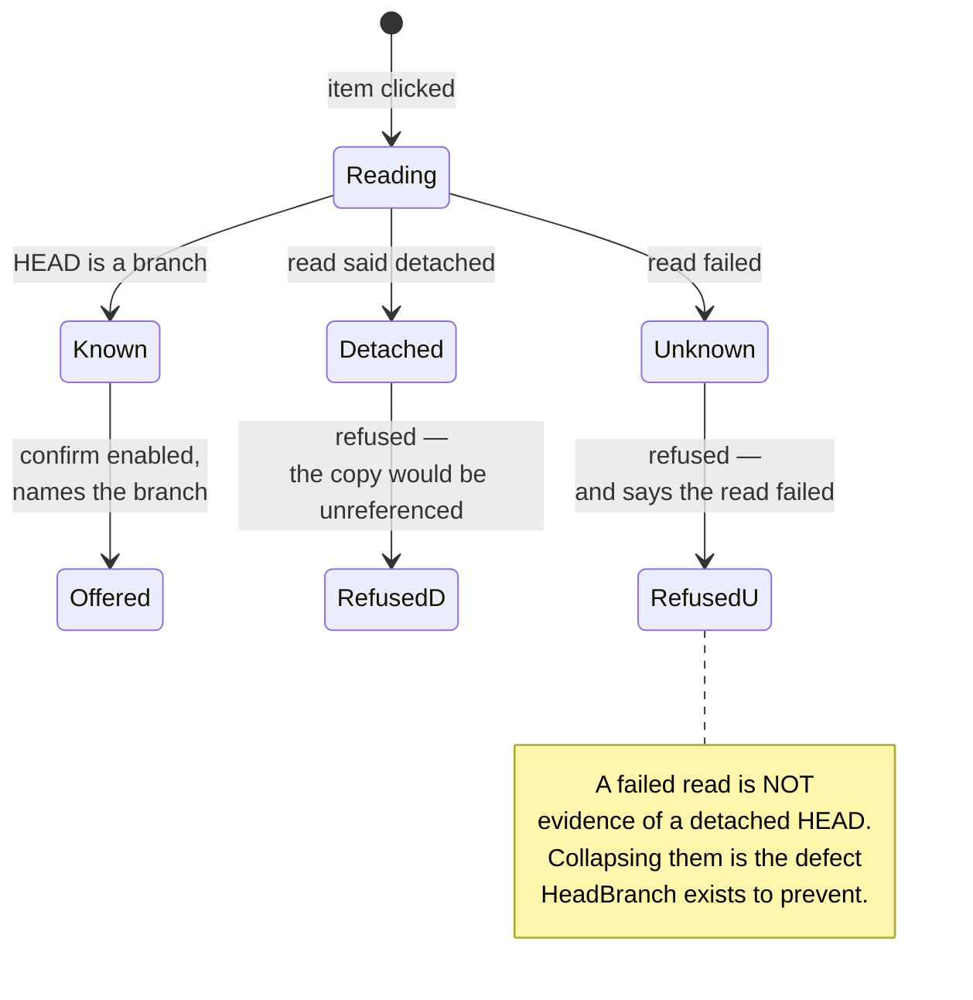
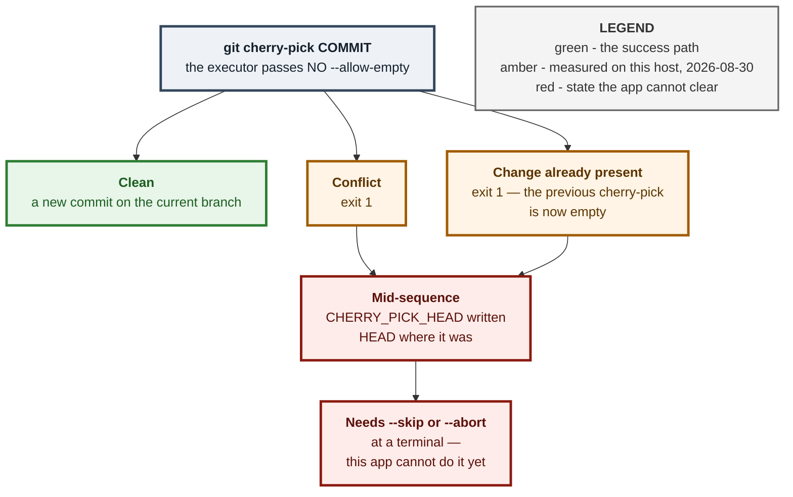

# ADR 0100 — A capability needs a door, and the door is a route

**Status:** Accepted — implemented, mutation-proved six ways, browser-verified,
and driven end to end against real git
**Date:** 2026-09-01
**Issues:** [#596](https://github.com/tom2025b/git-vista/issues/596) — M10.09,
cherry-pick has no UI
**Supersedes:** nothing · **Superseded by:** nothing

---

## Context

Since #576 this server has been able to cherry-pick. `GitOperation::CherryPick`
is in the protocol vocabulary, `planner::sequence_exec::exec_cherry_pick`
executes it, `planner.rs` dispatches to it, ADR 0099's preview engine draws it,
and `contract_suite`'s `a_cherry_pick_lands_a_commit_from_another_branch` proves
it works against real git.

None of that was reachable. Tom right-clicked a commit expecting to cherry-pick
it and read a twenty-item menu that did not offer the option. `grep -rn
"CherryPick" crates/git-vista/src/` returned exactly one file — a display label
for a past event in the Activity feed.

This is a shape worth naming, because it is the second time: #228 shipped an
executor with no caller, and this project has been paying for it since. A
capability with no door is indistinguishable, from where the user stands, from a
capability that does not exist.

A test suite tests what exists. Both #594 and #596 were invisible to 1,100
passing tests because both were *absences*, and nothing in a suite fails for a
thing that was never written.

## Decision

### 1. The door is a dedicated route, not the generic plan endpoints

`POST /api/plan` accepts an arbitrary `GitOperation` and `POST /api/execute-plan`
runs the `Plan` it returns. Both already existed. Cherry-pick could therefore
have been reached from the frontend with **no new server code at all**.

That is rejected. The frontend uses `/api/plan` only as a *read* — the
force-push entry point reviews a lease with it — and has never used
`/api/execute-plan` for anything. Every mutation it performs goes through its
own route, and four separate properties ride on that:

The generic pair keeps its place as a *planning* surface — build a plan, read
its risk, show the user what it means. It is not the execution path for the UI,
and this ADR is the record of that being a decision rather than an oversight.

### 2. The destination is read live, and "could not tell" stays its own answer

`OperationKind::CherryPick { commit, onto }` carries `onto: HeadBranch`, read
when the menu item is clicked — not from the graph, which can be stale. A pick
lands on whatever branch is checked out, never on the row that was tapped, so
the confirmation must name the real destination.

`HeadBranch` keeps three states and the dialog keeps them apart:

### 3. A blocked item says so, on screen — it does not vanish

`cherry_pick_offer(is_head, is_stub)` returns `Offered` or `Blocked(reason)`, and
a blocked item renders with its reason as **visible text**, not only a `title=`.
This is #65's rule, and #596 is the argument for it: an absent item taught Tom
that the app could not cherry-pick at all.

Two conditions block, and only two:

| Condition | Why | Knowable without the server? |
|---|---|---|
| Branch stub | A stub names a branch; a pick takes one commit | yes |
| The commit is HEAD | The empty pick — a *failure*, not a no-op | yes |
| Already an ancestor of HEAD | Same empty-pick failure | **no** |
| A merge commit | Needs `-m <mainline>`; that is `CherryPickMerge` | **no** |

The last two are deliberately *not* pre-empted. Answering them needs a
repository read, and one already exists: the confirm dialog's `/api/preview`
panel, which returns the empty-pick refusal verbatim and `Unsupported` for a
target with no sole parent. Guessing locally would mean a second implementation
of a question the server already answers exactly — the modelling failure ADR
0099 rejected, one layer up.

### 4. The copy states what failure leaves behind

Merge and revert either happen or do not. A cherry-pick has a third outcome:

The dialog says all of it, including the last box. Promising a recovery the UI
does not have is the same defect `revert_message` exists to prevent one layer
down: telling the user something the tool will not actually do.

## Alternatives considered

**Drive `/api/plan` + `/api/execute-plan` from the frontend.** Zero new server
code. Rejected in §1 — it silently drops idempotency, both api.rs guards, the
operations registry and the authz classification. A write that looks like a read
to every census that watches writes.

**Put the item on the branch menu instead.** A pick's subject is a commit, not a
ref. The branch menu already offers merge, which takes a branch; putting a
commit-shaped operation beside it would make the menu's own grammar inconsistent.

**Block ancestors of HEAD by fetching the merge base on click.** A second
repository read per menu open, to answer a question `/api/preview` already
answers exactly and for free, inside the dialog the user is about to see.

**Also give revert a first-class commit-menu entry.** #596 raises it and it is
real — revert reaches the UI only as an Activity-panel undo hint. Deliberately
left out: it is a separate operation with its own copy and its own failure mode,
and folding it in would have made one reviewable change into two.

## Consequences

- **Protocol.** One new DTO, `CherryPickRequest { commit }`, with
  `deny_unknown_fields`. The id is the one the user reviewed and is never
  re-resolved through `rev-parse` — the same posture `AmendCommitRequest`'s
  `expected_tip` takes.
- **Three censuses gained a row**, and each one caught the omission before a
  human did: `offline_guard_audit`'s `OFFLINE_GUARDED`, `contract_suite`'s POST
  route and planner funnel tables, and `route_authz`'s `ROUTE_AUTHZ`
  (`SessionAndCsrf`, like every other local git write). This is what those
  censuses are for and they worked.
- **Cherry-pick inherits the #594 preview panel for free.** Routing through
  `shell.open_confirm` is the whole mechanism; no preview code was written here.
- **`CherryPickMerge` still has no door.** It needs a mainline, which needs a UI
  for choosing one. The plain route rejects nothing about it — a merge commit
  sent to `/api/cherry-pick` gets git's own "is a merge but no -m option was
  given", forwarded verbatim, rather than a guess.
- **The mid-sequence state remains unrecoverable from the app.** `SequenceSkip`
  and `SequenceAbort` exist in the vocabulary with no route and no UI. That is
  now a *stated* gap in user-facing copy rather than a silent one, and it is the
  obvious next slice.
- **The confirm modal has no `role="dialog"` and no class**, which the browser
  spec had to work around by locating it via its own buttons. Not changed here —
  it affects every dialog in the app — but recorded as a real accessibility
  finding for whoever picks it up.

## Verification

- Host tests for the gate and the copy in `features/dialogs/core.rs`, **mutation-
  proved six ways** — two differently-shaped mutations against each of three
  invariants (the HEAD gate, the mid-sequence warning, and the
  detached-vs-unreadable distinction), every one caught, each with a green
  baseline in the same invocation.
- A browser spec, because `cargo test` never executes `crates/git-vista/src/menu/`
  — it is wasm-gated, so a fully green suite is compatible with the item simply
  not being rendered.
- A real drive against a purpose-built repository — server, wasm app, real git,
  nothing mocked: the pick landed on `main` as a new commit, the file appeared,
  no `CHERRY_PICK_HEAD` was left behind, and the original commit stayed on its
  own branch.

---

**Signed:** fable · 2026-09-01T10:45:00-04:00
