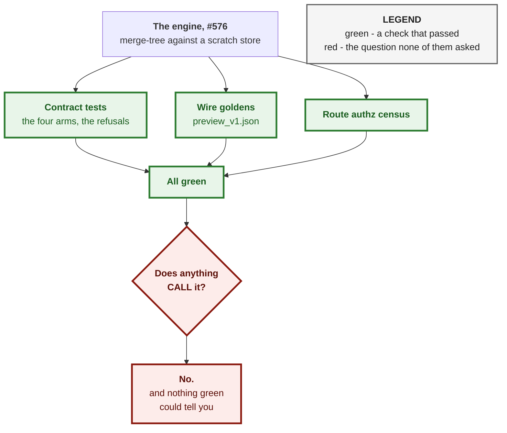
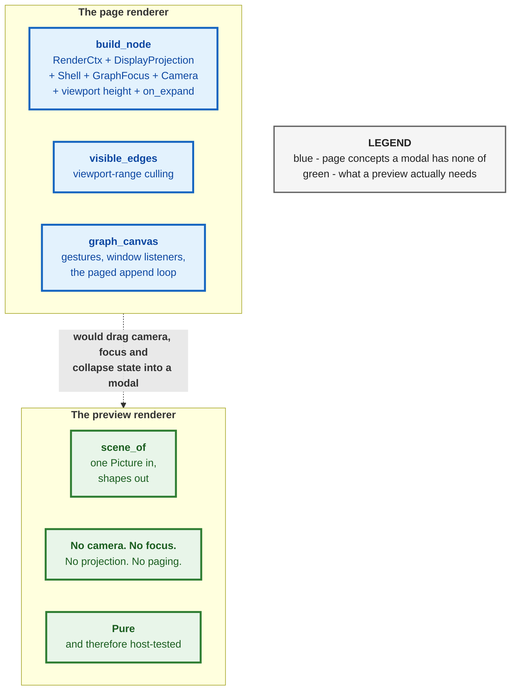
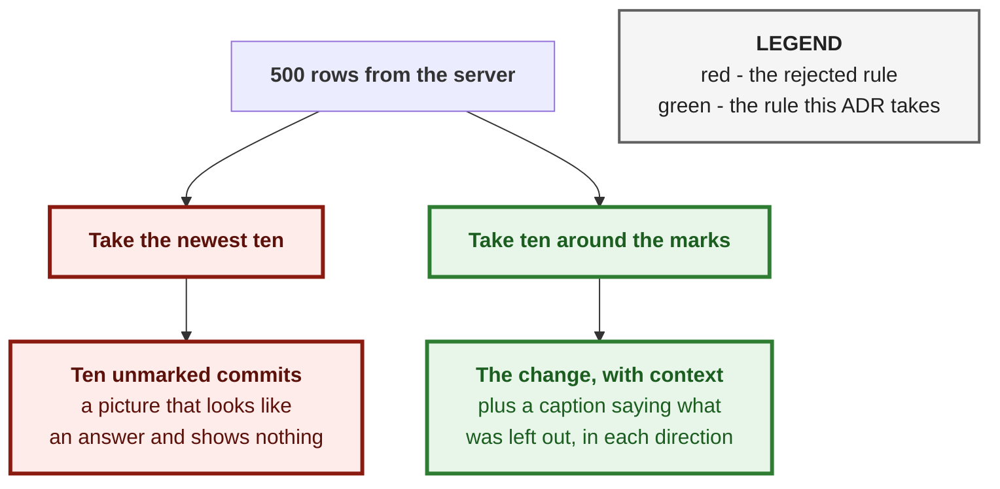
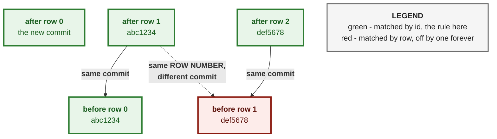
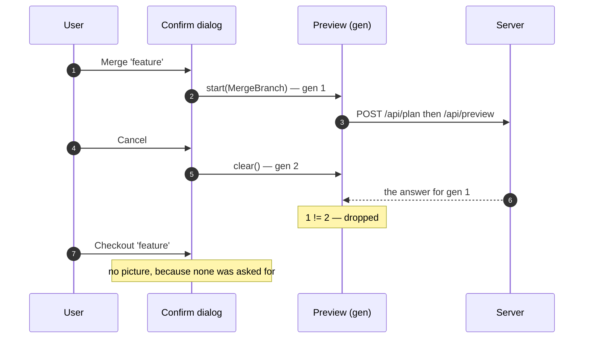
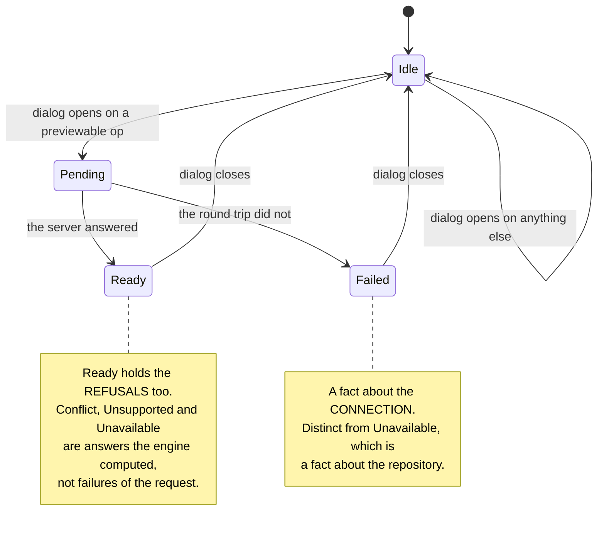
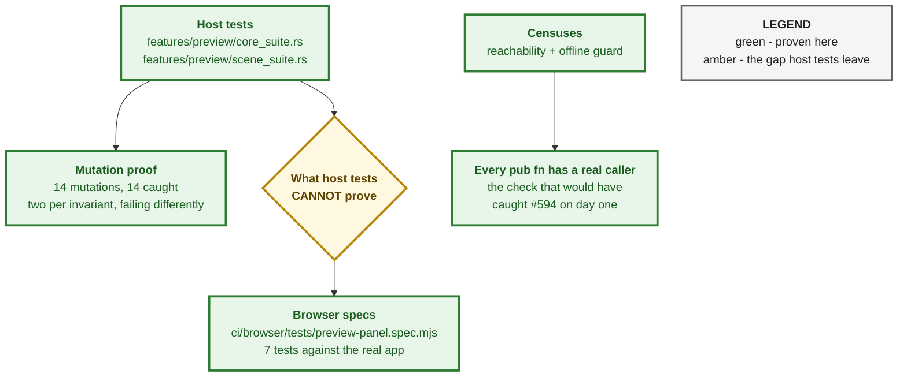

# ADR 0100 — A preview draws its own picture, windowed on what changed

**Status:** Accepted — implemented, mutation-proved two ways per invariant,
browser-verified against the real app
**Date:** 2026-09-01
**Issues:** [#594](https://github.com/tom2025b/git-vista/issues/594) — M10.08
A6, wire the graph preview into the app
**Follows:** [ADR 0099](0099-a-preview-is-real-git-refusing-rather-than-a-model.md),
whose status line ends "the web canvas (A6) is a follow-up". This is it.
**Supersedes:** nothing · **Superseded by:** nothing

---

## Context

`POST /api/preview` shipped in #576 registered, authz-gated, contract-tested
and wire-goldened. **No frontend code called it.** Verified 2026-09-01:
`grep -rn "/api/preview" crates/git-vista/src/` returned nothing.

That is worth pausing on, because it is a review lesson before it is a bug.
Three independent audits, nineteen findings and six hardening rounds all passed
over this feature. Every one of them checked the engine against its own
contract. None re-read the acceptance list. A door nobody opens is invisible to
every test that describes the room behind it.

Two things about A6 had to be settled before any code, and both were settled by
reading the source rather than the issue body.

**The issue body said "this is wiring, not a new renderer". It was wrong.**
`render::build_node` (`render/nodes.rs:41`) takes a `StoredValue<RenderCtx>`, a
`StoredValue<DisplayProjection>`, a `Shell`, an `RwSignal<GraphFocus>`, an
`RwSignal<Camera>`, a viewport height and an `on_expand` callback.
`render::visible_edges` (`render/edges.rs:26`) is viewport-range culling.
`app::canvas::graph_canvas` (808 lines) owns the gesture signals, the window
listeners, the overlay stack and — since M1.10 (#63) — the paged append loop
that mutates the aggregate in place as history arrives. The builders read a
`DisplayProjection` (`features/graph/collapse.rs:170`), the WIP-collapse
projection. A preview graph has none of that and never will.

**The issue body said "draw the returned `after` graph". A6 says both halves**
— "the web canvas renders **before/after** with changes marked" — and the
protocol is explicit that this is deliberate (`protocol/src/preview.rs:85-92`):
both are returned *because a before/after canvas needs both*, and
`PreviewChange::LaneShifted` is **defined** by comparing lane numbers across the
two layouts. A caller given only `after` cannot check a single one of them.

---

## Decision

### 1. A preview gets its own renderer, small and static

Not a widening of `render/`. A preview is a handful of rows at a fixed size:
no paging, no collapse, no gestures, no virtualization, no camera.

The decisive property is not size. It is that **`cargo test` never compiles
`render/`** — it is wasm-gated, like every view module. A renderer built as
pure data (`features/preview/scene.rs`: `PreviewScene`, `HalfScene`,
`SceneNode`, `SceneEdge`, `SceneStub`, `SceneTag`) is host-testable in full,
and the Leptos file beside it (`dialogs/preview_panel.rs`) turns shapes into
elements and decides nothing.

### 2. The window follows the change, never the top of the graph

The server walks up to `PREVIEW_HISTORY_LIMIT` — 500 commits — into each half
(`git-vista-server/src/preview.rs:143`). A confirmation modal can show ten.

Taking the newest ten is the obvious rule and the wrong one: for any operation
whose change is not at the very top of history it draws ten commits with
nothing marked in them. That is a picture which *looks like an answer* and
shows nothing — the same failure class ADR 0099 refused on the server, arriving
one layer later.

Two details that are part of the decision, not of the implementation:

* **The window is expressed in row *values*** (`GraphRow::row`), not in
  positions in the `rows` vector. `Edge::from_row`/`to_row` speak that
  language, so an edge crossing the window boundary is clipped by arithmetic —
  its y is clamped to half a row past the frame — instead of by a lookup table.
  A history is a continuous line, and a bottom row with no line leaving it
  says "history ends here", which is false for every window that truncated.
* **Elision is captioned in both directions.** "12 commits not shown" beside a
  window cut out of the middle is ambiguous in the one way that matters: a
  reader cannot tell whether the newest commit is on screen.

### 3. The two halves are matched by commit id, never by row number

A preview prepends one hypothetical commit, which renumbers every row beneath
it. `after` row 5 and `before` row 5 are therefore different commits.

So `window_for_before` takes the commit **ids** the after window drew and finds
the before rows carrying them.

**An honest limit, found by mutation and worth recording.** Every operation the
engine previews today adds its commit at row 0, so the after window normally
starts at 0 and the two windows coincide *numerically* — under that shape a
before half windowed by raw row number gives the identical answer. The id match
is correct and costs nothing, and it earns its keep only for a change list with
no `Added` in it (a lane shift alone). That is a well-formed payload, so the
rule stays; what changed is that the test now constructs the case where the two
rules differ, instead of one where they cannot.

### 4. Every request carries a generation, and a stale reply is dropped

A preview is two round trips with real git at the end of them. A confirm dialog
is one tap. A user can open, cancel, and open a *different* dialog well before
the first answer lands.

Without the tag the late reply paints the new dialog with the old operation's
picture — and it is a *plausible* picture: same repository, same shape, wrong
operation. Nothing about it announces itself as stale.

Closing the dialog clears, so cancel-then-reopen is covered without any caller
having to think about it. This is #594's acceptance point 5 on the client side;
the server side already held, because the engine writes only into a scratch
store it sweeps.

### 5. The preview informs. It never gates.

Every operation previewed here was executable before previews existed, and
stays executable when a preview cannot be produced. A host with git 2.37 gets
`Unavailable { GitTooOld }` and **still merges**.

`PreviewView::advisory_only` returns `true` unconditionally, and
`core::reassurance` — the sentence printed under every pictureless arm, saying
the operation is still available — *consults* it rather than asserting it. If
some future change makes a preview gate an operation, the promise stops being
printed rather than becoming a lie under a dead button.

### 6. The two dialogs wired, and the one deliberately not

The engine previews three operations (`server/src/preview.rs:752-760`). Two
have dialogs.

| Operation | Dialog | Wired |
|---|---|---|
| `MergeBranch` | `PendingOp::Merge`, from the branch menu | yes |
| `RevertCommit` | `PendingOp::Undo(UndoAction::RevertCommit)` | yes |
| `CherryPick` | none — [#596](https://github.com/tom2025b/git-vista/issues/596) | no |

Cherry-pick has nothing to hang a preview off. It inherits the panel the day it
gets a menu entry: one arm in `previewable`, one in `preview_subject`. Stated
here rather than silently narrowed.

The mapping lives in `features::preview::core::previewable`, over a
framework-free `DialogSubject`, because `PendingOp` lives in `crate::state`
which is `#[cfg(target_arch = "wasm32")]` — and "which dialogs get a preview" is
exactly the decision whose absence created this issue.

---

## Alternatives considered

**Reuse `render::build_node` with stub signals.** Rejected. It would mean
constructing a `Camera`, a `GraphFocus`, a viewport height and a
`DisplayProjection` inside a modal that has none of those concepts, and the
result would still be untestable on the host. The cost of the second renderer
is arithmetic; the cost of this one is dragging page state into a dialog and
losing every test.

**Draw only the `after` half.** Rejected — it is not what A6 says, and it is
not checkable: a caller holding one half cannot verify a single `LaneShifted`,
because paged history and the preview's capped `walk_history` need not agree on
lanes. The protocol returns both for exactly this reason.

**Add a tree oid, or any field, to the wire to make windowing easier.**
Rejected before it was considered: #576 finding 12 decided against widening this
wire deliberately, and ADR 0099 records it.

**Emit SVG as a markup string and set `inner_html`.** Tempting — it would make
the renderer a pure `String` function, testable by matching text. Rejected on
the security boundary: commit summaries and branch names are repository
content, and a repository is something a user can be handed. Escaping by hand
is the wrong place to be careful. The scene emits typed shapes and Leptos
creates the text nodes.

**Gate Confirm on a clean preview.** Rejected, and `advisory_only` exists so
that a future reader finds the argument before the code.

**Cap the picture by lanes only, or by rows only.** Both are needed and they
are different axes: `MAX_ROWS` bounds the history, `MAX_LANES` bounds the
gutter. A repository with forty branch stubs would otherwise make the gutter
wider than the label column. Lanes past the cap are drawn *at* the cap — a
visible squash, captioned, rather than a silent crop.

---

## Consequences

**Good.**

* A6 is closed, and closed where it can be seen: seven browser specs drive the
  real app. The panel is not provable any other way, because every consumer of
  the pure core is wasm-gated.
* The engine's four-arm honesty survives to the last layer. A conflict names
  its paths, `Unsupported` says no host can draw it, `Unavailable` gives its
  named reason and its remedy where one exists, and a failed fetch says
  plainly that it is a fact about the connection.
* #591 (graph simulator) and #460 (plan-review pane) have their two endpoints
  to animate between, and a `PreviewScene` to animate.
* The renderer is pure, so the geometry is mutation-provable — 14 mutations,
  two per invariant, all caught.

**Costs, stated.**

* **Two renderers exist.** A change to how a commit dot looks must be made
  twice, or deliberately not. The alternative was one renderer that a modal
  could not use and a test could not reach.
* **`refuse_if_visualize` makes `PreviewUnavailable::RepositoryReadOnly`
  unreachable from this client.** Deliberate and documented in
  `api/preview.rs`: in Visualize mode the app offers no merge and no revert, so
  no dialog exists to hang a preview off. The arm stays reachable from
  `git-vista-mcp`, from tests, and from a future read-only plan review, and the
  dialog renders it correctly if it ever arrives.
* **Two round trips per dialog open.** `/api/plan` then `/api/preview`, both
  guarded, both with a deadline and one retry, neither carrying an idempotency
  key (neither route reaches `operations::admit`). A retry is safe precisely
  because nothing is admitted.
* **An eighth browser fixture repository.** Its own, because every existing one
  is either already up to date with its other branch — so a merge preview would
  have nothing to draw — or deliberately dirty or conflicted, which answers a
  different question.

---

## Decision log

**The mutation run is the reason three of these tests are the shape they are.**
`failure-atlas` is not registered on titan, so the proof ran hand-rolled in a
throwaway clone — keeping the properties that make the MCP the required path: a
clone rather than the checkout (a WIP checkpointer committing a
deliberately-broken function is the incident that rule exists for), an
unmutated baseline first, and `not_applied`/`ambiguous` verdicts rather than a
passed-off `survived`.

First run: **12 mutations, 8 caught, 4 survived.** All four were defects in the
tests, not in the code.

| Mutation | First verdict | Why it survived | Fix |
|---|---|---|---|
| window anchored on the first mark only | survived | marks at rows 40 and 44 — a first-mark window still reaches 45 with its own padding | marks at 40 and 48; the pair plus context exactly fills the ten-row budget |
| `window_for_before` returns `after_window` | survived | the fixture's added commit sat at row 0, so both windows started at 0 and coincided | a deep, added-commit-free change list; exact list equality, because an overlap count called nine-of-ten a pass |
| before matched by row number | survived | same cause | same fix, plus a second mutation that fails differently (build `shown` from the whole after half) |
| stubs filtered by `lane` instead of `anchor_row` | survived | stub in lane 2 with rows 0..4 drawn — the two numbers happened to overlap | stub in lane 7: the lane now sits outside the row range, which is the point |

Second run: **14 mutations, 14 caught**, two per invariant, each pair failing
differently.

**A hazard found the hard way, recorded because it will recur.** The first
mutation run gave the clone a `target` symlinked to the checkout's.
`target/debug/deps` is keyed by package name, so the mutant's artifact was
reused by the next `cargo test` in the real tree and a *clean* checkout
reported a failing test. The clone gets its own target directory now. The same
class of collision bit the browser harness twice from a different direction: a
concurrent session building this workspace from a temp copy left
`target/debug/git-vista-server` carrying a compiled-in `DIST_DIR` pointing into
that copy, and the harness served 404s for the wasm bundle with the app never
mounting.

**The browser run corrected the spec twice, and both corrections are in the
code comments.** A merge moves `HEAD` as well as the branch, so the summary
reads "one new commit and 2 refs move." — asserted as the whole sentence,
because "one new commit" alone would still pass with the ref moves dropped from
the change list, and that is the half a caller cannot re-derive. And both
arrows are asserted, not just `→main`: `ref_moves` must carry `HEAD` too, or the
after layout reserves lane 0 for the wrong commit and colours the new commit off
its own hash — the two failures `git_vista_core::preview`'s module doc spends
its longest section on. A picture showing only `→main` is the visible symptom of
exactly that.

---

## Verification

* **Host:** `cargo test -p git-vista --bin git-vista-ui` — the preview core's
  suite and the scene's suite, every test naming two mutations that break it in
  different ways.
* **Mutation:** 14/14 caught, second run, in a throwaway clone with its own
  target directory.
* **Browser:** seven specs. A6's both halves with the after half marked;
  Confirm live before and after the picture lands; a late reply unable to paint
  a reopened dialog (made deterministic by delaying `/api/preview` in the route
  layer rather than racing a real one); and the four pictureless outcomes,
  fulfilled in the route layer because none can be produced against a healthy
  host.
* **Censuses:** `reachability_census` now has real call sites for every
  `pub fn` added here — it is the check that would have caught #594 on the day
  the engine landed, and it did catch every unwired function in this change.
  `offline_guard_audit` classifies `plan_request` and `preview_request` as
  guarded, and `api/preview.rs` is added to `API_SRC` so the census can see
  them at all.
* **Fixture:** the merge-preview shape is proved divergent, clean and **not yet
  merged** — and the clean part is proved on a throwaway clone, so the fixture
  handed to the suite stays pre-merge. A fixture that verified itself by
  merging could not tell a working preview from a picture of the past.

**Signed:** max · 2026-09-01T10:05:00-04:00
