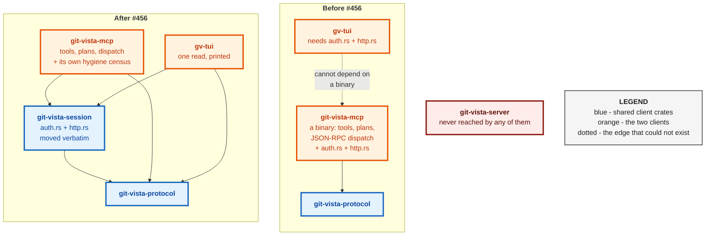
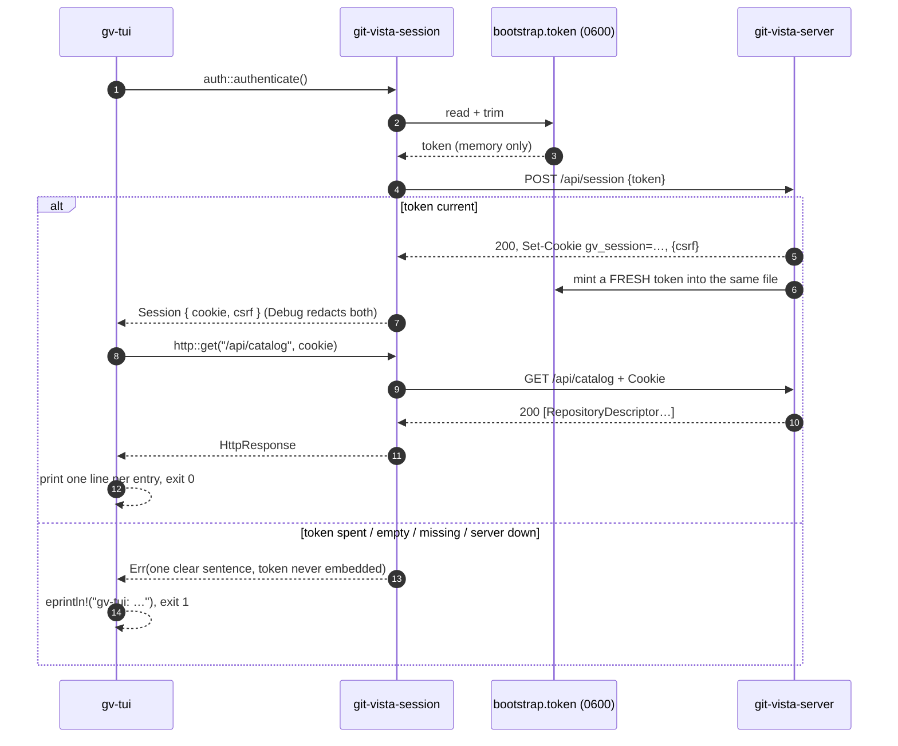
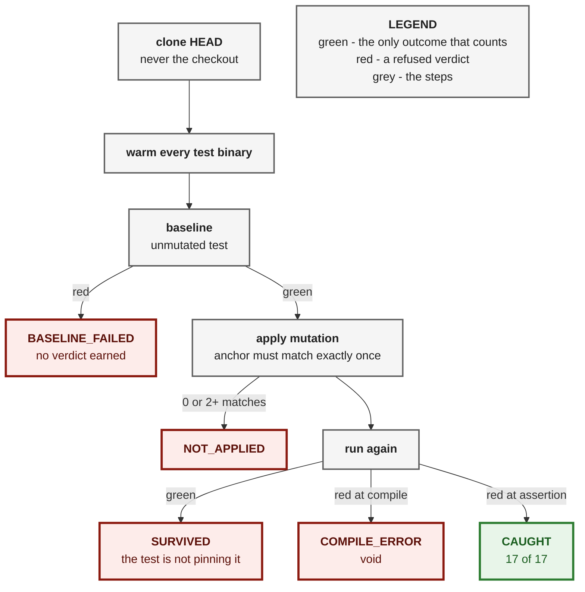

# ADR 0101 — The session boundary is a crate, not a bridge

**Status:** Accepted — implemented, mutation-proved two ways per invariant
(17/17), smoke-tested against a real server
**Date:** 2026-09-01
**Issues:** [#456](https://github.com/tom2025b/git-vista/issues/456) — M10.01,
`gv-tui` crate skeleton: session auth reusing the MCP bootstrap flow
**Follows:** the M2.23a decisions recorded in `git-vista-mcp`'s module docs
(#245: hand-rolled loopback HTTP, token hygiene; #246: read-only by
construction, proved on the dependency graph)
**Supersedes:** nothing · **Superseded by:** nothing

---

## Context

M10 is a lazygit-style terminal UI. Its first slice, #456, is deliberately
tiny: authenticate against the running `git-vista-server` from a terminal
process and print one read. The issue names the hard part and says it is
already solved: `git-vista-mcp/src/auth.rs` reads the `0600` one-time token,
exchanges it at `POST /api/session` for an `HttpOnly` cookie plus a CSRF
token, and holds both in memory only — over a ~120-line HTTP/1.1 client on a
`TcpStream` (`http.rs`) chosen instead of reqwest/hyper because the peer is
one loopback server answering small `Content-Length` JSON bodies.

The one decision the issue puts to this slice is *how to share that code*:

> Shared HTTP/auth code is **factored, not copy-pasted** — decide
> deliberately whether it moves into a shared crate or `gv-tui` depends on
> the MCP crate, and record the reasoning.

Three facts settled it, all read from the source rather than assumed:

1. **`git-vista-mcp` is a binary.** It has `src/main.rs` and no `lib.rs`.
   A Cargo dependency on it is not expressible today; it would first need a
   library target carved out, and *everything* in that library would become
   public API for the sake of two modules.
2. **What that library would export is the wrong thing.** `tools.rs`
   (1260 lines), `plan_tools.rs` (2088), `execute_tool.rs`, `lesson.rs` — the
   MCP tool catalogue, the plan builders, the JSON-RPC dispatch. A terminal
   UI has no business linking any of it, and the reviewed-dependency
   discipline (`docs/NATIVE_DEPENDENCIES.md`) is about keeping every crate's
   surface honest, not just the native ones.
3. **The session boundary is already client-generic.** The SPA's `gv` link,
   the MCP bridge and now the TUI authenticate identically. Even
   `live_handshake.rs` carries a third, hand-rolled copy of the same exchange
   for its baseline leg. The boundary was shared in fact before it was shared
   in code.

## Decision

**Extract `crates/git-vista-session`.** `auth.rs` and `http.rs` move out of
`git-vista-mcp` as `git mv` renames — the history stays walkable — into a
library crate whose whole public surface is those two modules. Both clients
link it; neither links the other.

The extraction is *only* the boundary. Three things that could have moved
were held back on purpose, each with the reason written where the next
person will look (`git-vista-session/src/lib.rs`):

- **`authed_fetch` / `authed_post` stay in `git-vista-mcp`.** They add lazy
  first auth plus one 401 retry, which a long-lived bridge needs to survive a
  server restart mid-session. `gv-tui` in this slice is a one-shot process
  that authenticates immediately before its read; a 401 there is genuinely
  odd and a clear error is the right answer. The first *persistent* TUI slice
  (#457) is the moment to lift them — with a consumer on each side to keep
  the seam honest.
- **`live_handshake.rs`'s baseline leg stays hand-rolled.** Its paired-
  baseline pattern (fetch the catalog directly, then through the bridge, and
  say which leg died) only means something if the baseline does not share the
  client under test. Pointing it at `git-vista-session` would make a bug in
  the session crate break both legs identically.
- **The `#245` token-hygiene census is duplicated, not moved.** Every crate
  that holds a live `Session` keeps a test proving the production half of
  each of its source files is free of `fs::write`, `File::create`,
  `OpenOptions`, `env::set_var` and `Command::new`. It now lives in three
  places with three floors: `git-vista-session` (`auth.rs`, `http.rs`,
  `lib.rs`), `git-vista-mcp` (a new `src/hygiene.rs`, floor = its six
  remaining files) and `gv-tui` (`main.rs`). The guard belongs to the secret,
  not to a file location.

Both new crates carry the #246 dependency-graph proof
(`tests/no_write_dependency.rs`): a breadth-first walk of `cargo metadata`'s
resolved graph — every edge kind, so a dev- or build-dependency cannot slip
past — asserting `git-vista-server` is never reached, with a sanity floor
that the crate's own known dependencies *are*.

### The one read is `/api/catalog`, not `/api/status`

The issue offers "`/api/status` or equivalent". The catalog is the equivalent,
for the same reason the MCP bridge's first tool was `list_repositories`: it
answers on a fresh server with nothing selected, so the only thing the slice's
success depends on is the boundary it exists to prove. `/api/status` also
depends on the server's selection state, which is the working-tree pane's
concern (#459), not auth's. The catalog is parsed as
`Vec<git_vista_protocol::RepositoryDescriptor>` — typed, so the read also
proves the protocol crate is reusable from a terminal client.

## Alternatives considered

| Alternative | Why not |
|---|---|
| `gv-tui` depends on `git-vista-mcp` | The MCP crate is a binary; the library it would have to grow exports tool/plan/dispatch code a TUI must not link. Rejected on both counts. |
| Copy `auth.rs` + `http.rs` into `gv-tui` | The issue forbids it, and rightly: three copies of a security boundary drift, and the hygiene census would have to be maintained three times over three diverging bodies of code. |
| Move `authed_fetch`/`authed_post` too, now | No second consumer yet; a seam with one caller is a guess about the second. Lift them with #457. |
| Re-point `live_handshake.rs`'s baseline at the new crate | Destroys the paired-baseline property. |
| Read `/api/status` as the one read | Couples the auth proof to selection state. |

## Consequences

- **Workspace grows by two crates** (`git-vista-session`, `gv-tui`), both
  picked up by every workspace-wide CI command; no CI file names crates
  individually, so none changed.
- **`git-vista-mcp`'s dependency surface gains one edge** (on the crate it
  used to contain) and loses two files. Its `no_write_dependency` test still
  passes; its census floor changed from five names to six, and the change is
  the kind that fails loudly if wrong.
- **A future non-browser client** (a second CLI, a script host) links
  `git-vista-session` and inherits the proofs: no server edge, no secret
  outside memory, redacted `Debug`.
- **Terminal-side auth is now one-shot only.** The persistent-pane slices
  must lift the 401-retry loop into the session crate before they loop; the
  lib doc says so where they will read it.
- **M10's next slices inherit a skeleton with seams.** `gv_tui::run` is
  generic over the auth and fetch closures, the same shape as the MCP crate's
  helpers, so every later pane's data path is unit-testable without a server.

## Evidence

**Workspace:** `cargo test --workspace` — 2577 passed, 0 failed, 16 ignored
(the pre-existing live-server tests). `cargo clippy --workspace
--all-targets -- -D warnings` clean on the host and on `wasm32` for the
frontend. `cargo fmt --check` clean.

**Smoke test against a real server** (a scratch `git-vista-server` on this
box, isolated `XDG_STATE_HOME`, one throwaway repository):

| Arm | Result |
|---|---|
| run 1, fresh token | `authenticated to git-vista-server — 1 repository in the catalog` / `repo (main worktree)`, exit 0; token file fingerprint `0fedb…` → `29bb9…` |
| run 2, immediately after | same output, exit 0; fingerprint → `5fbad…` — the spent token had been replaced, no lockout |
| already-spent token (run 1's exact bytes written back) | `POST /api/session answered 401 — the token may have expired … "That setup link is invalid or has expired."`, exit 1 |
| empty token file | `the bootstrap token file at … is empty — the server may be mid-rotation; retry`, exit 1 |
| missing token file | `could not read the bootstrap token at …: No such file or directory. Is git-vista-server running?`, exit 1 |
| server down | `could not connect to git-vista-server at 127.0.0.1:8080: Connection refused`, exit 1 |

Zero panics across every arm.

**Mutation proof — 17 of 17 caught.** Two differently-shaped mutations per
invariant, one removing the mechanism and one weakening it, each run in a
throwaway clone of HEAD `ee2c4e7a` with the unmutated test run first in the
same invocation. Only a red *at the assertion* counts; a compile error would
have been void, and none occurred.

| # | Invariant | Removed the mechanism | Weakened it |
|---|---|---|---|
| M01/M02 | the auth gate is in front of the read | auth error swallowed, read proceeds — caught | read sent without the cookie — caught |
| M03/M04 | a non-200 answer is refused in the server's words | status check deleted — caught | narrowed to 404-only — caught |
| M05 | a malformed body names the path | message dropped — caught | — |
| M06/M07 | the report is faithful | read-only marker dropped — caught | count zeroed — caught |
| M08/M09 | `gv-tui` token hygiene | `env::set_var` in `main()` — caught | `OpenOptions` in `run()` — caught |
| M10/M11 | `gv-tui` never reaches the server | direct dependency edge — caught | **transitive** edge via `git-vista-session` — caught |
| M12/M13 | `git-vista-session` never reaches the server | direct edge — caught | **dev-dependency** edge — caught |
| M14/M15 | the MCP crate kept its census | `env::set_var` in `main.rs` — caught | `Command::new` in `plan_tools.rs`, the file a hand list once forgot — caught |
| M16/M17 | the session crate took its census with it | `env::set_var` in `lib.rs`, a file the old floor never named — caught | `File::create` in `auth.rs` — caught |

The dependency-graph mutations needed one extra move: `git-vista-server` is
bin-only, so an edge onto it is not expressible until it has a library target.
Each of M10–M13 therefore also dropped an empty `src/lib.rs` into the server
crate — which is exactly the shape a future "just expose one helper" edit
would take, and exactly what these tests exist to catch.

---

**Signed:** fable · 2026-09-01T15:10:00-04:00
