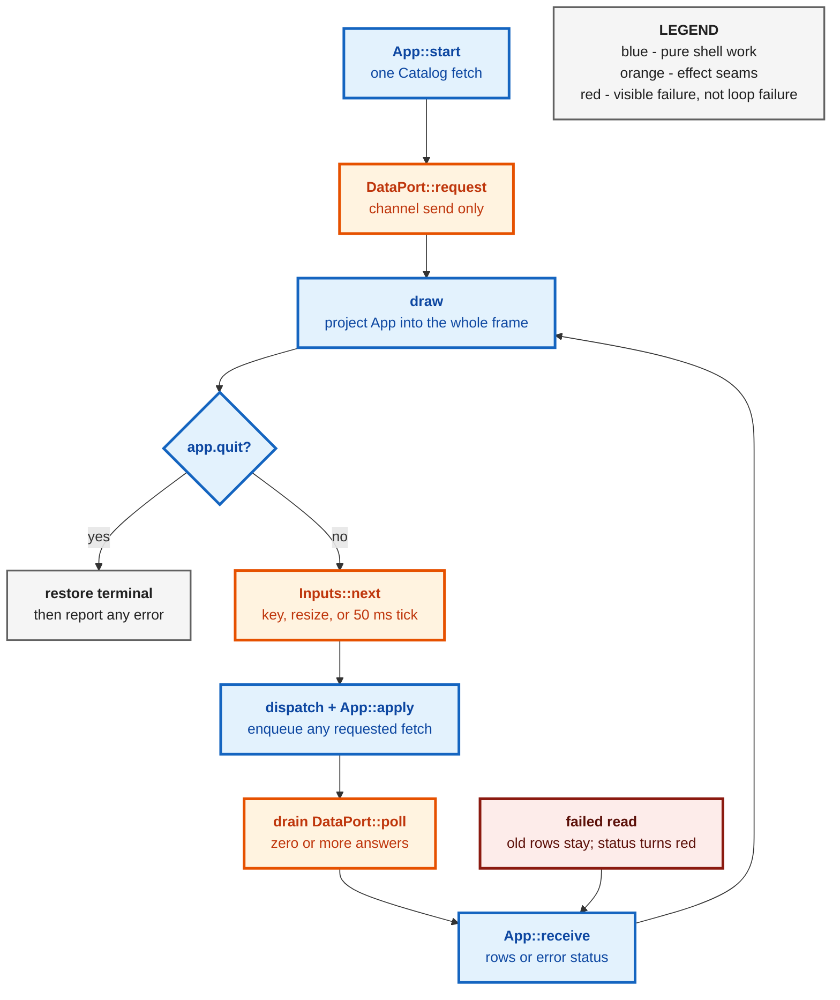
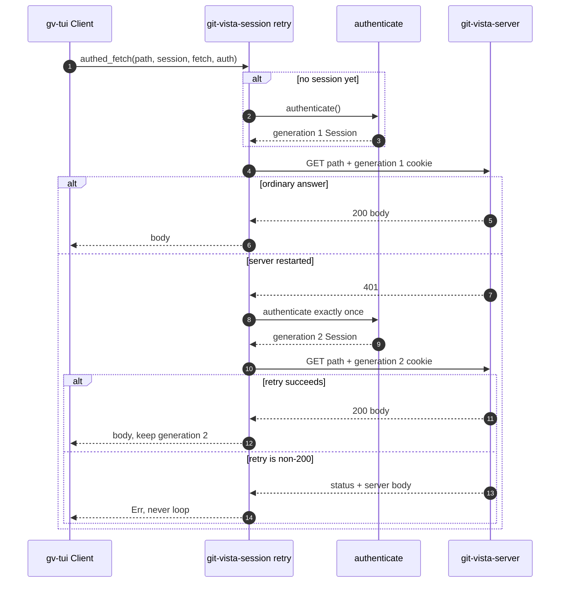
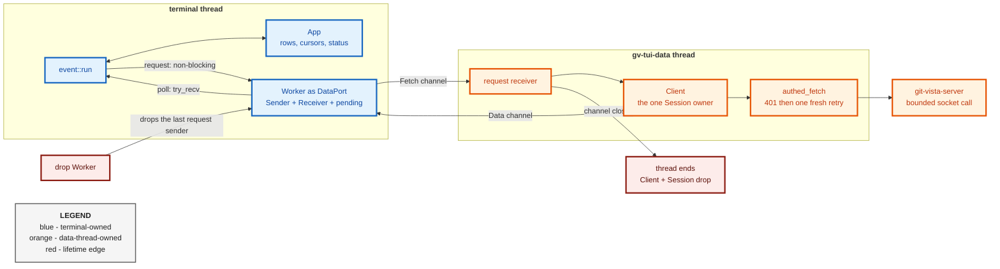

# ADR 0102 — A persistent client earns the retry

**Status:** Accepted — implemented, mutation-proved two ways per invariant
(16/16)
**Date:** 2026-09-01
**Issues:** [#457](https://github.com/tom2025b/git-vista/issues/457) — M10.02,
the persistent `gv-tui` shell; prepares the frame for
[#458](https://github.com/tom2025b/git-vista/issues/458) and
[#459](https://github.com/tom2025b/git-vista/issues/459)
**Follows:** [ADR 0101](0101-the-session-boundary-is-a-crate-not-a-bridge.md),
which deliberately left the authenticated 401 retry in `git-vista-mcp` until
a second long-lived consumer existed
**Supersedes:** nothing · **Superseded by:** nothing

---

## Context

ADR 0101 extracted `git-vista-session` for two clients but stopped short of
moving `authed_fetch` and `authed_post`. That was deliberate. The M10.01 TUI
was a one-shot catalog read: it authenticated immediately before the request,
then exited. Only the MCP bridge lived long enough for a server restart to
invalidate its cookie mid-session. Moving a retry abstraction with one caller
would have guessed at the second caller's needs.

M10.02 creates that caller. `gv-tui` now stays open, redraws a four-pane shell,
and refreshes data without restarting the process. A server restart during
that session produces the exact case the MCP bridge already handles: the old
cookie answers 401, the self-replacing bootstrap token yields a fresh session,
and the original request must be tried once with the **fresh** cookie. This is
the trigger ADR 0101 named in advance. The second consumer has arrived, so the
retry has earned a shared home.

Persistence creates a second problem: a loop that waits for the HTTP client
cannot redraw, dispatch `q`, or show a resize while the socket timeout runs.
The session itself is secret-bearing mutable state, so making every caller
share it through a lock would solve a scheduling problem by introducing an
ownership problem. The shell needs a boundary that is both non-blocking to the
terminal and single-owner for the session.

The frame also has to behave predictably across ordinary terminals. Ratatui
and crossterm minor releases change backend and key-event shapes; true-colour
and indexed palettes do not render consistently on the terminals #457 targets.
Those are dependency and rendering decisions, not incidental implementation
details.

## Decision

### The authenticated retry belongs to `git-vista-session`

Move `authed_fetch` and its POST-shaped sibling `authed_post` from
`git-vista-mcp::tools` into `git_vista_session::retry`. The MCP crate
re-exports the old paths, so its callers do not churn while ownership becomes
truthful. The TUI's `data::Client` calls `retry::authed_fetch` for its catalog.

The rule remains deliberately small:

1. authenticate lazily when there is no session;
2. send the request with the current cookie;
3. only on 401, authenticate once and retry once with the **new** cookie;
4. return a second non-200 honestly rather than loop.

`authed_post` moves with `authed_fetch` because they are the two shapes of one
session policy: POST adds CSRF, but its authentication and one-retry semantics
must not drift in a different crate. This is motion of an existing proved
boundary, not a new TUI write path; phase 2a remains read-only.

### One worker owns the session; the event loop owns only a port

`data::Client` owns `Option<Session>` plus injected fetch and authentication
closures. `data::spawn` moves the whole client to one thread named
`gv-tui-data`. That thread alone mutates the session, so there is one owner and
no lock.

The terminal sees only `DataPort`:

- `request(Fetch)` sends into an unbounded channel and returns;
- `poll()` checks an in-memory pending queue, then `try_recv`, and returns;
- if the request receiver is gone, the request becomes a visible catalog
  error (`the data thread has stopped; restart gv-tui`) rather than silence.

Dropping the port drops its request sender. The worker's receive loop then
ends, which drops the client holding the live session. If an HTTP call is
already in progress, the detached thread may take the bounded socket timeout
to reach that point; the terminal does not wait for it and retains no handle
through which another request can be sent.

The worker is intentionally detached. Keeping a `JoinHandle` and joining in
`Drop` would make `q` wait for a socket call that can take up to 30 seconds.
The channel close is the cancellation boundary available to this synchronous
HTTP client; bounded eventual cleanup is accepted over blocking terminal
cleanup.

### Pin the terminal boundary and keep its palette portable

Pin `ratatui = 0.30.2` and `crossterm = 0.29.0` exactly, with defaults off and
only the features the shell uses. A minor release changing key kinds or backend
traits must arrive as a reviewed dependency change alongside its test updates,
not through an unrelated build.

Both crates are pure Rust. `gv-tui` does not directly bind a kernel ABI crate,
and it still cannot reach `git-vista-server` even transitively. The native
dependency register is scoped to direct kernel-facing dependencies in the
server manifest; transitive `rustix`/`mio` use through the terminal toolkit is
the same category as existing pure-Rust library internals and does not add
`gv-tui` to `docs/NATIVE_DEPENDENCIES.md`.

The shell's half of #457's colour criterion is a hard palette boundary:
the sixteen ANSI colour names (plus the default `Reset`) and modifiers only.
Focused borders use named `Cyan`, failed status text uses named `Red`, and the
cursor uses `REVERSED`. `Color::Indexed` and `Color::Rgb` are absent. Tests scan
every cell at 80×24, the exact 40×10 minimum, and an undersized 30×8 terminal.

### Draw every turn; let Ratatui own diffing

`event::run` draws at the top of every iteration. Inputs wait at most 50 ms,
and key, resize, data, and tick paths all return to the same draw point.
Ratatui already diffs the new frame against the previous buffer, so an
unchanged frame emits no changed cells.

A separate dirty flag was rejected. It would duplicate invalidation knowledge
across every future `Fetch`/`Data` arm, resize, focus movement, cursor movement,
and status change. Missing one flag would leave stale pixels while the reducer
state was correct. Drawing the pure projection every turn keeps one source of
truth and delegates the optimized write decision to the library designed to
make it.

The loop is generic over `Inputs`, `DataPort`, and Ratatui `Backend`. Scripted
tests therefore prove ordering and failure behavior without touching a real
terminal: an answer is folded before the next key, a failed read stays in the
loop and reaches the red status row, input failure returns its message, and a
resize is observed through a backend whose size changes on flush.

### Keep the one-shot as an explicit subcommand

`gv-tui` with no arguments launches the shell. `gv-tui catalog` preserves
M10.01's existing one-shot `run`/`render_catalog` path and its four tests.
Any other argument shape prints `usage: gv-tui [catalog]` and exits non-zero.
The diagnostic remains useful without letting the old default obscure the new
product behavior.

## Alternatives considered

| Alternative | Why not |
|---|---|
| Keep the retry in `git-vista-mcp` and copy it into `gv-tui` | Two long-lived clients would own two versions of a security-sensitive session policy; ADR 0101 explicitly deferred sharing until this moment. |
| Make `gv-tui` depend on the MCP crate for the retry | The MCP crate is a binary and its tool/plan/JSON-RPC surface is not a terminal dependency; ADR 0101 rejected this edge. |
| Run authenticated reads on the terminal thread | A dead peer can occupy the bounded socket call for tens of seconds; drawing, resize, and `q` would all stop. |
| Put `Session` behind `Arc<Mutex<_>>` and let several workers fetch | Phase 2a has one ordered request stream. A lock permits more owners without providing a needed concurrency property, and makes secret lifetime harder to state. |
| Introduce an async runtime | The existing HTTP boundary is synchronous and bounded. A runtime is a much larger dependency and lifecycle decision than one owner thread plus two channels. |
| Join the worker in `Drop` | Quit would block on the active HTTP timeout. Channel close plus detached bounded cleanup preserves responsiveness. |
| Add a dirty flag | Every state-changing path would gain a second obligation. Ratatui already performs cell diffing after the pure draw. |
| Float ratatui/crossterm minor versions | Key and backend contracts could change under an unrelated lockfile update; exact pins make that review explicit. |
| Use indexed or RGB colours | #457 requires a portable terminal shell. Named ANSI colours and modifiers have the broadest predictable behavior and are mechanically scannable in TestBackend. |
| Link `git-vista-server` to reuse handlers directly | It would bypass the authenticated HTTP boundary and make the read-only dependency proof false. The TUI remains a client. |
| Delete the M10.01 catalog mode | It is a small, already-tested diagnostic for auth and protocol failures. Moving it behind an explicit subcommand removes the default conflict without discarding it. |

## Consequences

- `git-vista-session` now owns lazy authentication and the one-401 retry for
  both long-lived clients; the MCP paths remain source-compatible re-exports.
- The terminal thread never owns a `Session` and never waits for the server.
  The data thread is the only owner, needs no lock, and loses the ability to
  receive work when the port is dropped.
- A detached worker can outlive the visible shell only for the remainder of
  one already-running bounded request. There is no join pause on quit.
- The shell is read-only by construction: its only phase-2a `Fetch` is
  `Catalog`, and the crate's dependency graph still cannot reach the server.
- Rendering behavior is a tested contract across normal, minimum, and too-small
  dimensions, including focus containment and the ANSI-only palette.
- Every future pane enters through the same seams: add typed `Fetch`/`Data`,
  reducer rows, drawing, and then pane-specific keys. No pane needs to acquire
  a terminal, socket, or session directly.

## Evidence

The focused implementation gate at HEAD `83b6ba0c` is green:

- `cargo test -p gv-tui` — 49 unit tests and the transitive
  no-`git-vista-server` dependency test passed;
- `cargo clippy -p gv-tui --all-targets -- -D warnings` — clean;
- every new module was written red-first: data 0/6, UI 1/7 (the palette scan
  was the expected vacuous pass against a blank frame), event 0/6, and CLI
  routing 0/2 before their implementations.

**Mutation proof — 16 of 16 caught.** Every experiment used failure-atlas
run key `m10.02-2a`, cloned committed HEAD, ran its targeted baseline first,
and ran both legs behind buildlock. Only `caught` counts. Atlas ids 2–17 are
the conclusive set; an earlier id 1 containment refusal against the sandbox's
synthetic `/tmp/.git` marker is excluded and was rerun from the dedicated
validated `/var/tmp/failure-atlas-codex` base.

| Atlas ids | Invariant | Mutation A | Mutation B |
|---|---|---|---|
| 2–3 | retry uses a fresh cookie and exists on 401 | resend stale cookie — caught | remove the 401 arm — caught |
| 4–5 | refresh coalesces | remove the in-flight guard — caught | never increment in-flight — caught |
| 6–7 | cursor clamps after replacement | remove the clamp call — caught | clamp to `rows`, not `rows - 1` — caught |
| 8–9 | releases are ignored and repeats count | delete the release check — caught | treat Repeat as Release — caught |
| 10–11 | the minimum is exact | delete the size check — caught | replace `<` with `<=` — caught |
| 12–13 | cyan belongs only to the focused pane | colour every border cyan — caught | colour no border cyan — caught |
| 14–15 | dropping the port ends secret ownership | forget the client — caught | leak a request sender so the channel never closes — caught |
| 16–17 | a failed read stays in the loop | return the read error from the loop — caught | skip the answer drain — caught |

---

**Signed:** codex · 2026-09-01T17:31:56-04:00
