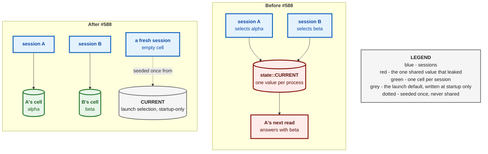
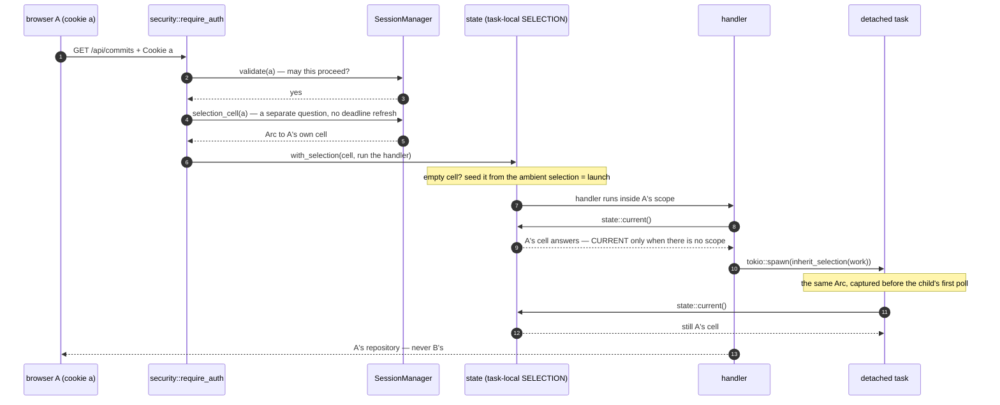
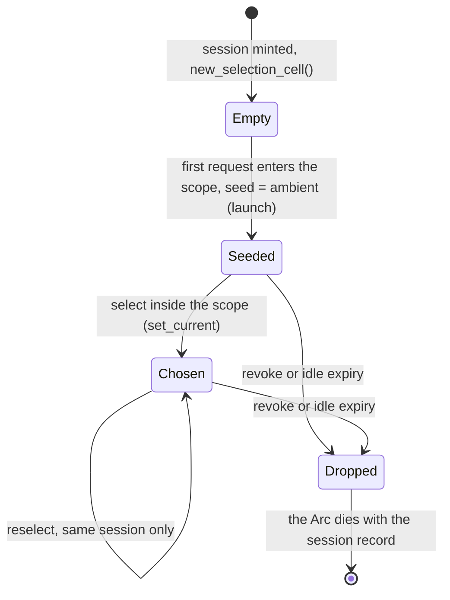
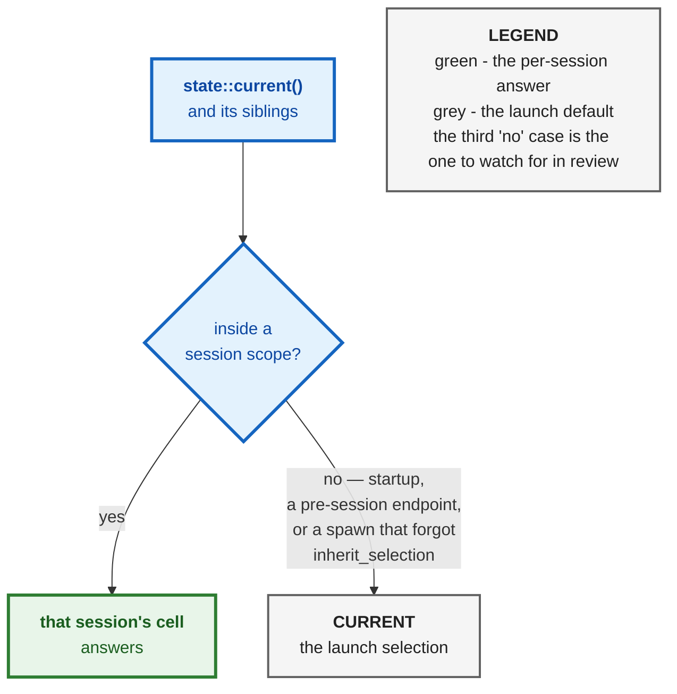
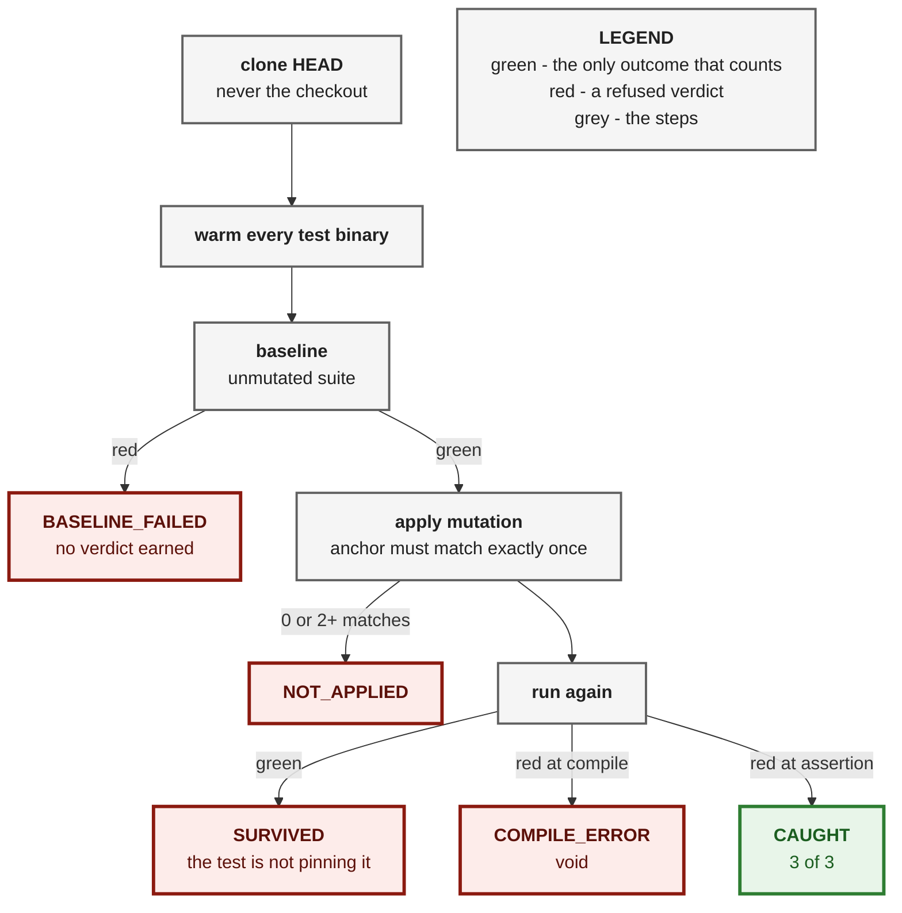

# ADR 0103 — The selection belongs to the session, not the process

**Status:** Accepted — implemented, driven through the real router by two
concurrent sessions, mutation-proved three ways on the one mechanism (3/3)
**Date:** 2026-09-01
**Issues:** [#588](https://github.com/tom2025b/git-vista/issues/588) — the
selected repository is process-global: a second session inherits, and
overwrites, the first one's pick
**Follows:** ADR 0006 / 0007 (the `RepoMode` model `state.rs` cites for what
a selection *is*); the D2 decision of 2026-07-30 recorded on
`state::read_only_for_path` (mode is the single source of truth for the
sandbox's write grant)
**Supersedes:** nothing · **Superseded by:** nothing

---

## Context

`state::CURRENT` was one `OnceLock<RwLock<Current>>` for the whole server
process. `set_current` wrote it; `state::current()`, `current_mode()`,
`current_handle()` and `read_only_for_path()` — and through them every read
handler, the planner and the preview engine — read it. One value, one
process, however many people were signed in.

Two consequences follow, and both are observable from outside the server
without reading a line of `state.rs`:

- **A fresh session inherits whatever repository the previous one picked.**
  There is no defined place a new session begins at, only the leftover.
- **Two live sessions overwrite each other.** A selects alpha, B selects beta,
  and A's next read answers with beta's commits.

The second is not hypothetical. The bootstrap-token flow explicitly supports
a second device bootstrapping its own session against the same server — the
iPad milestone is on hold, not abandoned — and two browser tabs on the same
box already produce two sessions.

The shape of the fix already existed. The test harness had long carried a
`#[cfg(test)]` `tokio::task_local!` (`TEST_CURRENT`, with
`inherit_test_current` for spawned tasks) precisely so parallel tests could
not replace one another's fixture repository. As `state.rs` now puts it: *the
hazard was real and the shape was right; it was only ever scoped too
narrowly.*



## Decision

**The selection becomes a per-session cell, entered once per request at the
guard, and `CURRENT` is demoted to the launch selection.** Five parts, each
written where the next reader will look for it.

### 1. A `SelectionCell` owned by the session record

`state::SelectionCell` is `Arc<RwLock<Option<Current>>>`. `session::Session`
gains a `selection` field holding one, minted **empty** when the session is
created. Its lifetime is therefore the session's: `SessionManager::revoke`
removes the record and the selection goes with it, which is why signing out
cannot leave a repository behind for the next person. Nothing else holds a
strong reference except the task currently serving a request for that
session.

### 2. Captured at the one place that already decides who is calling

`security::require_auth` already reads the session cookie to decide whether a
request may proceed. It now also asks `SessionManager::selection_cell(id)` for
the cell — *deliberately* a separate method from `validate`. `validate`
answers "may this request proceed", and that answer must not change shape
because a caller also wants the selection. `selection_cell` does not refresh
the idle deadline either; the `validate` call in the same request already
did.

Pre-session endpoints (token negotiation, `GET`/`POST /api/session`) get
`None` and resolve against the launch selection.

### 3. Scoped around the handler with a task-local

```rust
let mut response = match selection {
    Some(cell) => crate::state::with_selection(cell, next.run(request)).await,
    None => next.run(request).await,
};
```

`with_selection` seeds an empty cell from the **ambient** selection first —
`current_snapshot()` evaluated *before* entering the new scope, which is the
launch selection in production (no enclosing scope, so `CURRENT`) and the
harness's own scope under test. One expression covers both, and the seed can
never be another session's cell, because a session scope is only ever entered
from the guard, which is not itself inside one. Seeding happens here rather
than at session creation because the launch selection is not yet set when a
`SessionManager` is built.

Every existing `state::current()` call site is untouched. They simply now
answer session-first, launch second.



### 4. Detached tasks inherit the *same* cell

`inherit_selection` — the old `inherit_test_current`, promoted to production —
captures the caller's cell synchronously, before `tokio::spawn` first polls
the child in a task where the parent's task-local is no longer visible, and
re-enters the scope around the child. The child shares the cell, not a copy: a
task spawned to serve a request must see that session's repository, and a
selection it makes must be visible to the session that spawned it. Both
existing detached-task sites use it: `planner::plan_and_execute_tracked` and
`preview::preview`. Outside any scope (startup) the future is returned
unchanged and resolves against `CURRENT`.

### 5. `CURRENT` is the launch selection, and only that

Startup is the only writer with no session scope, and it is the only thing
that still writes `CURRENT`. Under `cfg(test)`, a `set_current` outside any
scope **panics** — so the test harness (`with_isolated_test_current`) is a
thin wrapper over the production mechanism rather than a shadow of it, which
is what #588's last acceptance criterion asks for. The launch selection
therefore stays the fixed, defined place a fresh session begins at, instead of
drifting to whatever the last person happened to pick.



### What this narrows but does not close

`read_only_for_path` — the signal `sandbox::policy_for` uses to decide whether
to withhold the write grant — still reads the selection at spawn time, not at
the moment `resolve_target` authorized the write. Real `.await` points sit in
between (durable persistence, task admission), so a reselection landing there
makes the in-flight write fall through to the catalog's registration-time flag
and can be **spuriously refused**. Fail-closed only: a legitimate write can be
wrongly refused; nothing insecure can succeed.

What #588 changed: that reselection must now come from the **same session**.
It used to be any request on the server. Closing it properly means
`resolve_target` capturing `read_only` alongside the path and threading that
snapshot through to `sandbox::policy_for` instead of re-deriving it at spawn
time; that crosses the planner/sandbox boundary and is its own change. The
comment on the function says all of this, so it is not silently lost.

## Alternatives considered

| Alternative | Why not |
|---|---|
| Keep `CURRENT` process-global and forbid a second session | The bootstrap token explicitly supports a second device, and two tabs already make two sessions. The constraint would be fighting the security model, not the bug. |
| Thread the selection as an argument through every handler | `state::current()` has many read-handler call sites by design (its doc says so); the task-local keeps that API and confines the change to one seam, the guard. A threaded parameter would touch every handler and still leave detached tasks to solve. |
| Scope a **copy** of the cell per request | A selection made inside the request would never reach the session. Mutation M02 did exactly this and all three suite tests went red. |
| One shared cell handed to every session | The mechanism would exist and change nothing. Mutation M03 did this and all three tests went red. |
| Look the cell up inside `validate` | `validate` answers one question; its shape must not change because a caller wants a second answer. Kept separate on purpose, and the separation is written on the method. |
| Close the `read_only_for_path` race in the same change | It crosses the planner/sandbox boundary; a fix that size deserves its own red test and its own record. Narrowed here, named, left open. |

## Consequences

- **Two devices, or two tabs, each hold their own repository.** Selecting in
  one no longer moves the other; the read that used to answer with the wrong
  repository now cannot.
- **A fresh session starts at the launch selection** — a defined place — and
  **signing out drops the selection with the session.**
- **A new house rule for spawns.** Any `tokio::spawn` from request context
  must wrap its future in `inherit_selection`, or the child silently answers
  from the launch selection. That is the fail-safe direction (it can never
  see another session's repository) but it is the *wrong* repository, and the
  two existing sites show the pattern.
- **`state::current()` and its siblings are unchanged in signature**, so every
  handler became session-aware without being edited.
- **Tests that select a repository must run inside `with_isolated_test_current`**
  — under `cfg(test)` a write with no scope panics rather than touching the
  process. The harness and production now share one mechanism.
- **The launch selection can no longer be moved by a request.** Only startup
  writes `CURRENT`.
- **The spawn-time `read_only` race is narrowed to same-session** and remains
  fail-closed. Its proper close is a separate change, named on the function.



## Evidence

**Workspace gate**, on the branch after `origin/main` was merged down (#599 and #603 included): `cargo fmt --check` clean; `cargo clippy --workspace --all-targets -- -D warnings` clean; `cargo test --workspace` — **2650 passed, 0 failed, 16 ignored** across 44 test binaries (the ignored ones are the pre-existing live-server tests). The shim-building test was run first so the preview suite saw a real `gv-sandbox`.

**The suite drives the real router, not `state::`'s internals.**
`session_selection_suite.rs` bootstraps two independent sessions through the
actual `api_router` (the bootstrap token is single-use and self-replacing, so
two sign-ins yield two sessions), registers two fixture repositories whose seed
commits carry different messages (`alpha seed` / `beta seed` / `launch seed`),
and decides every assertion on the bytes `GET /api/commits` actually returns
to each cookie. Asserting on `state::` would risk proving the mapping by
calling the function that defines it.

| Test | Pins |
|---|---|
| `two_sessions_hold_different_selected_repositories` | A selects alpha, B selects beta; A's read contains `alpha seed` and not `beta seed`, and B's the reverse |
| `a_fresh_session_starts_at_the_launch_repository_not_the_previous_pick` | with launch registered last, a first session picks alpha; a brand-new third session reads `launch seed`, not `alpha seed` |
| `signing_out_leaves_no_selection_for_the_next_session` | a session picks alpha and is revoked; the next session reads `launch seed`, not `alpha seed` |

The red commit came first (`920f6b4a`): all three failed against the
process-global `CURRENT` with the messages above, before any production code
moved.

**Mutation proof — 3 of 3 caught**, each in a throwaway clone of HEAD
`9f28835d` with a clean source tree, the unmutated suite run green first in
the same invocation, and only a red *at the assertion* counted:



| # | Shape | Where | What it did | Result |
|---|---|---|---|---|
| M01 | removed the mechanism | `security.rs` | served the request with no `with_selection` scope at all | caught — all 3 red |
| M02 | weakened it | `state.rs` | scoped a **copy** of the cell instead of the shared `Arc` | caught — all 3 red |
| M03 | weakened it | `session.rs` | handed every session the **same** process-wide cell | caught — all 3 red |

Three shapes, one mechanism: all three break per-request scoping. What was
**not** mutation-proved in this change, said plainly so it is not mistaken for
proved: `inherit_selection` (the detached-task inheritance) and
`SessionManager::revoke` dropping the cell. The revoke path is pinned by the
third test above; inheritance is exercised by the planner and preview suites
only through their existing behaviour, with no mutation run against it.

---

**Signed:** max · 2026-09-01T23:50:05-04:00
