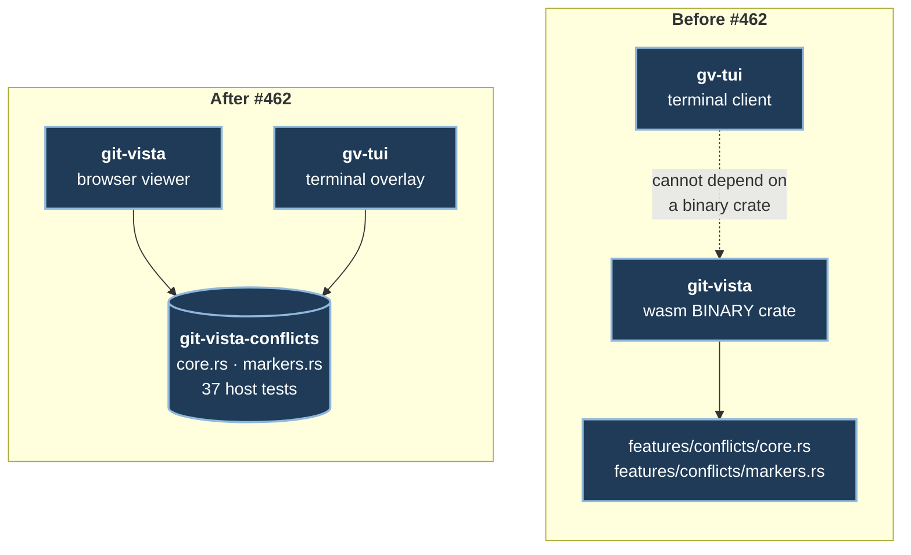

# ADR 0105 — The conflict model is a crate, and the terminal only draws it

**Status:** Accepted — implemented, mutation-proved two ways per invariant
(14/14), full gate green
**Date:** 2026-09-02
**Issues:** [#462](https://github.com/tom2025b/git-vista/issues/462) — M10.07,
conflict resolution in the terminal, on the shared conflict model
**Follows:** ADR 0063 (the conflict read model), ADR 0064 (whole-side
resolution), ADR 0066 (why the client-side conflict logic is framework-free),
ADR 0068 (a conflict's shape is read from `kind`), ADR 0069 (the `conflict-v1:`
token), ADR 0101 (the session boundary is a crate), ADR 0103 (the selection
belongs to the session)
**Supersedes:** nothing · **Superseded by:** nothing

---

## Context

#462's goal is one sentence, and every hard thing about the issue is in it:

> Inspect and resolve conflicts from the TUI, **using the same model M4.31
> shipped — not a second conflict implementation.**

The model was already there and already good. `features/conflicts/core.rs`
held the four-pane mapping, the six pane states and the `ResolutionSurface`
that decides which whole-file controls may be offered; `markers.rs` held the
marker-file parser and composer. Both were framework-free and host-tested, on
purpose, for the reason ADR 0066 records: two of #428's four criteria are facts
about **rendering**, and a mapping behind `#[cfg(target_arch = "wasm32")]` is a
mapping `cargo test` never compiles.

One thing stood in the way, and it was structural rather than conceptual.
Those files lived inside `git-vista`, which is a **binary** crate built to wasm
by Trunk. `gv-tui` had nothing to depend on. The choice was not "reuse or
rewrite" — it was "move the model, or write it twice."

## Decision

### 1. The model moves to `git-vista-conflicts`, a crate downstream of both core and protocol

`core.rs` reads `git_vista_core::diff` (the blob and worktree payloads) and
`git_vista_protocol::conflict` (the stages). Folding it into either of those
crates would break a dependency invariant each of them writes down:
`git-vista-protocol`'s lib doc says it depends on neither, and that
"`git-vista-core` does *not* depend on it, keeping the domain model free of
transport concerns." A crate downstream of both breaks neither claim.

The precedent is one milestone old and exactly this shape: ADR 0101 extracted
`git-vista-session` when `gv-tui` needed the session logic `git-vista-mcp`
already had. **Alternative considered and rejected:** add `git-vista-protocol`
to `git-vista-core`'s dependencies and put the module there. It is one line of
manifest, and it silently reverses a documented architectural claim in two
crates — the cheapest edit and the most expensive decision.

The move was a `git mv` plus a manifest. No logic was rewritten and all 37 of
M4.31's host tests came along and still pass. **That is ADR 0066's dividend
being collected**, and it is worth naming: had these decisions lived in the
Leptos viewer, #462 would have had to reimplement them, and the reimplementation
would have been tested by nothing.

The `features/conflicts` module is deleted rather than kept as a re-export.
With no code of its own left, a forwarding module only hides where the model
now lives.

### 2. Exactly two widenings of the shared surface, each with a reason

The issue permits `markers.rs` to "move or gain a public surface... deliberately".
Two did, and no more:

- **`markers::Choice::describe()`** — the four-way wording (`"keeping both"`
  and its siblings) was spelled out inline in `viewer.rs`. The terminal needs
  the same four words. Two lists of four strings in two crates drift, in a UI
  whose entire job is telling somebody exactly which version of a file they are
  about to keep.
- **`core::ConflictPanes::pane_mut()`** — the terminal folds blob answers back
  one at a time, tagged with the pane they were asked for. Without it, it would
  have written its own `match pane { Base => &mut self.base, … }`, a second copy
  of the one mapping that says which field is which side. #612 found precisely
  that shape a week ago: `CherryPick` and `RevertCommit` both carry one
  `CommitOid`, so mapping one to the other compiles and renders the exact
  inverse operation.

### 3. The terminal draws what the model returned, and decides nothing

Every judgement in the overlay is delegated, and this is the criterion the
issue actually cares about:

| question | who answers |
|---|---|
| what state is this pane in | `PaneState::for_stage` / `with_content` / `result_pane_state` |
| what does that state say to a user | `PaneState::describe` |
| may `Take ours` be offered, and if not why | `ResolutionSurface::take_ours`, `Withheld::describe` |
| what shape of conflict is this | `ResolutionSurface::note` |
| may a line-level resolver open at all | `ResolutionSurface::text_resolution_allowed` |
| what blocks does the marker file hold | `markers::parse` |
| what content does a set of choices produce | `markers::compose` |

**`text_resolution_allowed` is read, never re-derived.** It traces to
`ConflictedFile::text_resolvable`, the identical call the server makes before
executing a content resolution. #430 shipped a wrong sentence because that rule
had two implementations; it still has one.

Proving that is harder than it looks, and the proof is worth recording. The
predicate is three clauses — no typed reason, **and** both live sides actually
text — and on every ordinary fixture the obvious local re-derivation
(`not_text_resolvable.is_none()`) agrees with it. A test suite built only from
ordinary fixtures would pass on the wrong copy. So the suite carries the
documented **disagreement** case: a conflict whose wire payload has no
`not_text_resolvable` but whose stage is flagged binary, where the protocol's
own doc says the per-side flag wins. The naive re-derivation says yes there;
the real predicate says no. That fixture is the whole difference between
testing the rule and testing a fixture.

### 4. The four panes are a summary strip plus one full-width body, not a 2×2 grid

The frame's floor is 40 columns. Quartered, that is 20 columns of source per
pane — every line of every version truncated, and the user reading the *shape*
of four boxes rather than their contents. That is the same failure as a pane
that draws an empty box: it looks like inspection and is not.

So all four panes are always **stated** — one row each carrying that pane's own
`describe()` sentence, so "Not present on this side" is on screen whichever
pane is being read — and the focused one is shown full width. `Tab` and `1`–`4`
move between them. Every pane stays reachable, which is what #428's first
criterion asks, and none is ever a blank box.

The same distinction is applied one layer in: a `Block::Conflict` whose `base`
is `None` renders "no recorded ancestor in this marker file", never an empty
ancestor section. Git omits the ancestor under the default merge style, and a
blank section would claim a common ancestor existed and was blank — ADR 0063's
rule, inside the editor.

### 5. A conflict write is paired with its own `POST /api/select`, every time

This is the decision least visible in the diff and most likely to matter.

Reads in this client address a repository explicitly with `?repo=`.
`/api/resolve-conflict` addresses none: it goes through the planner, which acts
on **this session's selection** (per-session since #588, ADR 0103; before that,
per-process). A client that listed one repository's conflicts and posted a
resolution without selecting would write to whichever repository the server
launched with — and if that repository happened to have a conflict at the same
path, the write would **succeed, in the wrong repository, silently**.

Selecting once when the overlay opens would fix the common case and leave a
remembered fact that can go stale. Pairing the select with the write makes "the
resolution lands where the user was looking" true by construction. `Active`,
because `reject_if_read_only` refuses `Visualize` and it is the only mode a
write is legal in; and it is this terminal session's own selection, so the
browser's is untouched.

**The deeper fix is a protocol change and is deliberately not made here.** The
endpoint arguably ought to carry the repository, the way every read does. That
is a wire-contract decision with its own blast radius, it belongs in its own
issue, and #462 is not the place to make it. Recorded so the next reader knows
the pairing is a mitigation with a known better answer, not the end of the
thought.

### 6. The overlay owns the keyboard, because its editor takes every printable key

`keys::dispatch_conflict` is a second table rather than more arms in the first.
It has to be: under one shared keymap, typing `q` into a file you were resolving
would quit the program and throw the edit away, and `j` would scroll instead of
appearing in the line. `Ctrl-C` is the single binding that survives insert mode
— a terminal program you cannot interrupt is one somebody has to kill from
another window.

`x` opens the overlay. `c` was the obvious mnemonic and is left alone: the
working-tree slice (#459) is the natural owner of a commit key.

### 7. A hand-edit is authoritative from the first keystroke, and only from then

`Editor::hand_edited` is a separate flag from `buffer.is_some()`, and the
distinction is the whole of #462's fourth criterion. Merely *opening* the
composed text must not freeze the block choices — that would be the rule firing
on somebody who did nothing. A typed character must. So:

- before any edit, re-entering the buffer **re-seeds** from the current
  composition, because until then the buffer is only a view of it and a stale
  seed would show a choice the user has since changed;
- after one, the buffer is the user's text: block choices go inert and say so,
  the buffer is never re-seeded, and the submission carries the typed text
  rather than the composition.

Re-composing over somebody's typing is the worst failure available in an
editor, because it is silent. The seed itself is never empty: it falls back to
the marker file git actually wrote, since an empty buffer would offer "delete
everything in this file" as the starting point of a resolution.

### 8. `authed_fetch_response`, because a 404 is information

`GET /api/worktree-file/{path}` answers 404 when there is no file at the path,
and in a delete/modify conflict that is exactly what git left behind. Read
through the ordinary JSON path, that fact arrives as "content could not be
loaded" — a fault reported where nothing went wrong, which is the collapse
`Stage::Absent` versus `Stage::Unreadable` exists to prevent, arriving one layer
down in the transport. So `git-vista-session::retry` gains a sibling that hands
back the status. It also returns whether the answer arrived on a freshly minted
session, so `authed_fetch` keeps its exact "even after re-authenticating"
wording rather than losing that distinction to the refactor.

### 9. The idempotency key is unique per press, not derived from the request

A key names **one user action**, and the server replays the recorded outcome
for a key it has already seen. A key derived from the resolution's own content
would make a second, deliberate attempt look like a retry of the first and
replay its answer instead of running — for a refusal, that means being told
again about a repository state that has since changed. The wall-clock
nanosecond is in the key because the operation registry is durable across
server restarts (#62): a bare counter restarts at 1 in a fresh `gv-tui` and
collides with the previous run's keys, and a collision here is a write that
silently does not happen.

## Consequences

- One conflict implementation, two clients. A fix to the model reaches the
  browser and the terminal at once, and neither can drift.
- `git-vista-core` and `git-vista-protocol` keep the dependency invariants they
  document. The workspace gains a crate; that is the price.
- The write path depends on a select landing first. If `/api/select` is ever
  removed or changed, `gv-tui`'s conflict writes are affected — the pairing is
  named on `select_for_write` so the connection is findable.
- `Client::with` grew a third parameter. Every existing test passes a closure
  that panics if anything posts, which is louder than a benign stub.
- **`row_count` is a second implementation of the row layout**, arithmetic
  beside the visitor's walk, and it exists because a 2 MB conflicted file must
  not allocate thirty thousand rows per redraw. The honest way to hold two
  implementations of one thing is to pin them against each other, so
  `row_count_agrees_with_the_rows_actually_emitted_on_every_screen` fails the
  moment they diverge, on all three screens.
- Not attempted, and not pretended: rebase and cherry-pick sequence control
  beyond what conflict continuation needs (#461's territory), and the protocol
  change in decision 5.

## Verification

Full gate green on the exact head. `cargo test -p gv-tui --bins`: **115
passed**, counted by name rather than read off the word "ok" — the `--lib`
false-green this repository has lost cycles to twice does not apply here, but
the counting habit does.

Fourteen mutations through `failure-atlas`, seven invariants at two ways each
that fail differently — one removing the mechanism, one weakening it — and
**all fourteen `caught`**:

| invariant | removed | weakened |
|---|---|---|
| a hand-edit makes choices inert | guard deleted from `choose` | `apply_content` prefers the composition |
| the editor reads the server's flag | gate deleted | flag replaced by `note.is_some()` |
| an absent pane says so | summary strip narrowed to the focused pane | the sentence emptied to `""` |
| `row_count` matches the walk | the note term dropped | the ancestor row dropped |
| a write selects its repository first | select deleted | select moved after the post |
| a 404 is an absent file | the 404 arm deleted | `NoFile` mapped to `Failed` |
| the stage triple and token are echoed | token re-minted locally | stages replaced with `[None; 3]` |

One mutation is worth singling out. Replacing the eligibility flag with
`note.is_some()` — a re-derivation that looks entirely reasonable — is caught
**only** by the disagreement fixture in decision 3. Every other conflict test
in the module stays green under it. That is the difference a single fixture
made, and it is why "the tests pass" was not accepted as evidence for criterion
3 until this run.

---
**Signed:** max · 2026-09-02T19:10:00-04:00
