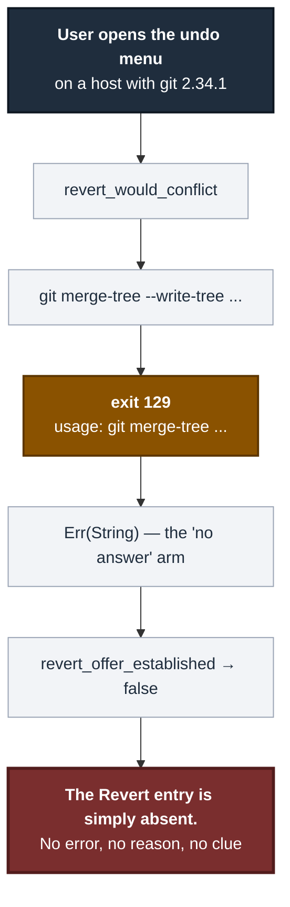
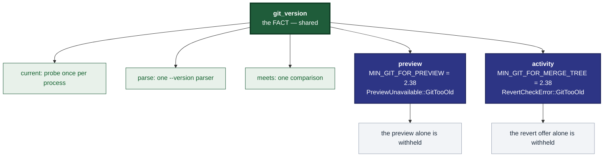

# ADR 0106 — Share the measurement, not the floor

**Status:** Accepted — implemented
**Date:** 2026-09-02
**Issues:** [#581](https://github.com/tom2025b/git-vista/issues/581) — the
documented git floor is 2.32, but `revert_would_conflict` has silently required
2.38 since [#327](https://github.com/tom2025b/git-vista/issues/327)
**Supersedes:** nothing · **Superseded by:** nothing
**Extends:** [ADR 0099](0099-a-preview-is-real-git-refusing-rather-than-modelling.md),
which introduced the per-feature version gate for the graph preview

---

## Context

`docs/SUPPORTED_VERSIONS.md` declares a **product** floor of git **2.32**,
derived from `GIT_CONFIG_GLOBAL`. Since #327, `activity::revert_would_conflict`
has run:

```
git merge-tree --write-tree --merge-base=<commit> <head> <parent>
```

`--write-tree` arrived in git **2.38**. There was no version check of any kind
on that path — the function read git's exit code and mapped `0` to "clean", `1`
to "conflict", and everything else to an unexplained `Err`.

**Measured 2026-09-02**, running that exact argv against two real gits in
rootless podman containers:

| git | exit | output |
|---|---|---|
| **2.34.1** (Ubuntu 22.04 LTS) | **129** | `usage: git merge-tree <base-tree> <branch1> <branch2>` |
| 2.43.0 (Ubuntu 24.04 LTS) | 0 | the merged tree oid |

129 is neither 0 nor 1. So on any host in the documented 2.32–2.37 band the
revert offer **silently never appeared**, and the user was told nothing.

The posture was never unsafe. `revert_offer_established` treats `Err` exactly
like a conflict, and its own comment says *"'couldn't tell' must never read as
'safe to offer'"*. That is why this survived three years and several audits: it
degrades fail-closed, and a fail-closed degrade produces no symptom anyone
reports. What was missing was not safety. It was the **explanation**.



Meanwhile #576 had already built exactly the machinery this needed — a
once-per-process probe, a parser for git's `--version` line, and a pure
comparison — and it was **private to `preview.rs`**. #581's own words: *"That
gate is worth building once, for both callers, rather than twice."*

## Decision

**Share the measurement. Do not share the floor.**

A new module, `crates/git-vista-server/src/git_version.rs`, owns the *fact*:

* `current(repo)` — the probe, cached per process in a `OnceCell`, caching only
  successes so a transient failure does not permanently disable a feature;
* `parse(line)` — one parser for git's `--version` line, including the vendor
  suffixes (`2.39.5 (Apple Git-154)`, `2.43.0.windows.1`);
* `meets(found, floor)` — one pure comparison, on `(major, minor)`.

Each feature keeps its **own** floor constant and its own refusal type:

| Feature | Constant | Refusal |
|---|---|---|
| Graph preview | `preview::MIN_GIT_FOR_PREVIEW` | `PreviewUnavailable::GitTooOld { found, minimum }` |
| Revert offer | `activity::MIN_GIT_FOR_MERGE_TREE` | `RevertCheckError::GitTooOld { found, minimum }` |

Both are `(2, 38)` today. That is a **coincidence of the same plumbing, not a
shared policy**, and the ADR's title is the whole point: a single shared
constant would read as authoritative, and the next feature needing 2.41 would
either raise it for everyone or quietly fork it back. A shared *number* becomes
a second product floor by the back door. A shared *measurement* is what was
actually missing.



**`revert_would_conflict`'s error becomes two facts, not one.**
`RevertCheckError::GitTooOld { found, minimum }` is a property of the host that
will be true again next time; `RevertCheckError::CheckFailed(String)` may not
be. The Recovery Center carries the distinction through as
`CheckFailedReason::GitTooOld`.

**The safety posture does not change.** Both arms still decline to offer.
`revert_offer_established`'s `.unwrap_or(false)` is untouched. The split buys an
explanation, never a different answer.

**This stays out of the boot gate**, for the reason ADR 0029 already gives:
`sandbox::probe` is deliberately the one gate in this codebase with no degraded
outcome, and a *capability* question does not belong in a gate whose whole
argument is that it has none.

## Alternatives considered

**Raise the product floor to 2.38.** Rejected. A host on 2.32–2.37 is a fully
supported host on which every other feature is correct; refusing it service for
one menu entry is a much larger harm than withholding that entry. It would also
have to be enforced somewhere, and the only boot gate available is the one that
must not grow a degraded mode.

**One shared `MIN_GIT` constant.** Rejected — the title of this ADR. The two
floors coincide today for one reason (`merge-tree --write-tree`), and reading a
call site should tell you what *that feature* needs without chasing a table.

**Leave the error a single `Err(String)` and just document the floor.**
Rejected. It would fix `SUPPORTED_VERSIONS.md` and leave the user on 2.34
watching a menu entry not appear. The distinction is cheap and the whole cost of
the defect was that the two cases were indistinguishable.

**Put `GitTooOld`'s version numbers on `CheckFailedReason`.** Rejected.
`CheckFailedReason` is `Copy` and caller-facing; a host detail that changes
under it belongs in `RevertCheckError`, which is where it lives.

## Consequences

* One place now establishes the running git's version, which is what #581 asked
  for. A third feature needing a floor adds a constant, not a mechanism.
* A user on git 2.32–2.37 is told *why* the revert offer is missing.
* The honest limit, stated rather than hidden: the version is probed **once per
  process**, so an operator who upgrades git under a running server does not get
  the gated features until restart — the same posture
  `sandbox::capabilities::current()` already takes toward host capability.
* `revert_would_conflict` now costs one extra `git --version` per *process*, not
  per menu-open.
* **A testing consequence worth naming**, because it nearly produced a vacuous
  test. `git_version::current` caches per process and cannot be made to lie, so
  no test can make this host's git look old — and this project's hosts are all
  far above 2.38. A pure gate test alone would have proven the decision correct
  while leaving *deletion of the gate call* completely green.
  `revert_would_conflict_at_version` therefore takes the version rather than
  probing it; everything else on that path is production. Mutation-proved two
  ways, failing differently:

  | Mutation | Kind | Result |
  |---|---|---|
  | delete the `if let Some(too_old)` gate call | removes the mechanism | **caught** — only the wiring test goes red |
  | `MIN_GIT_FOR_MERGE_TREE` 2.38 → 2.32 | weakens the mechanism | **caught** — the pure gate test *and* the wiring test go red, on different assertions |

* `docs/SUPPORTED_VERSIONS.md`'s feature-floor table gains the row that was true
  from #327 and undocumented until now.
