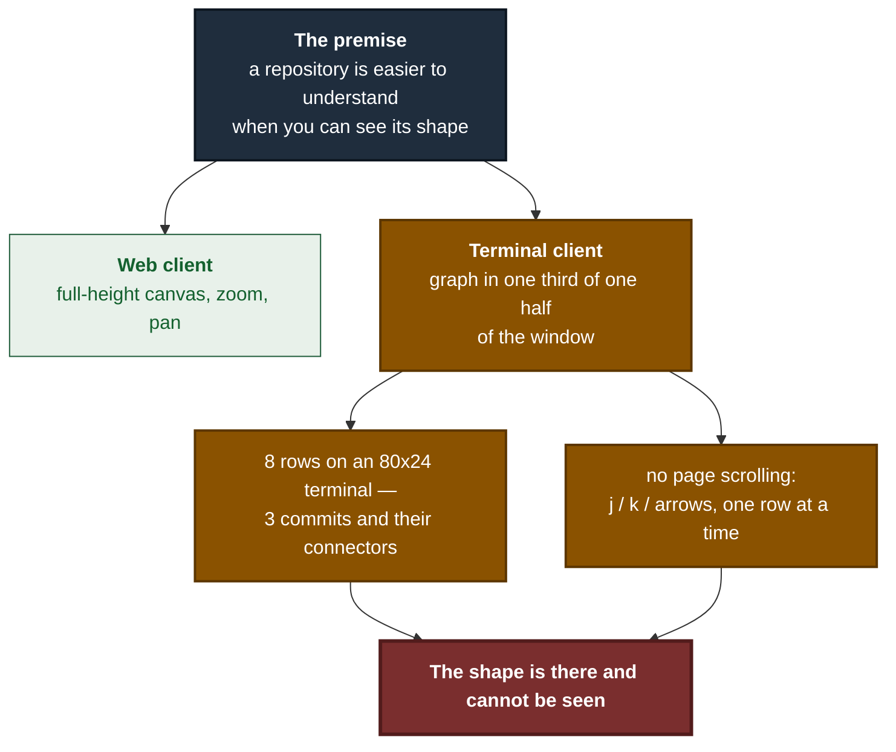
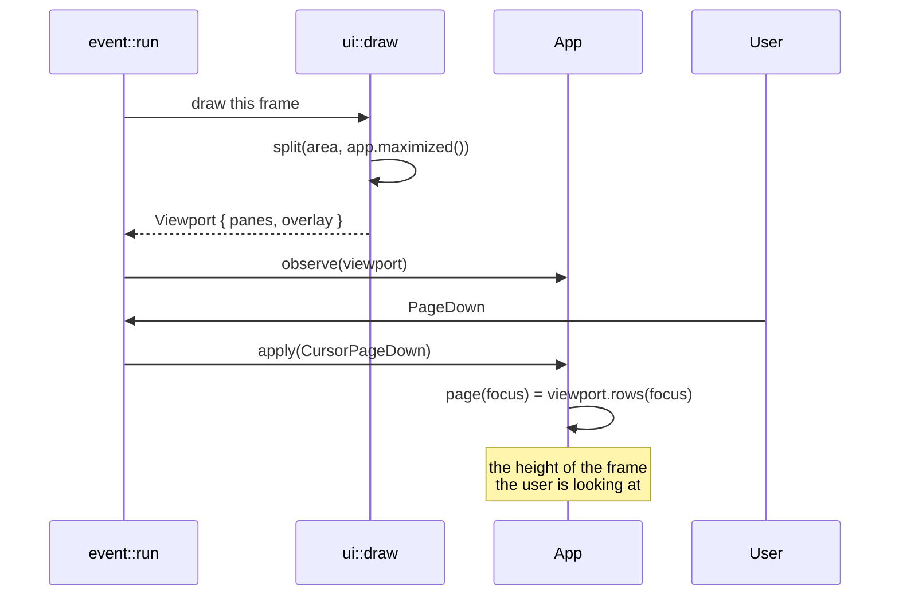
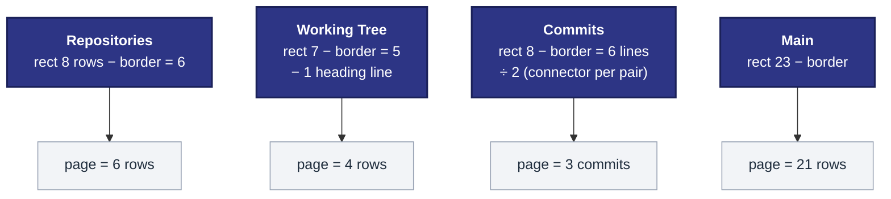
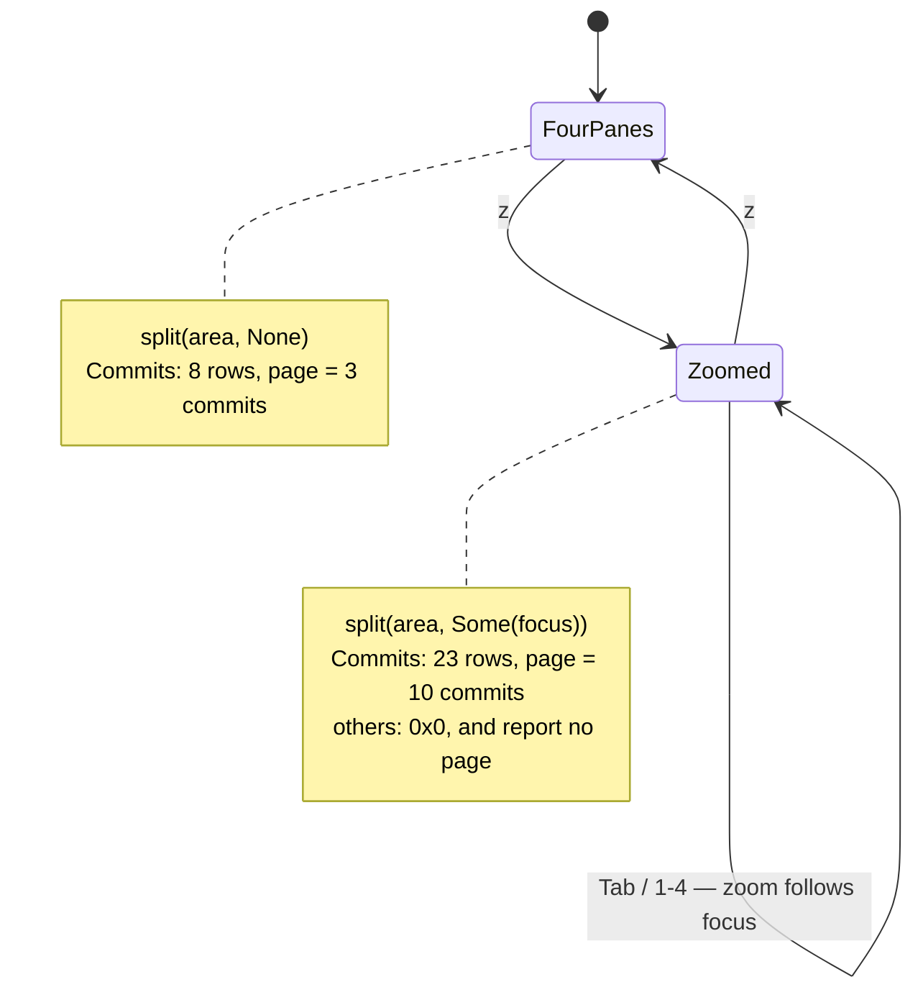
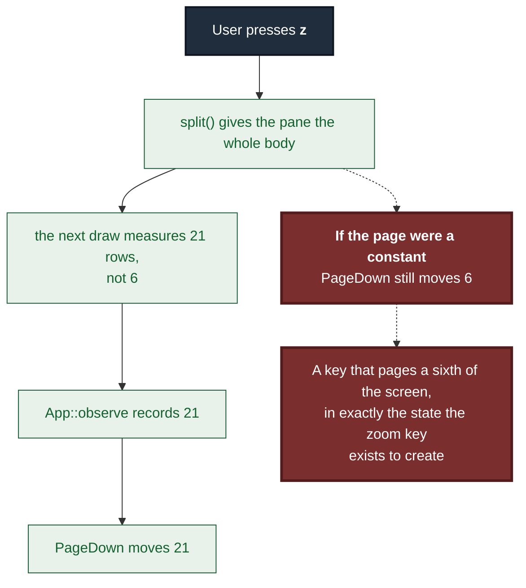

# ADR 0110 — A page is what the frame just said it was, and zoom is why that matters

- **Status:** Accepted — implemented, mutation-proved two ways
- **Date:** 2026-09-03
- **Issue:** #625
- **Extends:** [ADR 0102](0102-a-persistent-client-earns-the-retry.md), [ADR 0105](0105-the-conflict-model-is-a-crate-and-the-terminal-only-draws-it.md)
- **Supersedes / superseded by:** —

## Context

The premise of this project is that a repository is easier to understand when
you can **see** its shape. The browser client got a full-height zoomable
canvas for exactly that reason. The terminal client draws the same graph in
the smallest pane on the screen, and until this issue there was no way to make
it any bigger and no way to move through it faster than one row at a time.

M10 shipped that way and nobody noticed, which is worth saying plainly: every
acceptance criterion in the milestone was about the **correctness of the
content**, and not one was about **how much of the screen the content gets**.
No test could have caught it. Nothing was broken.

The keyboard had room for the fix. `PageUp`, `PageDown`, `Home` and `End`
appeared nowhere in the crate; no `maximize`, `zoom` or `fullscreen`
identifier existed anywhere in it. The arrow keys, often the first suspect in
a report like this, were already bound alongside `k`/`j` with a test pinning
both spellings — so they were never the missing piece.

## Decision

Four page keys and one zoom key, and — the part that is actually a decision —
**the page size is measured from the frame that was just drawn.**

### 1. Drawing is also measuring

`ui::draw` now returns a `Viewport`: how many rows of its own content each
surface had room for, taken from the very rects the widgets were rendered
into. `event::run` hands it to `App::observe` immediately after the draw and
before the next key is read.

The indirection is the whole point. The alternative — a constant, or a size
computed once at startup — is right in a one-third-height pane and wrong the
moment the zoom key hands that same pane the whole window. It would look
correct in every small-pane test.

### 2. A page is in the units its cursor counts

The graph draws a connector row between every pair of commits, so its cursor
counts **commits** while its pane is measured in **lines**. Its viewport is
therefore reported as `height / 2`. The working tree reports its list height
minus the heading row, which is not a row its cursor can select.

A page in the wrong units is not a rounding error: `PageDown` on the graph
would jump twice as far as a screen and skip half the history it claimed to
page through.

### 3. Zoom is a maximize toggle on the focused pane

`z` gives the focused pane the whole body and puts the four-pane shape back.
`layout::split` takes the zoomed pane; the other three come back as
**zero-sized rects at the body's origin**, so the existing exact-tiling
invariant covers both shapes rather than exempting the new one, and every
drawing path stays a projection of a `Panes` instead of branching on a mode.

Zoom **follows focus** rather than pinning the pane it was pressed on: `z`
then Tab shows the next pane full-height, which is what somebody wanting a big
look at something else means, and it leaves no stale "zoomed pane" to
reconcile when focus moves.

The status strip says `· z zoom`, and once zoomed says `· z unzoom`. It is
appended by the renderer rather than written into each of a dozen status
sentences, because a binding nobody can discover is a binding nobody has.

### 4. The two halves interact, and that is the defect worth pinning

## Alternatives considered

### Mouse wheel capture — rejected, and the smaller fix is the better one

The issue originally proposed capturing the mouse. It was rejected on three
independent grounds, recorded here so nobody re-adds it later believing it was
an oversight:

- Mouse capture takes terminal **text selection** away in most terminals.
  Copying a commit hash out of a pane would stop working without a modifier.
- Capture must be torn down on **panic** as well as on exit, or a crash leaves
  the user's terminal swallowing their mouse.
- Wheel events would have to be routed to the pane under the **pointer**, not
  the focused one — a second, parallel notion of "which pane" for the rest of
  the program to keep consistent.

Four key bindings cost none of that, work over SSH and in every multiplexer,
and follow the focus model that already exists.

### A statically bigger graph pane — rejected

Trades one fixed layout for another, and costs the working-tree pane that #459
exists to show. The complaint is not that the graph should always be big; it
is that it can never be big.

### Resizable splits — rejected as premature

A layout engine with draggable dividers is a much larger change for a program
with one user, and lazygit's single-key maximize is the convention this
milestone is modelled on.

### Recomputing the page size from the terminal size — rejected

`layout::split` could be called a second time from the event loop instead of
having `draw` report what it drew. Two derivations of one geometry can
disagree, and the one that would be believed is the one nobody can see. The
measurement now comes from the rects the widgets were actually rendered into,
and each `draw_*` helper reports its own number, because the function that
decided the geometry is the only one that can report it without guessing.

## Consequences

- `PageUp`, `PageDown`, `Home` and `End` work in all four panes, in the plan
  review modal, and in the conflict overlay. In the overlay's **insert mode**
  they are deliberately unbound: that mode owns the keyboard outright, and a
  scroll under a live text caret is worse than an inert key.
- The conflict overlay's Inspect scroll is now clamped to its own row count
  instead of running past the end and being clamped again at draw time. Held
  unbounded, a page key would have built a scroll position hundreds of pages
  past the file, and the first `PageUp` after it would have appeared to do
  nothing.
- `layout::split` takes a second argument, so every call site states whether
  it wants the zoomed shape. The four-pane result is unchanged.
- `ui::draw` returns a value. Callers that only want the pixels must discard it
  explicitly.
- `z` is spent. The unbound-key test in `keys.rs` has now lost four members to
  real bindings across four slices, each caught by that test failing rather
  than by anyone remembering.
- A page is deliberately the **full** visible count, not height-minus-one. A
  pane squeezed to no interior still moves by one, so `PageDown` degrades to
  `j` rather than being silently inert.
- **A cursor that can now move a page at a time is a cursor the viewport has
  to follow.** Found in review after this PR was opened, not before it: the
  conflict overlay's `view_offset` pulled the window back to the selection on
  `Screen::Editor` only, through `caret_row`. `Screen::List` had no
  scroll-following at all, because before the page keys nothing could move the
  file cursor further than one row from where the window already was. `End` in
  a list longer than the overlay moved `cursor` and never touched `scroll`, so
  the highlighted row left the drawn window entirely — the key looked inert,
  and `Enter` then opened a path that was nowhere on screen. `caret_row` is now
  one arm of `focus_row`, which answers the same question for whichever screen
  is up; the three-way clamp above it is unchanged. The general lesson is the
  narrower one worth writing down: **a new way to move a cursor is a change to
  every viewport that was only ever asked to follow small movements.**

## Verification

`cargo test -p gv-tui --bins` — **177 passed, 0 failed** (`--bins`, never
`--lib`: this crate's `lib.rs` is a stub and `--lib` reports `0 tests` as a
pass). The crate's integration test passes separately (1 passed).
`cargo clippy -p gv-tui --all-targets -- -D warnings` and
`cargo fmt --all -- --check` are clean.

### Mutation matrix

`failure-atlas mutation_check` ran against committed HEAD `9bcd3827`, with the
working tree reported clean. Both baselines were green (177 passed) and both
mutated legs reached and failed assertions; no compiler failure is counted as
a catch.

| Invariant | Mutation | Result |
|---|---|---|
| A page is the pane's current visible height | **remove**: drop `app.observe(measured)` from the event loop, so the measurement never reaches the app | **caught** (record 183) — both end-to-end tests red; the page collapsed to the floor of 1 |
| A page is the pane's current visible height | **weaken**: `page()` returns the constant `6` — the value that is *correct* at 80x24 | **caught** (record 188) — 4 tests red |

The second mutation is the one that matters, and its failure output is the
proof that the two-height requirement is load-bearing: under a constant `6`,
the **80x24** assertion still passed and only the **80x60** assertion failed
(`left: 6, right: 18`). A single-height test could not have caught it. That is
precisely the shape this ADR exists to prevent — a page size that is right in
a small pane and wrong the moment somebody zooms one.

Two further invariants carry their own mutation notes in the source rather
than a separate run: the zoomed-layout tiling invariant in `layout.rs` and the
per-pane unit measurement in `ui.rs`.

### The scroll-following defect, and why this matrix did not catch it

The mutations above exercise `page()` and `observe()` — **height**, not
scroll-following. Nothing in them draws the list and asks where the selection
ended up, so the missing `Screen::List` arm of `view_offset` survived a green
matrix untouched. Its own two mutations ran against committed HEAD `5ba45ef8`,
working tree clean, both baselines green at 178 passed:

| Invariant | Mutation | Result |
|---|---|---|
| The drawn window contains the row the file cursor is on | **remove**: `Screen::List => None` — the arm is gone, exactly the code as it stood when the PR was opened | **caught** (record 189) — offset stayed at `0` showing `file-00`…`file-03` with the cursor on `file-19` |
| The drawn window contains the row the file cursor is on | **weaken**: `Some(self.cursor.min(last))` — the follow is there but forgets that row 0 is the heading | **caught** (record 190) — offset `15`, one row short: `file-14`…`file-18`, cursor on `file-19` |

They fail differently, which is the point: the first is the mechanism absent,
the second is the mechanism present and off by one at the bottom edge only.
The test asserts that exactly one row of `window(view_offset(h), h)` is marked
selected **and that it is the file the cursor names** — an assertion that the
cursor reached the last file would have passed throughout the defect's life.

**Signed:** max · 2026-09-03
