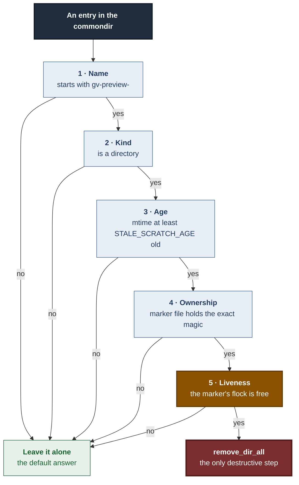
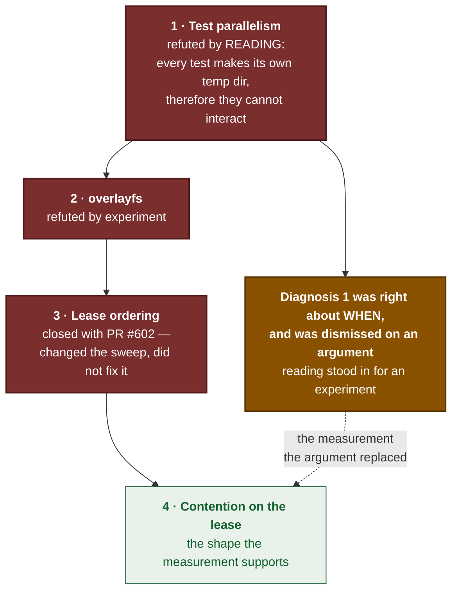
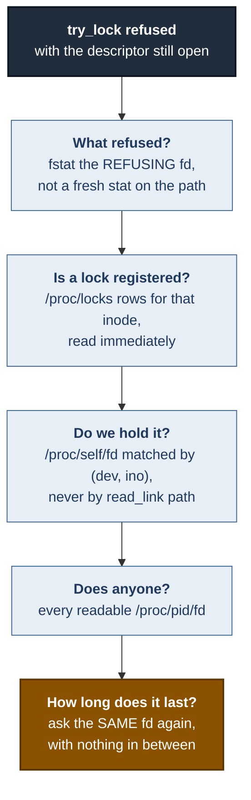
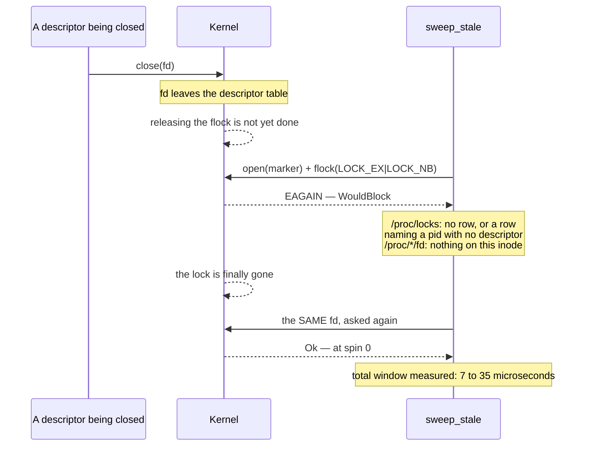
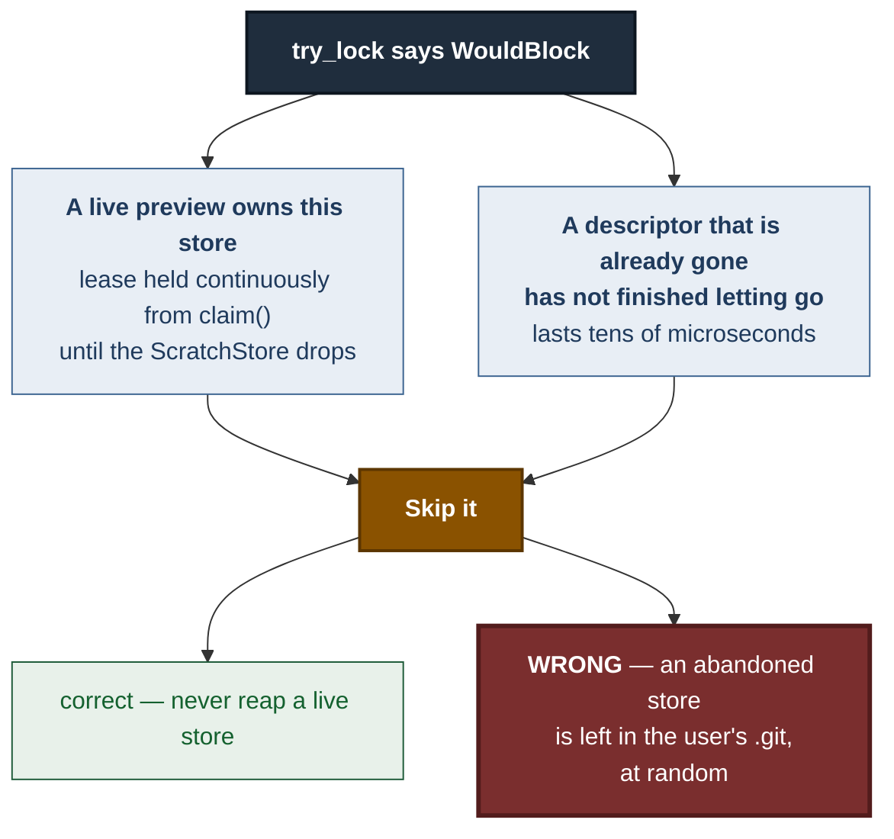
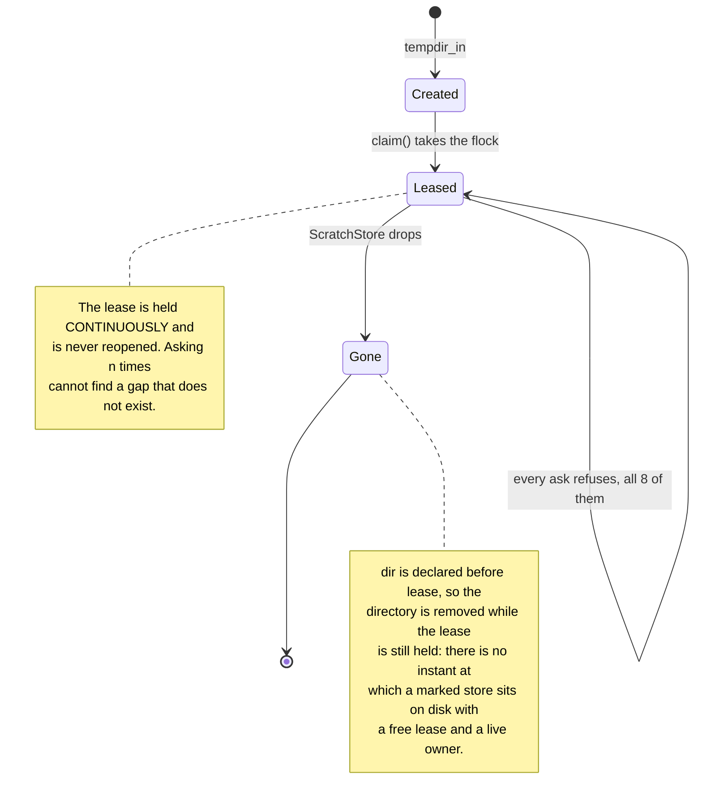
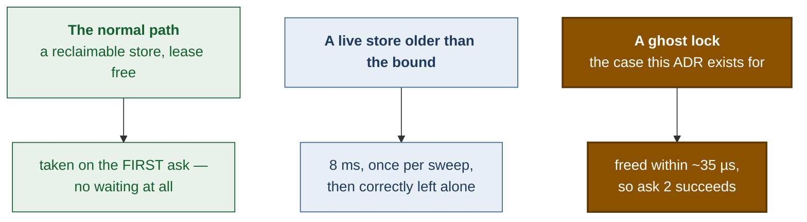
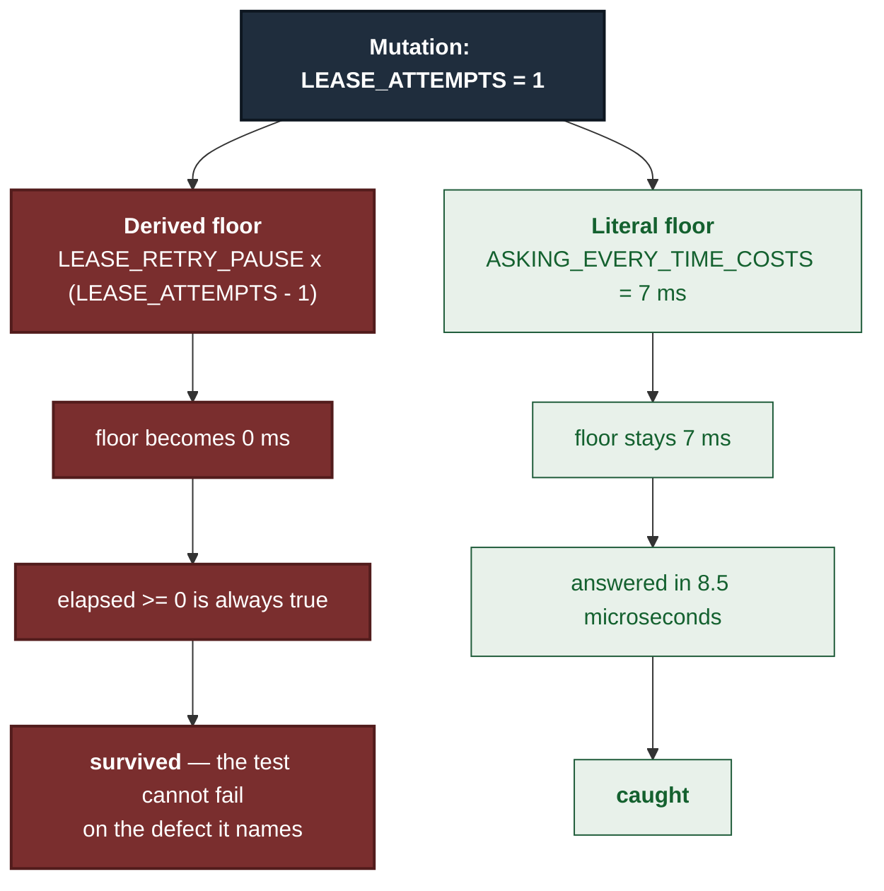

# ADR 0111 — One refusal is not evidence of an owner

- **Status:** Accepted — implemented, mutation-proved two ways per test
- **Date:** 2026-09-03
- **Issue:** #598
- **Extends:** [ADR 0104](0104-a-preview-draws-its-own-picture.md)
- **Supersedes / superseded by:** —

## Context

A preview builds its merge in a **scratch store**: a `gv-preview-*` directory
inside the served repository's `.git`. When a preview finishes, its store goes
with it. When a preview is killed, the store stays, and `sweep_stale` is what
reclaims it on the next preview.

Deleting directories inside a user's `.git` is the most destructive thing this
module does, so the sweep was built to refuse by default. A directory is
removed only when every gate answers yes:



Gate 5 is the interesting one. Age is a timestamp, not a lease: a preview whose
store was created two hours ago is indistinguishable from a corpse by age
alone. The advisory `flock` on the marker is what tells them apart, because the
kernel releases it exactly when the owning process goes away — which is the
question the sweep is really asking.

Gate 5 was one call:

```rust
f.try_lock().ok()?;
```

### What went wrong

Three tests failed intermittently in CI and blocked two unrelated pull
requests, #597 and #616. All three failed on the same kind of assertion — the
one each carries as a guard against a sweep that has quietly stopped deleting
anything:

> the sweep answered but reclaimed nothing — this test would pass against a
> sweep that had stopped working entirely

The issue was filed as three distinct failures. It was one.

### Four diagnoses, three of them wrong

This defect has an unusually bad record, and the record is the reason the
decision below is written the way it is.



The first diagnosis said "test parallelism" and was refused by reading the
code. The reading was correct as far as it went — each test really does make
its own temp directory — and the conclusion drawn from it was wrong. Reading
was the wrong instrument.

### The reproduction

The variable that matters is **running the whole `preview::` module in one
process**, not the single test:

| Configuration | Failures |
|---|---|
| the named test alone, 120 consecutive runs | **0 / 120** |
| whole `preview::` module, `--test-threads=1` | **0 / 10** |
| whole `preview::` module, default 20 threads | **12 / 20** |

So parallelism is necessary and sufficient, and it was measured rather than
argued.

### The contradiction, and the probe that resolved it

`strace` put the failure squarely on gate 5: `flock(22, LOCK_EX|LOCK_NB) = -1
EAGAIN`. Something really was refusing. But every probe run from the test body
afterwards showed **no lock and no holder** — an empty `/proc/locks`, an empty
descriptor table.

Those probes ran milliseconds too late. So the probe moved *into*
`abandoned_store_lease`'s error arm, firing at the instant of refusal with the
refusing descriptor still open. It asked four questions:



Matching by `(dev, ino)` rather than by comparing `read_link` output was
deliberate: `flock` is per-inode, so a holder that reached the same file by a
different spelling is invisible to a path comparison.

**The first version of this probe could not answer question 4.** It skipped the
cross-process scan whenever it found an in-process descriptor on the inode —
and the descriptor `try_lock` had just refused on is, by construction, always
one. Every refusal looked self-explained and the scan never ran once. That is
the same defect class this repository calls a green test that proves nothing,
wearing a probe's clothes. Excluding the refusing descriptor from its own
answer is what made the measurement below possible.

### What the probe measured

```text
LEASE-REFUSAL candidate=…/gv-preview-control thread=None variant=WouldBlock
  dev=66310 ino=25562238 locks=[] in_process_fds=[] other_processes=[]
  freed_after=27.315µs
LEASE-REFUSAL-SAMEFD ino=25562238 spins_until_free=0
```

- `try_lock` answered `WouldBlock`;
- **no** row in `/proc/locks` for that inode;
- **no** descriptor on that inode in this process;
- **no** descriptor on it in any other process this user can read;
- and the very next `try_lock`, on the **same descriptor** with nothing in
  between, **succeeded — at spin 0, in every captured occurrence.** The longest
  window observed was about 35 µs.

Some captures did show a `/proc/locks` row naming this process while nothing
anywhere pointed a descriptor at the inode. A lock with a row and no descriptor
is what a close whose lock has not finished being released looks like from
outside.



`WouldBlock` therefore conflates two opposite facts:



The sweep was drawing the same conclusion from both, and the harmless-looking
half of that conclusion is the leak `sweep_stale` exists to prevent.

## Decision

**A single non-blocking lock attempt is not evidence that anybody owns a
store. The lease gate asks `LEASE_ATTEMPTS` times before it believes a
refusal.**

```rust
fn lease_if_free(marker: &std::fs::File) -> bool {
    for attempt in 1..=LEASE_ATTEMPTS {
        if marker.try_lock().is_ok() {
            return true;
        }
        if attempt < LEASE_ATTEMPTS {
            std::thread::sleep(LEASE_RETRY_PAUSE);
        }
    }
    false
}
```

Eight asks, a millisecond apart. Nothing else about the sweep moves: no gate
removed, no ordering changed, no new deletion path. Gate 5 answers the same
question with more evidence.

### Why this cannot reap a live store

This is the load-bearing argument, and it is a property of the design rather
than of the timing.



A live store's lease is taken by `claim` and held until the `ScratchStore`
drops. It is never released and reacquired, so there is no window for a retry
to fall into. Every one of the eight asks refuses, and the answer for a live
store is byte-for-byte what it was before this change.

Only a lock that is **already gone** can flip from refusing to free — and a
lock that is already gone is precisely the definition of an abandoned store.
So retrying strictly narrows the set of false negatives and **cannot create a
false positive**. That asymmetry is the whole decision.

### What it costs, and who pays

The budget is `LEASE_ATTEMPTS × LEASE_RETRY_PAUSE` — at most 8 ms — and it is
spent only by a candidate that has already passed gates 1 through 4 and then
been refused once.



The free path pays nothing, and that is pinned by its own test rather than left
to inspection — a gate that always spent its budget would put 8 ms in front of
every reclaimable store in a user's `.git`, and it would still look correct.

## Alternatives considered

**Fix the tests instead of the sweep.** Rejected. The tests assert the sweep's
documented contract: an abandoned, marked, unleased store older than the bound
must be reclaimed. That guarantee genuinely fails today. Relaxing the tests
would have made the symptom go away and left a sweep that skips real leftovers
at random — a green suite over a live defect, which is the failure mode this
repository has recorded more than any other.

**Block on the lock (`LOCK_EX` without `LOCK_NB`).** Rejected outright. A
blocking acquire is exactly the wedge that
`a_named_pipe_wearing_the_markers_name_cannot_wedge_the_sweep` exists to
prevent: the sweep runs from `ScratchStore::new` on a spawned task, so anything
that can block for ever parks a runtime worker and takes every later preview
against that repository with it.

**Ignore `WouldBlock` and delete anyway.** Rejected, and it is worth naming
because it is the mutation the live-store test is built to catch. It removes
the only thing separating a running preview from a corpse and hands a live
store to `remove_dir_all`.

**Drop the lease gate and rely on age alone.** Rejected for the same reason
gate 5 was added: a two-hour preview is not a corpse.

**Distinguish the two `WouldBlock` causes at the syscall level.** There is
nothing to read. The kernel reports one `EAGAIN`; `/proc/locks` was empty in
most captures and, when it was not, named a process holding no descriptor. The
retry does not need to tell the causes apart — it needs only to ask again,
which the asymmetry above makes safe.

## Consequences

- The sweep reclaims abandoned scratch stores deterministically. A leftover in
  a user's `.git` is no longer skipped on a coin-flip.
- Three intermittently-failing tests are one fixed defect. `#597` and `#616`
  lose a CI tax they were paying for a bug in neither.
- The sweep can now block its caller for up to 8 ms per stale, live candidate.
  It already blocked for `read_dir` and `remove_dir_all`; this is a bounded
  addition to an existing cost, not a new kind of one.
- `LEASE_ATTEMPTS` and `LEASE_RETRY_PAUSE` are sized against measurement —
  roughly two hundred times the longest observed window — and both are pinned
  by tests that fail if either is changed.
- **A general caution now has a worked example in this codebase:** an
  advisory-lock probe that answers "somebody holds this" is answering a
  question about *this instant*, not about ownership. Anywhere else that
  pattern appears, one refusal is a hint, not a verdict.

## Verification

- **20 / 20 green** on the exact configuration that was 12 / 20 red: the whole
  `preview::` module in one process, ext4 `TMPDIR`, default 20 test threads.
- `./dev gate` green — full workspace tests, clippy, `cargo fmt --check`,
  `trunk build`, and 82 browser tests.

### Mutation matrix

`failure-atlas mutation_check` against committed HEAD `9a9194ff`, working tree
reported clean. Every baseline was green and every mutated leg reached and
failed an assertion; no compiler failure is counted as a catch.

| Test | Mutation | Result | Failed at |
|---|---|---|---|
| `a_free_lease_is_taken_on_the_first_ask` | **remove**: the gate never calls `try_lock` and always returns `false` | **caught** (record 191) | the answer |
| `a_free_lease_is_taken_on_the_first_ask` | **weaken**: the successful ask stops returning early, so the gate answers correctly but always spends its whole budget | **caught** (record 192) | the timing bound — 7.42 ms against 4 |
| `a_held_lease_is_refused_only_after_every_ask` | **remove**: `LEASE_ATTEMPTS = 1`, the shape this code had before #598 | **caught** (record 193) | the timing floor — 8.5 µs against 7 ms |
| `a_held_lease_is_refused_only_after_every_ask` | **weaken**: the refusal arm returns `true`, so a held lease reads as free | **caught** (record 194) | the answer |

Each pair fails **differently** — one at the boolean the gate returns, one at
the time it took to return it. That is what says the pair pins the mechanism
rather than noticing the same break twice.

### The self-referential floor, and why both bounds are literals

The held-lease floor was first written as `LEASE_RETRY_PAUSE * (LEASE_ATTEMPTS
- 1)`, which reads well and is worthless:



A bound derived from the constants under test moves with the mutation. Cut
`LEASE_ATTEMPTS` to one and the floor drops to zero, every elapsed time clears
it, and record 193 would have read `survived` — the test asserting a mapping by
calling the function that defines it, which this repository has shipped before
and has a standing rule against.

Both bounds are therefore literals: 7 ms for the held case, 4 ms for the free
one. Changing either constant is *meant* to land on these assertions. The
failure message from record 193 shows the trap being avoided in the act —
"answered in 8.5µs, under the 7ms that asking **1** times costs".

---

**Signed:** max · 2026-09-03T22:05:00-04:00
