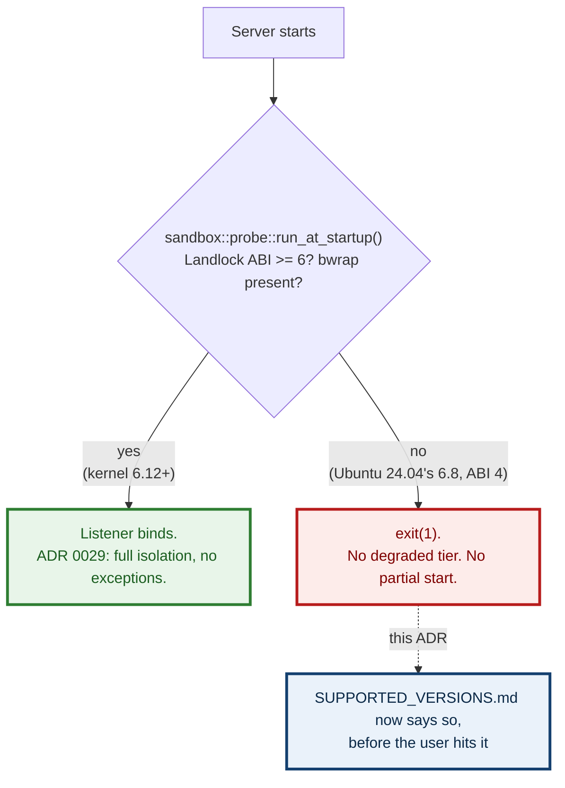

# 0111 — The kernel floor is documented, not renegotiated

- **Status:** Accepted — documentation implemented
- **Date:** 2026-09-03
- **Milestone / issue:** [#620](https://github.com/tom2025b/git-vista/issues/620)
  — the sandbox requires Linux 6.12 (Landlock ABI 6), which no current
  mainstream LTS ships, and it was documented nowhere.
- **Supersedes:** nothing. **Reaffirms** [0029](0029-inv-13-hard-fail-when-the-strict-tier-is-selected-but-unavailable.md)'s
  premise rather than reopening it — see "What this ADR does not do," below.
- **Related:** [0029](0029-inv-13-hard-fail-when-the-strict-tier-is-selected-but-unavailable.md)
  (INV-13: no degraded tier when Strict is unavailable — the decision this
  ADR's cost falls out of); the git-version-floor treatment in
  `docs/SUPPORTED_VERSIONS.md` (the sibling precedent this ADR follows for
  *documenting* a floor, though the enforcement mechanism differs — see
  below).

## Context

`crates/git-vista-server/src/sandbox/mod.rs:175` declares the sandbox's
Landlock floor:

```rust
pub(crate) const LANDLOCK_ABI_FLOOR: u32 = 6;
```

`main.rs:218` gates every server start on it, with no degraded path,
deliberately, per ADR 0029:

```rust
if let Err(refusal) = sandbox::probe::run_at_startup().await {
    eprintln!("error: {refusal}");
    std::process::exit(1);
}
```

Landlock ABI 6 first ships in **Linux 6.12** (November 2024). `#620` measured
a stock Ubuntu 24.04 cloud image on titan directly — `syscall(444, NULL, 0,
1)` — and got `landlock_abi=4` on kernel `6.8.0-138-generic`. So on the
current Ubuntu LTS, supported by Canonical until 2029,
`Capabilities::strict_missing()` returns `["landlock_abi>=6", "bwrap"]`,
`run_at_startup()` returns `Err(CapabilityAbsent)`, and the server exits 1
before executing a byte of repository content.

Nothing was wrong with the code. `docs/SUPPORTED_VERSIONS.md` documented a
git floor and a Safari floor, derived the same way this ADR derives the
kernel one, and said nothing about the kernel at all. A user on the most
common LTS in the world would hit a boot refusal with no way to have known
it was coming.



## The ladder, and what ships it

From the kernel's own Landlock ABI history, plus each distribution's shipped
kernel (only the Ubuntu 24.04 row is directly measured; the rest are derived
from public release notes):

| Landlock ABI | First kernel |
|---|---|
| 2 | 5.19 |
| 3 | 6.2 |
| 4 | 6.7 |
| 5 | 6.10 |
| **6 — this floor** | **6.12** |

| Distribution | GA kernel | ABI | Starts? |
|---|---|---|---|
| Ubuntu 22.04 LTS | 5.15 | 1 | No |
| Debian 12 bookworm | 6.1 | 2 | No |
| RHEL 9 | 5.14 | 1 | No |
| Ubuntu 24.04 LTS | 6.8 | 4 (**measured**) | No |
| Debian 13 trixie | 6.12 | 6 | Yes, exactly at the floor |
| Ubuntu 26.04 | 7.0 | 8 | Yes |

Every current mainstream LTS except Debian 13 fails the probe. This is not a
narrow edge case — it is the common path.

## The decision, exactly as taken

**The kernel floor is a documented requirement, not a bug, and ADR 0029's
premise is not reopened.** A hard-fail sandbox with no degraded tier is only
honest if the host it hard-fails on was foreseeable to the person installing
it. Today it wasn't; that was the actual defect, and it is a documentation
gap, not an argument for a fallback path.

Tom's call (this ADR): **documented requirement**, not a bug to fix by
relaxing INV-13. The remedy for a user on Ubuntu 24.04 is an HWE kernel
(`linux-generic-hwe-24.04`, which is 6.14 on 24.04.3 — clears the floor) plus
`apt install bubblewrap`, and that remedy is now written down.

`docs/SUPPORTED_VERSIONS.md` gains a `## Linux kernel: 6.12 or later` section
alongside the existing git and Safari floors, carrying the ladder and
distribution tables above, the measured Ubuntu 24.04 result, and the HWE
remedy.

## Why this is not enforced the same way the git floor is

`docs/SUPPORTED_VERSIONS.md`'s git floor is a *documented number a CI job
parses and rebuilds* (ADR 0082): the heading is the one source of truth, and
a check fails the build if it drifts from what the code enforces. The kernel
floor does not get that same treatment, and that is a difference in
mechanism, not in rigor:

- The git floor is a version comparison against an installed binary that CI
  can build fresh cheaply (`make` from source, a few minutes).
- The kernel floor is a property of the machine the *server itself* runs on
  — there is no "install a different kernel and test against it" step CI can
  cheaply take, and #620 confirms this cannot even be simulated: a container
  shares the host kernel, so `ubuntu:22.04` under rootless podman on titan
  reports the *host's* Landlock ABI (8), not the guest's. No container can
  ever test this floor.
- `LANDLOCK_ABI_FLOOR` already lives in exactly one place
  (`sandbox/mod.rs:175`), and `run_at_startup()` already enforces it, live,
  on every boot, on the real running kernel — which is a stronger guarantee
  than a CI-time comparison against a number in a doc heading. The gap #620
  found was never "the floor isn't enforced." It was "the floor isn't
  *documented*." This ADR and its doc change close that gap; they do not
  add a second enforcement mechanism, because the existing one is already
  the more direct check.

## What this ADR does not do

- **It does not lower the floor.** ABI 6 stays 6; the reasoning for it
  (`sandbox/mod.rs:172-174`, "the signal and abstract-unix-socket scopes
  this design uses") is unchanged and unexamined here.
- **It does not add a degraded mode.** ADR 0029's INV-13 — hard-fail, no
  exceptions — is reaffirmed, not revisited. A boot refusal on an
  unsupported kernel is *working as designed*; documenting that it will
  happen is the entire scope of this decision.
- **It does not claim HWE-kernel or Debian-13 clearance was independently
  re-measured here.** Both are derived from the ABI ladder and each
  distribution's own published kernel version, consistent with how #620
  scoped its own "not yet measured" section. Only the Ubuntu 24.04 stock
  result is a direct measurement.

## Consequences

- A user reading `docs/SUPPORTED_VERSIONS.md` before installing on Ubuntu
  24.04 now sees the boot refusal coming and the exact remedy, instead of
  meeting `error: CapabilityAbsent` with no context.
- The refusal message itself (`sandbox::probe`'s output) already names what
  is absent; this ADR and the doc change are about the moment *before*
  install, which nothing previously addressed.
- No code changes. No test changes. No new enforcement surface — the
  existing boot-time probe remains the single source of truth, live rather
  than a doc-parsed comparison.
