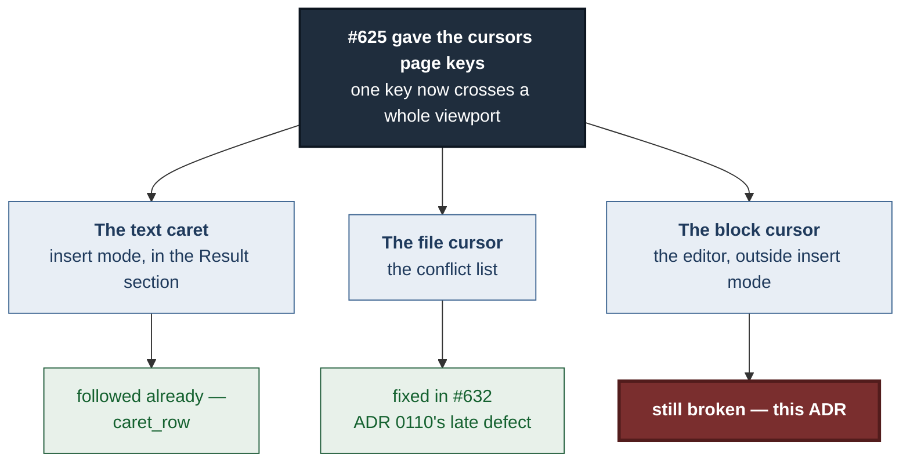
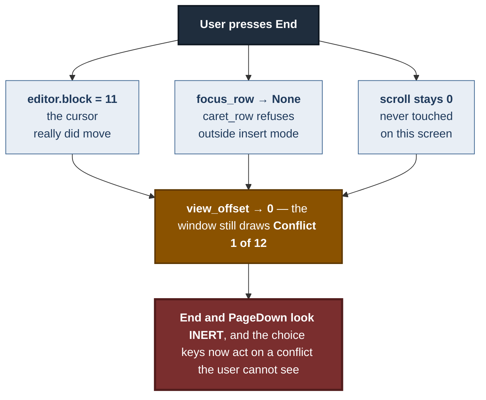
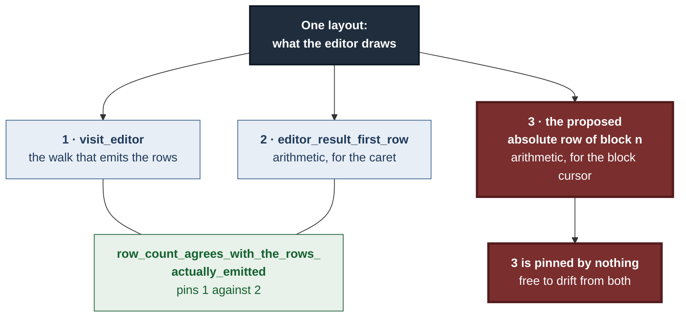
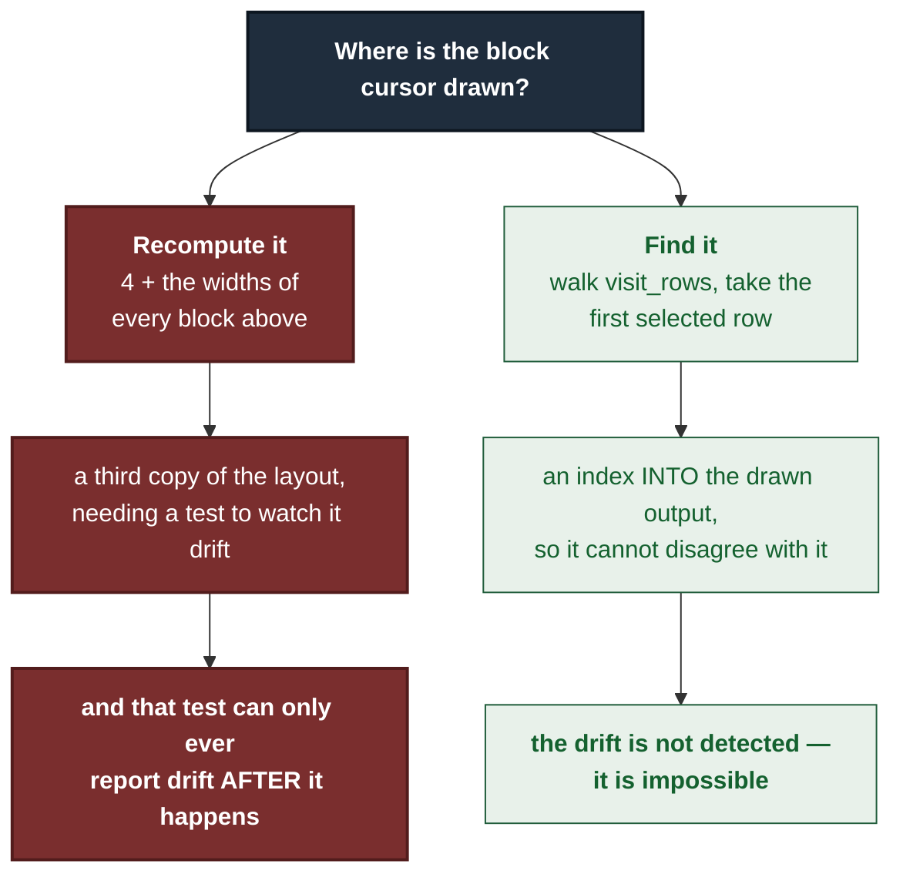
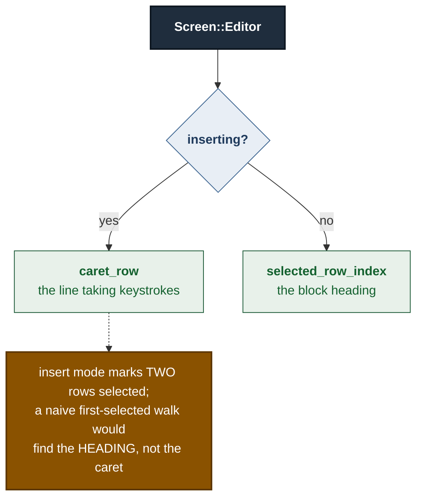
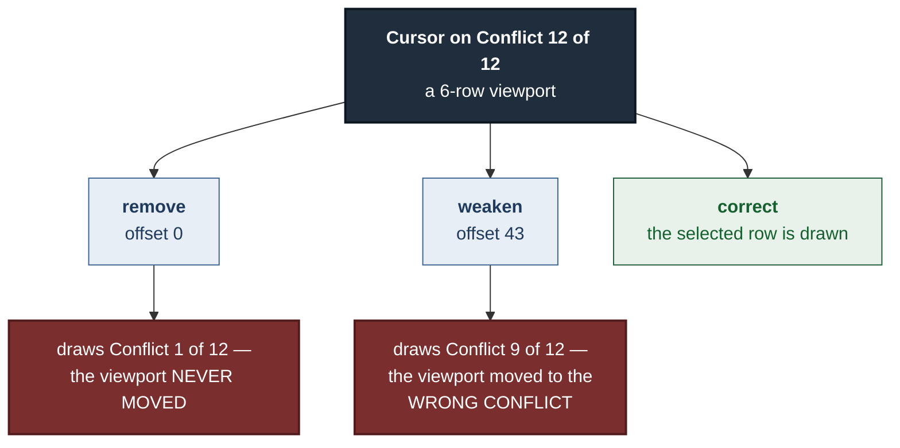

# ADR 0113 — Find the row, do not recompute it

- **Status:** Accepted — implemented, mutation-proved two ways
- **Date:** 2026-09-03
- **Issue:** #634
- **Extends:** [ADR 0110](0110-a-page-is-what-the-frame-just-said-it-was.md)
- **Supersedes / superseded by:** —

## Context

ADR 0110 gave `gv-tui` page keys and a zoom toggle, and established that **a
page is the pane's current visible height**. Making the cursor move further per
keystroke had a consequence nobody wrote down: a cursor that can cross a whole
viewport in one key can leave it.

That hazard has three faces in the conflicts pane, and they were found and
fixed one at a time.



### The defect

On `Screen::Editor` outside insert mode, three facts combined:

- `move_cursor` and `jump` move `editor.block` — and nothing else;
- `focus_row` delegated to `caret_row`, which returns `None` when
  `!editor.inserting`;
- `self.scroll` is `0` on that screen and is never moved there.

So `view_offset` had no focus to follow, returned the unmoved scroll, and in a
file with more conflicts than the overlay is tall the selected block heading
was simply drawn off screen.



The last step is the one that matters. This is not a cosmetic scrolling bug: the
choice keys write a resolution for `editor.block`, so an invisible block cursor
is a way to resolve the wrong conflict — the same class of hazard as an
invisible text caret in a buffer that accepts every keystroke.

### The constraint the issue placed on the fix

The issue explicitly declined to fix this inside #632, and said why. The
obvious fix needs the absolute row of block *n*, which is a **third**
implementation of the editor's row arithmetic:



The comment above `row_count` already asks nobody to add one quietly. The
issue's own acceptance criteria therefore demanded the third copy be pinned by
extending the existing agreement test.

## Decision

**There is no third implementation. `focus_row` finds the row in the output
`visit_rows` already produces.**

`Row` has carried a `selected: bool` since the pane was written — it is how the
renderer draws the highlight. So the row the viewport must not lose is already
marked, in the drawn output, by the one implementation that defines the layout:

```rust
Screen::Editor => self.caret_row().or_else(|| self.selected_row_index()),
```



This is the general principle the ADR is named for, and it applies past this
pane: **when a value can be *read* from the artefact a system already produces,
reading it beats deriving it a second way and testing that the two agree.** A
pinned second implementation is a good answer when there is no artefact to
read. Here there was one.

### The caret still wins where both exist

In insert mode `visit_editor` marks **two** rows selected: the block heading
the cursor is on, and the caret's line down in the Result section. Both are
real. The one the viewport must not lose is the caret — that is the buffer
taking keystrokes — so `caret_row` is asked first and the walk is only a
fallback.



That ordering is why `focus_row` is not simply "the first selected row on any
screen". It is a real decision, and getting it backwards is a live-caret
regression rather than a cosmetic one.

### The cost, and the asymmetry that is left

The walk is O(rows) and runs once per draw, on a screen that already visits
once to build the window. Conflict counts are bounded by what a merge produced;
this is not a hot loop.

`Screen::List` keeps its one-line arithmetic (`1 + cursor`, row 0 being the
heading) rather than walking. That asymmetry is deliberate: the list's
selection is a function of `cursor`, which the list owns, and the expression is
short enough to read against `visit_list` at a glance. The editor's was not —
it was a sum over heterogeneous block widths, which is exactly the kind of
expression that drifts.

## Alternatives considered

**The third arithmetic implementation, pinned by extending the agreement
test** — what the issue asked for. Rejected because the walk makes the pin
unnecessary: a test that watches two implementations agree is strictly worse
than having one. It is the right answer only when the drawn artefact cannot be
consulted.

**Make `Screen::List` walk too, for symmetry.** Rejected for now. It would
replace a one-line expression with a linear scan and buy nothing — the list's
arithmetic has no room to drift. Noted here so the asymmetry reads as a choice
rather than an oversight.

**Move `scroll` when `editor.block` moves**, instead of teaching `view_offset`
to follow. Rejected: it puts viewport policy in the key handlers, where every
future cursor movement has to remember it. ADR 0110 deliberately put the
follow in one place, and `view_offset` is that place.

**Mark only one row selected in insert mode**, so a first-selected walk is
unambiguous. Rejected: both highlights are correct and the user wants to see
both. The ambiguity belongs in `focus_row`'s ordering, not in the renderer.

## Consequences

- `End`, `PageDown`, `Home` and `PageUp` move the visible window on the editor
  screen, and the choice keys can no longer act on a conflict that is off
  screen.
- The editor's row layout has **two** implementations again, not three, and the
  new consumer is derived from the walk rather than added beside it.
- A general rule now has a worked example in this repository: **find it in the
  output, do not recompute it.** Anywhere a system already emits the thing you
  are about to derive, deriving it is a second source of truth.
- All three faces of the #625 paging hazard are now closed.

## Verification

`./dev gate` green: 179 `gv-tui` tests, the workspace suites, clippy,
`cargo fmt --check`, `trunk build`, and 83 browser tests. 7/7 required checks
green in CI on PR #639.

The test builds 12 conflicts separated by context lines into a 6-row viewport,
pages `End` / `PageUp` / `Home` / `PageDown`, and asserts the selected row is
among the rows `window(view_offset(h), h)` returns — **not** that
`editor.block` reached the last index, which would have passed throughout the
defect's life. It also asserts up front that the fixture is taller than the
viewport, so it cannot quietly stop testing anything.

### Mutation matrix

`failure-atlas mutation_check` against committed HEAD `eb72946d`, working tree
reported clean. Both baselines green; both mutated legs reached and failed an
assertion.

| Mutation | Result | How it failed |
|---|---|---|
| **remove**: drop the `.or_else`, leaving exactly the code as it stood | **caught** (195) | offset `0`, window draws "Conflict **1** of 12" |
| **weaken**: replace the walk with the arithmetic the issue proposed, counting four rows per conflict and forgetting the context blocks between them | **caught** (196) | offset `43`, window draws "Conflict **9** of 12" |



They fail **differently**, and the second is the one worth reading. It is
precisely the drift the issue predicted, and it fails while looking entirely
plausible on screen — a highlighted conflict heading, drawn inside the window,
that is simply not the one the cursor is on. A test asserting only that
`editor.block` reached the last index passes against **both** mutations. That
is why the assertion had to be about the rows actually drawn.

---

**Signed:** max · 2026-09-03T23:05:00-04:00
