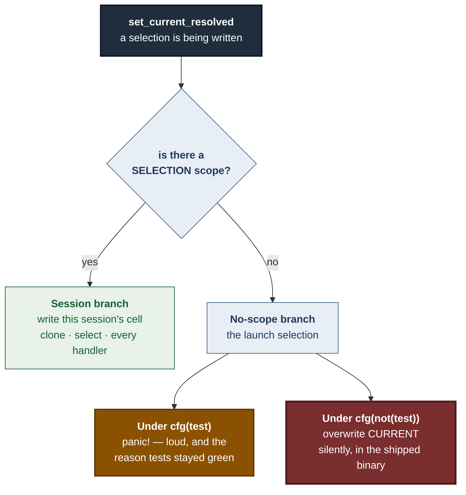
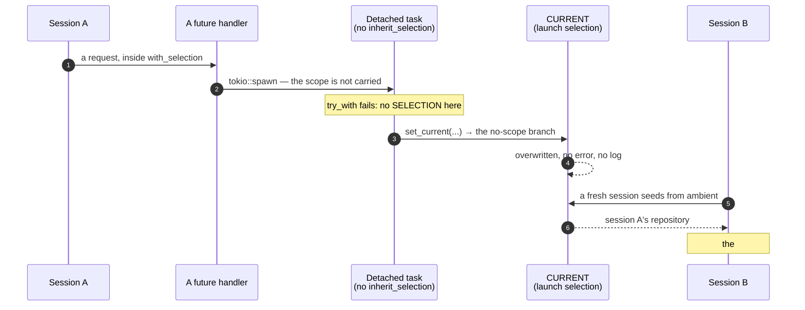
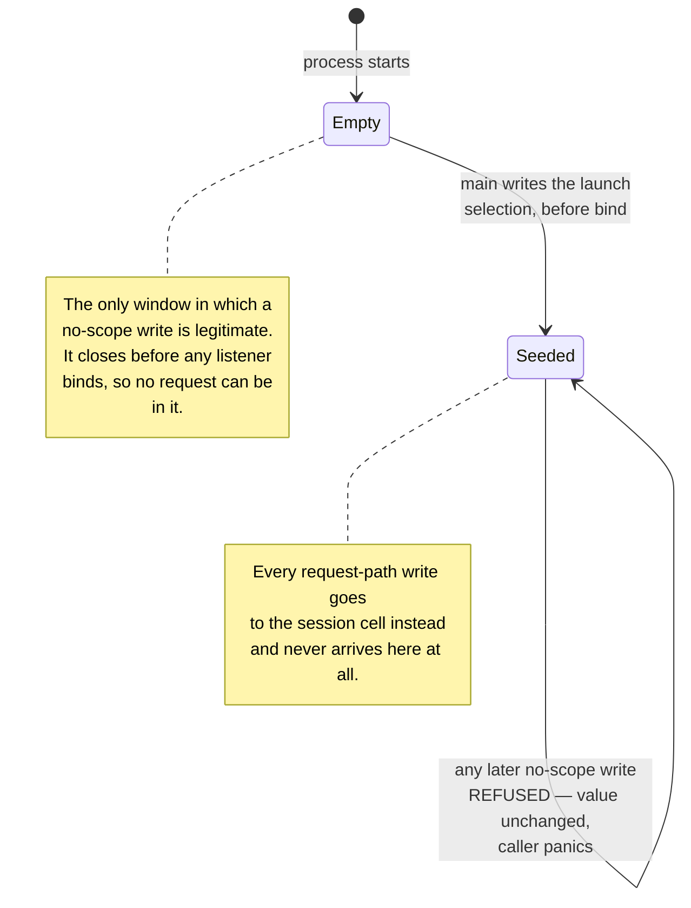
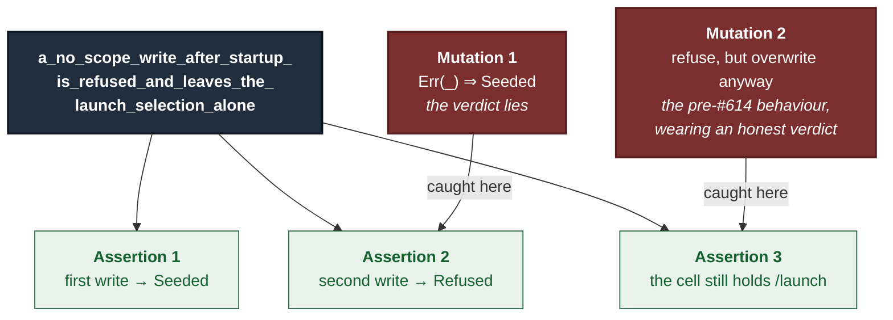

# ADR 0114 — The launch selection is written once, and the lock is what says so

- **Status:** Accepted — implemented, mutation-proved two ways failing differently
- **Date:** 2026-09-03
- **Issue:** #614
- **Extends:** [ADR 0103](0103-the-selection-belongs-to-the-session-not-the-process.md)
- **Supersedes / superseded by:** —

## Context

[ADR 0103](0103-the-selection-belongs-to-the-session-not-the-process.md) moved
the selected repository out of the process and into the session. `CURRENT`
survived as the **launch selection**: the repository the operator started the
server on, written once by `main` before any listener binds, so a fresh session
begins somewhere defined instead of inheriting whatever the last person picked.

A commissioned adversarial audit of that work — grok, reading #588 / PR #609
fresh, because #609 had been reviewed entirely inside one model family — agreed
the boundary holds and then named the part that was not nailed down.

**The guarantee was a fact about the call graph, not a property of the code.**

```rust
// state.rs — set_current_resolved, before this ADR
    // No scope: this is startup writing the launch selection.
    #[cfg(test)]
    panic!("tests that select a repository must use with_isolated_test_current");
    #[cfg(not(test))]
    if let Some(lock) = CURRENT.get() {
        *lock.write().expect("CURRENT lock not poisoned") = value;   // overwrites
    } else { … }
```

Three writers exist. Startup runs before bind and is legitimate. `POST
/api/clone` and `POST /api/select` both run inside `with_selection`, so they
take the session branch and never reach the code above. Nothing in production
reached the overwrite — **today**.



The red box is the whole issue. A future handler that spawned a task without
[`inherit_selection`](0103-the-selection-belongs-to-the-session-not-the-process.md)
and called `set_current` would land in it, write the process-global in
production, and silently restore exactly the cross-session leak #588 was filed
to remove.

**And every test would still pass**, because under `cfg(test)` that path
panics instead of running. The one guard that would have caught the regression
did not exist in the artifact that ships.



This is the failure mode this repository keeps meeting, and the one its rules
are written against: **correct today, silent when it stops being correct.**

## Decision

Refuse a no-scope write at runtime, in the release path, and let the
`OnceLock` be the thing that refuses.

The issue named three candidate shapes and left the choice open. This ADR takes
the third — its "at minimum" — deliberately and only that:

```rust
fn write_launch_selection(cell: &OnceLock<RwLock<Current>>, value: Current) -> LaunchWrite {
    match cell.set(RwLock::new(value)) {
        Ok(()) => LaunchWrite::Seeded,
        Err(_) => LaunchWrite::Refused,
    }
}
```

**The rule worth enforcing is "a no-scope write is legitimate only before
bind", and that is the same statement as "only the first one".** `CURRENT` was
already a `OnceLock`. Never reopening it for writing turns the invariant into
something the type enforces on its own — not a comment, not a habit, and not a
`BOUND` flag that some future entry point forgets to set.



The test-time panic **stays**. It is a better message for the case it covers —
a test author who forgot `with_isolated_test_current` — and the two guards
cover different populations: the harness catches test authors, the release
refusal catches a future handler. Replacing one with the other would have
traded a real guarantee for a tidier function.

The panic on refusal is how the caller finds out. `set_current` and
`select_registered` both report success to their handler, so a write refused
in silence would be the same quiet failure in a new place. A panic in a request
task fails that one connection; no session's selection has moved, because the
lock refused the write before the panic was reached.

### Alternatives considered

| Option | Why not |
|---|---|
| **A newtype/guard making the no-scope write unrepresentable** (the issue's option 1) | The strongest answer, and genuinely better in the long run: a writer must present a token proving it is inside a selection scope, so the bad call does not compile. It also touches every writer and its signature, which is a larger change than a guarantee that can be closed completely inside one function. Left available — nothing here forecloses it |
| **A structural test enumerating `set_current_resolved`'s callers** (option 2) | In the same family as `every_registered_route_is_classified`, and cheap. But it constrains the *source text* of today's call graph, not the behaviour: a caller reached through a trait object, a macro, or a helper one level down satisfies the enumeration and still reaches the branch. It guards the shape of the thing rather than the thing |
| **A `BOUND` flag set by `main` after binding** | The literal reading of "never legitimate after bind", and worse in practice. It needs a second entry point to remember it forever, it is settable from anywhere, and it leaves a race: two concurrent no-scope writers can both observe the flag unset. `OnceLock::set` closes that window atomically, and the loser of a seed race is refused for the same reason a post-bind writer is — which is the correct answer for both |
| **Refuse silently, log to stderr** | Refuses the write and reports success to the handler above. That is the defect class this repository files issues about, not a fix for one |

## How it is proven

The `#[cfg(test)]` panic is a problem for testing the release path: under
`cfg(test)` a scopeless write panics *before* reaching the release code, so a
test driving `set_current_resolved` would prove the harness works and say
nothing about the shipped binary.

So the test drives `write_launch_selection` — the release branch itself,
compiled in both configurations — against **its own** `OnceLock`. Its own for
the same reason the harness exists at all: writing the real `CURRENT` from a
test is the defect, not the test for it.



Both `caught`, from clean baselines, at `08bbe965`:

| Mutation | Fails at | Verdict |
|---|---|---|
| `Err(_) => LaunchWrite::Seeded` | assertion 2 — `left: Seeded, right: Refused` | caught |
| refusal branch overwrites the cell before returning `Refused` | assertion 3 — `left: "/hijacked", right: "/launch"` | caught |

**Two mutations, failing at different assertions, is the point.** Mutation 1
alone would prove only that the test reads the return value. Mutation 2 is the
one that matters: it is precisely the behaviour this ADR removes, reporting the
correct verdict while quietly keeping the defect — and assertion 3 is the only
thing in the test that can see it.

## Consequences

- **The launch selection is now write-once in the shipped binary**, not by
  convention. A future handler that spawns without `inherit_selection` and
  writes a selection now fails loudly on the connection that did it, instead of
  succeeding and leaking across sessions.
- **A concurrent seed race has a defined loser.** Previously two no-scope
  writers could both observe an empty cell; now exactly one seeds and the other
  is refused, which is the honest answer rather than last-write-wins.
- **`main` is unchanged.** The enforcement needs nothing from the startup path,
  so there is no new obligation for a future entry point to honour.
- **The stronger guard is still open.** Option 1's type-level version remains
  the better end state; this closes the hole without spending that change, and
  removes nothing it would need.
- **ADR 0103's index row is corrected.** It recorded this guarantee as open on
  #614; that half is now closed, and the row says so.

---

**Signed:** max · 2026-09-03T22:58:00-04:00
