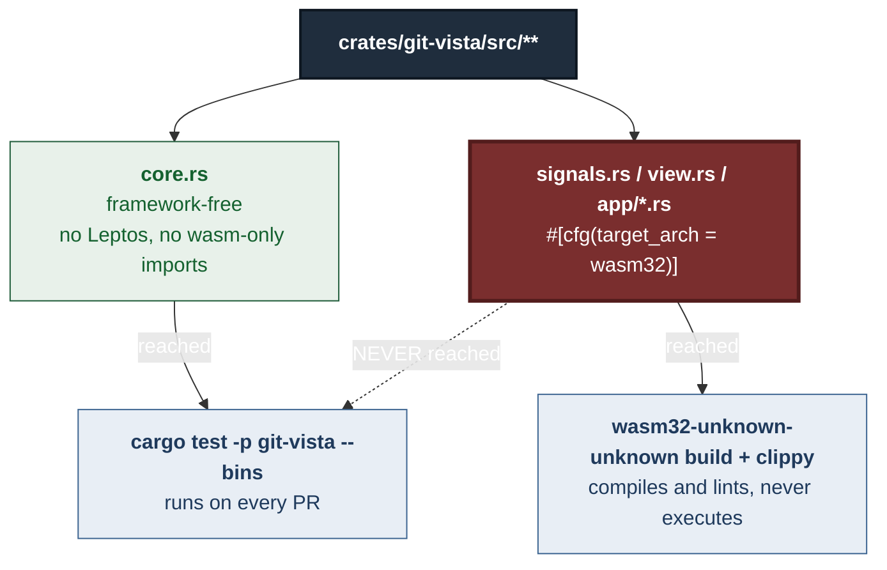

# ADR 0115 — A mutation proof cannot see what it does not run

- **Status:** Accepted — implemented, mutation-proved two ways per invariant (19/19 across three PRs)
- **Date:** 2026-09-04
- **Issue:** #612
- **Extends:** —
- **Supersedes / superseded by:** —

## Context

`crates/git-vista/src/**` splits into `core.rs` files (framework-free, host-
tested) and `signals.rs` / `view.rs` / `app/*.rs` files gated
`#[cfg(target_arch = "wasm32")]`. That split is deliberate and old — every
`features/*/mod.rs` states it, and it is the shape M1.11's design spec (D1)
asked for.

The gap is what CI does with the wasm-only half. It compiles the crate for
`wasm32-unknown-unknown` with Trunk. It runs clippy against it. It does
neither of those things badly. What it does not do, and cannot be made to do
without a browser test runner this repo does not have, is **execute** a single
line inside a `#[cfg(target_arch = "wasm32")]` module. `cargo test -p
git-vista --bins` — the host suite, the one that runs on every PR — never
touches that code at all.

So a decision placed in a wasm-only module is compiled, linted, and
unprovable by construction. Not untested by oversight — untestable by the
toolchain, on this repository, as configured. A census taken against three
sibling issues (#515, #518, #594) found several such decisions sitting
exactly there, each one already having caused or nearly caused a real defect.
This ADR is the record of moving three of them and what moving them found.



## Decision

Move decision logic out of wasm-only modules into a sibling `core.rs`, one
seam at a time, keyed off a census rather than a sweep. Each move:

1. Extracts the decision into a pure function in `core.rs`.
2. Replaces the wasm-only call site with a call to that function — never a
   silent re-derivation.
3. Host-tests the function directly, including the specific invariant that
   was previously unprovable.
4. Pins the wasm-only call site itself with a source-level census
   (`include_str!` over the wasm-only file, the same technique
   `features::a11y::audit` already used for markup no host test can mount),
   so a later change that re-inlines the decision goes red even though it
   cannot be reached by execution.
5. Mutation-proves the new function two ways, failing on **different**
   assertions — not two mutations that happen to redden the same test, which
   is one mutation reported twice.

Three seams moved this way, in order:

| PR | Issue rank | What moved | Host tests |
|---|---|---|---|
| [#640](https://github.com/tom2025b/git-vista/pull/640) | — | `StashNotice::from_write`/`from_pop`, `DrawerBusy` (#515, #518) | 773 → 781 |
| [#642](https://github.com/tom2025b/git-vista/pull/642) | #2 | `send()`'s `OperationKind → endpoint` table, `persist_if_remote_op`, the reattach budget rule | 773 → 784 |
| [#645](https://github.com/tom2025b/git-vista/pull/645) | #3, #4 | `app/mod.rs`'s `HistoryPhase` + its three transition rules; `dialogs/confirm.rs`'s preview composition | 792 → 814 |

### #640 — the stash notice and busy map

`StashNotice::from_write`/`from_pop` and `DrawerBusy` were pure types living
in `features/stash/signals.rs`, wasm-only for no reason but placement — moving
them cost a `pub use` re-export, nothing else. What that move made testable
was #515's rule (a lost write reply may only claim `Unknown`, never a
success or a refusal it never observed) and #518's rule (the busy map is
keyed on the entry's OID, not its selector, so two writes racing on
selectors that momentarily collide cannot unlock each other's row). Both had
been *review findings*, per the originating census — found by a person
reading the diff, not by a test, because no test could reach them.

### #642 — the write-routing table

This is the literal shape of #594: `send()` matched on `OperationKind` and
called a different `api::` function per arm, entirely inside
`features/operations/signals.rs`. A variant swapped for its type-compatible
sibling — `DiscardTrackedPaths` routed to `delete_untracked_paths_request`,
say — compiles clean and sends the wrong git command, with no test able to
see it happen. `write_route` now owns that table in `core.rs`, and
`sends_dispatch_matches_the_route_table`'s census pairs each `OperationKind`
arm in `signals.rs` with the `api::` call that follows it **in source
order**, because counting method names proves nothing when both names appear
in the file regardless of which arm reaches which. Two more decisions moved
alongside it because they were small once the module was open: the
`InFlightRemoteOp` persistence mapping (round-trip-proved against
`core`'s own reverse mapping) and the #218-adjacent reattach-budget rule,
which turned out to be two genuinely different triggers sharing one
`Settlement` value — unified into `lost_contact_settlement()`, kept
structurally distinct as `reattach_step`.

### #645 — the history phase and the sharpest finding of the three

`app/mod.rs`'s `HistoryPhase` and the three effects that move it
(`phase_for_epoch_bump`, `promote_seed`, `seed_retry_still_wanted`) moved the
same way as the other two. The finding worth stating plainly is in
`dialogs/confirm.rs`, and it is the instance #612's own issue body names.

`preview_subject` (in `features::dialogs::core`) and `previewable` (in
`features::preview::core`) were **both already** framework-free and
host-tested before this ADR. #594 gave them a two-way mutation proof — one
mutation removing the variant discrimination, one weakening the default arm
— and both came back `caught`. The proof's own report said "both caught."

That report was true and it was not enough. The line that **composed** the
two functions —

```rust
match previewable(preview_subject(&op)) {
    Some(operation) => preview.start(operation),
    None => preview.clear(),
}
```

— lived in `dialogs/confirm.rs`, wasm-only, unreached by the host suite the
mutation proof ran against. Swap the two arms of that `match`, or drop the
`None` case, and every existing test — including both #594 mutations —
stays green. **A mutation proof over two correctly-tested functions is not a
proof of the code that composes them, and "both caught" is a report about
the functions, not about the wire connecting them to anything a person
actually sees.**

`preview_action` now makes that composition inside `features::preview::core`,
returning a two-armed `PreviewAction` (`Start` / `Clear`) rather than a
`bool`, because collapsing "no dialog is open" and "this dialog has no
picture" onto the same instruction was itself part of the decision, not
incidental to it. `confirm.rs` is reduced to plugging the two arms in, and
`the_confirm_dialog_does_not_have_the_two_arms_the_wrong_way_round` reads
`confirm.rs` back as text and pairs each `PreviewAction` arm with the
**first** `preview.` call that follows it in source order — the same
counting problem #642's route-table census solved, for the same reason.

One regression surfaced while building this seam, caught by a guard already
in the repo rather than by anything written for this ADR: an early draft
passed `preview_subject` to `.map()` as a function value, and
`reachability_census` failed immediately — a function reachable only as a
value has no statement-shaped call site and reads as dead code. The fix was
spelling the call explicitly in both arms of the caller's `match`. This is
recorded because it is evidence for the enforcement decision below, not
because it was hard to fix.

## Enforcement — what actually catches the next one

The issue asks, in substance, "what stops this from happening again." Three
options were on the table.

**Not a clippy lint.** Clippy lints syntax and types. "This value is a
decision the rest of the app depends on" is neither. A wasm-only module is
*saturated* with functions that are pure by signature — every `#[component]`
body, every markup-composing helper, every closure passed to `create_effect`.
A lint keyed on "pure function in a `#[cfg(target_arch = "wasm32")]`
module" would fire on nearly everything in `dialogs/`, `menu.rs`, and
`render/`, and a lint tuned down until it stopped would have stopped firing
on the case that mattered too. The same argument kills "grep wasm-only
modules for pure functions" as a standalone mechanism — it is the same
lint, run by hand.

**What is already working, and should be leaned on rather than rebuilt:**
`reachability_census`. It did not exist for this ADR; it caught this ADR's
own regression anyway, because "a core function with no real call site" is a
mechanically checkable fact in a way "this logic is a decision" is not.
Every seam moved in this ADR kept its host-tested function reachable
*because* that census would have failed otherwise. That is real leverage
and it is already paid for.

**What is worth building, honestly scoped:** an inventory, not a verdict. A
new host test enumerates the `#[cfg(target_arch = "wasm32")]` module list
(from `main.rs`'s and each `features/*/mod.rs`'s `#[cfg]` declarations) and
the set of `include_str!` targets across the existing wasm-only-reading host
tests (`a11y::audit`, `offline_guard_audit`, and the per-seam censuses this
ADR adds), then asserts every wasm-only module over some line-count floor
has at least one host test reading it. This does not check that the
*right* decisions moved, or that a moved decision is *correctly* pinned —
it checks that nobody has been forgotten, the way #612's original census
had to be built by hand once. Making it a standing, always-current test
turns a one-time manual audit into a fact that rots loudly instead of
silently.

**What does the actual enforcing** is neither of those. It is the
per-seam census this ADR's three PRs each wrote: a specific `include_str!`
reading a specific wasm-only file, asserting a specific call is made in a
specific arm. That is not a mechanism installable once — it is a habit,
written at the moment a decision moves, argued in the module's own doc
comment the way `features::preview::core`'s doc on `DialogSubject` now
argues why the vocabulary stays narrow. `features/mod.rs`'s header states
the `core.rs`/`signals.rs` split; a line naming this expectation belongs
there too, so the next person moving a seam finds the pattern instead of
reinventing it.

The honest summary: the inventory test enforces **visibility** — that a gap
cannot go unnoticed the way #612's did. It does not enforce
**correctness** — that requires the per-seam census, written by a person who
understands the specific decision, every time.

## Alternatives considered

- **A wasm test runner** (`wasm-pack test --headless`, or similar) would let
  the host suite genuinely execute wasm-only code and remove the need for
  text-census workarounds entirely. Rejected for this ADR: it is
  infrastructure, not a decision, sized well past what three move-slices
  warrant, and the existing browser-driven Playwright suite already covers
  some of the same ground at the DOM level (imperfectly — see #623/#629 on
  that suite's own reliability). Worth its own issue if the pattern in this
  ADR keeps recurring past the modules already named.
- **Move everything wasm-only can reach into core, unconditionally.** Rejected
  as a category error: markup composition, DOM event wiring, and
  `create_effect` closures that only sequence signal reads/writes are not
  decisions — moving them buys nothing and would bloat `core.rs` files with
  code that has no invariant to pin. The census-driven, one-seam-at-a-time
  approach exists specifically to separate "this is a decision" from "this
  merely runs in a wasm-only file."
- **A single shared mutation-proof harness across all three seams** was
  considered and rejected: each seam's invariants are different enough
  (an epoch-comparison guard, a route table, a composed `Option` chain) that
  a shared harness would either under-specify or force an abstraction with
  one real caller — the anti-pattern this repo's own CLAUDE.md style already
  warns against.

## Consequences

- Host test count for `git-vista` moved 773 → 814 across the three PRs, with
  zero behaviour change in any of them — every move was re-export-and-call,
  never re-derive.
- `reachability_census` and the per-seam text censuses are now load-bearing
  in a way they were not designed to be for this issue specifically; a
  future refactor that deletes a census comment without reading why it
  exists reintroduces exactly the gap this ADR closes.
- The inventory test described above is **not yet built**. It is scoped as
  the next piece of work under #612, tracked separately from this ADR.
- `canvas.rs`'s 409 handler still sets `HistoryPhase::DriftReloading`
  directly, in wasm-only code. #645's own census
  (`every_phase_the_shell_can_set_comes_from_a_decision_this_file_makes`)
  names this gap in its own assertion message rather than implying the move
  is complete. It is not disqualifying — `DriftReloading`'s only content is
  which epoch it is reloading into, not a branching decision — but it is
  the one variant this ADR's move did not fully close, and a future slice
  should either move it or record why it is exempt, the way #515/#518's
  `signals.rs` docstring records what still lives there and why.
