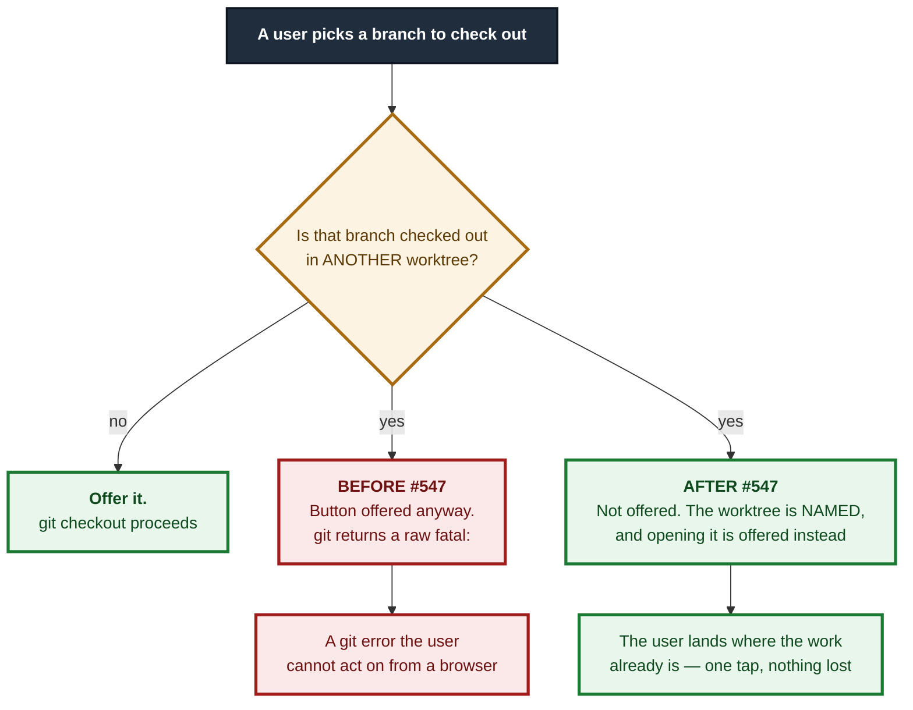
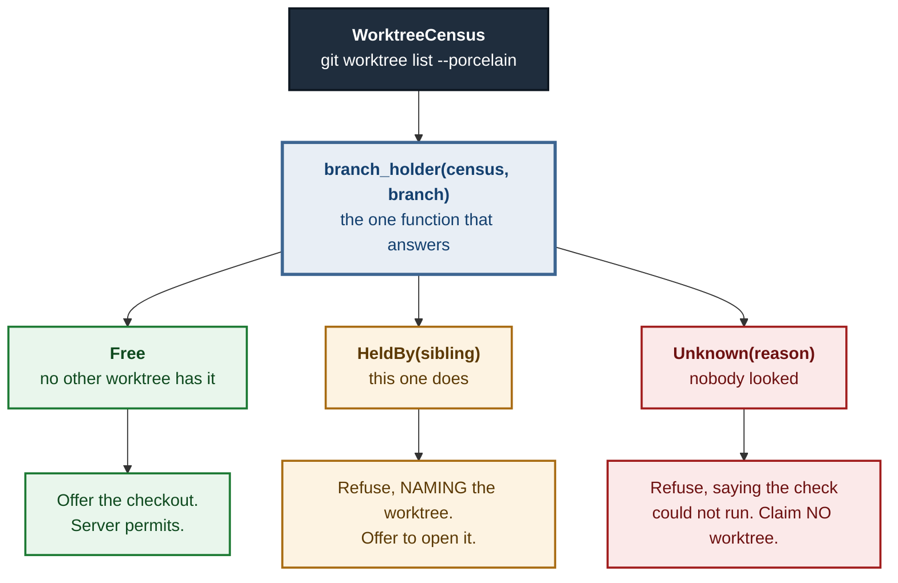

# ADR 0116 — A branch is open at one desk, and that is a fact about the repository

- **Status:** Accepted — implemented, mutation-proved two ways failing at different assertions
- **Date:** 2026-09-04
- **Issue:** #547 (M11.02)
- **Extends:** [ADR 0091](0091-effects-are-derived-not-declared.md) (the exhaustive
  fact-to-sentence mapping this variant had to face) · [ADR 0092](0092-a-refused-sibling-is-listed-not-dropped.md)
  and [ADR 0115](0115-a-mutation-proof-cannot-see-what-it-does-not-run.md) · builds on
  M11.01's worktree census (#546)
- **Supersedes / superseded by:** —

## Context

Git refuses to check out a branch that is already checked out in another
linked worktree:

```text
fatal: 'feature/x' is already used by worktree at '/home/tom/projects/gv-547'
```

It is not advisory and it is not a flag you can pass away. The refusal is also
**correct**: two worktrees on one branch would let the same branch move
underneath itself from two directions, which is exactly the "work gets lost"
failure M11 exists to prevent.

The application did not know the rule. `CheckoutBranch` offered the button, ran
the command, and surfaced that `fatal:` — a dead end in a browser, where there
is no terminal to act on it. This is the pattern the codebase has been
correcting for weeks: **an operation offered on the strength of a check that
was never made.**



## Decision

### 1. The rule is a `Precondition`, attached by the planner and enforced by the server

`Precondition::BranchFreeInEveryOtherWorktree { branch }` joins the existing
closed vocabulary — which is itself the test of whether the feature belongs in
this design. `shape()` attaches it to **every** `CheckoutBranch` plan, and
`enforce_fresh` re-verifies it against a fresh census immediately before
executing.

**It is a fact about the repository, not about the UI's mood.** A client that
offers the button anyway is *refused*, not obeyed. The UI declining to offer it
is a courtesy on top; the acceptance test for this drives
`plan_and_execute_in` directly, with no frontend in the call stack.

Re-verifying at execution is not ceremony: a worktree that takes the branch
*between* planning and executing becomes a refused race rather than a raw
`fatal:`.

### 2. The evaluation is three-valued, and the third value is not `false`

The answer comes from M11.01's `WorktreeCensus`, which is itself fallible.
`git_vista_protocol::branch_holder` is the **single** function that turns a
census into an answer about a branch — shared by the server's verification and
by the UI's decision to offer, so the path that *offers* an operation and the
path that *permits* it cannot disagree.



`CensusFailed` arrives as `BranchHolder::Unknown` and **never** as `Free`. An
unread enumeration contains no conflicting checkout, so "no conflict found" and
"nobody looked" are the same bytes unless a type keeps them apart.

Two consequences that are easy to get backwards:

- **`refuses_when_unmet_at_build` returns `true` for this precondition**, even
  though git *does* refuse. That function's narrow question — "if this is false
  and we run the executor anyway, does the executor refuse?" — gets the right
  answer for the wrong reason here. `false` would mean the user meets git's
  dead end, which is the whole defect; and `false` would also send a *failed
  census* to the executor, because `held_now` collapses "could not check" into
  the same `false` as "genuinely held". The gate is the only place that can
  keep those apart.
- **`Observed::census` defaults to `CensusFailed`, not to an empty
  `Observed`,** for every operation that does not need one. A future operation
  that acquires this precondition without acquiring its census then refuses
  rather than silently passing.

### 3. The refusal names the desk, and offers a next step

"Already checked out somewhere" is the same dead end with the one actionable
word removed, and is explicitly not acceptable. `collision_refusal` is the one
composer both gates go through, and what it offers depends on the census's own
`Serviceable` answer — never on a flattened boolean:

| holder | offered | why |
|---|---|---|
| `Serviceable::Yes` | **Open that worktree** | the app may serve it, so the offer is one the server will honour |
| `OutsideAllowedRoots` | named; "switch to it in a terminal" | it blocks the checkout (git's refusal does not consult this app's fence) but selecting it is refused — visibility must never widen the mutation boundary |
| `Missing` | named; "`git worktree prune` releases it" | the directory is gone, the administrative entry is not, and git keeps refusing until someone prunes |

### 4. The UI decides with the same function, and the button's label and effect are one decision

`GET /api/worktrees` exposes the census once (full-routes only: it discloses
directory base names, and absolute paths when the operator opted in — that is
filesystem shape, not published history). The checkout menu item reads it on
click, exactly as it already reads HEAD, and `CheckoutElsewhere::classify`
turns the `Result` into the same three states — a transport failure and a
`CensusFailed` both landing on `Unknown`.

`checkout_confirm_prompt` and `checkout_confirm_action` are pure and
host-tested, and are paired by
`the_offered_button_and_the_action_it_runs_agree`: a label maintained in one
function and an effect in another is how a dialog comes to promise one thing
and do another. Following ADR 0115, both live where `cargo test` runs them —
`dialogs/confirm.rs` only plugs their answers in.

Opening the holder reuses the session's current mode and **never escalates**
it; an unknown mode falls back to `Visualize`. A refused checkout must not be a
route to acquiring Active mode.

## Alternatives considered

- **Let git refuse and relay the message.** This is the status quo, and the
  message is unactionable in a browser. Rejected.
- **Say "already checked out somewhere".** The issue rules this out by name,
  and it is right to: it is strictly worse than the `fatal:` because it drops
  the one word that helps.
- **Derive a narrow `is-this-branch-free?` endpoint** instead of exposing the
  census. Rejected: two derivations of the same fact is precisely the
  offer/permit divergence the M11 spec forbids, and M11.03's list UI would then
  be a third.
- **Carry the holding worktree in the `Precondition` itself.** Rejected: a
  precondition is a condition to be *checked*, not an observation. Which
  worktree holds a branch can change between plan build and execution, and
  folding it into the operation's hash would make a plan stale for a reason the
  plan does not control. The refusal names the worktree because the *server*
  has the census in hand at that moment.

## Consequences

- The protocol gains a `Precondition` variant. Every exhaustive match had to
  state its position: Explain Mode's sentence, the TUI's review row, the MCP's
  agent-facing line, the plan export's checklist, and the
  `refuses_when_unmet_at_build` census (now `{RemoteConfigured,
  BranchFreeInEveryOtherWorktree}`, renamed and re-argued rather than widened
  quietly).
- `worktree_census` acquires its first production callers, so its
  `#[allow(dead_code)]` is gone. Its fence parameter gained `+ Sync` — the
  planner's pipeline runs inside a `tokio::spawn`, and a bare `&dyn Fn` makes
  that future non-`Send`.
- One extra `git worktree list --porcelain` per checkout plan and per checkout
  execution. No other operation pays for it: `needs_worktree_census` is read by
  both observation paths, so they cannot drift into building with a census and
  enforcing without one.
- **A `CensusFailed` now blocks a checkout that git might have allowed.** This
  is deliberate and is the fail-closed direction, but it is a real behaviour
  change on a host where `git worktree list` cannot run.

## Mutation proof

Two arms, both `caught`, failing at **different assertions**:

| arm | mutation | assertion red |
|---|---|---|
| remove the precondition from the plan | delete the `preconditions.push(...)` in `shape()`'s `CheckoutBranch` arm | `the_plan_for_a_checkout_states_the_collision_precondition` — and the pipeline then reproduces the original defect verbatim: `400` carrying `fatal: 'feature/x' is already used by worktree at '…/desk-two'` |
| weaken the server's check | `refuses_when_unmet_at_build` returns `false` for this precondition | `the_refusal_names_the_worktree_and_says_what_to_do_about_it` — a test the first arm leaves green |

A third arm proves the wasm seam's own test is not inert: dropping the
`return;` from the "Open Worktree" redirect in `confirm.rs` — so confirming a
held branch would select the other worktree **and then also run the checkout
git is certain to refuse**, under a button labelled "Open Worktree" — is caught
by `the_open_worktree_redirect_returns_instead_of_also_dispatching`. Both
statements are in the file either way; only their order distinguishes the two,
which is why the test compares positions rather than counting occurrences.

**The second arm found a defect in the test suite, not in the code.** With the
gate weakened, git's own `fatal:` reaches the client — and that string
*contains both the worktree name and the branch name*. The naming test, as
first written, asserted only `body.contains("desk-two")`, and therefore
**passed on precisely the dead end the feature exists to replace**: structurally
complete, semantically inert, and it would have shipped looking green. It now
also asserts the two things git's `fatal:` cannot carry — the rule stated in
words, and a next step. That is the difference between a name and an answer,
and it is why one mutation is never a proof.
