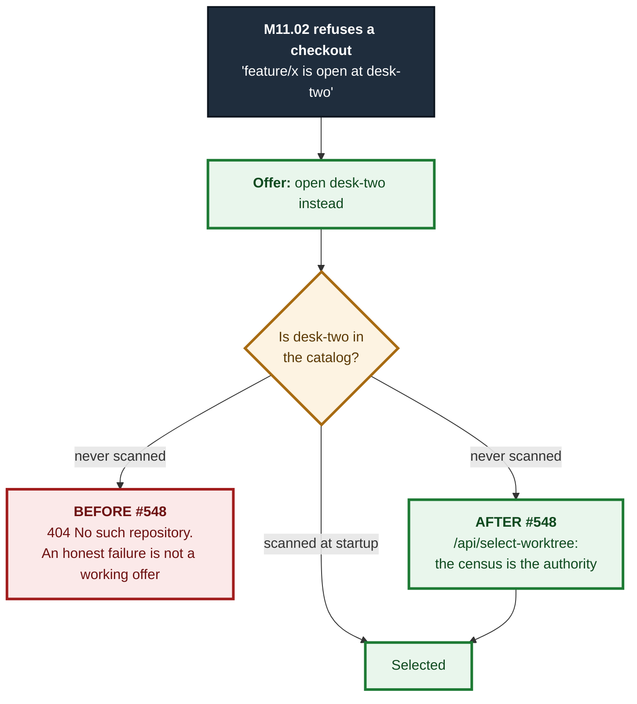
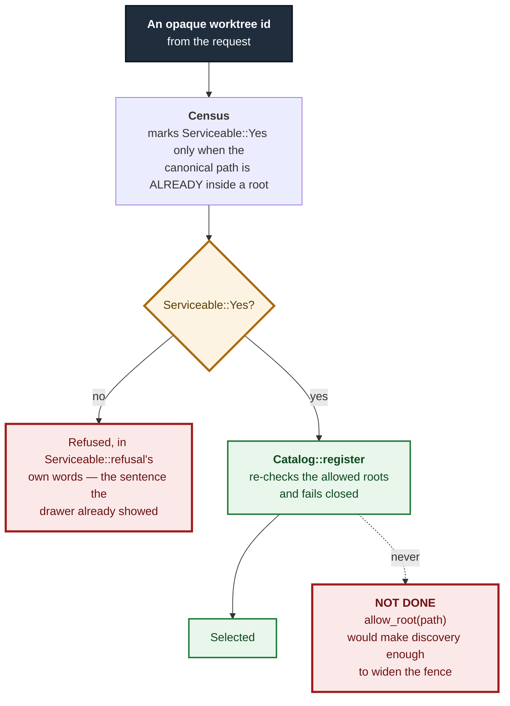

# ADR 0117 — A discovered desk needs a door, and the door does not move the fence

- **Status:** Accepted — implemented, mutation-proved three ways failing at disjoint assertions, browser-verified
- **Date:** 2026-09-04
- **Issue:** #548 (M11.03)
- **Extends:** [ADR 0116](0116-a-branch-is-a-fact-about-the-repository-not-the-uis-mood.md) (whose refusal this turns into a route) · [ADR 0092](0092-a-refused-sibling-is-listed-not-dropped.md) · [ADR 0115](0115-a-mutation-proof-cannot-see-what-it-does-not-run.md)
- **Supersedes / superseded by:** —

## Context

M11.02 taught the app to refuse a checkout git would reject and to *name the
worktree holding the branch*. That sentence was a route with nowhere to go.
`POST /api/select` resolves ids through the catalog and answers `404` for
anything it does not already hold — and a linked worktree nobody ever scanned
is not in it. So the "open that worktree instead" offer failed on a perfectly
serviceable desk. #651's own PR body named the gap and deferred it here.

## Decision

### 1. A second door, because the two routes differ in what authorises an id

`/api/select`'s fail-closed `404` is correct and is **not** changed. Teaching
it to fall back to a filesystem walk would turn an unknown id from "refused,
nothing happened" into "scan the disk and see" — a security-relevant loosening
of a well-tested route, applied to every caller of it.

| route | authority | unknown id |
|---|---|---|
| `/api/select` | the catalog | `404`, and nothing is scanned |
| `/api/select-worktree` | a fresh census of the **served** repository | `404` unless that census names it |

The catalog is still asked **first**, so the common case on this machine — where
the repo-root scan already registered every worktree under `~/projects` — costs
no subprocess and reuses the existing path verbatim.

### 2. The fence is enforced twice, and admitting never widens it

This is the decision the ADR exists for.

`register_explicit` allows a root and *then* registers under it, which is right
for a path an operator named on the command line. Doing the same for a
discovered worktree would make "git listed this directory" sufficient to widen
the fence — and `git worktree add` would become a way to make this app serve any
directory on the filesystem. That is the second of the three options
`docs/superpowers/specs/m3.23-worktrees.md` §1 weighs, and the one it rejects.

So `register_discovered_worktree` calls `Catalog::register` and **deliberately
does not call `allow_root`**:

**The guarantee is an omission, and an omission has no runtime signature.**
Adding `allow_root` makes the app serve *more*, never less: no behavioural test
goes red, nothing looks wrong, and the fence is gone. It is therefore pinned by
reading the source — `admitting_a_discovered_worktree_never_widens_the_allowed_roots`
— with a paired positive asserting that the `register` it calls is still the one
that refuses an outside path.

### 2a. `expose_paths: true` on the internal census — what it does and does not disclose

The handler takes its census with `expose_paths: true` because registration
takes a path and the handler has to have one. The question that makes that
acceptable is narrower than "is anything disclosed": it is **does census output
need redacting before it reaches a client?** Answered honestly, in two halves,
because the two halves have different answers.

**On the success path, no.** An `Observed` census's `WorktreeSibling::path` is
read locally and never serialized: this handler answers with a status and a
sentence it composes itself, and no sibling row reaches the response. So
`expose_paths: true` here discloses nothing that the operator's
`GIT_VISTA_EXPOSE_PATHS` opt-in would otherwise have withheld.

**On the failure path, yes — and this ADR previously said otherwise.** A
`WorktreeCensus::CensusFailed { reason }` is answered as `Couldn't read this
repository's worktrees, so nothing was selected: {reason}`, and those reasons
are built in `worktree_census` from porcelain output and `common_dir.display()`.
That is an absolute path in a response body. The original sentence here —
*"nothing from that census is serialized to the client"* — was true of
`Observed` and false of `CensusFailed`, and it was stated as though it covered
both (found by Grok, round 6, finding 4).

Two facts bound the size of that, and neither excuses the wrong sentence:

- It is **not introduced by this route.** `GET /api/worktrees` (M11.01, #546)
  already returns `CensusFailed.reason` verbatim, and does so **with
  `expose_paths` off** — the failure arm never consulted the flag.
- The audience is an authenticated session on the loopback-only router, and the
  paths are the operator's own.

**So the real defect is a contract one, not a leak to a stranger:**
`GIT_VISTA_EXPOSE_PATHS` is the control whose stated guarantee is that absolute
paths do not leave the process unless the operator opts in, and the census's
failure arm makes that guarantee untrue as stated. A control that is right on
the path everyone tests and wrong on the path nobody does is the shape worth
naming.

**This ADR deliberately does not fix it**, because the fix is a real trade-off
and belongs to whoever weighs it rather than to a slice about something else. A
`CensusFailed` reason is *how you find out why enumeration failed*; redacting
paths out of it costs exactly the diagnosability it exists for. The two shapes
worth considering — strip paths from the reason, or split it into a client-safe
summary plus a server-only detail — are a change to M11.01's wire contract, not
to this route. Recorded here so the next reader inherits the accurate sentence
and the open question together.

### 3. Three facts on a row, and they stay three

`locked`/`prunable`/`bare` are **git's**. `Serviceable` is **this
application's**. The offer is derived from both. #548 names the collapse as a
failure condition, and the sharpest consequence is concrete: a locked worktree
inside the allowed roots is still openable — locking only stops `git worktree
remove`/`prune` — so one "unusable" badge would make that row unopenable for a
reason nobody holds.

They render through `.act-pill.act-terminal` and `.act-pill.act-app`, an
existing pair whose documented meaning is already *"done outside git-vista"*
versus *"done through it"*. Reusing it gives two visibly different colours with
no new CSS rule, no new `:focus-visible` twin, and no new `INTERACTIVE_CENSUS`
row. The browser leg asserts the two **computed colours** differ, not only the
class names — two classes resolving to the same colour would satisfy a
structural check and fail the criterion.

### 4. A refusal is text, and the text has one source

`Serviceable::refusal` lives in the protocol crate and is used by **both** the
server's `409` and the drawer's row. Two copies would let the drawer promise
one thing and the server say another about the identical row — and the drawer's
copy is the one a user reads while deciding whether to tap at all.

It is rendered as a paragraph, never `title=`: #65's finding is that a
tooltip-only reason never surfaces on a tap and is never announced. The stash
drawer beside this one *does* use `title=`, so "follow the neighbouring file"
would have reintroduced the defect; the view's own doc says so, and a source
census asserts the refused arm carries no `title=`.

## Alternatives considered

- **Widen `/api/select` to fall back to a census.** Rejected: it changes what an
  unknown id means for every existing caller, and the fail-closed `404` is a
  tested security property.
- **Register every discovered sibling during the census.** Rejected: the census
  is a *read*, called from the planner on every checkout plan. A read with a
  registration side effect is a different thing wearing a read's name.
- **Hide the desks this app cannot open.** Rejected by the spec, and it would
  also make the drawer disagree with M11.02's collision check, which counts
  every worktree git counts.
- **Grey the refused rows out.** This is the failure the milestone exists to
  correct: a disabled control with no explanation teaches nothing.
- **A new `Overlay` variant for the drawer.** Rejected: the stash drawer's
  precedent — a section of the Activity panel — needs no new overlay vocabulary,
  no new dock rule, and no new CSS.

## Consequences

- One new POST route, classified in `ROUTE_AUTHZ` (`SessionAndCsrf`) and in the
  planner's write-route census as a **catalog write, not a git write** — it
  mints no plan and touches no ref, so it has no funnel row.
- `Serviceable` gains user-facing text, so the protocol crate now owns a
  sentence the browser suite asserts on. That is deliberate: the alternative is
  the same sentence in two crates.
- The drawer refetches on the graph epoch and only while the Activity panel is
  open, so a closed panel costs nothing.
- **The browser leg is not optional here and was not treated as such.** #547
  shipped with its dialog path unexecuted, flagged honestly in its PR body. This
  feature is a real drawer, so it gets five real browser tests — including the
  end-to-end switch to a desk the catalog never held, which is the only place
  the gap this ADR closes can actually be observed closing.

## Mutation proof

Three arms, all `caught`, at **disjoint** assertions in two crates:

| arm | mutation | assertion red |
|---|---|---|
| hide what we cannot open | `drawer_view` filters out non-serviceable siblings | `every_sibling_is_listed_including_the_ones_the_app_refuses` — `["here","desk-two"]` vs `["here","desk-two","outside","ghost"]` |
| widen the fence | `register_discovered_worktree` calls `allow_root` before registering | `admitting_a_discovered_worktree_never_widens_the_allowed_roots` — a different crate, and the only arm any of these tests can catch, because the defect makes the app serve *more* |
| one badge for both | `app_fact` collapses the two refusals to `"unusable"` and reports `FactSource::Git` | `the_three_app_verdicts_are_three_different_sentences` — `["can open","unusable","unusable"]`, plus `a_locked_worktree_inside_the_roots_is_still_openable` |

The second arm is the one worth restating. It is a pure widening: every
behavioural test in this repository still passes under it, the app still works,
and every worktree still opens. Only a test that reads the source can see it,
which is why the guarantee is written down as an omission and checked as one.
