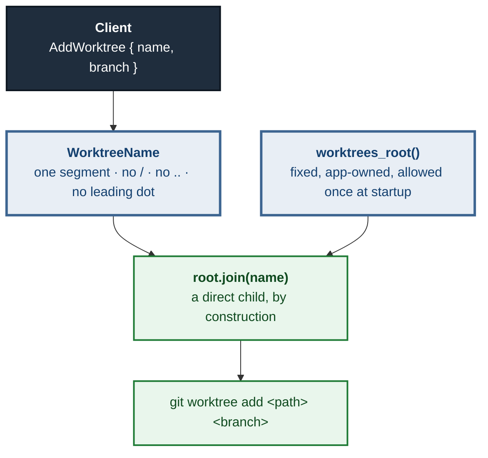

# ADR 0118 — A new desk is named, not located, and it is built in a root the app owns

- **Status:** Accepted — path policy decided; implementation follows in #549
- **Date:** 2026-09-04
- **Issue:** #549 (M11.04), answering `docs/superpowers/specs/m3.23-worktrees.md` **open question 2**
- **Extends:** ADR 0117 (*"A discovered desk needs a door…"* — lands with #548 / PR #654, still open at the time of writing, so the link is deliberately omitted rather than left to 404) · [ADR 0008](0008-persistent-clones-xdg.md) (the managed root this mirrors)
- **Supersedes / superseded by:** —

## Context

`AddWorktree` is the first operation in M11 that **creates a directory**. Every
other worktree operation so far has read (`git worktree list`) or selected
(`/api/select-worktree`). Creating one raises a question none of them did:

> **Where does the new directory go, and who chooses the location?**

The spec left this open deliberately, and Tom answered it on the issue:
**a managed root**, the way clones already work.

This ADR records that decision, the argument for the alternative — which was
real, and is Tom's own working habit — and one thing the decision forces that
the spec's own sketch got wrong.

## Decision

### 1. New worktrees live under a root the app owns

`worktrees_root()` mirrors `clones_root()` exactly (ADR 0008): an env override,
else `$XDG_DATA_HOME/git-vista/worktrees`, else
`~/.local/share/git-vista/worktrees`. It is created at startup, admitted to the
allowed roots **once**, and scanned like the clones root is.

The property that decides it, in Tom's words on the issue:

> A managed root is inside the fence **by construction**. A sibling directory
> has to be checked against the fence every time a path is picked, and "checked
> every time" is the kind of rule that holds until one code path forgets it.

### 2. The operation carries a **name**, not a path

The spec sketches:

```rust
AddWorktree { path: PathBuf, branch: BranchName },
```

**That shape cannot ship here, and the managed root is why.** If the client
supplies a path, then "is it inside the managed root?" becomes a check — and the
whole point of the managed root is to have no check to forget. It also
contradicts an invariant this codebase already holds everywhere else: request
bodies do not carry paths. `SelectRequest`'s own doc says so
(*"like every request body this cannot carry a path"*), `WorktreePathsRequest`
validates each element into a `WorktreePath` that can never be absolute and can
never carry `..`, and `/api/delete-clone` addresses a directory by opaque id
rather than by location.

So the operation is:

```rust
AddWorktree { name: WorktreeName, branch: BranchName },
```

`WorktreeName` is a validated newtype in the protocol crate — **a single path
segment**: no separator, no `..`, no leading dot, not empty, length-bounded. The
server computes the location itself:

```rust
worktrees_root().join(name.as_str())
```

A single segment joined to a fixed root can only ever produce a direct child of
that root. Containment stops being something the code checks and becomes
something the types cannot express otherwise.



### 3. The load-bearing omission: creating a desk never widens the fence

ADR 0117 established that admitting a *discovered* worktree must not call
`allow_root`. The same rule applies here, and the temptation is stronger,
because here the directory genuinely is new and "it doesn't work until you
allow it" is a plausible-looking bug report.

It already works. The **root** is allowed once, at startup, as a constant of the
installation; every child of it is therefore already inside the fence. Adding
`allow_root(new_path)` per created worktree would grow the allowlist by one
entry per creation, and each entry would outlive the directory it was added
for — so a name that ever escaped validation would leave a permanently admitted
root behind it.

Allowing the **root** and allowing a **request-derived path** look similar and
are not:

| what is allowed | when | derived from |
|---|---|---|
| `worktrees_root()` | once, at startup | the installation's configuration |
| `clones_root()` | once, at startup (and on first clone) | the installation's configuration |
| a created worktree's directory | **never** | would be a request |
| a discovered worktree's directory | **never** (ADR 0117) | would be a census |

## Alternatives considered

### The sibling-directory convention — declined, but it was a real candidate

Tom's own habit is visible in his machine's worktree list: `Git-Vista-336-wt`,
`Git-Vista-codex-379`, `Git-Vista-testbed-8081` — a sibling directory next to
the main repo, named for the issue. The arguments for following it are genuine
and should not be flattened:

- **It matches what he already does.** A tool that puts things where its user
  already looks for them is friendlier than one that invents a location.
- **The path is predictable and typeable.** He can `cd` to it without asking the
  app where it went.
- **It needs no new root** to configure, to back up, or to explain.
- **On his machine it would already be inside the fence**, because
  `~/projects` is the configured repo root — so a sibling is a child of an
  allowed root and would be discovered and registered by the existing scan for
  free. That is a real advantage, and it is exactly the gap ADR 0117 had to
  build a route to close.

It is declined because **that last advantage is a property of one machine's
configuration, not of the design** — and this is measurable rather than
hypothetical. The browser harness registers repositories explicitly through
`GIT_VISTA_REPOS`, which allows each repository's *own* path as a root and
nothing above it. #548's fixture places a worktree beside its repository under
exactly that configuration, and the census resolves it
`Serviceable::OutsideAllowedRoots` — asserted in CI, in
`worktree-drawer.spec.mjs`, where the app shows the fence sentence and refuses
to open it.

So the sibling convention produces a worktree the app cannot open, on an
ordinary supported configuration, and the app would have created it itself. The
fix would be to check containment at every path-picking site and fall back when
it fails — which is precisely the "checked every time" rule Tom's answer names
as the thing that holds until one code path forgets it.

**What is lost, stated plainly:** the created worktree will not be where Tom's
muscle memory expects, and this ADR does not pretend that costs nothing. Two
things soften it and neither is a promise this ADR makes on behalf of a later
one: the drawer (#548) shows every worktree with its branch, and shows the
absolute path when `GIT_VISTA_EXPOSE_PATHS` is set; and nothing here stops a
future issue from adding an operator-configured root, since the location is
already one function.

### A client-supplied path validated against the root — declined

The shape the spec sketched, with a containment check on arrival. It is not
unsafe if the check is right; it is declined because it makes the safety a
property of a check rather than of the construction, and because it would be the
only request body in this codebase that carries a filesystem path. The failure
mode is the ordinary one for canonicalisation checks — symlinks, `..` in an
encoding the validator did not consider, TOCTOU between check and use — and the
named form has none of them to get wrong.

### Not building `AddWorktree` at all — considered, and rejected as premature to reject

The spec's open question 1 notes that M11.01–03 delivers most of the value with
no path policy at all, and that closing this as "not planned" is legitimate.
That remains true. It is not taken, because the decision that blocked it has now
been made and the remaining work is small — but the argument is recorded so a
later reader knows it was weighed rather than overlooked.

## Consequences

- One new managed root appears on disk. Like the clones root it is created
  lazily and is empty on a fresh install.
- `AddWorktree` is `RiskLevel::Safe` with `RecoveryStrategy::NotNeeded`: it
  creates a directory and a metadata file, moves no ref, and destroys nothing.
  git itself refuses if the branch is already checked out elsewhere — the
  precondition ADR 0116 added states that rule to the UI first.
- Worktrees created here are discovered by the census like any other, and
  resolve `Serviceable::Yes` because the root is allowed — so #548's drawer
  lists and opens them with no new code.
- The three effect classifiers in `git-vista-protocol/src/effects.rs` gain an
  arm each (the compiler forces this, ADR 0091), and `tests/explain_parity.rs`'s
  independent table gains its row. Both are required: the parity table is what
  keeps the derived half from being unpinned.
- **A `WorktreeName` that fails validation is refused before any path exists.**
  The refusal is the server's, not the picker's, and is tested as such.
- **No UI ships with this slice, deliberately.** The natural home for a "new
  desk" control is #548's drawer, which is still in review — building a second
  one here would mean duplicating it and then deleting one. This follows the
  staging M11.01 already used: the primitive and its wire type land and are
  reviewed first, with no route into the UI yet. The browser suite is therefore
  unchanged by this slice, and its number is stated in the PR as evidence of
  that rather than as evidence of new coverage.
