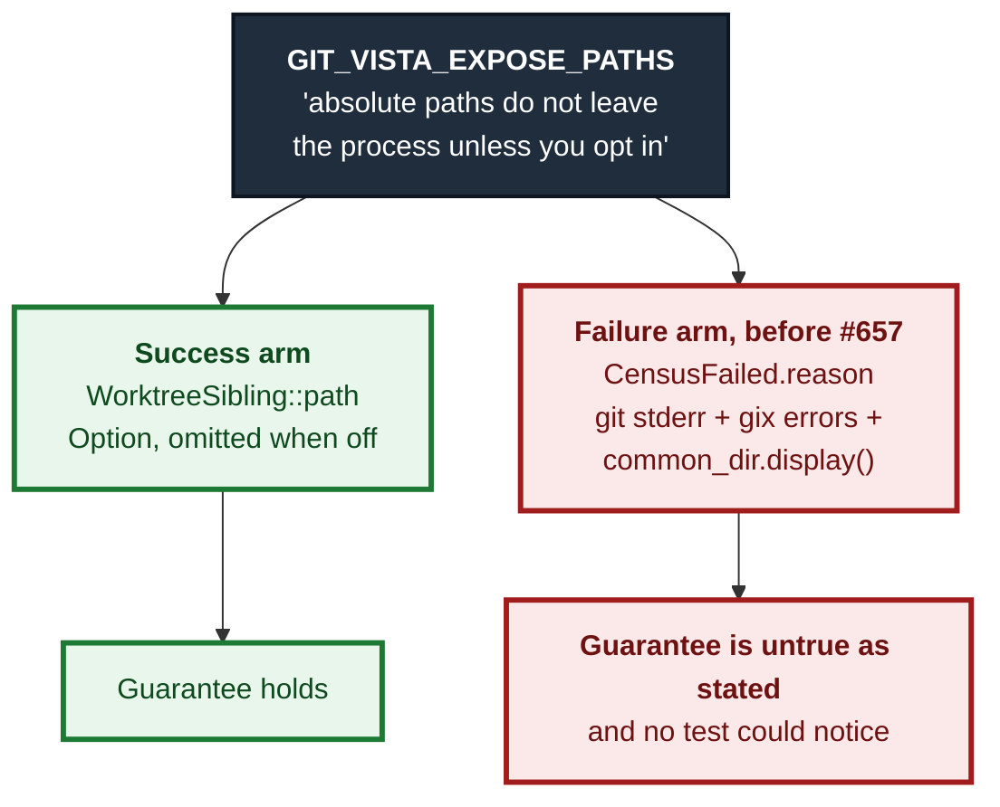
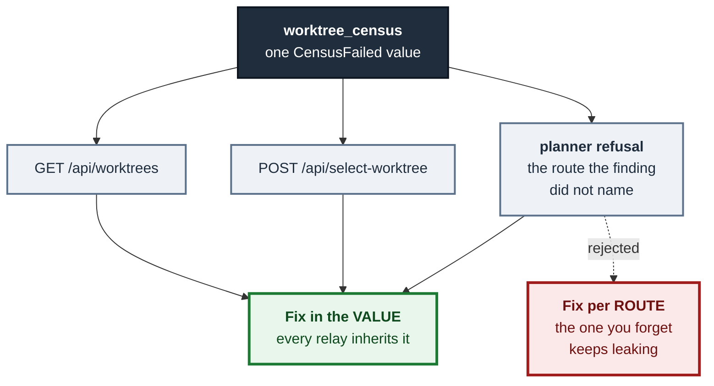
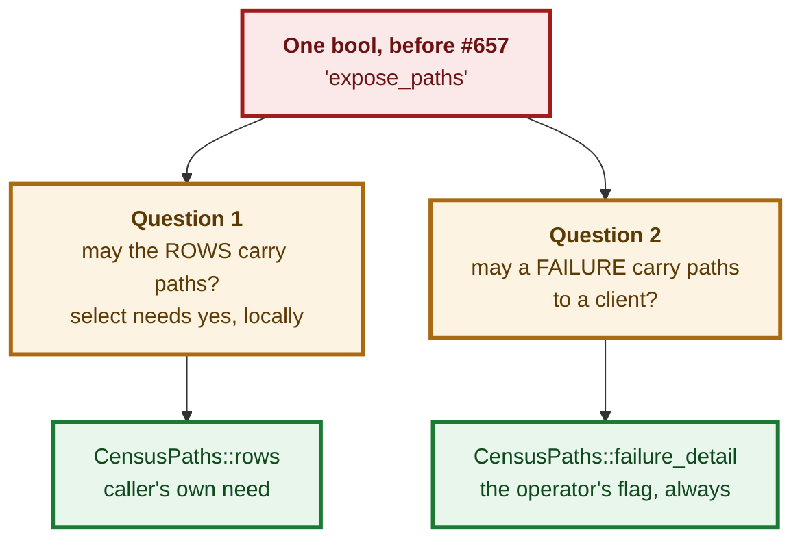

# ADR 0119 — A guarantee that holds only on the success arm is not a guarantee

- **Status:** Accepted — implemented, mutation-proved two ways failing at disjoint assertions
- **Date:** 2026-09-05
- **Issue:** #657 (follow-up to #546, M11.01)
- **Extends:** [ADR 0092](0092-a-refused-sibling-is-listed-not-dropped.md) (the census type) · [ADR 0003](0003-repository-catalog.md) (`GIT_VISTA_EXPOSE_PATHS`)
- **Supersedes / superseded by:** supersedes [ADR 0117](0117-a-discovered-desk-needs-a-door-and-the-door-does-not-move-the-fence.md) §2a on the failure arm only

## Context

`GIT_VISTA_EXPOSE_PATHS` is this application's one control over absolute-path
disclosure. Its stated guarantee, since ADR 0003, is that absolute paths do not
leave the process unless the operator opts in. `WorktreeSibling::path` honours
it: `Option<String>`, filled by `expose_paths.then(…)`, omitted from the wire
entirely when withheld.

`WorktreeCensus::CensusFailed { reason }` did not. Its reason was built from
git's stderr, from `gix` errors, from `parse_worktree_porcelain`'s complaints
and from `common_dir.display()` — all of which name absolute paths — and it was
serialized verbatim, **with the flag off**.

So the control was right on the arm every test exercises and absent from the
arm none of them do. That is the finding (Grok, review round 6, finding 4, on
PR #654), and it is a contract defect rather than a leak to a stranger: the
audience is an authenticated session on a loopback-only router and the paths are
the operator's own. What is actually broken is that a stated guarantee was not
true as stated.



### Three routes, not two

The issue named two routes that hand a `CensusFailed` reason to a client.
There are three, and the third is why the fix could not live in a route:

| route | how the reason reaches a client |
|---|---|
| `GET /api/worktrees` | `handlers::read` serializes the whole `WorktreeCensus` |
| `POST /api/select-worktree` | `handlers::select` answers `…so nothing was selected: {reason}` |
| **any plan carrying `BranchFreeInEveryOtherWorktree`** | `branch_holder` → `BranchHolder::Unknown(reason)` → `planner::couldnt_run` / `collision_refusal` |

A fourth source was found while fixing it: `parse_worktree_porcelain`'s own
errors quote the porcelain line they choked on, and a `worktree` line **is** an
absolute path. Neither the issue nor the review enumerated that one.

Two facts follow. First, redacting at each route is fail-open by omission — the
route nobody thought of keeps leaking. Second, a list of known path-bearing
message sites is not a fix, because the list was already incomplete twice.



## Decision

### 1. Split the field, rather than redact the string or document the behaviour as intended

`CensusFailed` carries two fields:

```rust
CensusFailed {
    /// Always client-safe.
    reason: String,
    /// Path-bearing. `None` unless the operator opted in.
    #[serde(skip_serializing_if = "Option::is_none", default)]
    detail: Option<String>,
}
```

The invariant a client may rely on, and the one the golden fixture now pins:
**`reason` is byte-identical whether or not the operator opted in.** The flag
adds `detail`; it never rewrites `reason`. A client matching on the reason
string must not see a different message because of a server-side environment
variable.

The three options the issue put up, and why this one:

| option | what it costs |
|---|---|
| **Redact the reason at source** | Cheapest, one chokepoint — and it costs exactly the diagnosability `CensusFailed` exists to provide. `WorktreeCensus` is three-valued (ADR 0092) *so that* "I could not read the list" is a reportable answer; a reason stripped to "something went wrong" walks that back, and the person losing it is the operator debugging their own machine |
| **Split the field** (chosen) | A wire change to a type two routes and a golden fixture pin, plus every construction site restated. Bought: the guarantee becomes true, and the diagnostic survives for whoever opted in |
| **Document the behaviour as intended** | Defensible on the audience argument alone. Rejected because the *other* two arms of this same control were not written that way — a control that means one thing for `WorktreeSibling::path` and the opposite for `CensusFailed.reason` is worse than either rule applied consistently |

### 2. Nothing is destroyed; the flag only withholds

`Failure::into_census` writes the full detail to the server's own log
unconditionally, before deciding what to serialize.
`GIT_VISTA_EXPOSE_PATHS` governs what leaves the process **for a client**, and
the operator's own terminal is not a client. So an operator who never sets the
flag still has every byte of every failure — in the place they were already
looking.

This is what makes option 1's cost avoidable rather than merely traded away.

```mermaid
stateDiagram-v2
    [*] --> Raised: a census step fails
    Raised --> Logged: eprintln! full detail<br/>(unconditional)
    Logged --> Withheld: flag off
    Logged --> Disclosed: flag on
    Withheld --> [*]: reason only
    Disclosed --> [*]: reason + detail

    note right of Logged
        The log is not gated.
        The flag withholds from a
        client; it never destroys.
    end note
```



### 3. The composition rule, stated so a future construction site cannot get it wrong

`reason` is built **only** from literals this module writes plus values from a
closed set proven path-free: counts, byte ceilings, ref names, and base names
(the same non-path label `WorktreeSibling::name` already carries on the success
arm). Any string that arrived from git, from `gix`, or from
`parse_worktree_porcelain` is `detail` — without exception, and *without
inspecting it first*.

The "without inspecting it first" is the load-bearing half. Whether a
particular error names a path is not a property this module can check, and
guessing per-message is how the incomplete list happened twice already. One
admitted exception, stated so it does not read as an oversight: validation
errors from `git-vista-protocol` (`BranchName::new`, `CommitOid::new`) are
safe, because that crate is wasm-safe and has no filesystem access at all — it
cannot have learned a path to name.

A companion helper enforces the base-name half. `display_name`'s fallback for a
path with no final component **is the whole path**, so a `reason` built on it
would degrade into leaking exactly when the path is strangest. `safe_label`
degrades into saying less instead (`"an unnamed worktree"`), and a unit test
pins the difference between the two.

### 4. `CensusPaths` — one boolean was answering two questions

The conflation is the root of the finding, not an incidental detail of it.
`handlers::select` takes its census with paths on **for its own local use**: it
must hand a path to `Catalog::register`, and its `Observed` rows are never
serialized (ADR 0117 §2). Under a single `expose_paths: bool`, that local need
also decided whether a *failure* published its paths to a client.

So the parameter is now a two-field type with two named constructors:

| constructor | rows carry paths | failure detail serialized |
|---|---|---|
| `CensusPaths::from_flag(expose_paths)` | the operator's flag | the operator's flag |
| `CensusPaths::rows_for_local_use(expose_paths)` | **always** | the operator's flag |

Two adjacent `bool` parameters would swap silently. Two named constructors
cannot, and the type is where the distinction is explained.



### 5. `handlers::select` relays `reason` and never `detail`

That route answers plain text, not JSON, so appending `detail` would be the one
place the flag could be bypassed by accident — a text body has no field a client
can choose not to read. An operator who wants the path has the server log and
`GET /api/worktrees`, both of which honour the flag properly.

## Consequences

- **`GIT_VISTA_EXPOSE_PATHS` now means the same thing on both arms of the
  census**, which is the whole point. `docs/SECURITY_MODEL.md`'s bullet says so
  explicitly rather than being read as covering it.
- **A wire change.** `census_failed` gains an optional `detail`, and the golden
  fixture pins both shapes — withheld and present — for the same reason it
  already pins `path` present and absent: `skip_serializing_if` means an
  optional field silently becoming always-present is invisible to a Rust round
  trip and is still a real change to a client's `"detail" in obj`.
- **The drawer carries `detail` through to the view.** Dropping it in
  `DrawerView::Unreadable` would have made the opt-in buy the operator nothing
  where they actually look.
- **Diagnosability is reduced for an operator who has not opted in** — honestly,
  and this is the cost, not a claim that there is none. A parse failure now says
  "printed something this app could not parse" rather than quoting the line.
  The mitigation is real but is a *different* place: the server log has the
  whole thing, unconditionally.
- **Every new failure site in `worktree_census` must now choose a half.**
  `Failure::safe` versus `Failure::detailed` is a decision the type forces at
  construction; there is no way to add a message without making it.

## Verification

- Four census-level tests drive real failures in a `tempfile::tempdir` and
  assert against **that run's actual absolute path**, not a pattern that could
  match by accident: the flag-off/flag-on pair, the `rows_for_local_use`
  conflation specifically, the `current_count != 1` guard (count stays, root
  moves), and a live-but-unreadable sibling named by base name.
- Each has its paired positive with the flag on, so none can pass by the census
  having become unable to produce a detail at all.
- `safe_label` versus `display_name` on `/` is pinned as a unit test.
- Protocol-level: `detail` omitted-not-null on the wire, and
  `BranchHolder::Unknown` proven to relay `reason` and not `detail` — the third
  route, tested where it is decided.
