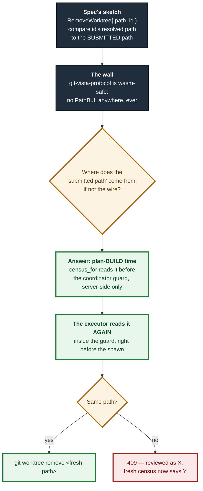

# ADR 0120 — A closed desk is proved twice, and never once on the wire

- **Status:** Accepted — implemented, mutation-proved (three arms run; two overlapped, a third found the genuinely disjoint second way), all caught
- **Date:** 2026-09-05
- **Issue:** #550 (M11.05)
- **Extends:** [ADR 0117](0117-a-discovered-desk-needs-a-door-and-the-door-does-not-move-the-fence.md) (the census and the fence this reads) · [ADR 0119](0119-a-guarantee-that-holds-only-on-the-success-arm-is-not-a-guarantee.md) (`CensusPaths`, which this is the second caller of)
- **Supersedes / superseded by:** —

## Context

M11.03 gave the drawer a door in (`/api/select-worktree`). #550 asks for the
door out: `git worktree remove <path>`, addressed the same way — an opaque
census id, never a path a client names. The design spec sketched the
operation as `RemoveWorktree { path: PathBuf, id: WorktreeId }` and stated the
rule in one sentence:

> The stable `id` is the mutation authority. Under the repository guard,
> immediately before executing: take a fresh census, resolve `id` to its
> current path, and refuse unless that path equals the submitted path. Then
> remove by the resolved path — never by the submitted one.

That sentence assumes a client submits a path to compare against. Nothing in
this codebase's wire contract may — `git-vista-protocol` is wasm-safe and
carries no filesystem type at all, the same constraint that had already cut
`AddWorktree`'s own `path` field (#549, ADR 0118). This issue's base commit
predated #549's merge (its PR, #656, was read as reference only and depended
on as nothing while it was still open); #549 landed on `main` mid-session and
this branch was rebased onto it, which is also where the sandbox grant helper
below got its expected deduplication. So the sentence has to be implemented
without ever putting a path on the wire, and the "submitted path"
it describes has to come from somewhere else.



## Decision

### 1. `GitOperation::RemoveWorktree` carries `id` only

```rust
RemoveWorktree { id: WorktreeSiblingId }
```

`WorktreeSiblingId` is a new validated newtype (`require_non_empty`), kept
distinct from `WorktreeToken` — which names the worktree a plan is built
*against* — because the two are never interchangeable: removing the worktree
you are standing in is refused server-side, never requested, and giving them
separate types turns a mixed-up call into a compile error rather than a
runtime refusal discovered later.

No `path` field, matching the correction #656 already made for `AddWorktree`
for the identical reason. `RemoveWorktreeRequest` (the wire DTO) carries the
same single field.

### 2. Two independent census reads stand in for "submitted vs. resolved"

The compare-and-swap the spec describes needs two values to compare. With no
path on the wire, both have to be **server-derived reads of the same id, taken
at two different times**:

- **The "expected" read** is `planner::census_for`'s ordinary plan-**build**
  pass — the same call `CheckoutBranch`'s collision precondition already pays
  for (M11.02, #547) — extended to also cover `RemoveWorktree`. It runs
  *before* the coordinator guard is acquired, exactly where every other
  plan's observation runs.
- **The "fresh" read** is a *second*, independent call to the same census
  function, made by `worktree_exec::exec_remove_worktree` itself, **inside**
  the coordinator guard `plan_and_execute_in` already holds for the whole
  `execute()` call. This is the read `enforce_fresh`'s own `observe_live`
  takes for every other precondition-bearing operation — except that value is
  computed and then discarded (never passed to `execute`), so a `Precondition`
  built on it could prove the id was *valid* but could not hand the executor
  the *path* to actually remove. That is decision 3 below.

Both reads use `CensusPaths::rows_for_local_use` (ADR 0119): rows always carry
the real path, regardless of the operator's `GIT_VISTA_EXPOSE_PATHS` setting,
because neither read is ever serialized to a client — they exist purely for
this internal comparison and the git spawn that follows it. This is the same
constructor, and the same reasoning, `handlers::select::select_discovered_worktree`
already uses for its own internal-only census read.

The comparison, and every refusal it can produce, lives in one function
(`resolve_removable`) called against *both* reads, so the two are judged by
the exact same rule:

| case | refusal |
|---|---|
| census unreadable | 409, the census's own client-safe `reason` |
| `id` names no sibling | 404 — already gone |
| the sibling *is* the served worktree | 409 — defense in depth; the drawer never offers this |
| `Serviceable::Missing` | 409, `Serviceable::refusal()`'s own words — releasing it is `git worktree prune`, a different operation this design omits |
| `Serviceable::OutsideAllowedRoots` | 409, `Serviceable::refusal()`'s own words — visible for collision detection only; visibility must never widen the mutation boundary |
| expected path ≠ fresh path | 409 — "this worktree changed since it was reviewed" |

Only on a match does `git worktree remove <fresh path>` run — the **fresh**
path, never the expected one, matching the spec's own instruction to remove
by the resolved value and not the submitted one.

### 3. No `Precondition` — the gate lives in the executor, by name

Every other destructive operation in this vocabulary states its gate as a
`Precondition`, re-verified by `enforce_fresh` before `execute` ever runs.
This one does not, and the reason is structural rather than stylistic:
`enforce_fresh` re-derives a fresh `Observed` (`observe_live`) purely to
*check* it against the plan's preconditions — the fresh value itself is
thrown away the moment the check passes. A `Precondition::WorktreeStillAt`
could prove "the id still resolves," but it could not hand `execute` the path
that resolution produced, because nothing propagates `enforce_fresh`'s
internal `live` past its own return.

`shape()` therefore gives `RemoveWorktree` **no preconditions at all** —
`RiskLevel::Destructive`, `RecoveryStrategy::Irrecoverable`, empty
preconditions, no ref changes — and the whole compare-and-swap lives in
`exec_remove_worktree`, which takes its own second census read specifically
because it is the one place that can use the path it just proved. This is
recorded as a deliberate choice in both `GitOperation::RemoveWorktree`'s doc
comment and `shape`'s own arm, so a future reader does not "fix" the missing
precondition by adding one that cannot carry what it would need to.

### 4. `git worktree remove` needs a grant it does not have, and the grant is proved, not assumed

`git worktree remove <path>` writes outside the served repository — into the
sibling's own directory — and `sandbox::policy_for` never grants that: it
grants the served repository (and its commondir, for a linked worktree) and
the fixed system trees, nothing else. `AddWorktree` (#549) already needed the
identical mechanism for its own destination, so the two share one inner
function, `sandboxed_with_grant` (`git_cmd.rs`) — generalised, when this
issue's branch rebased onto #549's merge, to document both callers rather
than kept as two near-identical twins. Each keeps its own thin wrapper
(`git_output_in_managed_root` for add, hardcoding `NetworkNeed::Local`;
`git_output_with_extra_grant` for remove, taking the declared need) so
neither caller's call site changed shape, but the policy-composition logic —
and the "never request-derived" argument for `grant` — is stated once.

**The grant target was wrong on the first attempt, and the fix was found by
this feature's own pipeline test, not reasoned out in advance.** Granting
`fresh_path` itself is not enough: `git worktree remove` deletes everything
*inside* the directory (which a grant on the directory covers) and then
unlinks the directory entry from its **parent**, which needs the parent
writable. The first version of `exec_remove_worktree` failed
`remove_worktree_executes_through_the_pipeline` with a real `Permission
denied` on that last step; the fix is `fresh_path.parent()`, not `fresh_path`.
Left in as the concrete demonstration of why "run the real thing through a
real sandbox" is not optional even for a feature whose logic looks obviously
right on paper.

The grant is never client-derived: it is `fresh_path`'s parent, and
`fresh_path` is a value this very call just proved, via a live census, to be
`Serviceable::Yes` — already inside this application's own allowed roots.

### 5. `--force` is not offered, anywhere, and that is checked structurally

Git's own refusal on a dirty tree is the entire protection an uncommitted,
never-staged edit in the removed worktree has — it was never written to git's
object database, so there is nothing for this app's recovery machinery to
pin. `remove_worktree_never_passes_force` greps `worktree_exec.rs` for the
literal, quoted `"--force"` (not the bare substring, which this file's own
doc comments legitimately use in backtick prose) — the same posture
`argv_boundary`'s tripwires already take for other structural absences.

### 6. The two-tap ceremony gets its own function, not a third `WorktreeAction` arm

`features::dialogs::core::WorktreeAction` (`DiscardTracked` / `DeleteUntracked`,
#220) addresses tracked/untracked **paths** inside the served worktree.
`RemoveWorktree` addresses a whole **other** worktree by id — a different
subject with no path list to render and no per-path recovery nuance to word.
`remove_worktree_confirm(name, armed)` is a new, parallel function with the
same two-tap `ArmStep` shape `DeleteUntracked` already established, wired into
`dialogs/confirm.rs`'s existing `PendingOp` match and `OperationKind`'s
existing dispatch table (`write_route`, `send()`) — no parallel mechanism, per
the issue's own instruction.

The drawer's row gains a **second, independent offer** (`RemoveOffer`,
alongside the existing `RowOffer`), not a third `RowOffer` variant: a
servable, non-current row answers yes to both "can I switch to this?" and
"can I close this?" at once, which one offer field per row cannot express.

## Alternatives considered

- **Carry `path` as a `String` on the wire, client-supplied.** Rejected: every
  other request body in this codebase addresses by opaque id specifically so
  a location on disk is never something a request names, and a client has no
  legitimate way to have learned a real path (`GIT_VISTA_EXPOSE_PATHS` is off
  by default).
- **A `Precondition::WorktreeSiblingResolves` re-verified by `enforce_fresh`.**
  Rejected — see decision 3: the fresh value `enforce_fresh` computes to check
  a precondition is discarded before `execute` runs, so this shape cannot hand
  the executor the path it needs without a larger, riskier change to shared
  pipeline plumbing that no other operation needs.
- **Reuse `#656`'s `sandboxed_with_grant` verbatim, before it merged.** Not
  possible while #656 was still open: depending on unmerged code would have
  made this issue's own landing conditional on another lane's. A
  near-identical function was written under a different name, with a note to
  deduplicate at merge time — done once #549 landed and this branch rebased
  onto it (decision 4).
- **Grant `fresh_path` (not its parent).** Tried first; refuted by the
  pipeline test itself (decision 4) rather than reasoned out before writing
  code.

## Consequences

- One new POST route (`/api/remove-worktree`), classified in `ROUTE_AUTHZ`
  (`SessionAndCsrf`) and in the planner's write-route census as a genuine git
  write, with its own funnel row.
- `sandboxed_with_grant` (`git_cmd.rs`) is now shared by `AddWorktree` (#549)
  and `RemoveWorktree`, generalised at rebase time rather than left as two
  near-identical functions — see decision 4.
- `features::operations::{core,signals}.rs`'s exhaustive `OperationKind`
  census (`write_route`, `every_operation_kind`, `sends_dispatch_matches_the_route_table`)
  now has a fourteenth entry — every one of those censuses is compile- or
  test-enforced, so a future variant cannot land partially wired.
- Explain Mode needed **zero new arms**: `RiskLevel::Destructive` and
  `RecoveryStrategy::Irrecoverable` are already-covered facts, proved by
  building a real plan and reading every rendered line
  (`a_remove_worktree_plan_explains_itself_with_no_new_sentence`), the same
  proof style #656 established for `AddWorktree`.
- The checklist export (`plan_export.rs`) refuses to print a copyable command
  line for this operation, for the same reason it refuses one for
  `AddWorktree`: the real argument (a resolved path) is not something the
  client — or a person reading the checklist — can know in advance.

## Mutation proof

Three arms against `crates/git-vista-server/src/planner/worktree_exec.rs`,
proved via `failure-atlas`'s `mutation_check` (a fresh clone at HEAD, run
unmutated then mutated, never touching this working tree), all **caught** by
`remove_worktree_refuses_when_the_id_now_resolves_elsewhere` — the test that
drives the exact scenario the spec names: the reviewed desk is closed and a
different one reoccupies the same admin-dir slot, so `id` is unchanged but
the real path is not.

| arm | mutation | mutated result |
|---|---|---|
| remove the check | delete `if fresh_path != expected_path { … }` (`let _ = &expected_path;`); both census reads still run, the fresh resolution is just never compared | **200 Worktree removed** where `409` was expected — the operation actually ran, silently redirected onto whatever now occupies `id` |
| invert the comparison | `!=` → `==` (refuse on a match, proceed on a mismatch — backwards) | **200 Worktree removed** — same symptom as the first arm |
| weaken to id-existence-only | keep the fresh census read but drop both the `Serviceable`/path resolution AND the equality check: only confirm *some* sibling with this `id` still appears in the fresh census (`siblings.iter().any(\|s\| s.id == id)`), then act on the **stale, build-time** path rather than re-deriving it | **400 Bad Request** — `fatal: '<stale path>' is not a working tree`, because the reviewed desk had genuinely been removed and the weakened check never re-derived where `id` lives now |

The first two initially looked like one proof run twice — both go red on the
identical `200` vs. `409` symptom, because both leave the *fresh* path
resolution intact and only break the *comparison* against it. The third arm
is the one that actually earns "two ways": it breaks a different half of the
mechanism (the re-derivation itself, not the comparison) and is caught by a
**different** failure mode — git's own error surfacing as `400`, rather than
the application silently succeeding as `200`. That the first two overlap is
recorded here rather than quietly dropped; the third is what makes the proof
honest. All three: caught, none survived. Run ids: 280 (delete the check),
281 (invert the comparison, redundant with 280 — see above), 282 (weaken to
id-existence-only); `run_key: gv-550-remove-worktree-cas`.

### A fourth arm, added post-review: the path-disclosure fix (#665)

grok's review of the opened PR found that the compare-and-swap above was
sound but the executor's own failure arms were not: the git-refusal arm
returned `stderr_or`'s raw text straight to the client, and on a dirty-tree
refusal that text is git's own `fatal: '<absolute path>' contains modified
or untracked files, use --force to delete it` — the one thing this
operation never lets a client choose or see, shipped verbatim. Auditing the
rest of the function per the reviewer's instruction found a second,
identical leak on the spawn-error arm via the shared `couldnt_run` helper.
Same defect class as #656 claim 2 (fixed in #662); same fix: both arms now
route through `crate::state::withheld_detail`, exactly as `AddWorktree`'s
three failure arms already do.

Two further mutation arms, proving the withholding itself rather than the
compare-and-swap, picked to fail **differently** rather than repeat the
same red twice:

| arm | mutation | mutated result |
|---|---|---|
| reproduce the leak | revert the git-refusal arm to a bare `stderr_or` return, dropping `withheld_detail` entirely | all three targets red, including the content assertion — the panic message is the leaked path itself: `` fatal: '/tmp/.../desk' contains modified or untracked files, use --force to delete it `` |
| over-redact | keep `withheld_detail`, but replace the useful summary with `"Error."` | the leak test (`remove_worktree_refuses_a_dirty_sibling`) stays **green** — no path leaked — while the exact-body pin and the paired positive go red on uselessness, not on disclosure |

The two arms are the required "two ways, failing differently": the first
fails on *content* (a path is present that must not be), the second fails
on *shape* (the body still discloses nothing, but the pin and the paired
positive catch that "say nothing" is not the same as "say something safe
and useful"). Both caught, neither survived. Run ids: 285 (reproduce the
leak), 286 (over-redact); `run_key: gv-665-remove-worktree-path-disclosure`.

New tests from this fix: an absolute-path assertion added to
`remove_worktree_refuses_a_dirty_sibling` (a status-only assertion is
exactly what let this class through twice), plus
`the_executor_body_is_exactly_what_it_should_be` and
`the_pinned_body_withholds_the_path_but_says_something_useful` in
`contract_suite.rs`, mirroring `worktree_add_suite.rs`'s exact-body pin for
`exec_add_worktree`.
