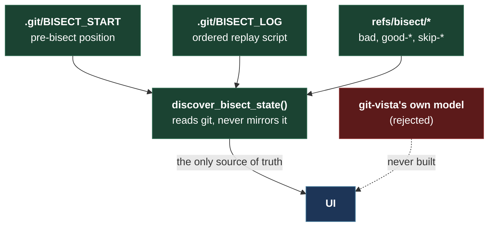

# ADR 0121 — A bisect session has one owner, and it is git

- **Status:** Proposed — design settled, implementation in progress
- **Date:** 2026-09-05
- **Milestone / issue:** M5.34 — A durable, resumable visual bisect session (#87)
- **Supersedes / superseded by:** —

## Context

`git bisect` already keeps its own durable, on-disk state for a bisect
session: `.git/BISECT_START` (the pre-bisect position to return to),
`.git/BISECT_LOG` (an ordered, replayable script of every `start`/`good`/
`bad`/`skip` command run), and `refs/bisect/bad` /
`refs/bisect/good-<oid>` / `refs/bisect/skip-<oid>` (the current known-good,
known-bad and skipped commits). None of that disappears when this
application restarts, and none of it can be told apart from what git itself
would show a user running `git bisect` from a terminal.

#87's acceptance criteria are: existing bisect state is discovered, sessions
survive restart, every decision is journaled, reset is reliable, and
automated test execution goes through a reviewed adapter rather than
browser-supplied shell. The central risk this ADR heads off is building a
**second** model of "what step are we on" that can disagree with git's own —
the way a UI ends up confidently showing a bisect that git has already
finished, or offering "mark good" when there is no bisect running at all.



Verified empirically (not assumed) in a scratch repo before any of this was
designed, because guessing at git's own plumbing has been wrong here before:

- `git bisect start <bad> <good...>` writes `BISECT_START` with the
  pre-bisect ref/branch name, and moves HEAD to a candidate — recorded in the
  reflog as a **plain** `checkout: moving from X to Y`, with no `bisect:`
  prefix at all. Unlike merge/rebase/cherry-pick, a bisect step is
  **indistinguishable from an ordinary checkout by reflog text alone.**
- `git bisect skip` creates `refs/bisect/skip-<oid>` (confirmed by direct
  inspection) — so the current good/bad/skip set is fully recoverable from
  `refs/bisect/*` alone, but **order** is not: only `BISECT_LOG`'s command
  lines preserve the sequence a person made their decisions in.
- The step that finds the culprit prints `<oid> is the first bad commit` and
  **exits 1** — a verified quirk: exit code alone cannot distinguish "found
  it" from "the command failed," and `BISECT_START`/`BISECT_LOG`/
  `refs/bisect/*` are **not** cleared automatically. `git bisect reset` is a
  separate, explicit step that the user (or this app) must still run.

## Decision

### 1. Git's on-disk state is authoritative; the app reads it, never mirrors it

"Discover existing bisect state" means: does `.git/BISECT_START` exist
(bisect in progress); what does `refs/bisect/bad` /
`refs/bisect/good-*` / `refs/bisect/skip-*` currently list (enumerated via
`git for-each-ref refs/bisect`, one read, no parsing of git's prose); and
what is the ordered history (`BISECT_LOG`'s `git bisect <verb> <args>`
command lines, parsed as the structured replay script git itself defines
that format to be — not its `#`-prefixed comment lines, which are only
git's own human-readable annotation and can drift from the ref state on a
detached/rebased history).

No separate journal is the source of truth for "what step are we on." The
app's own activity journal (below) is an audit trail of decisions, not a
second state machine that could disagree with git about the session itself.

### 2. "Finished" is derived from the candidate range, never from git's printed sentence or its exit code

A bisect is finished when the commit range `<bad> ^<good_1> ^<good_2> …`
(via `git rev-list`, skip commits deliberately left inside the range since
they were never resolved as good) collapses to exactly one commit — that
commit is the culprit. This is computed the same way ADR 0037 requires
elsewhere in this codebase: read state, don't parse prose. It also sidesteps
the verified exit-code quirk above — the executor never branches on `git
bisect bad/good`'s exit status to decide success; it inspects `stderr` only
for a genuine refusal (e.g. "You need to give me at least one good and one
bad revision") and otherwise re-reads ref state unconditionally afterward.

### 3. Three new `GitOperation` variants, following `SequenceContinue`/`SequenceSkip`/`SequenceAbort`'s shape exactly

```rust
BisectStart { bad: CommitOid, good: Vec<CommitOid> },
BisectMark { verdict: BisectVerdict },   // Good | Bad | Skip
BisectReset,
```

`BisectMark` carries no commit field. Precedent: `SequenceContinue`'s own
doc comment — "which sequence is not a field... asking the caller would
invite them to be wrong about it... the executor reads which one is in
progress." The current bisect candidate is whatever `HEAD` already is;
accepting a commit from the client would let a stale client mark the *wrong*
commit good or bad, silently corrupting the search. The executor refuses
with `409` when `BISECT_START` does not exist, exactly as
`sequence_exec::exec_sequence` refuses when neither `CHERRY_PICK_HEAD` nor
`REVERT_HEAD` exists.

These three go through the ordinary planner pipeline — `effects.rs`
(`WorktreeEffect::FilesRewritten`, `IndexEffect::Rebuilt`,
`NetworkNeed::Local` for all three, matching `CheckoutBranch`: a bisect step
*is* a checkout, just one git drives internally), `census_for`, risk
classification, dispatch, the sandbox argv table, and the golden fixture —
the same closed vocabulary as every other mutation (ADR 0015, ADR 0017).
`refs/bisect/*` are internal plumbing the reviewer never needs to see move,
the same D5 posture `PushStash` and `fetch_remote` already take, so the
plan's `RefChange` list stays empty for all three variants.

### 4. `RiskLevel` and a new `RecoveryStrategy::BisectReset`

`BisectStart`/`BisectMark`: `RiskLevel::Reversible` — HEAD moves, but nothing
is destroyed. `BisectReset`: also `Reversible` — it returns to the recorded
pre-bisect position and touches nothing else.

Recovery needed a real decision. `head_moves`'s `ResetRef` shape (used by
`SequenceContinue`/`Skip`) is keyed to a **checked-out branch** — bisect
runs on a **detached** HEAD by design, so there is no branch tip to pin at
shape time, and `NotNeeded` would be dishonest (something *did* move).
Neither existing variant fits, so this ADR adds one:

```rust
/// The undo for a bisect step is a full `git bisect reset`, not a bare ref
/// move — it may reattach a branch (`BISECT_START` can name one), and it
/// also clears `refs/bisect/*` and the log a raw `ResetRef` would leave
/// dangling. Stating `ResetRef` here would claim a mechanical undo this
/// app does not perform.
BisectReset,
```

`BisectStart`/`BisectMark` declare `RecoveryStrategy::BisectReset`;
`BisectReset` itself declares `NotNeeded`. This is the same shape as
`SequenceAbort` being a sibling operation rather than a recovery hint on
`Continue`/`Skip` — the vocabulary already has precedent for "the undo is a
different, explicit, named operation," this ADR just gives that precedent
its own tag instead of overloading `NotNeeded`.

### 5. Notes are app-only metadata, not a `GitOperation`

A free-text note on a candidate commit changes nothing git will ever look
at — it never moves a ref, never touches the index. Routing it through the
planner/plan-review/journal machinery built for repository mutations would
be ceremony around a fact that isn't one. Notes persist in a small
durable file keyed by commit oid (`.git/git-vista/bisect-notes.json`,
alongside the existing `.git/git-vista/journal.jsonl` — same directory,
same "lives with the repo, survives restart" property), read/written
directly by their own narrow endpoint. They are cleared when `BisectReset`
runs, since they're scoped to the session they were written during.

### 6. Every decision is journaled through the existing activity journal, under one new `ActivityKind::Bisect`

`ActivityKind` is a closed enum with "no catch-all" as a stated design
principle (`Other` exists only for git writes this app doesn't yet
recognise). A bisect step is fully understood by the app that just ran it,
so folding it into `Other` — or worse, into `Checkout`, which would make it
indistinguishable from an ordinary branch switch in the feed — is exactly
the miscategorisation the enum's own doc comment warns against. One
variant, `Bisect`, covers start/mark/reset; the *summary* string (already a
free-text field on every `ActivityEvent`) carries which verb and which
commit, the same way one `BranchDeleted` kind covers both a safe and a
force delete and lets the summary say which. `journal_app_event` is called
from each executor exactly as every other operation already does — no new
journal, no new file format.

An externally-run bisect (a human typing `git bisect` in a terminal) is
**not** reclassified by this ADR. Point 1 above already found that its
reflog trace is a bare `checkout: moving from X to Y` — indistinguishable
from an ordinary checkout by text, and distinguishing it would need
cross-referencing reflog timestamps against `BISECT_LOG` modification
times, a parse-git's-timing exercise this ADR declines for the same reason
ADR 0037 declines parsing its prose. Out of scope for #87, which journals
the app's *own* actions (always routed through `journal_app_event` with an
explicit kind already) — not reflog forensics on actions it didn't take.

### 7. The reviewed adapter: a closed, compiled-in table — not a runtime config file

"Automated tests use a reviewed adapter, never browser-supplied shell" is a
security boundary (ADR 0017, ADR 0030's exact shape: the server owns argv
construction, the client only ever selects from a server-declared set). The
question this ADR has to answer is *where the reviewed set lives*.

This app has no existing per-repo, human-edited config file — the catalog
(ADR 0003) is populated by directory scanning at startup, not by a file an
operator hand-maintains. Adding one just for bisect adapters would introduce
a new trust boundary (a file format, a parser, a reload story) nothing else
in this issue asks for, for a feature that — per the issue's own wording,
"optional constrained test execution" — is explicitly not required to ship
with any adapter wired up.

So: a closed Rust enum, `BisectAdapterId`, compiled into the server, is the
entire reviewed set. "Reviewed" means what it literally says — a human
reviewed the exact argv in a PR before it could ever run, the same review
every other line of this server already gets, rather than an
operator-editable file this ADR would have to design a trust model for. The
client can `GET` the (possibly empty) list of configured adapters and
`POST {id}` to run one; there is no field anywhere in that request shape a
string could occupy. #87 ships this table **empty** — no served repository
is guaranteed to share a test command with any other (this app serves
arbitrary repos, so a hardcoded `cargo test` would be actively wrong for a
non-Rust one) — and the empty state is itself the tested, working
behaviour: the endpoint reports zero adapters, and the UI's automated-run
affordance does not appear. A later milestone that wants one concrete
adapter for one concrete repository adds a variant, reviewed in that PR,
exactly like every other one-variant-per-real-thing addition in this
vocabulary. Building the config-file version now, before anything needs the
second adapter, is exactly the complexity the "Future Me Check" this
project holds itself to would reject.

## Alternatives considered

- **Maintain the app's own bisect session model, backed by its own
  durable store.** Rejected: two sources of truth for the same session is
  precisely the failure mode §1 exists to avoid, and git already durably
  tracks everything except free-text notes.
- **Parse `BISECT_LOG`'s `#`-prefixed comment lines instead of its command
  lines.** Rejected: the comments are git's own human-readable annotation of
  the command that follows, not a second data source — parsing both would
  invite them to disagree; the command lines are the format `git bisect
  replay` itself trusts, so this app trusts the same thing.
- **`BisectMark` carrying `{ commit: CommitOid }` for an explicit
  compare-and-swap.** Rejected for the reason `SequenceContinue` already
  gives: the repository knows which commit is under test; asking the client
  invites a stale client to mark the wrong one. If a future need for
  optimistic-concurrency detection arises, `enforce_fresh`-style staleness
  checking (ADR 0018) already has a home for it without adding a field here.
- **Reuse `RecoveryStrategy::NotNeeded` for `BisectStart`/`BisectMark`.**
  Rejected in §4 above — HEAD does move, and the tag would misstate that.
- **A per-repo, admin-edited adapter config file.** Considered seriously
  (§7) and deferred, not rejected outright — it is the right design *if*
  more than one served repository ever needs its own distinct adapter. #87
  does not have that need yet, so building the file format, its parser, and
  its reload story now would be speculative.
- **Hardcode one adapter (e.g. `cargo test --workspace`) as a sensible
  default.** Rejected: this app serves arbitrary repositories, and a
  Rust-specific default would silently misbehave (or simply fail) against
  any other kind of project the operator points it at.

## Consequences

- A bisect session is exactly as durable as git's own bisect state already
  is — restart-proof for free, with no new failure mode for "the app's copy
  disagreed with git's."
- The activity feed gains one new, precise kind rather than an `Other`
  fallback or a `Checkout` misclassification.
- The security boundary for automated execution is provable by inspection:
  `BisectAdapterId` has zero variants at ship time, so the wire shape for
  "run an adapter" cannot be constructed with anything resembling a
  command string, by the type system, not by a runtime check.
- The cost paid for the compiled-in adapter table is that adding the first
  real adapter needs a code change and a PR, not a config edit. Given #87
  ships none, that cost is not yet incurred by anyone.
- `git bisect reset`'s exit-code quirk (the step that finds the culprit
  exits 1) means the executor must be tested against that exact case, not
  only the "still narrowing" case — the mutation proof below covers both.

## Mutation proof

Both `discover_bisect_state`'s "finished" derivation (§2) and the
`RecoveryStrategy::BisectReset` recovery/reset roundtrip are mutation-proved
two disjoint ways each via `failure-atlas`'s `mutation_check` — see the PR
for `run_key`, mutation ids and caught/survived counts; recorded here once
the implementation lands rather than guessed at in advance.
