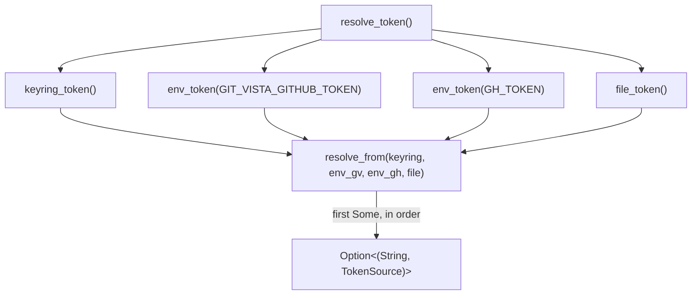

# ADR 0121 — Absence is the normal answer, not a caught error

- **Status:** Accepted — implemented, mutation-proved two ways failing differently
- **Date:** 2026-09-05
- **Issue:** #583 (M13.02)
- **Extends:** [ADR 0122](0122-the-token-is-a-credential-not-a-header.md) (decision 9 names `state::credential_token()` as the placeholder this ADR replaces) · `docs/SECURITY_MODEL.md`'s "Remote and Forge Credentials" section, whose "OS keyring / encrypted local store" row this moves from Aspirational to Implemented
- **Supersedes / superseded by:** —

## Context

ADR 0122 (#582) built the mechanism a token travels through once
Git-Vista has one — a credential helper that reads exactly one environment
variable and touches no filesystem. It deliberately left *where the token
comes from* as a one-line placeholder, `state::credential_token()` reading
`GIT_VISTA_GITHUB_TOKEN` directly, because #582 needed a real production
call site to prove the helper mechanism, not a mock.

#583 is the real answer to that placeholder: a keyring first, an
environment variable second, a gitignored local file last. The issue names
four rules verbatim, and each shaped a decision below:

- Never printed. Masked to the last 4 characters anywhere its existence is
  shown.
- Never written to a tracked file.
- **Absent is a normal state, not an error** — public repositories work
  with no token at all.
- The resolver says WHICH source answered, so a user whose stale env var
  shadows a fresh keyring entry can find out why.

The title names the one of these four most likely to get quietly violated
by a well-intentioned "helpful" error message later: a `None` from this
resolver must never be worth logging as a warning, retrying, or surfacing
to a client as a failure. It is the same shape a public GitHub clone has
always been.

## Decision

### 1. Every tier folds failure into `None` — nothing here ever returns `Result`

`resolve_token() -> Option<(String, TokenSource)>` matches the shape
`credential_token()` already committed callers to (ADR 0122 decision 9).
No tier — keyring, either env var, or the file — has an error path a
caller could see. A missing D-Bus session, a locked Secret Service
collection, an unset variable, a file that does not exist: all of these are
the *same* outcome as a user who has genuinely never configured a token,
because from a caller's perspective they are indistinguishable and should
be. `token_store::keyring_token`'s doc comment states this explicitly
against the concrete failure this project has already hit once
(`NoStorageAccess(Prompt)`, observed manually against this box's own D-Bus
session — see "Mutation proof" below for why that observation mattered
more than it first looked).

### 2. The precedence engine is pure, and separated from every real source

`resolve_from` takes four `Option<String>` values and returns the first
`Some`, tagged with which position it came from — nothing else. It never
touches the OS keyring, the environment, or disk, which is what makes
"precedence is asserted, not assumed" (the issue's own acceptance wording)
a claim a test can actually check: five tests exercise every ordering
(keyring beats everything, `GIT_VISTA_GITHUB_TOKEN` beats `GH_TOKEN` and
the file, `GH_TOKEN` beats only the file, the file is the last resort, and
all-absent is `None`) by constructing the four inputs directly, with no
real credential store, environment mutation, or filesystem I/O in any of
them. The real sources (`keyring_token`, `env_token`, `file_token`) are
each tested once, separately, against their own concerns (a blank value is
absent, whitespace is trimmed, a missing file is absent) — composition and
per-source correctness are two different claims, tested two different
ways, rather than one large test asserting both at once and hiding which
one a future regression actually broke.

### 3. Masking is `mask_token`, a pure function, with the boundary named explicitly

`mask_token("ghp_...wxyz") == "...wxyz"` — always the last 4 characters,
never the full value, regardless of length. Three edge cases the issue
names by name (`"including short and empty inputs"`) each get their own
test: empty input returns a literal `"<empty>"` rather than an empty
string that could be mistaken for "no masking needed"; input at or below
the 4-character visible window is fully starred (`"abc"` → `"***"`,
`"abcd"` → `"****"`) rather than partially or fully revealed; input one
character past the window shows exactly 4 (`"abcde"` → `"...bcde"`). The
`abcd`-length case is the one this ADR's mutation proof exists to pin —
see below.

### 4. The resolver reports provenance as a typed value, not only as a log line

`resolve_token()`'s return type *is* the answer to "the resolver says
which source answered": `TokenSource` is carried alongside the token all
the way up, not discarded until the last possible moment
(`credential_token()`'s `.map(|(token, _source)| token)` is the one place
it is dropped, to keep ADR 0122's every-caller-unchanged promise).
`token_store::provenance_line()` is the first consumer — one line, printed
unconditionally at server startup (`main.rs`, right after the M1.13b boot
gate), masked, naming the tier: `git-vista: GitHub token: GIT_VISTA_GITHUB_TOKEN
(...wxyz)` when something answered, or a plain, unremarkable sentence when
nothing did. This is deliberately a boot-time fact, not a per-request one —
`state::credential_token()`'s one call site (`handlers/clone.rs`) is
unaffected and stays silent, per ADR 0122 decision 9's "never logged, never
`eprintln!`ed" constraint on that specific function. Any future
diagnostics surface (a settings page, `gv doctor`) has a typed value ready
rather than needing to re-derive provenance from scratch.

### 5. The OS keyring tier: `keyring` v1, Linux-only, zbus backend

`keyring = { version = "4.2.0", default-features = false, features = ["v1",
"zbus-secret-service-keyring-store"] }`. Three choices worth recording:

- **`v1`**, the crate's simple synchronous `Entry::new(service,
  username).get_password()` API, over building directly on `keyring-core`
  and a store crate — this server needs get-by-two-fixed-strings, nothing
  else `keyring-core`'s lower-level API would buy.
- **`default-features = false`**, dropping the Windows and Apple backends a
  Linux-only server (this crate already gates on kernel-ABI specifics
  elsewhere — Landlock, seccomp) never reaches, rather than carrying dead
  platform code.
- **`zbus-secret-service-keyring-store`** over the `dbus-secret-service-*`
  alternative: pure-Rust D-Bus client, so no `libdbus` headers are needed
  at build time — consistent with this project's general preference
  (`docs/NATIVE_DEPENDENCIES.md`) for avoiding C-library FFI where a
  reasonable Rust-native alternative exists. This crate does not talk to
  the kernel ABI directly (it is D-Bus, a userspace IPC protocol), so it
  does not belong in that register — confirmed against the register's own
  scope statement before deciding not to add a row.

`KEYRING_SERVICE`/`KEYRING_USERNAME` are two fixed strings
(`"git-vista"`/`"github-token"`) addressing one credential, not a
per-repository entry — ADR 0122 decision 6 already scoped this project's
tokens to `repo`, singular, for now; a keyring entry per served repository
is a later issue's problem if it is ever needed at all.

### 6. The file tier's path is documented, and its `.gitignore` entry lands in this same commit

`state::token_file_path()` returns `state_dir().join("github-token")` —
the same `$XDG_STATE_HOME/git-vista` (or `~/.local/state/git-vista`)
directory that already holds the bootstrap token and the sandbox trust
markers, `0600`. The issue's acceptance criterion — "`.gitignore` covers
the file path before any code can write it" — is not decorative here:
`./dev testbed`'s `cmd_testbed` deliberately points `XDG_STATE_HOME` at
`$dir/.state`, a directory *inside* the testbed's own worktree (to avoid
two servers racing over one shared bootstrap-token file, a real incident
from 2026-08-05 that predates this ADR). That is the one place
`state_dir()` can resolve inside a checkout of this repository instead of
a user's real home directory, and until this commit nothing in
`.gitignore` covered it. `/.state/` was added to the top-level
`.gitignore` in the same commit as `token_file_path()`, closing the window
the acceptance criterion names before any code could open it.

## Alternatives considered

**Return `Result<Option<String>, TokenError>` instead of folding every
failure into `Option`.** Rejected — decision 1. A `Result` invites a caller
to `?` it, log the `Err` arm, or otherwise treat "the keyring had no
D-Bus session" as worth surfacing, which is exactly the "absent is an
error" mistake the issue names first among its rules. `credential_token()`
already committed to `Option<String>` (ADR 0122); widening the return
shape here would mean either breaking that promise or silently discarding
richer errors at the boundary anyway, which is no better than never having
them.

**One flat `resolve_token()` that reads the keyring, environment, and disk
directly, tested via env-var and tempfile fixtures for every precedence
case.** Rejected in favor of the pure `resolve_from` split — every
precedence test would otherwise need to mutate real global state (two env
vars, one file) in every combination, multiplying the exact
parallel-test-race hazard this ADR's own mutation-proof section had to fix
once already (see below) instead of confining that hazard to the three
tests that must touch real state at all.

**A per-repository keyring entry, keyed by remote URL.** Rejected for now
— ADR 0122 decision 6 scoped tokens to `repo`, not per-repository storage;
building per-repository keyring addressing without a concrete second
consumer would be speculative. Recorded as a real limitation, not silently
foreclosed: `KEYRING_SERVICE`/`KEYRING_USERNAME` being two fixed constants
is exactly the seam a future issue would widen.

**Store the tier-3 file encrypted at rest (a passphrase-derived key, or the
keyring itself wrapping a file-encryption key).** Rejected as
out of scope for #583 — the issue names "a gitignored local file," not an
encrypted one, and `docs/SECURITY_MODEL.md`'s update (this same commit)
records the resulting gap plainly rather than letting the "encrypted local
store" bullet read as fully met when only the keyring tier actually is.

## Consequences

- `state::credential_token()` keeps its exact signature and doc-comment
  promise from ADR 0122 decision 9; no caller changed.
- `state::token_file_path()` is a new small public seam or later issue
  (a settings UI, `gv doctor`) to read or write the same file this
  resolver reads.
- `docs/SECURITY_MODEL.md`'s "OS keyring / encrypted local store" row
  moves from Aspirational to Implemented, with the plaintext-file caveat
  recorded rather than glossed over.
- The crate gains its first D-Bus-speaking dependency (`keyring`, `zbus`,
  and their transitive tree) — Linux-only feature selection, no new row in
  `docs/NATIVE_DEPENDENCIES.md` (it does not touch the kernel ABI).
- `/.state/` is now gitignored repository-wide, closing a gap that existed
  since `./dev testbed` was written, independent of whether any token file
  is ever actually created there.
- A future settings surface (#584 territory) that lets an operator *write*
  a token still needs its own design — this ADR covers resolution
  (reading), not provisioning.

## Mutation proof

Two arms against `crates/git-vista-server/src/token_store.rs`'s
`mask_token`, proved via `failure-atlas`'s `mutation_check` (a fresh clone
at HEAD, run unmutated then mutated, never touching this working tree),
picked to fail **differently** rather than repeat the same red twice.

| arm | mutation | mutated result |
|---|---|---|
| remove the mechanism | return the full, unmasked token instead of the last-4-characters tail | 4 of 21 targets go red, including `mask_token_never_reveals_the_full_value` and — the one that matters most — `provenance_line_never_contains_the_resolved_token`, which fails on the literal secret value appearing in the boot-time log line |
| weaken it | change the boundary from `chars.len() <= VISIBLE` to `chars.len() < VISIBLE`, so an exactly-4-character token takes the reveal-the-tail branch instead of the fully-starred branch | exactly 1 of 21 targets goes red — `mask_token_exactly_at_the_visible_window_is_fully_starred_not_shown`, on `"...abcd"` where `"****"` was expected — an off-by-one at the single boundary the issue's "including short... inputs" wording names, not the same failure as arm one |

Both caught, neither survived, and the failure shapes disjoint exactly as
intended: arm one is caught on *content* (the raw secret literally present
in output, 4 targets, including a security-relevant one) — arm two is
caught on a *boundary condition* with everything else about masking intact
(1 target, a length-equality check). Run ids 323 (remove the mechanism)
and 324 (weaken it), `run_key: gv-583-mask-token`.

### A third, unplanned catch: the tests themselves raced

The first `mutation_check` call against this file (run id 322, same
mutation as arm one above) came back `baseline_failed` — the *unmutated*
clone was already red, with no mutation applied. `mutation_check`'s
baseline runs at cargo's default parallelism (no `--test-threads=1`), and
six tests in this file mutate the process-wide
`GIT_VISTA_GITHUB_TOKEN`/`GH_TOKEN` environment variables — the exact race
`git-vista-session::auth`'s own env-var test already carries a comment
about, and which this file's first draft reproduced by writing each case
as a separate `#[test]` instead of following that precedent. Fixed with a
shared `Mutex` (`ENV_LOCK`/`lock_env()`) held for the duration of every
env-mutating test, rather than folding the six cases into one test body —
each keeps its own name and failure message, at the cost of one lock
acquisition per test. Verified with 10 consecutive green runs at default
parallelism before either mutation arm above was attempted; a `caught`
verdict from a racy baseline would have been credit for a failure the
mutation did not cause, which is precisely the class of false confidence
`mutation_check` exists to refuse (`baseline_failed`, not a lucky
`survived`).
