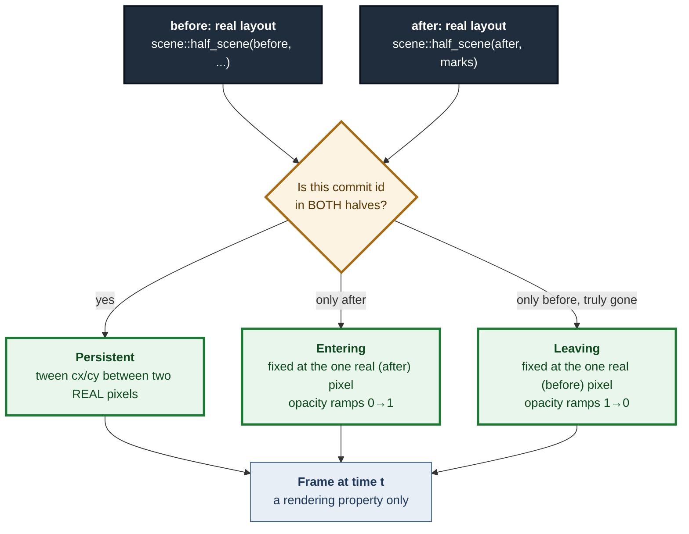

# ADR 0121 — An animation only interpolates a pixel, never a repository state

- **Status:** Accepted — implemented, mutation-proved two ways per invariant, all caught
- **Date:** 2026-09-05
- **Issue:** #591 (M9)
- **Extends:** [ADR 0104](0104-a-preview-draws-its-own-picture.md) (the before/after
  picture this animates) · [ADR 0115](0115-a-mutation-proof-cannot-see-what-it-does-not-run.md)
  (the wasm/core split this keeps)
- **Supersedes / superseded by:** —

## Context

Tom asked for this by voice on 2026-09-01: after a complex git operation, a
simulator view — watch commits and refs move, rather than being shown only
the end state. #576 and #594 already built the hard half: `/api/preview`
computes a full **before** graph and a full **after** graph through the same
layout pipeline, and `features::preview::scene::scene_of` already lays both
out as two static SVGs, side by side, sharing one lane count so a commit that
did not move sits at the same pixel in both pictures. An animation is a tween
between two layouts already on screen.

The issue states one constraint as non-negotiable:

> The animation must only draw states that are the two real endpoints. No
> invented intermediate git states. It is a visual transition, not a model of
> git internals.

This is the entire design problem. Everything else — duration, easing,
reduced motion — is a normal UI decision. This one is a correctness property,
and it is exactly the kind of property a preview panel exists to protect:
ADR 0099 already established that a preview is *real git refusing*, never a
model, and an animation that implies a commit existed for a moment on its way
somewhere is the same failure wearing a stopwatch.

## Decision

### 1. A new framework-free module, `features::preview::tween`, owns every time-dependent decision

Same split ADR 0115 already argued for `core.rs`/`scene.rs`: which pixel a
commit sits at when the clock reads `t`, when a ref badge starts sliding,
when an outcome label may appear — all of it is a pure function of
`(TweenScene, t)`, host-tested, with no knowledge of `requestAnimationFrame`,
a signal, or the DOM. The wasm side's whole job is reading a clock and
calling `tween::sample`.

### 2. `tween_of` reuses `scene::half_scene` and `layout_params` directly — it does not recompute geometry

`tween_of(picture)` calls the *exact same* `layout_params` and `half_scene`
`scene_of` calls, once per half. A commit's animated `from`/`to` position is
therefore the identical pixel the static picture already draws it at, by
construction — not a second calculation that could quietly drift from the
first. `scene::SceneNode` gained one field, `commit_id`, so the two halves'
node lists can be matched; nothing else about the static renderer changed.

### 3. Node lifecycle is derived from set membership, and only from set membership

Every commit dot is exactly one of three things, decided by whether its id
appears in the before half's drawn window, the after half's, or both:

- **`Persistent`** (both): slides between two real positions.
- **`Entering`** (after only — the hypothetical commit, or a commit newly in
  the drawn window): fixed at its one real position; only opacity moves.
  It is never given a `from`, because there is no real "before" position for
  a commit that did not exist.
- **`Leaving`** (before only, and — this is the load-bearing distinction —
  genuinely absent from `after.rows` in its entirety, not merely outside the
  after *window*): fixed at its one real before-position; opacity ramps out.

That third case matters because `scene::window_for_before`'s own doc already
accepts that the two windows can disagree about which commits they draw, as a
documented consequence of a fixed ten-row budget. A commit dropped by
windowing still exists on both sides of the operation. Fading it out would
read as "this operation deleted this commit" — false, and exactly the
failure the honesty rule exists to prevent. So `tween_of` checks
`after.rows` (the whole half), not the after window, before ever choosing
`Leaving`. No operation the preview engine supports (merge, revert,
cherry-pick) can produce that arm today; the check exists so a future,
genuinely destructive preview cannot silently start lying by omission.

### 4. Edges are the after graph's real topology; only endpoint pixels move

An animated edge is not a separately-tweened path. It is one of `after`'s
real parent/child edges, with its two endpoints named by commit id rather
than row number, so `sample` can look up wherever that commit currently sits
and draw a line between two real positions. The edge that never existed
before the operation (into the hypothetical commit) fades in with its
endpoint, because edge opacity is the minimum of its two endpoints'
lifecycle opacity — never a separate, invented rule.

### 5. A ref slides between the two commits the server itself named — never a re-derived guess

`PreviewChange::RefMoved` already carries both `from` and `to` oids; the
static picture only ever kept the destination (`RowMark::refs_landed`). This
ADR adds `Picture::ref_moves: Vec<RefMove>`, built once in `core::view_of`
from the same change list, so a badge's animated origin is the exact commit
the server said the ref used to point at — never a second lookup by name
against the before graph, which could disagree with the server on a
same-named tag versus branch (see `GitRef::is_ref_moves_target`'s own doc for
why that distinction exists at all). When the origin commit is not drawn in
the before window, the badge has no honest starting pixel and fades in at its
destination instead of sliding from an invented one.

### 6. Outcome-only labels reveal only once the transition has essentially settled

A `new` pill, a `→main` pill, a `lane 0→2` pill are each a sentence about the
*after* state. `SceneTag` gained an `is_mark: bool` (true for exactly these
three; false for a ref that already pointed here and is simply carried
through). `tween::sample` hides every `is_mark` tag until progress crosses
`REVEAL_AFTER = 0.92` — late enough that it reads as "arrived" rather than
"still moving," early enough (well under 100ms at `DURATION_MS = 900`) that it
does not feel like a second wait. An unmoved ref's tag is never gated; it was
never untrue.

### 7. Reduced motion degrades to the resting frame, and never enters the loop

`features::preview::signals::Playback::start(reduced_motion)` checks the
platform preference once, and — when it says less motion — sets progress to
`1.0` and returns without ever calling `schedule`, the function that arms
`request_animation_frame`. The animation is additive: the two static
before/after panels this ADR does not touch are the fallback, exactly as the
issue requires ("the animation must degrade to the end state rather than ever
being the only way to see the result").

### 8. Branch stubs are not animated, on purpose

A stub (a branch with no commits of its own, drawn as a ring cascading off
its anchor) is drawn at its final position only, for the whole transition.
Tweening a stub's staircase offset adds real complexity — its own anchor,
its own depth-based cascade math — for a secondary annotation neither the
issue nor Tom's sketch mentions. Left for a later iteration if it turns out
to matter; not built speculatively here.

## Alternatives considered

- **Show only the after graph, with earlier state as a ghost overlay.**
  Rejected: this is a re-reading of the issue's own sketch ("interpolate row/
  lane positions between before and after"), which asks for one settling
  picture, not two superimposed ones. A ghost overlay is also harder to keep
  honest — a semi-transparent "used to be here" mark reads uncomfortably
  close to a claimed intermediate state.
- **Cross-fade the two static SVGs as whole images.** Rejected: this cannot
  show "the ref slides" or "the commit moves through the gutter" at all — it
  is a dissolve between two pictures, not a simulator. It is also strictly
  less honest to build, since a naive image cross-fade very easily *does*
  imply a blended intermediate state (a ref badge visible at 50% opacity in
  two places at once looks like two refs, not one ref moving).
- **Re-derive a ref's origin by scanning the before graph for its name.**
  Rejected once `PreviewChange::RefMoved::from` was noticed already carrying
  the answer — the same argument ADR 0116 already made for `branch_holder`:
  a second computation of a fact the server already established exactly once
  can only ever disagree with the first.
- **Gate outcome labels by wall-clock time rather than progress.** Rejected:
  `REVEAL_AFTER` as a `t`-fraction means the reveal point scales automatically
  if `DURATION_MS` ever changes, with no second constant to keep in sync.

## Consequences

- `Picture` gained `ref_moves: Vec<RefMove>`, populated in `core::view_of`
  alongside the existing `marks`. Every existing caller of `Picture` builds
  it through `view_of`, so no call site needed updating by hand.
- `SceneNode` gained `commit_id: String`; `SceneTag` gained `is_mark: bool`.
  Both are additive fields on types already `pub`, and the one destructuring
  pattern outside `scene.rs` (`dialogs/preview_panel.rs`'s `node_view`) was
  updated to ignore the new field explicitly rather than list it unused.
- `scene::half_scene` and `scene::lane_cx`/`scene::row_cy` moved from private
  to `pub(super)`, and a new `scene::layout_params` factors the window/lane
  computation `scene_of` already did into something `tween_of` can call too
  — `scene_of` itself is otherwise unchanged.
- The animated view is purely additive markup above the two existing static
  panels in `dialogs/preview_panel.rs`; nothing about the static rendering
  path changed in shape, only in the two new fields it now carries and
  ignores where irrelevant.
- `features::preview::signals::Playback` is the one piece of this feature
  `cargo test` cannot execute (`#[cfg(target_arch = "wasm32")]`), per ADR
  0115's own rule. It is pinned by `tween_suite.rs`'s
  `reduced_motion_returns_before_scheduling_a_frame` and
  `the_frame_loop_asks_this_module_for_progress_rather_than_keeping_a_second_answer`,
  which read `signals.rs` as text and check the two compositions execution
  cannot reach: that the reduced-motion branch returns before scheduling, and
  that the tick loop asks `tween::progress_at` rather than keeping a second,
  unproven notion of elapsed time.
- `web-sys`'s feature list gained `MediaQueryList`, for
  `window.matchMedia("(prefers-reduced-motion: reduce)")`. Elapsed time uses
  `js_sys::Date::now()`, already a dependency and already this codebase's
  convention for animation-frame-granularity timing (`api.rs`'s request-id
  noise), rather than pulling in the `Performance` web-sys feature for no
  practical gain.

## Mutation proof

Four arms against `crates/git-vista/src/features/preview/tween.rs`, via
`failure-atlas`'s `mutation_check` (a fresh clone at HEAD, run unmutated then
mutated, never touching this working tree). `run_key: gv-591-tween`.

| invariant | arm | mutation | caught by |
|---|---|---|---|
| the hypothetical commit never receives an invented starting position | remove the mechanism | give `Entering` a fake `from` of `(0.0, 0.0)` and interpolate from it, same as `Persistent` | `the_hypothetical_commit_never_receives_an_invented_starting_position` — position now moves across `t`, where the invariant requires it fixed |
| " | weaken it | reverse the fade direction (`t` → `1.0 - t`) | the same test, a **different** assertion — the fixed-position check still passes, but the monotonic-fade-in and `opacity == 1.0` at rest checks fail |
| an outcome-only label is hidden until the transition has settled | remove the mechanism | drop the filter entirely (`.filter(\|_\| true)`) | `an_outcome_only_tag_is_hidden_until_reveal_after_and_visible_at_rest` — the `new` pill is visible before `REVEAL_AFTER`, which must never happen |
| " | weaken it | make the reveal condition unreachable (`t >= REVEAL_AFTER + 1.0`) | the same test, a **different** assertion — hidden-before-reveal now passes (it is always hidden), but the pill is still missing once the transition has settled, which fails the visible-at-rest check |

Run ids: 309 (invented start), 310 (reversed fade), 311 (reveal filter
removed), 312 (reveal condition flipped — later replaced by 313 for a cleaner
disjoint failure), 313 (reveal condition made unreachable). All five:
caught, none survived. Run 312 is recorded here for honesty even though 313
superseded it in the PR: `t <= REVEAL_AFTER` happened to fail at the same
assertion as removing the filter entirely (both hide it after the transition
settles at `t = 1.0`, since `1.0 <= REVEAL_AFTER` is false), so it did not by
itself demonstrate a second, disjoint failure — the same lesson ADR 0120
recorded when two of its three arms overlapped. Run 313 is the arm that
actually earns "two ways failing differently" for that invariant.

The animation's cross-check against the static renderer
(`the_animated_edge_count_matches_the_static_after_pictures_drawn_edges`,
`every_persistent_or_entering_node_id_is_drawn_in_the_static_after_picture`)
is ordinary regression coverage, not mutation-proved separately — both
renderers share `half_scene`/`layout_params` by construction (decision 2), so
there is no independent second mechanism for them to drift from.
