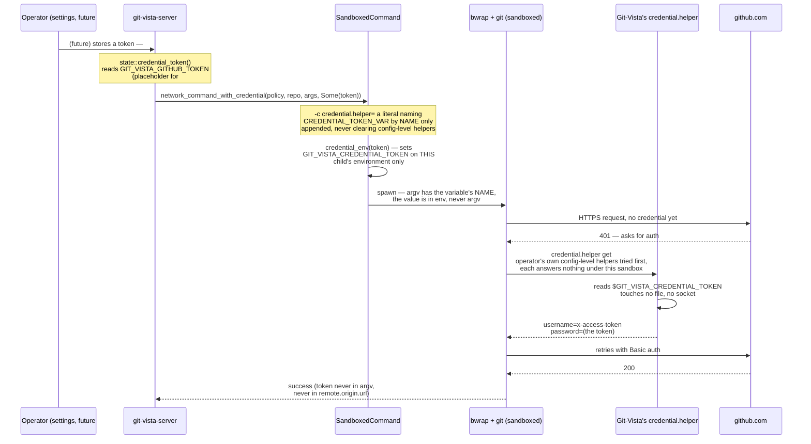

# ADR 0122 — The token is a credential, not a header

- **Status:** Accepted — implemented, mutation-proved two ways failing differently
- **Date:** 2026-09-05
- **Issue:** #582 (M13.01) · #587 (M13.06, this record)
- **Extends:** [ADR 0033](0033-ssh-agent-and-known-hosts-carveout.md) (the sibling carve-out for SSH; this is the HTTPS half of the same question) · `docs/SECURITY_MODEL.md`'s "Remote and Forge Credentials" section, which this annotates
- **Supersedes / superseded by:** —

## Context

M13 is "private repositories for anyone." #582 is the issue that blocks
every other issue in that milestone: until a token has somewhere to go, no
private repository can be reached at all.

### The measurement

`sandbox::clone_live::a_private_https_fetch_completes_through_the_production_clone_policy`
(added 2026-08-31, `#[ignore]`d, driven by a real private repository named
only via an environment variable) recorded this failure through the
production `policy_for_clone` launcher:

```
failed to create root command: failed to read configuration:
  open <helper's config>: permission denied
fatal: could not read Username for 'https://github.com': No such device or address
```

The helper **executed** — that error is the helper's own, not a sandbox spawn
failure. It could not read its own token store. Git then fell back to
prompting; `GIT_TERMINAL_PROMPT=0` refused it. The identical unsandboxed
`ls-remote`, moments earlier, succeeded — which is what makes this
attributable to the sandbox policy and not to the network or the
repository's own state.

### Why the sanctioned path cannot simply be widened

`docs/SECURITY_MODEL.md` already states the target shape: "Prefer existing
Git credential helpers and SSH agents on the Linux host." For SSH this is
implemented (`sandbox/ssh_remote.rs`, ADR 0033) — `~/.ssh/known_hosts` and
`$SSH_AUTH_SOCK` are narrow, well-understood carve-outs. HTTPS credential
helpers do not have an equivalently narrow shape: `gh`'s config lives at one
path, `~/.git-credentials` at another, a gnome-keyring or `pass` agent
behind a socket that varies by desktop session. Granting one is a grant
this project has just spent an audit hardening; granting all of them is
open-ended, and the set is not closed — a host with a different helper
installed tomorrow reopens the same gap under a different path.

## Decision

### 1. Git-Vista supplies its own credential helper

Rather than widen the sandbox to reach an operator's existing token store,
the server holds a token itself and hands it to a helper program **it
authored**, which needs no filesystem access to answer git's `get` request —
only one environment variable.



### 2. The token is a credential, never a header — because there is no HTTP client

**There is no HTTP client anywhere in this codebase.** Every remote
operation this server performs is a spawned `git` process; the wire between
this server and a forge is entirely git's own HTTPS implementation. This
matters because the obvious, natural-looking design for "send a token to a
service" is `Authorization: Bearer <token>` — and that design has **nothing
to attach to** here. There is no request builder, no header map, no client
struct anywhere this server could set that header on, because it never
constructs the HTTPS request in the first place; git does.

This is recorded as its own decision, not folded into the mechanism above,
because it is the single most likely thing a future session gets wrong. A
session that has not read this ADR and needs "send this token to GitHub"
will very plausibly reach for an HTTP client crate, discover none is
vendored, and add one — at which point the entire credential-helper design
this ADR documents becomes dead code beside a parallel, unaudited path that
duplicates every property below without ever being told to. If a future
requirement genuinely cannot be met by a spawned git process (git's own
plumbing does not cover it), that is a new architectural decision requiring
its own ADR, not a header quietly added beside this mechanism.

### 3. The two allowlists are different things

`state::path_is_allowed` governs which **local filesystem paths** this
server may open — a security boundary hardened by #576's finding 3, and the
subject of most of this crate's sandbox test suite. Remote authentication is
an unrelated question: which **remote host** a spawn may reach is governed
by `sandbox::Policy`'s `net_ports`/tier and the URL a request supplies,
never by `path_is_allowed`.

**Removing or loosening `path_is_allowed` is never what "no hardcoded
repos" means**, and "no hardcoded repos" is exactly the kind of phrase that
invites exactly that confusion — M13 is about which *remote* repositories a
token can reach, not about widening which *local* directories this server
will serve. Nothing in #582's implementation touches `path_is_allowed`; if
a future M13 issue's implementation does, its own PR states why in a
dedicated section, per this milestone's standing instruction.

### 4. Argv carries the variable's name, never its value

`sandbox::network_exec::network_command_with_credential` appends
`-c credential.helper=<shell literal>` where the literal is a fixed string
this crate authored, containing `spawn::CREDENTIAL_TOKEN_VAR`'s **name**
(`GIT_VISTA_CREDENTIAL_TOKEN`) — never the token's value. The value is set
separately, via `SandboxedCommand::credential_env`, directly into the
spawned child's environment. `/proc/PID/cmdline` — the kernel's own record
of a process's argv, not merely this crate's bookkeeping of what it intended
to pass — never contains the token; this is asserted by a real spawn reading
its own `/proc/self/cmdline` back
(`network_exec::tests::a_supplied_token_reaches_the_helpers_environment_and_never_the_processs_own_argv`),
not reasoned from the source.

### 5. The token must never appear in URL userinfo — forbidden, with a reason

`https://<token>@github.com/...` is the classic alternative shape for
supplying HTTPS credentials, and it is explicitly **forbidden here, in every
form, including a test fixture**. It has happened once already in this
codebase's history — `network_exec::redact_url_userinfo`/`redact_output`
exist specifically because a URL-userinfo-shaped credential leak needed
stripping from captured output, and `docs/SECURITY_MODEL.md`'s "Redact URL
userinfo" row exists for the same incident. Reintroducing the shape this
redaction machinery was built to catch — even briefly, even in a fixture
that is deleted afterward — defeats the point of having proved it caught
once. #582's implementation never constructs such a URL: the URL a request
supplies passes through unchanged, and the token travels only through the
credential-helper environment variable. This is checked empirically, not
only reasoned: `clone_live::a_private_https_clone_never_bakes_the_token_into_remote_origin_url`
does a real private clone and reads `git remote get-url origin` back,
asserting the token is absent and the URL is byte-identical to the one
supplied.

### 6. Scope is `repo`, and only `repo`

This ADR does not implement scope selection — no OAuth or GitHub App flow
exists yet (#583/#584 territory) — but records the constraint for whoever
does: a token this server requests or accepts must be scoped to `repo` and
nothing wider. `repo, read:org`, or "while we're here" is not a scope
widening this milestone authorizes; a future issue that appears to need
broader scope is a finding to report to Tom, not a default to reach for
silently.

### 7. `SandboxedCommand::credential_env` — the one deliberate exception to "no `env`"

`sandbox/spawn.rs`'s `SandboxedCommand` type doc has, since #66's Task 5,
stated that argv and environment are sealed after `sandbox_argv` classifies
a spawn — no `arg`, no `args`, no `env` in production, because the excluded
cases (`GIT_DIR`, `GIT_SSH_COMMAND`, `GIT_EXTERNAL_DIFF`, the
`SCRUBBED_GIT_GEOMETRY_ENV` family) are all names **git itself** interprets:
setting one changes what git does, unconditionally. `network_exec.rs`'s own
module doc had already flagged the shape of this exact decision, for a
smaller case (`GIT_TERMINAL_PROMPT`, needed to pin one exact error string),
and explicitly declined to make it unilaterally: *"that needs an `env`
capability on the production spawn surface — an architectural decision that
belongs in its own ADR, not a unilateral widening here. Reported, not
built."* This ADR is that decision, made for the case that could not be
deferred — #582 blocks the whole milestone, `GIT_TERMINAL_PROMPT` blocked
one byte-exact test string.

`CREDENTIAL_TOKEN_VAR` does not carry the hazard the exclusion was written
against: git does not interpret this name at all. It only becomes
meaningful because this crate's own `-c credential.helper=` literal names
it — a config value this crate authored, never request data. Setting an
inert, git-opaque variable is data, not an argv change wearing a different
hat, which is what the exclusion is actually about.
`network_exec::network_command_with_credential`'s doc comment carries the
full argument; this ADR is the record of it having been made deliberately,
once, rather than each call site re-deciding it.

**Correction (2026-09-05, grok's read-only review of #668).** This decision
originally continued: "and never something a served repository's own
`.git/config` can point at (a repo-local `credential.helper` naming
`printenv GIT_VISTA_CREDENTIAL_TOKEN` gets nothing, because that variable
is set on this specific child's environment only when this specific spawn
is the one that set it)." **That isolation claim is false and is
withdrawn.**

The variable is set on the *git* process; `gv-sandbox` `execve`s git
without clearing the environment (verified: its exec path contains no
`env_clear`/`env_remove`); git's credential helpers are children of that
git and inherit it. Decision 8's append-never-clear is exactly what places
an operator's — or a repository's — own helper *earlier in the same chain,
in the same process, with the same environment*. Decision 7's isolation and
decision 8's append cannot both hold of a token living in git's
environment. Append is what the code does, so isolation is the claim that
loses.

What still holds, and what does not:

- **Not exploitable by a served repository today.** The only production
  caller is `POST /api/clone`, which has no repository at spawn time, so
  there is no repo-local `.git/config` to declare a hostile helper. The
  helpers that do inherit the value there are the operator's own global
  configuration.
- **It becomes a real exfiltration path the moment fetch/push/pull adopt
  `network_command_with_credential`**, because those run against an
  *existing* repository whose `.git/config` may name a helper that runs
  first and can read the variable straight out of its environment.
  **Treat this as a blocker on reusing this helper for those paths** until
  the token is genuinely isolated to Git-Vista's own helper — handing it
  over a pipe the helper reads, rather than an inherited environment
  variable, is the shape that would actually deliver what this decision
  originally, wrongly, claimed. That is its own decision and its own ADR,
  not a quiet addition beside a new call site.

Recorded as a correction in place rather than a silent edit: the wrong
version of this paragraph is what a later session would otherwise have
trusted, and the reasoning error — asserting isolation for a value that
lives in an inherited environment — is the part worth not repeating.

### 8. Never clears, only appends

The forced flag is the **non-empty** form. `FORCED_NETWORK_ARGS`'s
`-c core.askpass=` is empty on purpose — it *disables* a config-level entry,
closing the M1.13 finding I5 RCE gap. This ADR's `credential.helper` value
is never empty (`network_exec::tests::the_forced_credential_helper_value_is_never_empty`
pins this), because an empty value would clear every helper the operator's
own configuration already declares. Git tries configured `credential.helper`
entries in the order they are defined — config-file entries before `-c`
overrides — and moves to the next whenever one answers nothing for `get`.
So Git-Vista's helper runs **last**, as the fallback for exactly the case an
operator's own helper cannot handle under this sandbox, and never shadows a
host credential path that happens to work.

### 9. `state::credential_token()` is a placeholder, and says so

#582 needed a real production call site to prove the mechanism, not a mock.
`state::credential_token()` reads `GIT_VISTA_GITHUB_TOKEN` from the
process environment directly — the second tier of #583's eventual
keyring-then-env-then-file chain, implemented early because it was the
cheapest way to have something real. Every caller's shape (`Option<String>`
in, nothing about *how* the token was found leaking out) is designed to
survive #583 replacing this function's body without any caller changing.

### 10. `handlers/clone.rs` gets its first askpass hardening too

While tracing #582's call site, `handlers/clone.rs::clone_repo` was found
to call `sandbox::spawn::command_async` directly — the one production
Remote-tier spawn in this crate that never went through
`network_exec::network_command` at all, because clone has no repository yet
and so never reaches `git_cmd::sandboxed()`, the chokepoint every other
Remote-tier call routes through. `POST /api/clone` therefore never had the
`-c core.askpass=` hardening every other fetch/pull/push has had since
#228. Fixing #582 meant touching this exact call site regardless, so it now
goes through `network_command_with_credential` and gets both fixes in the
same change. This is reported here as a finding, not folded silently into
"credential helper work" — it is a real, independent gap that predates
M13 and was closed as a byproduct of it.

## Alternatives considered

**Widen the sandbox's read grant to the operator's actual token store.**
Rejected: per-helper (gh's config, `.git-credentials`, a keyring socket are
three different shapes already) and open-ended — a host with a fourth
helper installed reopens the same gap. Also widens a boundary this project
had just finished auditing, for a convenience (reusing the operator's own
credentials) that a headless server has limited reason to want anyway: the
operator is not typically the one whose desktop session is running this
process.

**`Authorization: Bearer` via an HTTP client.** Rejected structurally —
see decision 2. There is no HTTP client, and adding one to carry a header
duplicates, unaudited, every property this ADR's mechanism already has:
where the value lives in memory, what process boundary it crosses, what
logging or output could catch it. It would also mean every remote operation
this server performs (fetch, pull, push, clone) needing a *second*,
parallel execution path alongside the git-spawn one, rather than one
mechanism all of them already share via `NetworkNeed::Remote`.

**URL userinfo (`https://<token>@host/...`).** Rejected — see decision 5.
Forbidden by this project's own history, not merely by convention.

**A general `env(k, v)` setter on `SandboxedCommand`.** Rejected in favor of
the narrow `credential_env`, which sets exactly one fixed, git-opaque name.
A general setter reopens the exact hazard C10's Task 5 closed — any future
caller could set `GIT_SSH_COMMAND` or `GIT_EXTERNAL_DIFF` through it, and a
type that seals argv but not environment has not actually sealed the spawn.

## Consequences

- `sandbox::spawn::SandboxedCommand` gains its first environment-setting
  method, `credential_env`, and the crate gains one new inert environment
  variable name, `CREDENTIAL_TOKEN_VAR`. Both are documented against the
  exact prior "no `env`" rule and why this does not reopen it.
- `sandbox::network_exec::network_command_with_credential` is additive: the
  existing `network_command` and its six call sites are byte-for-byte
  unaffected (`network_exec::tests::no_token_is_byte_identical_to_plain_network_command`).
- `handlers/clone.rs` gets askpass hardening it never had (decision 10) —
  a genuine, independent security improvement discovered as a byproduct.
- `docs/SECURITY_MODEL.md`'s credential table gains a row for Git-Vista's
  own HTTPS credential helper and a correction to the "existing helpers"
  row recording what was measured.
- `state::credential_token()` is explicitly temporary scaffolding for
  #583; the next session working that issue should read decision 9 before
  changing this function's signature.
- Scope for #583/#584 is narrowed by decisions 3 and 6: whatever storage
  and settings surface those issues build, they supply a `repo`-scoped
  token to this same `credential_token()` shape, and they do not touch
  `path_is_allowed`.

## Mutation proof

Two arms against `crates/git-vista-server/src/sandbox/network_exec.rs`,
proved via `failure-atlas`'s `mutation_check` (a fresh clone at HEAD, run
unmutated then mutated, never touching this working tree), picked to fail
**differently** rather than repeat the same red twice — the standing rule
this project's own history (#550's 280/281 pair) exists to enforce.

| arm | mutation | mutated result |
|---|---|---|
| clear instead of append | change the forced flag from the non-empty helper literal to the empty form `credential.helper=` (the same shape `core.askpass=` legitimately uses to disable) | `the_forced_credential_helper_value_is_never_empty` goes red on an empty-string assertion — a **static, argv-shape** failure |
| leak into argv | move the token from `credential_env`'s environment set into the `-c credential.helper=` literal itself (interpolating the value, not just the variable's name) | `a_supplied_token_reaches_the_helpers_environment_and_never_the_processs_own_argv` goes red on the **kernel's own `/proc/self/cmdline` reading containing the canary** — a real, dynamic, spawned-process failure, structurally different from the first arm: one is a string-shape check on a literal, the other is an empirical read of a live process's own memory |

Both caught, neither survived, and the failure shapes disjoint exactly as
intended: arm one failed on a *static* check (an empty argv-shape literal,
caught by `the_forced_credential_helper_value_is_never_empty` and — because
the mutation also dropped the variable name — the argv-name-presence
assertion in the other test too, 2 of 3 targets red); arm two left the
empty-value check untouched (its literal is non-empty, just wrong) and was
caught purely on content — the token itself appearing in the composed argv,
1 of 3 targets red, and a different assertion within that same test than
arm one tripped. Run ids 320 (clear instead of append) and 321 (leak into
argv), `run_key: gv-582-credential-helper`.
