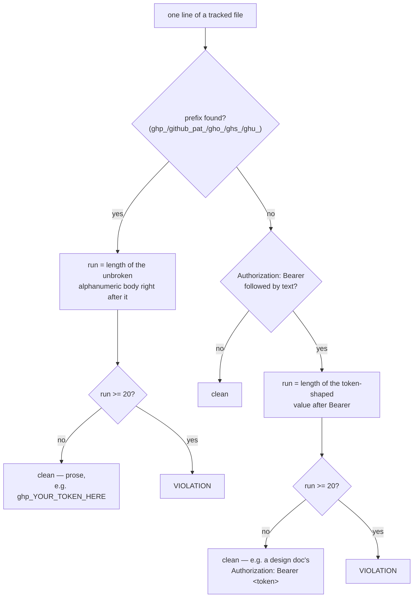

# ADR 0123 — The safety lives in the shape, not a list

- **Status:** Accepted — implemented, mutation-proved two ways failing differently
- **Date:** 2026-09-05
- **Issue:** #586 (M13.05)
- **Extends:** [ADR 0119](0119-a-guarantee-that-holds-only-on-the-success-arm-is-not-a-guarantee.md) (the "safety has to live in the value" reasoning, applied to a second value) · `crates/git-vista-server/src/argv_boundary.rs` (the census-tripwire shape this file follows) · [ADR 0122](0122-the-token-is-a-credential-not-a-header.md) (its "no HTTP client exists" premise, which this guard is now also evidence for)
- **Supersedes / superseded by:** —

## Context

M13 gives Git-Vista its own credential storage (#583) and its own
credential-passing mechanism (#582, ADR 0122). Neither guarantees a token
never *lands* in a tracked file — a pasted example in a doc, a debug print
left in a commit, a fixture that used a real value by accident. #586 is the
tripwire: a test that reads the repository's own tracked files and refuses
if any of them contains something shaped like a GitHub credential.

The issue names the trap directly: *"The obvious version passes forever
because the repo is clean today, and would keep passing if its scan were
broken... or the first doc update disables the guard by making someone add
an exclusion."* Two failure modes, one decision each.

## Decision

### 1. It is not vacuous — every claim is proved, not assumed

A tripwire that has never been shown to fire is not evidence of anything.
Three separate proofs, matching the issue's own three-part acceptance list:

- **"Can go red" is proved per pattern, not once.** Six tests
  (`ghp_classic_pat_shaped_content_is_caught_through_the_real_scan` and five
  siblings) each build a throwaway `git init`-ed directory, write a
  synthetic real-length token into a tracked file, and assert
  `scan_tracked_files` — the *same function* the production guard calls —
  finds exactly one violation. One test per pattern, not one test with six
  assertions, so removing any single pattern breaks exactly its own test
  (see "Mutation proof" below).
- **The file set is proved wide, not just deep.** `the_scan_reaches_
  every_tracked_file_not_only_rust_source` puts its synthetic token in a
  `README.md` at the fixture repository's root, alongside real `.rs`,
  `.txt`, and nested `.md` files that must NOT be flagged — proving the scan
  is not accidentally scoped to source files or to one directory.
- **The prose exemption is proved with real sentences, not a synthetic
  positive-only case.** `prose_naming_every_prefix_without_a_real_body_
  never_trips_the_guard` writes the actual kind of paragraph this project's
  own documentation writes — every prefix named bare, a header shape shown
  with a placeholder, and `ghp_YOUR_TOKEN_HERE` — and asserts zero
  violations.

### 2. Shape, not a list — the central design choice, and why

The issue itself surfaces the trap: an exclusion list (files, or literal
strings) fails open the first time someone adds a legitimate doc mention,
because the person adding it is the person least likely to be thinking
about the guard. **ADR 0119 already reached this conclusion for a different
value** (redacted error messages): *"a list of known message sites is not a
fix, because that list was already incomplete twice — the safety has to
live in the value."* The same argument applies here without modification —
substitute "message sites" for "files," and "the value" is still the right
place for the safety to live.

So this guard has **no exclusion list of any kind** — not of files, not of
directories, not of strings. Instead it matches on **shape**: a real GitHub
token is its prefix followed by a long, unbroken, fixed-alphabet body — 36
characters for a classic PAT or App token (`ghp_`/`gho_`/`ghs_`/`ghu_`),
roughly 82 for a fine-grained `github_pat_`. Prose has no reason to ever
write that body out in full; it writes the bare prefix, an ellipsis, or a
placeholder like `ghp_YOUR_TOKEN_HERE` (four letters, then an underscore
breaks the run). `MIN_BODY_LEN = 20` sits comfortably under every real
minted length and comfortably over anything a human would type by hand —
pinned directly by `body_shorter_than_the_shape_threshold_is_prose_not_a_
credential` (19 chars, no match) and `body_at_the_shape_threshold_is_
treated_as_a_real_credential` (exactly 20, matches), not left to the reader
to infer from the constant's value alone.

`Authorization: Bearer` gets the identical treatment: the header name and
the word `Bearer` are legitimate to write in a design document (see
`docs/SECURITY_MODEL.md`'s own "Redact HTTP `Authorization` header text"
row, which does exactly that); only a header followed by a real-length
token-shaped value counts.

### 3. `git ls-files`, never a hand-rolled directory walk

The scan's file set is exactly what the repository itself tracks —
`.gitignore`, submodules, and a `git rm --cached`ed path all resolve
correctly for free, because the source of truth is git's own index rather
than a second, parallel notion of "which files matter" that could drift
from it. This is the same authority `argv_boundary.rs`'s own source census
uses (`rs_files`, walking `src/` directly, is a narrower case of the same
idea — but that scan only ever needed one crate's source tree; this one
needs the whole repository, which only `git ls-files` can answer honestly).

### 4. "Through the same code path" is a structural property, not a claim

`scan_tracked_files` is the *only* scanning function in this file. The real
guard (`no_tracked_file_in_this_repository_contains_a_credential_shaped_
string`) and every fixture test call it — the fixtures point it at a
throwaway directory instead of this repository, but the file discovery, the
reading, and the shape-matching are identical code, not a parallel
implementation that could silently diverge from what production runs. A
regression that broke the scanner (the wrong git subcommand, a narrowed
file set, a removed pattern) would be invisible to the real guard for as
long as the repository stayed clean — which it does today, and would keep
doing even with a broken scanner — so the fixture tests are what actually
exercises the failure path this guard exists to catch.

### 5. Fixture tokens are built at runtime, never as a literal in tracked source

This test file is itself a tracked file the guard scans. A 20-character
alphanumeric run written literally in this file's source, right after one
of the prefixes, would trip the guard the moment the file lands — the
identical self-reference problem `argv_boundary.rs` already solved for its
own needle (*"the needles are assembled at runtime so this file's own
source never contains the bare pattern it scans for"*). Every synthetic
token here is built with `.repeat(...)`/`format!`, never spelled out.

### 6. `Authorization: Bearer` in tracked source would be evidence of more than a leak

ADR 0122 argues at length that no HTTP client exists anywhere in this
codebase — every remote operation is a spawned `git` process, so there is
structurally nowhere a `Bearer` header could be *constructed*. A match on
this pattern in tracked source is therefore not only a credential leak; it
is evidence that ADR 0122's premise has quietly stopped holding, and worth
noticing on those terms specifically, not folded silently into "found a
token."

## Alternatives considered

**An exclusion list of files or paths known to mention these prefixes.**
Rejected — decision 2. This is the exact failure mode the issue names and
ADR 0119 already proved out for a different value: the list is
structurally incomplete the moment someone adds a new doc, and the person
adding it is the person least likely to think about the guard.

**Matching on the prefix alone, with no shape requirement.** Rejected —
this is what forces an exclusion list in the first place, since any
documentation naming a prefix (which this project's own `docs/
SECURITY_MODEL.md` already does) would trip it. The shape requirement is
what makes an exclusion list unnecessary rather than merely undesirable.

**A regex crate (`regex`) for the shape matching.** Rejected as
unnecessary — every pattern here is a fixed literal prefix followed by a
run of one character class, which `str::match_indices` and
`char::is_ascii_alphanumeric` express directly, matching this crate's
existing preference for hand-rolled scanning over a new dependency for a
simple shape (`argv_boundary.rs`'s own `code_only` comment/string blanker
is the precedent: no regex crate anywhere in this file's neighborhood
either).

**One combined test asserting all six patterns' fixtures at once.**
Rejected — decision 1. Six separate tests mean removing any single pattern
breaks exactly its own test, which is what makes "remove a pattern" a
meaningful, targeted mutation rather than one that could be satisfied by
noticing *some* test went red without knowing which defect class it was.

## Consequences

- The guard runs under `cargo test --workspace`, so `./dev gate`'s existing
  `test` step is what makes this "run in the gate" (issue acceptance) —
  no separate wiring, no new CI step.
- `crates/git-vista-server/tests/credential_tripwire.rs` is now part of
  this project's small set of repository-wide census tests
  (`adr_index_matches_the_files.rs`, `dev_script_guards.rs`), all sharing
  the `repo_root()` idiom from `CARGO_MANIFEST_DIR`.
- A future prefix (a new forge, a new token family) needs its own
  `PrefixPattern` entry with its own real minted length considered — the
  shape argument generalizes, the specific `MIN_BODY_LEN` does not
  automatically.
- Provisioning code that ever needs to *write* a real token to a fixture
  file for a test (unlike #583's own `token_store.rs` tests, which use
  synthetic short values like `"a-file-token"`) must keep doing so with
  short, clearly-fake bodies — this guard would now catch a real-length one
  landing in a tracked test fixture, which is a feature, not friction.

## Mutation proof

Two arms against `crates/git-vista-server/tests/credential_tripwire.rs`,
proved via `failure-atlas`'s `mutation_check` (a fresh clone at HEAD, run
unmutated then mutated, never touching this working tree), picked to match
the issue's own two named arms — **remove a pattern**, and **weaken the
scan's file set** — which fail differently by construction.

| arm | mutation | mutated result |
|---|---|---|
| remove a pattern | delete the `ghp_` entry from `PREFIX_PATTERNS` | 3 of 11 targets red: `ghp_classic_pat_shaped_content_is_caught_through_the_real_scan` (the pattern's own dedicated test), plus the two other tests that happen to use `ghp_` as their example prefix (the shape-boundary test and the file-set test) |
| weaken the scan's file set | append `.filter(\|p\| p.extension().is_some_and(\|e\| e == "rs"))` to `tracked_files`, restricting the scan to Rust source | 7 of 11 targets red: every fixture test whose synthetic token lives in a `.md` file (all six per-pattern tests plus the file-set test) — none of them is a `.rs` file, so the narrowed scan finds nothing in any of them |

Both caught, neither survived, and the failure shapes disjoint exactly as
intended: arm one is a **content/pattern-completeness** failure — it breaks
detection of one specific credential family and nothing else (the `github_
pat_`/`gho_`/`ghs_`/`ghu_`/`Authorization: Bearer` tests all stayed green)
— arm two is a **coverage/file-set** failure, indifferent to which pattern
a fixture used and breaking every fixture regardless of prefix, because
none of this file's fixtures happen to be `.rs` files. One misses a token
it looks at; the other never looks. Run ids 327 (remove a pattern) and 328
(weaken the file set), both recorded under the failure-atlas run key
`gv-586-tripwire`.

### A footnote this ADR earned the hard way

The sentence above originally wrote that run key as an inline
`<the underscore spelling of "run key">:`-then-value pair — an adjacency
that gitleaks' `generic-api-key` rule scores as a secret,
because the value carries enough entropy to clear its threshold. That is a
false positive (it is a label this session invented for a mutation run, not
a credential), but it had real consequences: CI's `actions/checkout@v4`
uses `fetch-depth: 0`, which fetches **all branches**, and `gitleaks detect`
scans **all refs** rather than only the checked-out tip. So pushing this
branch turned the secret-scanning check red on an unrelated open PR whose
own history was measurably clean. Two lessons worth keeping:

- **A repository-wide history scan makes every pushed branch everyone's
  problem.** A red check on PR *A* can be caused entirely by branch *B*.
  Diagnose it by scanning the PR's branch alone in a single-branch clone —
  that experiment is what separated "my merge broke it" from "another
  branch broke it" here, and the two have completely different fixes.
- **The fix was prose, not an allowlist.** A `.gitleaks.toml` exemption was
  available and deliberately not taken: it is the exact "add an exclusion"
  move decision 2 of this very ADR argues against, and it would have
  widened a security check's blind spot to spare one sentence. Rewording
  costs nothing and leaves the guard at full strength. Other ADRs' run keys
  (`gv-582-credential-helper`, `gv-583-mask-token`, `gv-591-tween`) were
  measured and do not trip the rule, so no sweep was needed — only this
  line.
