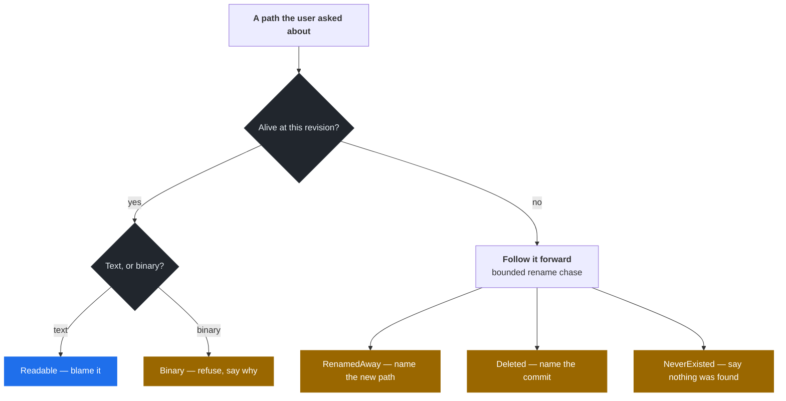
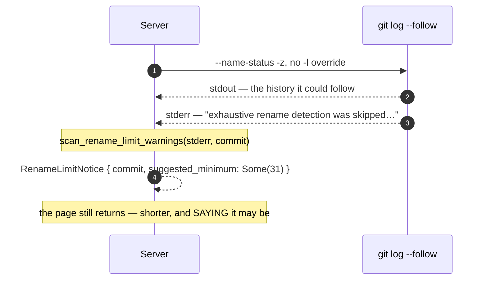
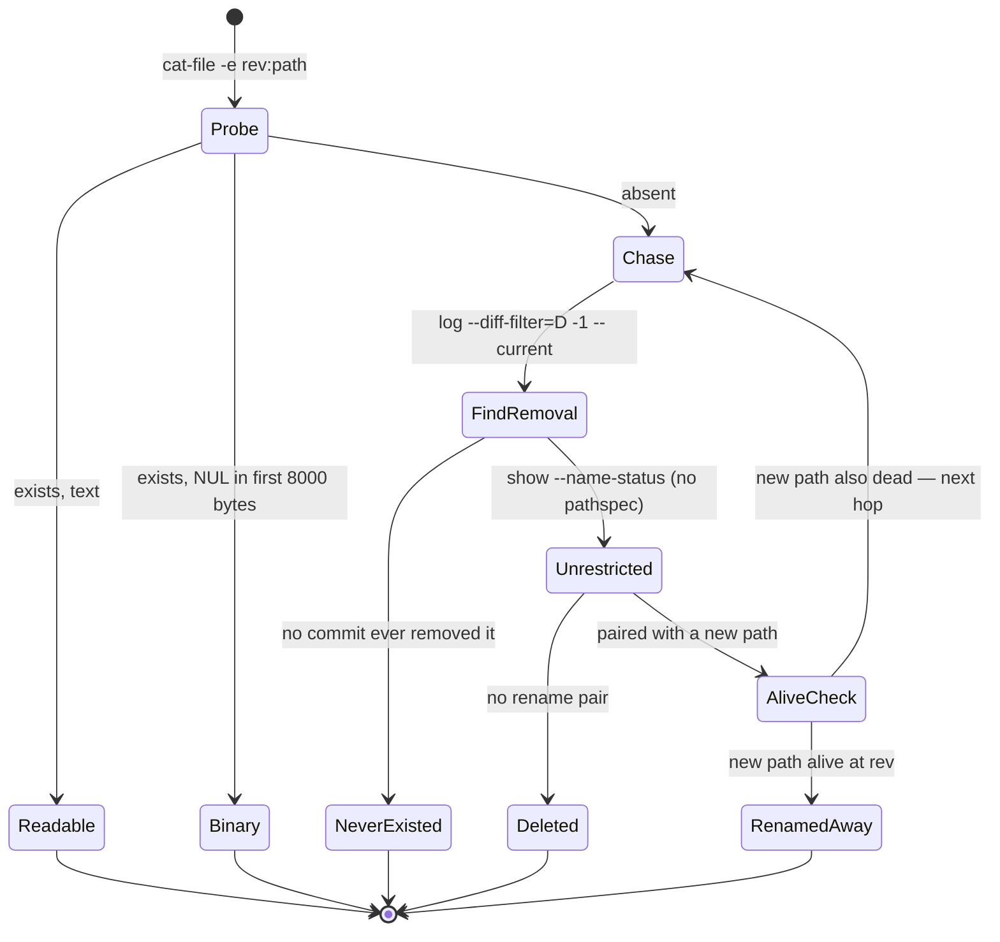

# 0124 — A rename is followed forward by walking, not by asking `--follow`

- **Status:** Accepted — implemented, mutation-proved two ways at disjoint
  assertions (failure-atlas runs 329 and 330), browser-verified.
- **Date:** 2026-09-05
- **Milestone / issue:** M5.33 — Add rename-aware file history and blame (#86)
- **Related:** [0022](0022-paged-history-and-bounded-reads.md) (paged history
  and bounded, cancellable reads — this reuses both its mechanism and its
  accepted cost), [0115](0115-a-mutation-proof-cannot-see-what-it-does-not-run.md)
  (decisions live where a host test can reach them),
  [0062](0062-a-comparison-states-which-question-it-asks.md) (the comparison
  vocabulary a blame range hands off to).
- **Number:** 0124, not 0121. 0121 (#667), 0122 (#668) and 0123 (#586) were
  claimed while this branch was in flight; this branch was cut before any of
  them existed and could not see them. Third near-collision in one round —
  the reason `tests/adr_index_matches_the_files.rs` exists.

## Context

#86 asks for file history and blame "with explicit performance limits", and
names five criteria: paged and cancellable results, blame ranges that map to
commits and comparisons, handled rename limits / binary files / absent paths,
accessible touch selection, and performance fixtures that exist.

Four of those five are really one question asked four ways: **what does this
app do when git's own answer is incomplete, and does the user find out?** A
blame that quietly stops following a file across a rename, a "no history"
that actually means "renamed away", or a page that silently costs the whole
repository — each is a plausible-looking screen with a wrong statement on it.
That is the failure shape this repository has spent the month correcting, and
ADR 0022 named its first instance: a 5,000-commit ceiling that truncated
history without saying so.



## Decision

### 1. The rename engine is real git, not `gix`

Every read here shells out to the `git` binary through the existing
sandboxed, capped, `kill_on_drop` path (`git_cmd::git_stdout_capped`), the
same B3 posture `git-vista-core::diff` already takes for `--numstat` and
`--name-status`. `gix` 0.84 as vendored has its `blame` feature disabled, and
re-implementing similarity detection would put a second, divergent rename
engine beside the one git already ships. This crate only ever parses bytes
git already printed.

### 2. The rename limit is `diff.renameLimit`, observed and reported — never overridden

`git log --follow` falls back to a plain delete+add when a commit changes more
files than `diff.renameLimit` allows for the O(n²) exhaustive comparison.
Verified directly rather than recalled: forcing the limit down (`-l1`) on a
commit that renamed one file *and* changed 30 others prints, to **stderr**,

```text
warning: exhaustive rename detection was skipped due to too many files.
warning: you may want to set your diff.renameLimit variable to at least 31 and retry the command.
```

— and the rename that would otherwise have been detected reports as `D` + `A`
instead of `R`. That is the rename-shaped twin of ADR 0022's commit-count
cliff.

The server does **not** raise the limit. It scans stderr for that exact
sentence family and reports each hit as a first-class `RenameLimitNotice`
carrying the commit and git's own suggested minimum. Raising it silently would
substitute this app's guess for the repository's configured policy; hiding it
would be the silent-truncation failure again.



### 3. Following a rename *forward* is an iterative bounded walk, because `--follow` cannot do it

`--follow` resolves a full rename record only when the queried name is the
**immediate predecessor** of the file's identity at the log's starting point.
Query it with a name two or more renames stale and it degrades the very next
rename into a bare delete, because a pathspec-restricted diff hides the ADD
side of a rename whose OLD name is the only side matching the pathspec.
Measured on a three-generation chain (`a.txt` → `b.txt` → `c.txt`):

| Query | `--follow` reports | Truth |
| --- | --- | --- |
| `c.txt` (live) | the whole chain | the whole chain |
| `b.txt` (one stale) | `D b.txt`, then `R100 a.txt b.txt` | renamed to `c.txt` |
| `a.txt` (two stale) | `D a.txt` only | renamed to `c.txt` |

So `chase_rename_chain` walks it hop by hop instead, and each hop uses that
degradation deliberately:

1. `git log --diff-filter=D -1 -- <current>` — pathspec-restricted, precisely
   *because* it reliably finds the commit that ended this name's life whether
   or not that was a rename.
2. `git show --name-status -M50%` on that one commit, **unrestricted** — the
   ADD side is only visible without the pathspec filter.
3. If the pair's new path is alive, the chain resolves; if it is also dead,
   it becomes `current` and the loop repeats.



The loop is bounded at `MAX_RENAME_HOPS = 20`, so the cost is `O(hops)` git
spawns and never `O(history)`. Measured: 12 hops buried in ~3,000 commits
cost 1.37–2.9s, against 15–60ms for a live name — a ratio that tracks hop
count, not the 3,000.

### 4. Absence is not one fact

`PathState` is `Readable | Binary | NeverExisted | Deleted { last_commit } |
RenamedAway { last_commit, current_path }`, the same posture `HeadState` takes
for HEAD (ADR 0068's shape). A client handed an empty result list cannot tell
"you mistyped this" from "this lives somewhere else now" from "we looked and
found nothing", and those are opposite situations for whoever is reading the
screen. Binary is a **refusal**, not an empty result: `git blame` never
declines binary content — it splits arbitrary bytes on `\n` and blames the
resulting "lines" — so showing that output would be showing nonsense with a
straight face.

### 5. Blame pages by line range, and the doc says what that does *not* bound

`git blame -L <start>,<end>` per page, verified to still resolve renames
across the boundary it cuts. An initial version of this ADR claimed `-L` makes
a page cost `O(page size)` regardless of position. **That was wrong, and the
measurement is why it is not in the shipped text**: git still examines every
commit between the query point and wherever the requested lines settle,
because it cannot know a commit is irrelevant to the range without diffing it.
On a 3,000-commit single-line-per-commit file:

| Page | Raw `git blame -L` |
| --- | --- |
| last 10 lines | **21 ms** |
| middle (line 1500) | 459 ms |
| first 10 lines | 450 ms |

What `-L` genuinely bounds is the parsed and returned result — always exactly
the requested window, never the whole file. What it does not bound is the
walk, whose cost tracks distance from the requested revision to where the
lines last changed. That is the same tradeoff ADR 0022 accepted knowingly for
commit-history paging, applied to blame; it is recorded here rather than
papered over, because a performance claim nobody measured is how "seems fast"
gets into a PR.

### 6. Cancellation is the mechanism ADR 0022 already installed

No new machinery. Every spawn goes through `git_stdout_capped` /
`git_output`, both `kill_on_drop(true)`; axum drops a handler's future when
the client disconnects, which drops the child with it. A navigated-away tab
or an aborted `fetch` kills the git process rather than leaving it to finish
into a buffer nobody will read.

### 7. Blame reads `--line-porcelain`, not `--porcelain`

`--porcelain` prints a commit's metadata only the first time it appears, so a
correct parser needs cross-hunk dedup state. `--line-porcelain` repeats it on
every line-group, making the parser stateless per group — one failure mode (a
malformed group) instead of two (malformed, and "forgot a commit shown three
groups ago"). The extra bytes are bounded by the same cap every other read
here already accepts.

### 8. The view holds no decisions, and a census says so

Per ADR 0115: the panel's wasm-only `view.rs` delegates every decision to
`features/blame/core.rs` (selection state, banner text) or to machinery
already host-tested elsewhere (`offer_for`, `roving_row_key`, `drag_range`).
`cargo test` compiles none of that file, so `view_census.rs` reads its bytes
and pins the claim — including that the two 44px tap targets stay separate,
that `aria-pressed` survives, and that all three pointer phases stay wired
(losing `pointerenter` alone degrades a drag to one-row taps *silently*).
The census caught a false positive against itself on its first run, and the
assertion was narrowed rather than the finding waved through.

## Consequences

**Accepted costs.**

- **Two git spawns per rename hop.** A 20-hop chase is 40 spawns. Bounded and
  measured; the alternative — one `--follow` — returns a confidently wrong
  answer past one hop.
- **A page far from the tip costs more than a page at it.** Stated above,
  measured, and left as it is: the fix would be a cache, and a stale blame
  cache is a worse failure than a slow honest one.
- **`--line-porcelain` sends more bytes than `--porcelain`.** Paid knowingly
  for a parser with one failure mode.
- **The index gap 0121–0123.** This branch cannot see those numbers; the row
  order in `README.md` will need one merge resolution when main comes down.

**What this buys.**

- A file's history survives arbitrarily many renames, and the app can say
  where a dead name went rather than reporting it as gone.
- A rename git *could not* detect is a visible fact with a commit attached,
  not a shorter list.
- Binary and the three absences each say their own sentence.
- A blame range reaches the existing commit-detail panel and the existing
  M4.27 comparison viewer — no second surface for either.

## Alternatives considered

| Alternative | Why not |
| --- | --- |
| One `git log --follow` for the whole chain | Measured wrong past one hop (§3). It is the obvious implementation and it silently reports renames as deletions. |
| Raise `diff.renameLimit` ourselves | Substitutes this app's guess for the repository's configured policy, and turns a reportable fact into a hidden cost. |
| Reconstruct blame segment-by-segment from the rename chain | Needs line-range mapping across renames — a second blame implementation beside git's, to gain nothing git's own rename-following does not already do correctly. |
| Detect binary ourselves rather than reusing the NUL sniff | Two binary heuristics in one codebase that can disagree; `file_at_commit_for_repo` already owns this one. |
| Cache blame results per (path, rev) | The expensive case is the one where history is deepest, which is also the one most likely to be invalidated by the next commit. A stale attribution is worse than a slow one. |
| Fold blame into the existing `ViewerDoc::File` variant | "Two ways to reach one view is how a surface starts disagreeing with itself" — `ViewerDoc`'s own doc, about a different pair. |

## Where this is implemented

| Concern | Path |
| --- | --- |
| wire types + pure parsers (porcelain, `--follow` stream, warning scan) | `crates/git-vista-protocol/src/blame.rs` |
| path classification, rename chase, paging, both endpoints | `crates/git-vista-server/src/handlers/blame.rs` |
| performance fixtures and their measured numbers | `crates/git-vista-server/src/handlers/blame/perf_suite.rs` |
| route classification | `crates/git-vista-server/src/route_authz.rs` |
| client fetches | `crates/git-vista/src/api/blame.rs` |
| pure selection state and banner text | `crates/git-vista/src/features/blame/core.rs` |
| the wasm-only panel, and the census that reads it | `crates/git-vista/src/features/blame/{view.rs,view_census.rs}` |
| touch / keyboard / 44px, in a real browser | `ci/browser/tests/blame-touch.spec.mjs` |

---

**Signed:** max · 2026-09-05T09:05:00-04:00
