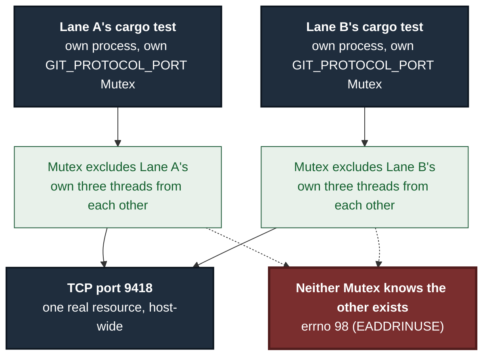
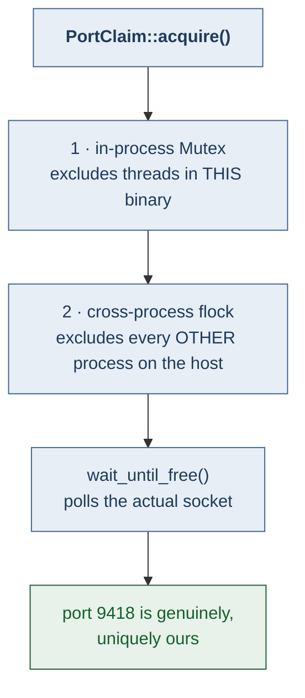

# ADR 0125 — A port claim is only as wide as its lock

- **Status:** Accepted — implemented, mutation-proved two ways failing differently
- **Date:** 2026-09-06
- **Issue:** #674
- **Extends:** [ADR 0119](0119-a-guarantee-that-holds-only-on-the-success-arm-is-not-a-guarantee.md) (safety lives in the value, not a convention)
- **Supersedes / superseded by:** —

## Context

Three unrelated tests in `git-vista-server`'s test binary all need TCP port
9418 — `sandbox::escape_suite::strict_listener_denied`,
`sandbox::escape_suite::strict_tcp_bind_denied`, and
`planner::contract_suite::push_branch_executes_through_the_pipeline`. The
port is not a free choice: it is the one unprivileged entry in
`sandbox::DEFAULT_GIT_PORTS`, the literal port list a Network-tier Landlock
connect grant covers in production. `test_ports::PortClaim` (#66, M1.13b) is
the rendezvous that lets `cargo test`'s default thread-per-test scheduler run
all three without them stepping on each other — a `std::sync::Mutex`, held
for as long as anything is bound to the port.

Two lanes hit `errno 98 (EADDRINUSE)` on this exact port independently on
2026-09-05, while a different lane's `cargo test` ran concurrently. All 26
affected tests passed when serialized. The failures were first attributed to
flakiness; #674 traced them to two compounding facts:

1. `~/.local/bin/buildlock`'s comment says its default concurrency is 1; the
   code actually defaulted `GV_BUILD_SLOTS` to 3.
2. Even at `GV_BUILD_SLOTS=1`, the guarantee that port 9418 has one owner was
   never true across lanes — only within one.

A `Mutex` only ever excludes threads *inside the process that declares it*.
Two lanes each running their own `cargo test` invocation get two entirely
separate copies of `GIT_PROTOCOL_PORT`; from the port's point of view, that
is no exclusion at all.

### Why "give each lane its own port" does not work here

The issue named this as option 2 — derive a distinct port per lane so
concurrency never needs to be given up. Reading the actual call sites rules
it out:

- `sandbox::mod::DEFAULT_GIT_PORTS` is `&[22, 443, 80, 9418]`, unconditionally,
  and it is *production* code: it is the exact port list a real
  Network-tier sandboxed process is allowed to `connect()` out to. It is not
  test fixture configuration.
- `strict_listener_denied`'s whole point is proving that grant is exactly
  9418 and nothing else — a test that connected to a different port under a
  Network-tier grant would either fail (the grant does not cover it) or
  require widening `DEFAULT_GIT_PORTS` itself, which changes what a
  sandboxed process is allowed to reach in production, to buy test
  concurrency.
- `push_branch_executes_through_the_pipeline`'s fixture `git daemon` must be
  reachable *through* that same Network-tier grant for the pipeline's push to
  succeed at all. A daemon on an arbitrary port is unreachable from inside
  the sandbox the test is exercising.

Every current use of the literal `9418` traces back to this one production
constant. Randomizing the test port would mean randomizing (or widening) the
security policy real users run under, to solve a test-scheduling problem —
a strictly worse trade than the one #674 was filed to fix.

## Decision

**The claim's exclusivity becomes a property of the claim, not of whichever
convention (`buildlock`, `GV_BUILD_SLOTS`) happens to be configured to
serialize builds.** `PortClaim::acquire` takes a second lock after the
existing `Mutex`: a blocking `flock` on a fixed, host-wide path
(`/tmp/git-vista-test-port-9418.lock`), held for the claim's whole lifetime
and released by the `File`'s own `Drop`.

The path is fixed and shared, deliberately not per-worktree or per-PID: the
resource being arbitrated is itself host-wide (one TCP port on
`127.0.0.1`), so a "unique" per-lane lock path would just hand two lanes two
different locks guarding the one port neither of them actually owns
exclusively — the same shape of mistake #674 already made once, one layer up.

`buildlock`'s stale comment is also fixed to match its own code
(`GV_BUILD_SLOTS` now genuinely defaults to 1, matching both the script's own
comment and this project's `CLAUDE.md`, which already documented the
*intended* concurrency as 1). This is worth doing regardless of the port fix
— a tool whose comment and behavior disagree is a bug on its own — but it is
not what makes port 9418 safe. A caller that overrides `GV_BUILD_SLOTS`, or
invokes the test binary directly, bypassing `buildlock` entirely, still
reaches `PortClaim::acquire` and is still safe, because the safety no longer
lives in `buildlock` at all.

## Alternatives considered

**Fix only `buildlock`'s default (option 1 as named in the issue), and stop
there.** This is the one-line fix and was applied regardless (see above), but
alone it leaves port safety as a *convention*: true only for callers that go
through `buildlock` with an unmodified `GV_BUILD_SLOTS`. `ADR 0119` already
argues, for a different guarantee, that a rule true only on the path every
test happens to exercise is not a guarantee — the same shape applies here.

**Give each lane's test run its own git-daemon port (option 2 as literally
described).** Rejected — see "Why this does not work here" above. The port
is not a fixture value; it is a mirror of the real Network-tier Landlock
connect grant, and the tests that use it exist specifically to prove that
grant is exactly what it claims to be.

**Widen `DEFAULT_GIT_PORTS` to include a range of test-only ports.** Not
seriously considered: it would make the sandbox's real connect grant depend
on whether a test binary happens to be running, or would require a
test-only policy variant to diverge from the one users actually run under —
either way, weakening or complicating a security boundary to buy test
concurrency.

## Consequences

- Two lanes running `cargo test` concurrently — the scenario #674 was filed
  from — no longer race for port 9418, regardless of `GV_BUILD_SLOTS`.
- The three port-9418-dependent tests still run in the same process, on the
  same port, under the same Landlock policy as production. Nothing about
  what they prove changed.
- A new, narrow cost: any concurrent test run anywhere on the host that
  touches these three tests now queues briefly behind whichever process got
  there first — bounded by how long a `git daemon` fixture or a Landlock
  probe takes, not by a whole build.
- `buildlock`'s own default is now `GV_BUILD_SLOTS=1`, matching its comment
  and this project's documented intent; anyone who had been relying on the
  undocumented default of 3 sees more serialization, deliberately.
- `/tmp/git-vista-test-port-9418.lock` is a new file this box's test runs
  create. It carries no payload and no ownership claim beyond the lock
  itself — safe to delete when nothing holds it, like `buildlock`'s own lock
  files.

## Verification

**Reproduced pre-fix, 3 for 3.** The pre-fix `test_ports.rs`, compiled, with
the three tests' compiled binary invoked as three separate OS processes
(not threads — the actual shape of two concurrent lanes) run concurrently:
every round failed, always the same signature —
`strict_tcp_bind_denied: proved NOTHING — baseline TCP_BIND wanted errno 0
got 98`.

**Same reproduction, post-fix, 9 for 9** (three rounds of three concurrent
processes): every round, all three tests passed.

| Configuration | Rounds | Result |
|---|---|---|
| pre-fix, 3 processes concurrent | 3 | **3 / 3 failed** (errno 98) |
| post-fix, 3 processes concurrent | 3 | **9 / 9 passed** |

`./dev`'s fmt, native clippy (`-D warnings`), and the full `git-vista-server`
test crate (1230 unit tests + 4 integration suites) are green.

### Mutation matrix

`failure-atlas mutation_check` against committed HEAD `ba13f260`, working
tree reported clean.

| Test | Mutation | Result |
|---|---|---|
| `the_cross_process_lock_excludes_independent_openers` | **remove**: `acquire_cross_process_lock` opens the file but never calls `.lock()` | **caught** (record 338) |
| `the_cross_process_lock_excludes_independent_openers` | **weaken**: each call locks its own per-thread path instead of the shared constant, so independent openers no longer contend at all | **caught** (record 339) |

Both fail at the same assertion (the overlap counter), which is the only
assertion this invariant has — there is one claim being made
("independent openers exclude each other") and both mutations break it the
same observable way, from different causes. `a_claim_serializes_concurrent_holders`
(pre-existing) already proves the in-process `Mutex` alone excludes
concurrent threads; the new test is deliberately structured to call
`acquire_cross_process_lock` directly, bypassing that `Mutex`, so a defect
confined to the file lock cannot hide behind it.

The cross-process race itself — genuinely separate OS processes racing for
port 9418 — is not expressible through `mutation_check`'s `test_commands`
(a single `cargo test` invocation is one process regardless of how many
times it is named). The manual three-process reproduction above is the
proof for that half; the mutation matrix is the proof that the reusable
locking primitive it depends on is not a no-op.

---

**Signed:** C3 · 2026-09-06T07:20:00-04:00
