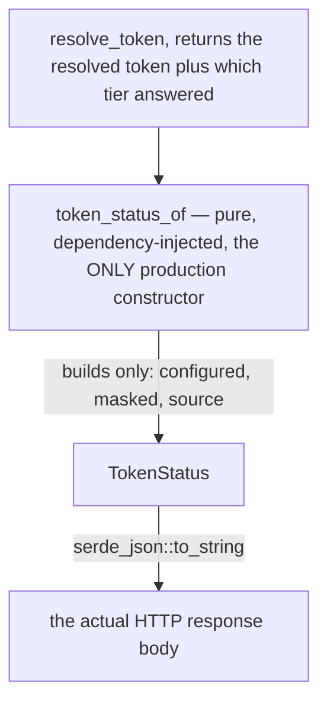

# ADR 0129 — A settings surface writes through the same fence it reads through

- **Status:** Accepted — implemented, mutation-proved two ways failing differently
- **Date:** 2026-09-06
- **Issue:** #584 (M13.03)
- **Extends:** [ADR 0126](0126-absence-is-the-normal-answer-not-a-caught-error.md) (#583) — that ADR's own Consequences section names this exact gap: "A future settings surface (#584 territory) that lets an operator *write* a token still needs its own design — this ADR covers resolution (reading), not provisioning." · `docs/SECURITY_MODEL.md`'s token-storage row, which this adds a sibling row beside
- **Supersedes / superseded by:** Decision 3's live request-time keyring read is superseded by [ADR 0132](0132-a-settings-read-never-negotiates-with-a-locked-keyring.md) (#692); the write target, error posture, masking guarantee, and route boundary remain in force

> **2026-09-06 amendment (#692):** Decision 3 originally required every
> Settings GET and successful POST to call the live resolver. That made a
> synchronous Secret Service unlock attempt part of an async request. ADR
> 0132 replaces only that request-time read policy with one bounded startup
> keyring observation plus a masked snapshot; the sections below state the
> amended contract rather than preserving a known-false runtime claim.

## Context

#583 (ADR 0126) built a resolver — keyring, then `GIT_VISTA_GITHUB_TOKEN`/
`GH_TOKEN`, then a gitignored file — but no way for a human to set the
value it reads, short of editing an environment variable or hand-writing a
file at an undocumented path. #584 is that surface: one UI field, and the
issue's own framing that the headless path ("`GIT_VISTA_GITHUB_TOKEN`,
documented, so a server with no browser attached is fully usable") is worth
thinking hardest about.

That headless half needed no new code at all — #583 already built it. The
actual design question #584 poses is narrower and sharper: **given a
resolver that already knows how to READ from four tiers with a fixed
precedence, what may a WRITE touch, and how does a read-side wire guarantee
("never printed") get proven for a NEW read that a browser can trigger on
demand, not only at boot?**

A second live constraint shaped the answer: `codex-daybreak` was working
#680 (a HIGH-severity credential leak in the clone path — descendants
inheriting the token from the environment, clone relaying raw child
stderr) in the same file, the same morning. The two efforts needed to be
provably non-overlapping without either lane blocking on the other.

## Decision

### 1. The write targets exactly one tier: the OS keyring

`store_token(token: &str) -> Result<(), StoreTokenError>` calls
`keyring::Entry::new(KEYRING_SERVICE, KEYRING_USERNAME).set_password(...)`
— the same two fixed constants `resolve_token`'s read side already
addresses, and nothing else. Two tiers are deliberately unreachable from
this surface:

- **The environment-variable tiers are not this process's to rewrite.**
  `GIT_VISTA_GITHUB_TOKEN`/`GH_TOKEN` are read from whatever launched this
  process; a settings surface that could somehow persist a value into a
  *future* process's environment would be a different, much stranger
  feature than "save a token."
- **The tier-3 file is a human's manual fallback, not a target the app
  writes on the user's behalf.** ADR 0126's own doc for
  `state::token_file_path()` already frames it as a fallback for a machine
  with no keyring ("set this file's contents… when neither the OS keyring
  nor `GIT_VISTA_GITHUB_TOKEN`/`GH_TOKEN` has one"), meant to be edited by
  hand. Letting the settings UI fall back to writing plaintext there when
  the keyring fails would make "did this save land somewhere secure"
  depend silently on which machine it ran on — the same shape of silent
  degradation ADR 0126 itself flags for the tier's *read* side, but on the
  write side, worse: a write's caller asked for something to happen and
  has no way to learn it happened somewhere weaker.

Choosing "keyring only, no negotiated fallback" is therefore not
incompleteness — it is the same "the safety lives in the shape, not a
list" reasoning ADR 0123 already committed this repository to for a
different value: **the write path's whole security claim is that a saved
token lives in a secure store; a path that could quietly not do that is a
path with no claim left to make.**

### 2. A write failure is reported, never folded to `None`

ADR 0126 decision 1 made every *read* fold failure into `None` — a missing
D-Bus session, a locked Secret Service, an unset variable, are all
indistinguishable from "never configured," because from a resolver's
perspective they are. A *write* has no equivalent safe default: the user
just asked for a specific thing to happen, and "it silently didn't" is
never an acceptable substitute for "it happened." `StoreTokenError` has two
variants — `Blank` (client error, `400`) and `Keyring(String)` (server-side
failure, `502`, carrying the backend's own diagnostic text) — and the HTTP
handler reports one or the other rather than a bare `200` regardless of
outcome.

### 3. The read side follows the same precedence without a request-time keyring call

ADR 0132 supersedes this decision's original "resolve everything live on
every request" mechanism. `RequestTokenResolver` retains only the masked
status of a keyring value observed during one startup probe, bounded at two
seconds and run on Tokio's blocking pool. A GET first uses that snapshot;
when no usable keyring was observed, it evaluates
`GIT_VISTA_GITHUB_TOKEN`, then `GH_TOKEN`, then the fallback file lazily
and live. It never calls the synchronous keyring API.

A successful POST still establishes a real fact: `set_password` returned
success for the highest-precedence tier. It updates the same masked snapshot
from the submitted value and returns it without a D-Bus read-back. An
external keyring change after startup is therefore not reflected until a
successful Settings write or restart. That deliberate staleness replaces an
unbounded, repeatable unlock interaction on the request path; ADR 0132 owns
the trade-off and exact locked-keyring behavior.

### 4. The only production constructor cannot put the value on the wire, and that is proved at the wire, not by inspecting the type

`TokenStatus { configured: bool, masked: Option<String>, source:
Option<String> }` is not itself sealed against carrying the value —
`masked`/`source` are plain `Option<String>`, and nothing at the type
level stops a hand-built literal from putting a raw token in either one.
The guarantee is one level down, in construction, and the issue's
acceptance criterion is explicit that inspecting the type is not how it
gets checked: *"The value is never returned by any read endpoint —
asserted at the wire level, not by inspection."*

- **The constructor.** `token_status_of` is the only place production code
  builds a `TokenStatus`. It always sets `masked` from `mask_token`'s
  output and `source` from `TokenSource::label()`'s fixed `&'static str` —
  never the resolved `String` itself. A future caller that hand-built a
  `TokenStatus` some other way would not be stopped by the type; it would
  be a new, unaudited construction site.
- **The test.** `token_status_of`'s host tests do not merely construct a
  `TokenStatus` and inspect its fields — they call
  `serde_json::to_string(&status)` (the actual wire serialization a client
  receives) and assert the real secret substring is absent from the
  **whole serialized value**, for all four resolution tiers, not only the
  one a hand-picked example might have exercised.

This is a constructor-and-wire-test guarantee, not a type-level seal — a
narrower and more honest claim than "the type cannot carry it." A type-level
seal would need a newtype with a private inner (`Masked(String)`, say,
constructible only via `mask_token`); nothing here builds one, because the
one production path is already covered and a newtype is a bigger change
than #584 asked for.

### 5. Both routes sit behind the full write posture, and never the LAN listener

`GET`/`POST /api/settings/token` are registered inside `main.rs`'s
`if full_routes` block — never on the LAN listener — and classified in
`route_authz.rs` (`GET`: `SessionRequired`; `POST`: `SessionAndCsrf`, the
same posture as `/api/rescan`). This is a stricter reading of the LAN
boundary than most reads get: `/api/rebase-status` (a repository-state
read) is registered on *both* listeners, but whether the operator has
configured a credential at all — masked or not — is operator-configuration
in a way no LAN viewer has a legitimate reason to see, so it stays
alongside the write/select/clone endpoints ADR 0005 already reasons about
this way.

## Alternatives considered

**Let a failed keyring write fall back to the tier-3 file.** Rejected —
decision 1. This is the alternative that most looks like completeness
("at least SOMETHING gets saved") and is exactly the failure mode decision
1 argues against: a save that appears to succeed while silently landing in
a weaker store than the one the UI implies.

**Cache only whether the settings surface's own last write succeeded.** The
original decision rejected this in favor of a fully live read. ADR 0132's
replacement is narrower than that rejected design: startup first makes one
bounded real keyring observation, stores only its masked status, and a later
successful POST updates it. Environment/file tiers remain live. The change
was necessary because the supposedly "fast, local" keyring call is a
synchronous D-Bus operation that can attempt an unlock and wait indefinitely.

**Mask by inspection only (read the struct definition, confirm the only
production constructor masks the value) rather than a runtime wire-level
test.** Rejected — decision 4, and the issue's own wording ("asserted at
the wire level, not by inspection") rules this out explicitly. Reading the
code and running it are different claims; ADR 0115's own
finding (a composition site outside either of two well-tested functions
could still be wrong) is the general shape of why "the two pieces are each
correct" does not imply "the wire format is correct."

**Register `GET /api/settings/token` on the LAN listener, like
`/api/rebase-status`.** Rejected — decision 5. Repository-state reads and
operator-credential-configuration reads are different in kind: the former
describes what the served repository could do next, which a read-only
viewer plausibly wants; the latter describes what the *operator* has
configured, which a LAN viewer has no standing to ask about at all, masked
or not.

## Consequences

- `token_store.rs` gained its first write path here — `store_token`,
  `StoreTokenError`, and `token_status_of`. ADR 0132 later replaced
  `token_status` with the request-scoped `RequestTokenResolver` and changed
  `resolve_from` to accept lazy source functions; `resolve_token`'s public
  precedence and provenance remain unchanged.
- The credential chain now has two independent, non-overlapping efforts
  touching it the same day: this ADR (provisioning) and `#680`
  (containment — descendants inheriting the token from the environment,
  clone relaying raw child stderr). Neither modifies the other's surface;
  `git log` and each PR's own diff are the record of that, not this
  document's claim alone.
- A future diagnostics surface (`gv doctor`, a CLI flag) must choose
  explicitly between live credential resolution and ADR 0132's bounded
  request policy; there is no longer one `token_status()` pretending those
  have the same blocking contract.
- The settings dialog (`dialogs::settings`, wasm-only) is deliberately
  thin: every decision it needs — the status sentence, whether Save is
  enabled, what the input field holds after a save settles — lives in
  `features::settings::core` (framework-free, host-tested), per ADR 0115.
- No change to `docs/SECURITY_MODEL.md`'s existing token-storage row; a new
  row beside it covers this ADR's surface specifically, so neither becomes
  stale independent of the other.

## Mutation proof

Two arms against `crates/git-vista-server/src/token_store.rs`'s
`token_status_of` — the function decision 4's wire-level guarantee rests
on — proved via `failure-atlas`'s `mutation_check` (a fresh clone at HEAD,
run unmutated then mutated, never touching this working tree), picked to
fail differently rather than repeat the same red twice.

| arm | mutation | mutated result |
|---|---|---|
| leak the value directly | `masked: Some(mask_token(&token))` → `masked: Some(token)` (the full, unmasked value) | caught: `token_status_of_present_names_the_source_and_masks_the_value` fails on the exact-match assertion against `"...wxyz"`, and the wire-level substring check fails independently |
| leak through a different field | `source: Some(source.label().to_string())` → `source: Some(token.clone())` (the resolved token substituted for the tier label) | caught, and by a **different** assertion: `token_status_of_present_names_the_source_and_masks_the_value`'s `source` equality check fails while `masked` stays correct — proving the wire-level substring test in the OTHER new test (`token_status_of_never_lets_the_value_reach_the_wire_whichever_tier_answered`) is not the only thing standing between this function and a leak |

Both caught, neither survived, and the failure shapes are disjoint: arm
one is caught on the field the function's whole job is to mask; arm two is
caught on a field with no masking responsibility at all, proving the two
fields are independently guarded rather than one assertion accidentally
covering both. Run key `gv-584-token-status`.

A second mutation-proof pair covers `handlers/settings.rs`'s
`store_error_response` — the mapping decision 2 relies on to keep a client
mistake and a server-side keyring failure from being reported as the same
kind of thing.

| arm | mutation | mutated result |
|---|---|---|
| collapse both arms to the same status | `StoreTokenError::Keyring(_) => (StatusCode::BAD_REQUEST, ...)` (report a server failure as a client error) | caught: `a_keyring_failure_is_a_server_error_naming_the_backend` fails on the status-code assertion, and `the_two_error_kinds_map_to_different_status_codes` fails independently |
| drop the backend's diagnostic text | `format!("Couldn't save to the OS keyring: {reason}")` → a fixed string with no `{reason}` interpolation | caught: `a_keyring_failure_is_a_server_error_naming_the_backend`'s `message.contains("no storage access")` assertion fails, while the status-code assertion stays green — a different failure than arm one's |

Run key `gv-584-store-error-response`.
