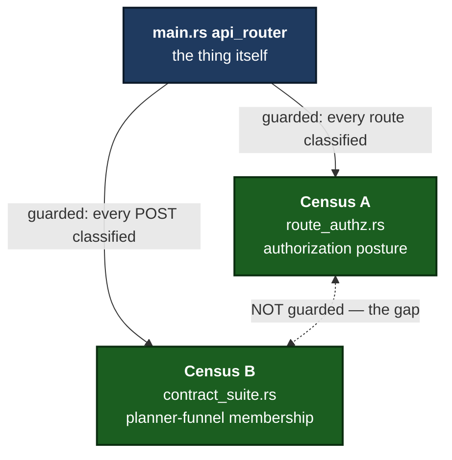
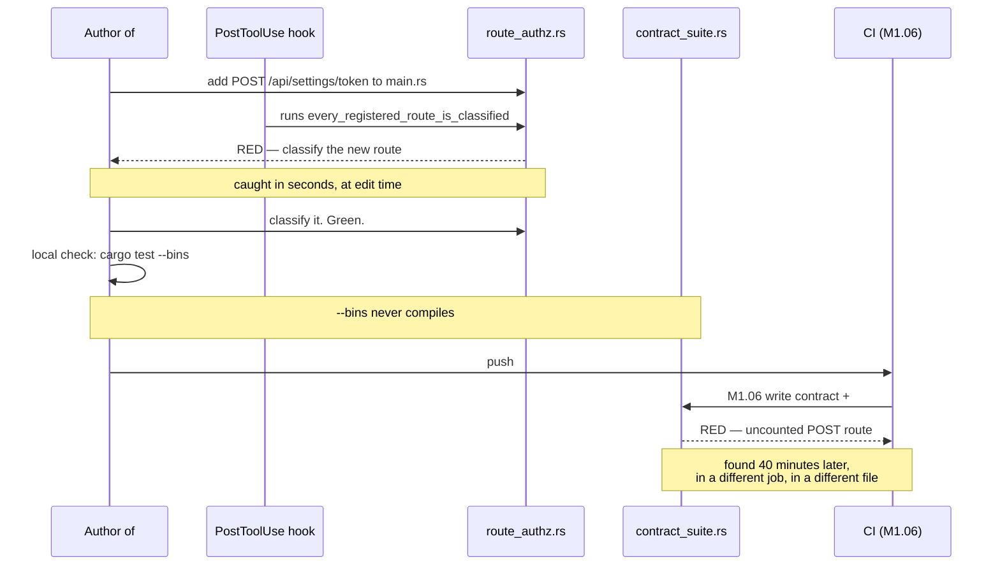
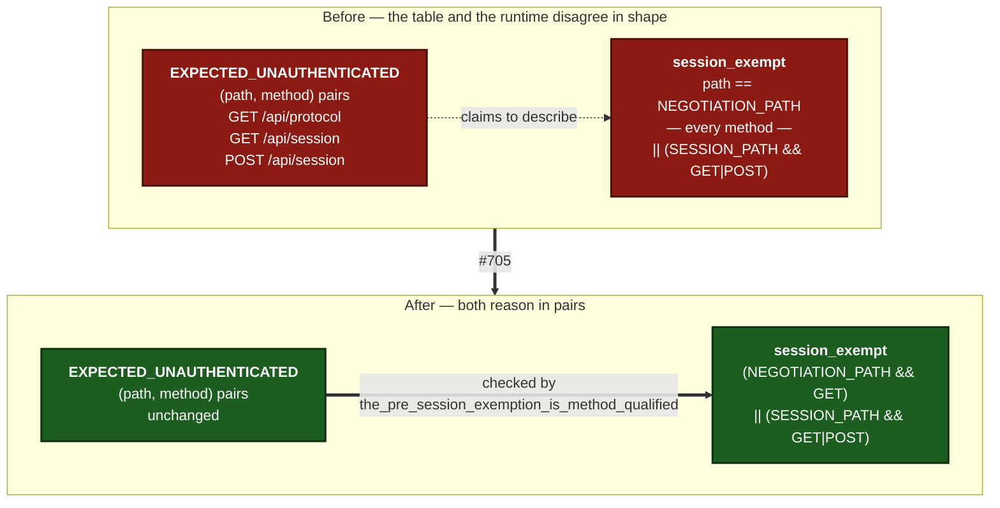
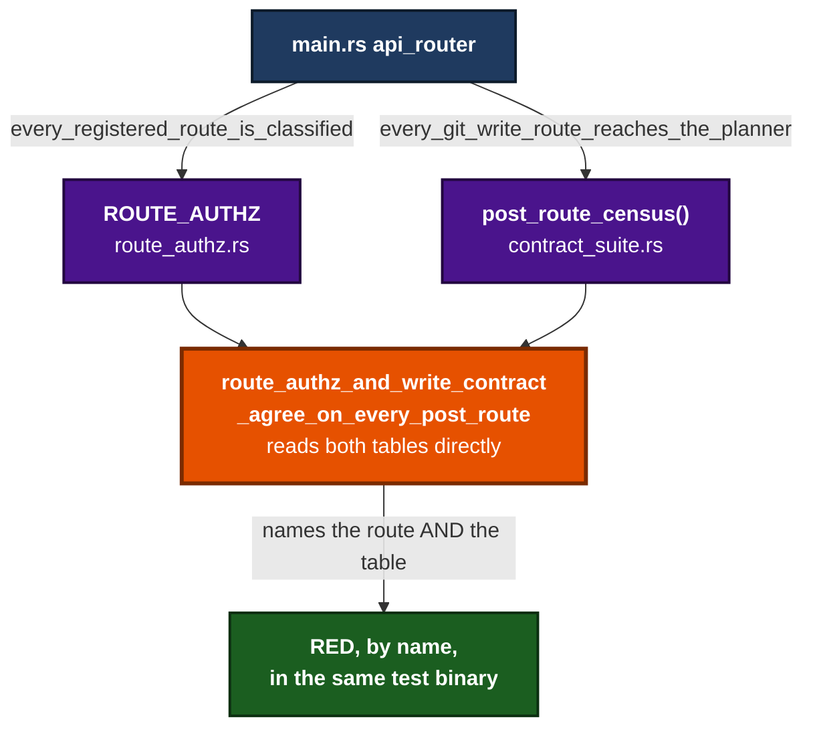
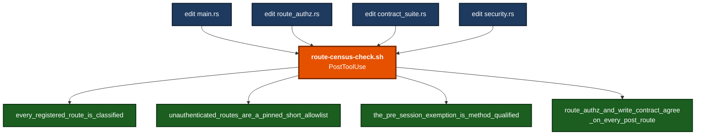
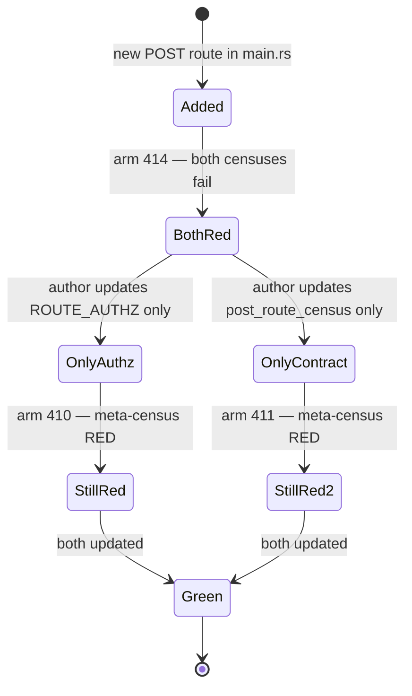
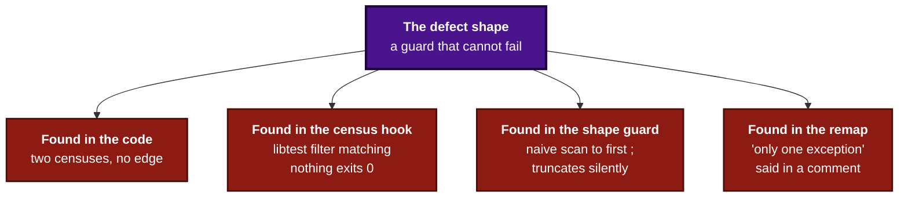
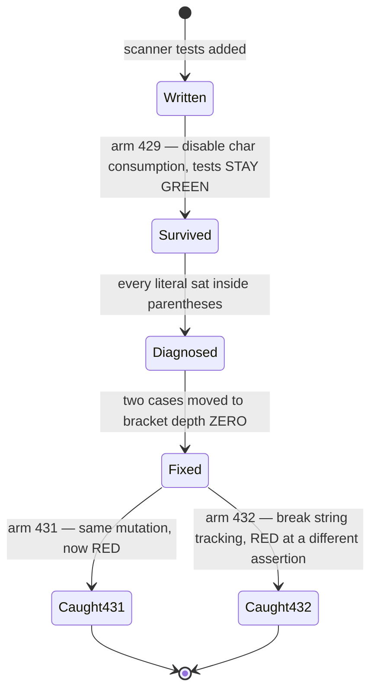

# ADR 0134 — Two censuses that must agree are checked against each other

- **Status:** Accepted — implemented, mutation-proved two ways per invariant. Eleven arms caught and **one survived** (arm 429, in this change's own test — kept in the record below, because it is the fifth instance of this ADR's defect shape and the only one caught by a machine rather than a reader)
- **Date:** 2026-09-07
- **Issues:** #690 (two route censuses), #705 (the pre-session allowlist and its runtime)
- **Extends:** [ADR 0119](0119-a-guarantee-that-holds-only-on-the-success-arm-is-not-a-guarantee.md) — "a list of known sites is not a fix, because that list was already incomplete twice — the safety has to live in the value," applied one level up: not to a list of call sites, but to two independently hand-maintained *descriptions of the same thing*, each individually complete and individually well-guarded, that must both change together
- **Builds on:** `route_authz.rs`'s existing route census and #703's `post_route_census`
- **Supersedes / superseded by:** —

## The shape, in one sentence

When two artefacts describe the same underlying thing for different reasons,
guarding each one against the *thing* is not enough — something must also
check them against **each other**, or the first edit that satisfies one and
forgets the other passes every test that exists.

Both censuses were always correct. Neither was ever wrong on its own. The
defect lived in the *absence of an edge* between them.

## Context

### The two censuses

`crates/git-vista-server/src/route_authz.rs`'s `ROUTE_AUTHZ` classifies every
route `main.rs`'s `api_router` registers by the authorization it must sit
behind — `Unauthenticated`, `SessionRequired`, `SessionAndCsrf` — and pins a
fixed `EXPECTED_ROUTE_COUNT`.

`crates/git-vista-server/src/planner/contract_suite.rs`'s `post_route_census`
classifies every POST route as a git write that must reach the planner
(`GitWrite(entry)`), a `NonGitWrite` (catalog, credential, auth, cancel), or a
`ReadLike` POST — a read wearing a write's verb because the CSRF gate keys on
the method.

Each has its own test proving it agrees with `main.rs` in both directions:
nothing registered is unclassified, nothing classified has been quietly
deleted. Each is strong. Nothing pointed from either to the other.

### How the gap was found — #584 / PR #688

The hook knew about one table. It fired, ran the one test it knew, went green,
and said nothing about the second table's existence. The local verification
that ran alongside the edit could not have caught it either: `--bins` does not
compile the integration-test target set, and the failure surfaced only in CI.

The author did nothing wrong. The process had no step at which the second
table could have been discovered.

### The same shape again, one layer down — #705

`route_authz.rs`'s `EXPECTED_UNAUTHENTICATED` pins the pre-session allowlist
as three `(path, method)` pairs and presents itself as *exact*. `security.rs`'s
`require_auth` is what actually enforces it. The two were written
independently, and drifted in **shape**, not in content:

**No bypass existed, and this ADR does not claim one.** `main.rs` registers
only `get(protocol_info)` on that path, so `POST /api/protocol` ended at
`405 Method Not Allowed` — the router refused it because no handler was
there. That is a safe *accident*, not a guarantee: it holds only while nobody
registers a write handler on the negotiation path. What was actually broken
was the **audit**. A future `POST /api/protocol` could have been classified
`SessionAndCsrf` in `ROUTE_AUTHZ`, satisfied every structural test in that
file, and run with neither session nor CSRF checked.

The measured difference is exactly one status code, and it is the whole issue:

| request, no session | before | after |
|---|---|---|
| `GET /api/protocol` | 200 — exempt | 200 — exempt (unchanged) |
| `POST /api/protocol` | **405** — refused by the *router* | **401** — refused by the *session gate* |

A `405` there means the gate is open and only the missing handler is hiding
it. The wire test asserts `401` specifically, rather than merely "not 2xx",
because that is the only assertion able to tell the accident from the
guarantee.

## Decision

### 1. A third test reads both censuses directly and asserts their POST sets are identical

`route_authz_and_write_contract_agree_on_every_post_route`, in
`planner/contract_suite.rs`, computes the POST-route set of
`route_authz::ROUTE_AUTHZ` and the route set of `post_route_census()`, and
panics naming the exact route *and which table is missing it*.

It reads the two tables **directly** rather than re-scanning `main.rs` a third
way. A third scanner would be a third hand-maintained thing that could itself
drift — the very failure this ADR exists to close, moved one step further out.

`ROUTE_AUTHZ`, its `Authz` enum (named because it appears in the table's
element type, even though the test destructures it with `_`), and the
`route_authz` module in `main.rs` became `pub(crate)` for exactly this. All
remain `#[cfg(test)]`-gated at their module root.

One deliberate exception is mapped, not ignored: `post_route_census`'s first
row names the *handler* `create_session`, not a path, because session
bootstrap is registered with a bare `.post(create_session)`. Its real route is
`POST /api/session`, which is how `ROUTE_AUTHZ` names it, so the test maps
across. A second such exception would mean the tables had stopped describing
the same thing, and the comment says so.

### 2. The runtime pre-session exemption is method-qualified, and that shape is structural

`session_exempt` now names the same three pairs the table does.
`the_pre_session_exemption_is_method_qualified` (in `route_authz.rs`, beside
the table it defends) reads `security.rs`, splits the `session_exempt`
expression on `||`, and requires **every disjunct to test a method as well as
a path** — plus that each pinned path appears in the expression by its runtime
constant, so renaming one and not the other cannot pass.

Checking the *shape* rather than the *count* is the point. Both sides counted
three before the fix; a count check would have stayed green forever.

### 3. The `PostToolUse` hook is extended, not replaced

`route-census-check.sh` now fires on edits to `route_authz.rs`, `main.rs`,
`contract_suite.rs` **and** `security.rs`, and runs four tests rather than one.

`contract_suite.rs` and `security.rs` are on the trigger list because the
hook's whole purpose is to catch drift the moment *either side* is edited, not
only when the router is. This is the fix for the failure #584 actually hit:
the edit-time signal now covers the relationship, not just one endpoint of it.

### 4. A single source-of-truth table was considered and not built

The issue offered three directions. The single-source table — one row per
route carrying both classifications — would work, but `ROUTE_AUTHZ` and
`post_route_census` classify different things for different reasons (security
posture vs. planner-funnel membership), are read by tests with different
shapes, and carry failure messages tuned to what a maintainer must do next.
Merging them is a larger, riskier refactor of two files to close a
*discoverability* gap that the meta-census closes just as completely at a
fraction of the risk. Nothing here forecloses it later: if a third census ever
needs the same route set, that is the trigger to revisit, and this paragraph
is the standing argument for doing so.

The doc-comment cross-reference (the issue's own weakest option) was rejected
outright: a comment is exactly the fix that "looks read" without being
enforced — the shape ADR 0119 already ruled out.

## Consequences

- A route added to one census and not the other now fails **by name, in the
  same test binary as both tables**, rather than only in whichever CI job
  happens to exercise the table nobody thought to check.
- The hook catches the exact #584 failure at edit time, not merge time.
- `GET /api/protocol` is unchanged. **`HEAD /api/protocol` is a deliberate
  behaviour change**: Axum serves `HEAD` implicitly from a `get(...)` route,
  so it was previously pre-session and now requires a session like any other
  read. Nothing in this codebase issues one. Pinning a fourth pair instead
  would need a `HEAD` row in `ROUTE_AUTHZ` that `main.rs` never registers and
  the route census would then reject — stating the consequence is cheaper and
  more honest than bending the census around it.
- `ROUTE_AUTHZ`, `Authz` and the `route_authz` module are `pub(crate)` purely
  so the cross-check can read them. Nothing outside this crate's test code is
  expected to use the wider visibility.
- **The next hand-maintained pair with this shape should get the same
  treatment** rather than a bespoke fix. Two descriptions of one thing, each
  guarded only against the thing, is now a recognised defect shape in this
  project, and a cross-check between them is the default answer.

### A note on how this landed

This branch originally hoisted `contract_suite.rs`'s table into its own
`KNOWN_POST_ROUTES` const. While it sat unmerged, #703 landed a strictly
better structure on `main` — `post_route_census()` returning typed
`(path, handler, PostKind)` rows, with the git-write distinction in the *type*
rather than in a comment, and carrying #87's three new bisect routes. The
merge was resolved by taking main's version of that file wholesale and
rebuilding the meta-census on top of it, rather than stitching two tables
together. The cross-check is the decision; which table it reads is not.

## Mutation proof

Five arms through `failure-atlas`'s `mutation_check`, `run_key`
`gv-lane-3-690-705`, every baseline green and the working tree clean
(`source_working_tree_dirty: false`). Two arms per invariant, chosen to fail
*differently* rather than to break the same thing twice.

| # | invariant | mutation | verdict |
|---|---|---|---|
| 410 | #690 cross-check, A-not-B | remove `/api/rescan` from `post_route_census()`, leave it in `ROUTE_AUTHZ` — **the exact #584 shape** | **caught** — panics at `contract_suite.rs:3540` naming `/api/rescan` as present in `ROUTE_AUTHZ`, absent from `post_route_census()` |
| 411 | #690 cross-check, B-not-A | remove `/api/rescan` from `ROUTE_AUTHZ`, leave it in `post_route_census()` | **caught** — panics at `contract_suite.rs:3550`, the *opposite* `difference()` branch, a genuinely disjoint assertion |
| 414 | both censuses still bind to the router | add `POST /api/rescan-twice` to `main.rs`, update neither table | **caught** — `every_registered_route_is_classified` **and** `every_git_write_route_reaches_the_planner` both red (`left: 49, right: 48`) |
| 412 | #705 shape guard | revert `session_exempt` to the path-only clause | **caught twice, differently** — the structural test fails on clause shape; the wire test fails `left: 405, right: 401` |
| 413 | #705 value guard | keep it method-qualified but wrong: `Method::GET` → `Method::PATCH` | **caught** — the structural test correctly **passes** (still pair-shaped) while `the_negotiation_get_stays_pre_session` fails `left: 401, right: 200` |

Arms 412 and 413 are the pair that matters most: they prove the structural
test and the wire test cover genuinely different properties. 413 is green on
the structural test and red on the wire test, so neither is standing in for
the other.

Arms 410, 411 and 414 together prove the property the issue actually asked
for, which a one-sided check cannot give:

Satisfying one census leaves the build red until the other is updated too.
That is the whole issue, and it is now a measured property rather than a
claim.

## The review found this same shape inside the fix — twice

PR #724's cross-family review (grok) found two guards **in this change** that
could pass while checking nothing. Recording them here rather than quietly
fixing them, because the recurrence is the lesson: the defect this ADR names is
easy to reintroduce *while writing the fix for it*.

**1. The shape guard read the expression with a naive scan to the first `;`.**
Its own comment asserted the expression "contains no string literals or nested
statements" — a claim about code nobody has written yet, not a check on it. A
`;` inside a string literal in a later clause truncates the slice, and the
truncated head still contains both `||` arms, both `Method::` tests and both
path constants, so **every assertion passes while a trailing
`|| path == "/api/x"` goes entirely unread**. `session_exempt_expression()` now
tracks string literals and bracket depth the way `strip_line_comments` already
did — the sturdier tool was in the same file all along — and returns `None`
rather than a truncated slice. It also *refuses loudly* on the two constructs it
does not model (char literals, block comments) instead of assuming they will
never appear, which is the assumption that made the first version inert.

**2. The `create_session` remap's "keep this the only exception" was a comment.**
An *unmapped* extra handler-named row already failed the set difference; a
second *mapped* exception would have stayed green. The exception set is now
asserted — every row names a path except exactly one known handler-named row.

**3. Still unproved, and named rather than hidden:** the census hook's own
hardening is verified by inspection, not by a test that can go red, because
nothing in this repository tests `.claude/hooks/*.sh` at all. That is the one
guard in this change whose correctness does not rest on a mutation proof.

### The four review arms

| # | invariant | mutation | verdict |
|---|---|---|---|
| 424 | the shape guard reads the *whole* expression | add a `;`-bearing string literal to a clause, then append `\|\| path == "/api/evil"` — the exact silent-truncation case | **caught** — and the panic prints the full expression *including* the trailing clause, proving the scan passed the string |
| 425 | it refuses what it cannot model | introduce a char literal (`path.starts_with('/')`) | **caught** — the refusal fires, at a different assertion and message than 424 |
| 426 | a second handler-named row cannot slip in | rename `/api/rescan` to `rescan` in `post_route_census()` | **caught** — by the *new* assertion, which fires before the set difference, so it is live rather than shadowed |
| 427 | the exception filter is the right way round | invert `!route.starts_with('/')` | **caught** — a different failure mode again |

`run_key` `gv-lane-3-724-review`, every baseline green, working tree clean.

### A fifth instance — and the only one a reader did not catch

grok's second, non-blocking suggestion was to move the char-literal decision
into the scanner rather than refuse on a whole-expression `contains('\'')`,
which could not tell `&'a T` or `'static` from `';'`. Taken. That converted a
*refusal* into real *handling* — and since this ADR had just finished insisting
that refusing is not handling, the honest follow-up was to prove the handling,
not to re-prove a refusal that no longer existed. Hence
`the_session_exempt_scanner_reads_whole_statements`, testing
`session_exempt_expression` directly as a pure function.

**That test was itself inert, and `mutation_check` said so.**

Every literal in those cases was wrapped in parentheses, so `depth > 0` skipped
the `;` before the string or char branch was ever consulted. **Bracket depth was
doing all the work**; both literal branches could have been deleted with the
suite still green. The test named a property it could not fail on — this ADR's
defect shape, committed inside the test written to prove that shape was fixed.

It also forced a correction to arm 424's reading. That arm proved the new
scanner reads *further* than the old one; it did **not** isolate string
tracking, because the real `session_exempt` clauses are parenthesised too, so
depth alone would have carried the same input. The claim was true and the
evidence was weaker than claimed — a distinction easy to miss when the verdict
says `caught`.

| # | mutation | verdict |
|---|---|---|
| 429 | disable char-literal consumption | **survived** — the defect, recorded |
| 431 | the same mutation, after the cases moved to depth zero | **caught** — truncates to `let session_exempt = a == '` |
| 432 | break string tracking (`in_string = true` → `false`) | **caught** — a different assertion, truncates to `a == "x` |

**The lesson, and it is the whole ADR restated:** four humans-or-models read
this change and none of them saw that the test could not fail. A machine that
breaks the mechanism and re-runs did, in thirty seconds. Reading proves a guard
is *present*; only breaking the thing it guards proves it is *live*. Every arm
in this document exists for that reason, and arm 429 is the one that earned it.

---

**Signed:** max · 2026-09-07T18:05:00-04:00
