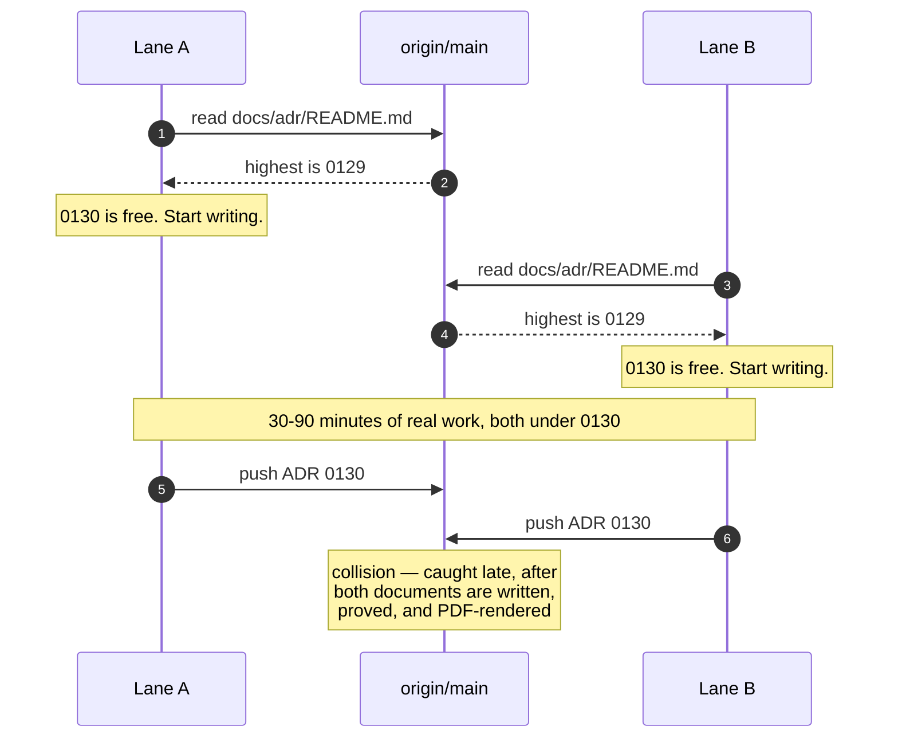
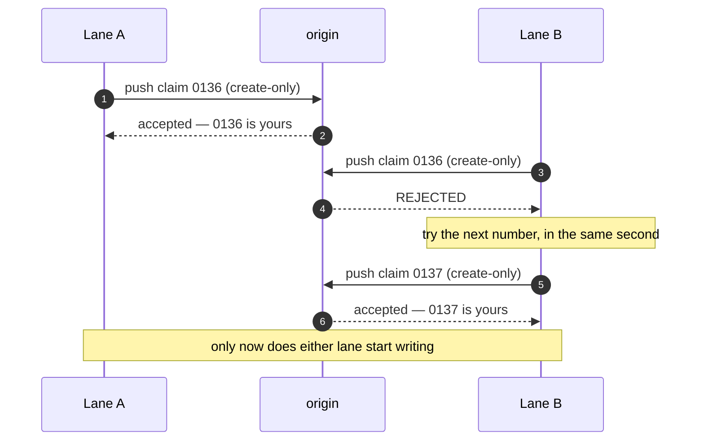
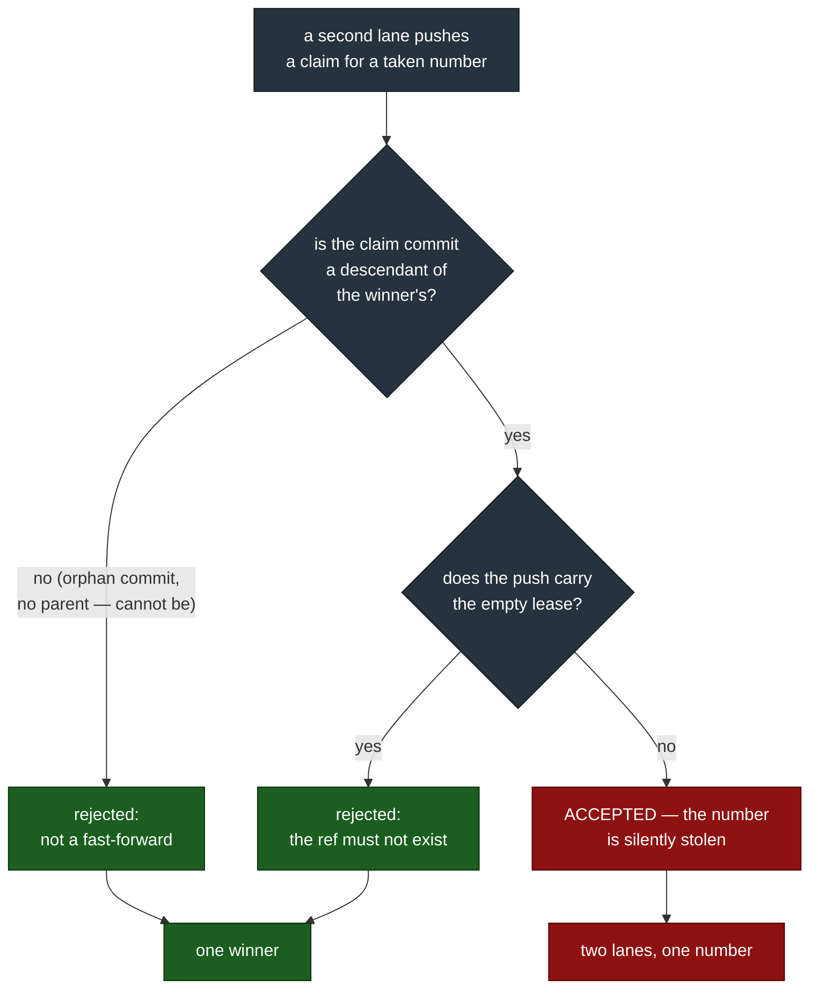
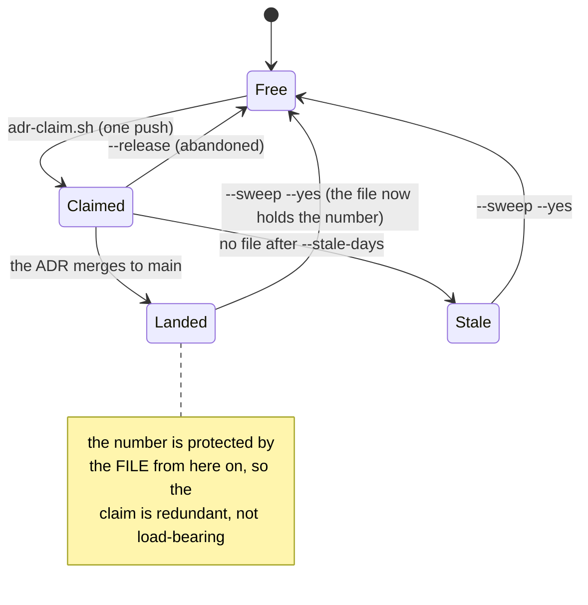
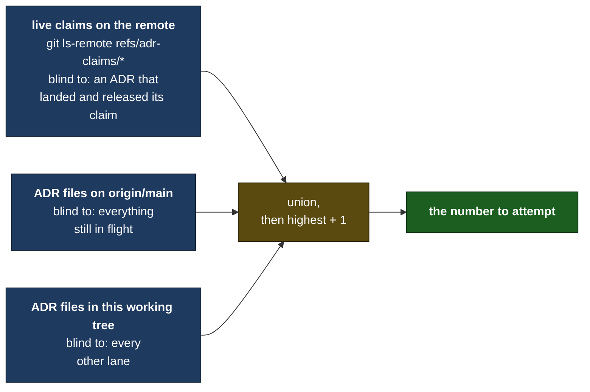

# ADR 0136 — A number is claimed by a push, not by a read

- **Status:** Accepted — implemented, mutation-proved three ways failing differently
- **Date:** 2026-09-07
- **Issue:** #697
- **Supersedes / superseded by:** completes [0130](0130-a-claimed-number-is-provisional-until-it-merges.md), which named this fix and deferred it

## Context

ADR 0130 answered #689's five same-day ADR-number collisions with two
mitigations that make a collision **cheap**: a test that catches heading
drift the moment it is introduced, and `scripts/adr-renumber.sh`, which
turns the repair from a five-place hand-edit into one reviewable command.

It deliberately did not make a collision **impossible**. Its own
"Alternatives considered" names the fix — reserve the number in a small,
immediately-pushed commit before any work starts — rejects it as heavier
than that day warranted, and sets an explicit trigger for revisiting:

> Worth reconsidering if collisions keep recurring after this ADR's two
> mitigations ship — the table above would then be evidence that "make
> lateness cheap" was not enough.

They recurred before the ink was dry. #694 and #695 both claimed 0130
simultaneously, while #697 — the issue that names the problem — was being
written. That is six collisions in one day, and the sixth landed on the
pull request meant to fix the first five. The evidence bar 0130 set has
been met by 0130's own merge window.

### The gap is structural, not a lapse

Every lane in the table followed the documented process correctly. The
process is the defect:



The window between arrow 2 and arrow 5 is the whole bug. Nothing on the
remote holds 0130 for lane A during it, so lane B's read is correct and its
conclusion is wrong. No amount of "check the index immediately before
claiming" closes a window whose width is the length of the work.

Worth stating plainly, because it changes what a fix has to do: **none of
these collisions was ever silent.** `adr_index_matches_the_files.rs`
already turns two files sharing a number into a hard `panic!`; merge
conflicts and reviewers caught the rest. The failure is lateness, and 0130
bought as much as making lateness cheap can buy. The remaining cost is the
work done under the wrong number before anyone finds out.

## Decision

**A number is claimed by pushing, not by reading.** Before writing an ADR,
a lane runs `scripts/adr-claim.sh`, which pushes a claim to the remote and
prints the number it won. The push either succeeds — this lane owns the
number — or is rejected outright, and there is no state in between.



### The mechanism

The claim is one `git push` of an **orphan commit** to
`refs/adr-claims/NNNN`, carrying `--force-with-lease=refs/adr-claims/NNNN:`
— an **empty** expected value, which means *this ref must not exist*. The
remote applies that as a compare-and-swap against the ref's current value,
and a ref update is atomic. Two lanes racing therefore produce exactly one
winner and one outright rejection. Git's own push semantics are the
arbiter; there is no lock service, no polling, and nothing to keep running.

Three properties, each measured against this repository's real remote on
2026-09-07 rather than assumed:

| Property | Measured |
|---|---|
| GitHub accepts a ref outside `refs/heads/*` and `refs/tags/*` | `* [new reference] … -> refs/adr-claims/9999` |
| A second claim of the same number is refused | `! [rejected] … (stale info)`, exit 1 |
| The claim is invisible to `git ls-remote --heads --tags` | 0 matching rows |

### Why the commit has no parent, and why the lease is there anyway

This is the part that reading the design will not tell you, and it was
found by running it.

A plain `git push` to an existing ref is rejected only when the push is
**not a fast-forward**. If a losing lane's claim commit happened to be a
descendant of the winner's, a plain push would be *accepted*, and the
number would be silently stolen. Measured, against this remote: the steal
succeeded, exit 0, the ref left pointing at the thief.

So there are two independent guards, because either alone is a single
point of failure:



The orphan commit (`git commit-tree` over the empty tree, no `-p`) can
never be a descendant of anything, so the left branch is the only one a
correct caller reaches. The **lease is the guard that does not depend on a
future caller remembering that**, which is why both are present.

### The nonce, which is not decoration

A git commit object is a pure function of its tree, parents, author,
committer and message. Two lanes can share every one of those: the same
empty tree, no parents, the same configured identity, the same number, the
same second. They then mint **byte-identical objects**, both pushes
succeed — the second is a no-op — and both lanes believe they own the
number. The collision this script exists to prevent, reintroduced by the
deduplication that makes git fast.

The claim message therefore carries a `Nonce:` line. This was not
foreseen; the test fixture produced it on its first run, with four
concurrent lanes all reporting they had won 0136.

### The trace, and giving a number back

The claim message is the cleanup trace the issue asks for — and it is more
than the process it replaces recorded, which was nothing at all:

```
adr-claim: 0136

Number: 0136
Claimed-by: Claude_Max <262510778+tom2025b@users.noreply.github.com>
Claimed-at: 2026-09-07T…Z
Host: Titan
Branch: feat/697-atomic-adr-claim
Nonce: …
Issue: #697
Slug: a-number-is-claimed-by-a-push-not-by-a-read
Release-with: scripts/adr-claim.sh --release 0136
```

A claim is a ref, so giving it back is one push and leaves nothing behind:



`--sweep` is what keeps an abandoned claim from permanently burning a
number. It lists two categories and releases neither without `--yes`:
claims whose ADR has landed (safe by construction — the file on `main` now
holds the number), and claims older than `--stale-days` with no file
behind them. Both are printed with the claimant's name, so a number is
never quietly taken from someone.

That the pool really reopens is asserted, not asserted-about: the guard
claims a number, releases it, claims again, and requires the same number
back.

### A claim is not an index row

`scripts/adr-claim.sh` writes nothing into `docs/adr/`. This is a
constraint, not an omission:

- `every_index_row_has_an_adr_file` (#578) fails a README row with no file
  behind it. A reservation written into the index would break the gate on
  every in-flight ADR.
- ADR [0086](0086-a-number-left-deliberately-unused.md) names the habit
  directly — "claiming a number when the intent exists rather than when
  the file does" — and is a tombstone for a number lost to it.

So the reservation lives off to the side, on the remote, where it costs
nothing to take back. The index keeps meaning exactly what it means today:
*a decision has been written under this number.*

### What counts as taken

The next free number is one past the highest in the **union** of three
sources, because each misses something the others catch:



**Highest-plus-one, not lowest-free.** A gap is not proof a number is
free: `0134` is missing from `main` right now because a lane on #690
renumbered onto it in a WIP commit that never landed. Handing 0134 to the
next lane would collide with that branch the moment it revives. Gaps stay
gaps — 0086 is a tombstone that says so in prose.

**An empty read is an error, not `0001`.** Every caller unions in ADR
files that certainly exist, so reading zero numbers means a read failed.
Returning "the first number" there is the vacuous-success shape this
repository keeps finding, so the function refuses instead.

### Lost race and failure are different answers

`try_claim` returns 0 (won), 1 (lost), or 2 (the push failed for some
other reason), and it tells them apart by **asking the remote who owns the
ref**, never by matching git's error text. Message matching would
reclassify an auth failure as a lost race on a different git version or a
non-English locale — and the caller's response to those two is opposite:
advance to the next number, or stop immediately. Misreported, a network
blip burns a number on every retry.

### The recovery path stays

`scripts/adr-renumber.sh` from 0130 is unchanged and is still the answer
when a lane skips the claim step and collides anyway. The two compose in
one command: `scripts/adr-claim.sh --renumber OLD` claims a fresh number
atomically and hands it straight to the renumber script, releasing it
again if the renumber fails so a botched recovery does not burn a number.

Prevention and recovery are both required. A lane can forget to claim;
nothing here makes that impossible, and the `panic!` in
`adr_index_matches_the_files.rs` is still the backstop that catches it.

## Alternatives considered

**A reservation commit pushed to `main`** — the shape #697 sketches, an
entry in a tracked `docs/adr/RESERVED.md`. It works: `main` is
unprotected on this repository and a non-fast-forward rejection would
arbitrate identically. Rejected on four counts, each of which the ref
namespace simply does not have:

1. A tracked `RESERVED.md` is a **merge-conflict surface**. Every lane
   that merges `main` down mid-flight collides on it. The race would be
   replaced by a textual conflict in the one file every lane touches.
2. A push to a branch fires GitHub's `push` event, so the **full
   seven-check gate runs for a reservation that changes no code**. Refs
   outside `refs/heads/*` and `refs/tags/*` fire nothing (measured).
3. A rejected push to `main` is resolved by fetch-rebase-retry, and every
   retry re-runs that gate. A rejected ref push is resolved by trying the
   next number — no rebase, no history, no CI.
4. Reservations would sit in `main`'s history **forever**, one commit per
   ADR ever started, abandoned ones included. A ref is deleted and leaves
   nothing.

**`refs/tags/adr-claim-NNNN`** — rejected for a narrower reason. Tags are
fetched by every clone by default and listed in GitHub's UI, so a purely
internal bookkeeping device would become visible clutter in every
contributor's tag list. `refs/adr-claims/*` is fetched by nothing and
appears in no UI.

**A lock service, or a coordination file in a shared directory.**
Rejected: it is another process to run, to monitor, and to recover when it
dies holding a lock — and the remote every lane already pushes to provides
the same atomicity for free. Tom's box runs lanes across two machines;
anything machine-local would not arbitrate between them at all.

**Date-and-slug filenames** (`2026-09-07-a-number-is-claimed-….md`), which
have no contention by construction. Still rejected, and for the same
reason 0130 gave: it touches the index format, 130 files' worth of
cross-reference style, and the ordering the index gets for free from the
filename. Nothing in #697 argues for paying that; the race can be closed
without it.

**Do nothing more — 0130's mitigations are enough.** Rejected by the
evidence 0130 itself asked for: six collisions in one day, one of them on
the PR fixing the other five.

## Consequences

- **Every lane's workflow gains one step**, run once, before writing:
  `NNNN=$(scripts/adr-claim.sh --issue N --slug SLUG)`. 0130 explicitly
  avoided asking for a pre-work ritual so it could ship the same day; this
  ADR accepts that cost, because the recurrence is the argument that
  making lateness cheap was not enough.
- **`docs/adr/README.md` and `docs/handoffs/README.md` now document the
  claim step**, and the handoff rule requires it in place of "check the
  index, take the next free number."
- **`ci/adr_claim_race_test.sh`** drives four concurrent claims against a
  real bare repository and asserts four distinct numbers. It runs under
  `cargo test` through `dev_script_guards.rs`, so it cannot become a guard
  nobody invokes (the gap #469 closed), and it is network-free.
- **Mutation-proved three ways, failing differently** — deleting the lease
  (the descendant steal, rc 0 where rc 1 is required), fixing the nonce
  (four lanes claim 0136 and all four believe they won), and reporting a
  non-contention failure as a lost race. Each was `caught`, each with a
  different assertion and a different message.
- **A fourth mutation was `survived` first, and that is the finding worth
  keeping.** Assertion (7) originally inlined its own copy of the push
  instead of calling `try_claim`, so deleting the lease from the script
  changed nothing it could see. It read as a test of the script, was
  reviewed as one, and could not fail on the script being wrong. It was
  the mutation, not the reading, that said so — the same lesson 0130
  recorded about its own cross-reference sweep, arrived at independently
  one ADR later. The rule that follows: **a guard must drive the function,
  never a copy of what the function does.**
- **This ADR's own number was claimed with the script**, before a word of
  it was written.
- **Known gap, stated rather than papered over.** Branches that were
  already in flight when this lands hold ADR numbers no claim ref knows
  about, and the union above cannot see inside an unmerged branch.
  Highest-plus-one over `main` plus live claims makes that unlikely rather
  than impossible, and `adr_index_matches_the_files.rs` plus
  `adr-renumber.sh` remain the backstop for exactly that case. The
  transition costs one more collision at most; steady state does not.
