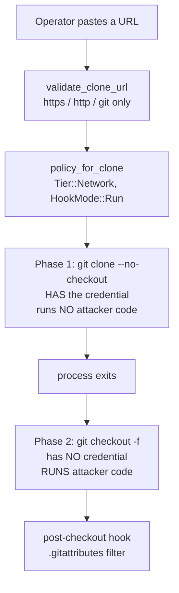
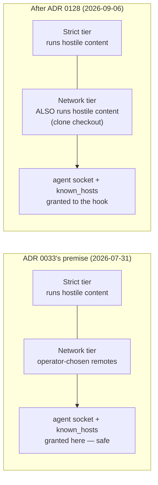
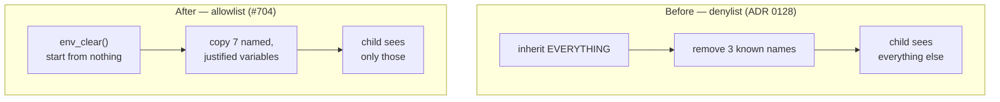

# ADR 0137 — An untrusted checkout inherits an allowlist, and a capability it cannot use

- **Status:** Accepted — implemented, mutation-proved two ways per issue, all four failing differently
- **Date:** 2026-09-07
- **Issues:** #702, #704 — one root cause seen from two sides
- **Extends:** [ADR 0128](0128-a-credential-exists-only-before-untrusted-checkout.md) (the credential boundary this widens from three names to a built environment)
- **Supersedes in part:** [ADR 0033](0033-ssh-remote-carveout.md) — its safety argument for granting the SSH agent socket and `known_hosts` to `policy_for_clone`. ADR 0033 stands unchanged for `policy_for`.
- **Related:** [ADR 0028](0028-network-tier-ports-not-hosts.md) (a port grant is not an egress policy — read before believing the port half buys more than it does), [ADR 0122](0122-the-token-is-a-credential-not-a-header.md), [ADR 0123](0123-the-safety-lives-in-the-shape-not-a-list.md)

## Context

`POST /api/clone` is loopback-only and needs a live session and a CSRF token, so
nothing here is an unauthenticated bypass. The trigger is the *expected* product
action: an authenticated operator clones a repository they do not control.

ADR 0128 split that operation in two. A credentialed `git clone --no-checkout`
fetches objects and exits; a second, credentialless process runs `git checkout
-f`, which is where attacker-selected `post-checkout` hooks and
`.gitattributes`-selected content filters execute. Running them is deliberate
product behaviour, not an oversight — ADR 0128 rejected disabling them by name.

The boundary between those phases was `SandboxedCommand::without_credential_env`,
and it removed exactly three names: `GIT_VISTA_CREDENTIAL_TOKEN`,
`GIT_VISTA_GITHUB_TOKEN`, `GH_TOKEN`. Everything else in the server's ambient
environment was inherited verbatim.

### #704 — the list was only ever as complete as the last person to think about it

Any credential the operator exported before starting the server reached
attacker-selected code: `AWS_SECRET_ACCESS_KEY`, `NPM_TOKEN`, a CI runner's
injected secret. Reproduced dynamically on `a6acf693` with a synthetic canary;
no real credential was read. The defect is not any particular missing name — it
is that a *removal list* is the wrong shape for the question "what may this
process see."

### #702 — the specific one, and it was already contradicted in writing

`policy_for_clone` is an independent `Policy` constructor. It copied #188's SSH
carve-out into every clone: `$SSH_AUTH_SOCK` into `rw_trees`,
`~/.ssh/known_hosts` into `ro_carveouts`, and the full `DEFAULT_GIT_PORTS`
including 22. So a fetched `post-checkout` hook inherited the operator's live
agent socket. An agent will not surrender private-key bytes, but it will
happily *sign* for a process that asks — and a Network-tier port grant is
port-only, never host-bound (ADR 0028), so the same hook could reach port 22
anywhere. Proved dynamically on `a6acf693` with a throwaway key and a throwaway
agent.

ADR 0033 permitted those grants on an argument it stated plainly:

> Neither grant reaches the Strict tier, which is where hostile repository
> content actually runs; both apply only to push/fetch/clone/`ls-remote`, which
> are user-initiated against a remote the user chose.

That was true in July. ADR 0128 made it false in September: hostile repository
content now runs in the Network tier, by design, in this exact policy. Nothing
about #680's change was wrong — but a safety argument written against the old
arrangement was left standing under the new one.

### The grants were not merely unsafe here. They were unusable here.

`validate_clone_url` accepts `https://`, `http://` and `git://` and rejects
everything else, including a leading `-`. This route **cannot perform an SSH
clone**. The comment sitting on the grant line said skipping it "would leave
`git clone git@host:…` broken" — that URL has been a 400 at the wire boundary
since Phase 12. A capability no code path on this route can legitimately reach
is not a trade-off to weigh.

## Decision

### 1. The untrusted checkout's environment is built, not filtered

`spawn::UNTRUSTED_CHECKOUT_ENV_ALLOWLIST` is the complete set of names the
checkout child may inherit. `with_untrusted_checkout_env` calls `env_clear()`
and then copies across only those names that the parent actually has.

| Name | Why it survives the cut |
|---|---|
| `PATH` | `gv-sandbox` reaches git through `Command::new("git").exec()`, a `PATH` lookup. Without it there is no checkout at all, not a reduced one. Hooks and filters need it too. |
| `HOME` | Git resolves `~/.gitconfig` through it. ADR 0128 is explicit that the split changes *when* checkout happens, not whether hooks and filters run — dropping `HOME` would silently stop operator-configured ones. The secrets under `$HOME` stay withheld by `secret_excludes` regardless. |
| `XDG_CONFIG_HOME` | The other root git consults for global config. Omitting it would make config resolution differ between the two phases for exactly the operators who use it. |
| `LANG`, `LC_ALL`, `LC_CTYPE`, `LC_MESSAGES` | Locale. They select message text and character handling; they name no resource and grant no access. |

Three exclusions are decisions rather than omissions, and are recorded as such
in the constant's own doc comment:

- **`SSH_AUTH_SOCK`** — the whole of #702, and the load-bearing half of its fix
  (see §3).
- **`GIT_CONFIG_COUNT` / `GIT_CONFIG_KEY_n` / `GIT_CONFIG_VALUE_n`,
  `GIT_CONFIG_GLOBAL`, `GIT_CONFIG_SYSTEM`** — these would buy the same config
  parity `HOME` buys, but their payload is an arbitrary string and
  `credential.helper=!echo password=…` is a legal value. A config channel that
  can carry a secret is not forwarded into attacker-selected code. An operator
  who configures the server this way loses that configuration at checkout; that
  is the trade, taken deliberately.
- **`TMPDIR`, `TERM`, `TZ`** — `git checkout -f` needs none of them, and `/tmp`
  is in no grant this policy gives out in any case.

Adding a name to that list is a security decision and must arrive with the
sentence saying what breaks without it, in the same edit.

### 2. The guarantee lives in a type, not in a caller's memory

`network_command_without_credential` now returns `UntrustedCheckoutCommand`
rather than a bare `SandboxedCommand`. The only constructor applies the
allowlist unconditionally; the only completion path redacts URL userinfo. There
is no `env`, no `spawn`, and no way to recover the inner command.

This is the same move ADR 0128 made for `CredentialedCommand`, for the same
reason, and it removes a second "correct if the caller remembers": the handler
previously had to write `.map(redact_output)` on each of its two completion
paths. `SandboxedCommand::without_credential_env` is **deleted**, not
deprecated — while a "remove these names" builder exists on that type, the next
credential-adjacent call site can reach for it and rebuild #704 one variable
later.

### 3. `policy_for_clone` gives up three capabilities it cannot use

- `rw_trees` no longer extends with `ssh_agent_socket_grant(tier)`.
- `ro_carveouts` is empty, not `ssh_known_hosts_carveout(&home)`.
- `net_ports` is a new `CLONE_GIT_PORTS` (443, 80, 9418) — `DEFAULT_GIT_PORTS`
  without 22. That list is the exact image of `validate_clone_url`'s accepted
  schemes, and the correspondence is the point.

`policy_for` is untouched. Fetch, push and `ls-remote` against an already-cloned
SSH remote are what #188 exists for, and they keep all three.

**The honest ordering of what actually closes #702.** ADR 0033 §3 measured, and
this change re-read rather than assumed, that the `rw_trees` agent-socket grant
is **inert on this kernel**: Landlock ABI 8 does not mediate pathname `AF_UNIX`
sockets at all. Removing that Landlock rule therefore removes nothing the kernel
was consulting. What made the agent reachable from a hostile hook was the
inherited `$SSH_AUTH_SOCK` telling it where to connect — so §1's allowlist is
the load-bearing half, and §3 is the other three things:

1. the argv no longer *claims* a grant the process should not have, restoring
   ADR 0033's own D5 Option B property (what the sandbox permits is auditable
   from the launcher command line alone);
2. the grant cannot silently become load-bearing again if a future Landlock ABI
   starts mediating pathname sockets;
3. port 22 is gone, so a hook that recovered a socket path by some other means
   still cannot reach an SSH service.

## Rejected alternatives

### Add `SSH_AUTH_SOCK` to the removal list

The literal minimum fix for #702, and it is #704 restated. A fourth name makes
the fifth omission the next issue. Rejected on shape, not on cost — this is ADR
0123's rule applied to an environment instead of an argv.

### Run the checkout at the Strict tier instead

Genuinely stronger: Strict denies `AF_UNIX` at the seccomp layer outright, so
the residual in §"Consequences" would be gone. Rejected because Strict has no
network, and ADR 0128 kept network access for the checkout deliberately — a
`git-lfs` smudge filter is a legitimate checkout-time network consumer. Trading
a working product feature for a residual that is already unreachable is the
wrong direction, and it can be revisited on its own terms if LFS-at-checkout is
ever dropped.

### Keep `known_hosts` because it is only public key material

True as far as it goes — ADR 0033 is right that `known_hosts` reveals which
hosts the operator connects to rather than a secret that grants access. But that
argument justifies a *cost*, and here there is no matching benefit: this route
cannot verify an SSH host key because it cannot speak SSH. A carve-out out of
the `~/.ssh` exclude with no caller is a bypass mechanism left armed for
nothing. Dropping it also removes a real failure mode — a `stow`/`chezmoi` user
whose `known_hosts` is a symlink had every clone refused by
`add_carveout_rule`'s deliberate `Symlinked` guard.

### Leave the environment inherited and sandbox harder instead

Rejected because the filesystem sandbox never saw the leak. An environment
variable is not a path; Landlock has no opinion about it. The only layer that
can answer "what may this process read out of its own environment" is the layer
that builds the environment.

## Consequences and limits

- **A legitimate operator hook loses variables it may have relied on.** A hook
  selected by the operator's own `core.hooksPath` now runs with seven variables
  rather than the server's whole environment. This is a real behaviour change
  and the intended one: the boundary cannot distinguish the operator's hook from
  the remote's, because at checkout time the remote chose which file runs.
- **The seccomp `AF_UNIX` exemption remains Network-tier-wide**, because the
  tier is shared with `policy_for`'s legitimate SSH remotes. A hook that could
  *guess* an agent socket path could still `connect()` to it. It has no way to
  find one — `/tmp` is in no grant this policy gives out, so the directory
  holding `ssh-XXXXXXXXXX/agent.<pid>` cannot be read — but "cannot enumerate"
  is weaker than "cannot connect", and this ADR says so rather than rounding it
  up.
- **Dropping port 22 confines nothing to the operator's own remote.** ADR 0028's
  limitation is unchanged: a port grant carries no address. It removes one
  destination service class, and that is all it should ever be described as.
- **`sandbox::test_env` is now the crate's one test-side writer of process
  environment.** `argv.rs`'s file-scoped `SSH_AUTH_SOCK_LOCK` justified itself
  on "nothing outside this file touches this key", which #704's proof made
  false — the fix reads the whole environ, and the clone proof sets the same
  key. A lock whose scope is narrower than its key's readership is a comment,
  not a lock. Callers hold it for *composition* only, never across an `await`.
- **A future `ro_carveouts` caller inherits an empty precedent here.** ADR 0033
  said nothing about its shape recommends a second caller; there is now one
  fewer, not one more.

## Proof

Both acceptance criteria are dynamic and both run against compiled, host-native
code — no `cfg`-gated arm, so nothing here reports green over its own absence.

- **`handlers::clone::clone_checkout_runs_the_hook_with_only_an_allowlisted_environment`**
  is #680's canary widened. It builds a source repository with a tracked
  executable `hooks/post-checkout`, performs the credentialed `--no-checkout`
  transfer, confirms no content and no marker, selects the hook with
  `core.hooksPath=hooks`, and runs the production credentialless checkout with a
  canary variable and a fake `SSH_AUTH_SOCK` genuinely present in the server
  process. The hook reports seven fields: the three ADR 0128 names,
  `SSH_AUTH_SOCK`, the canary — all five `unset` — then `PATH` and `HOME`,
  which must be **present**. An empty environment would satisfy the first five
  legs while producing a checkout that cannot run, which is why the last two
  exist. The premise is asserted, not assumed: the canary and the socket are
  checked present in this process at the moment the command is composed.
- **`sandbox::spawn::tests::an_untrusted_checkout_environment_is_built_by_allowlist_not_by_removal`**
  makes the same claim where the decision is made, on a synthetic environment,
  with `AWS_SECRET_ACCESS_KEY` standing in for "a credential nobody
  enumerated". A test that checks only the three ADR 0128 names passes
  identically under a denylist and an allowlist and therefore cannot fail on
  #704 at all; an unknown name is what separates the two mechanisms.
- **`sandbox::argv::policy_for_clone_carries_neither_188_grant_while_policy_for_still_does`**
  asserts a *difference between two constructors* in one critical section: the
  same socket path present in `policy_for`'s Network policy and absent from
  `policy_for_clone`'s. Without that paired positive the test would pass just as
  well if `ssh_agent_socket_grant` were broken outright for fetch and push.

`failure-atlas mutation_check` ran under run key ``gv-702-704-untrusted-checkout-allowlist`` against
committed HEAD ``2e9c2f97` (run 415 ran at `f737f8c5`, whose only difference is this untracked file; the code under test is byte-identical, and the tool's dirty-tree warning is recorded here rather than suppressed)`. Every baseline was green; every mutation was
caught.

| Run | Issue | Mutation | Kind | What went red, and why it is a *different* failure |
|---|---|---|---|---|
| 415 | #704 | Drop the `.filter(…)` from `untrusted_checkout_env` so it copies `source` wholesale | remove the mechanism | Three tests. The real spawned hook reported `unset\|unset\|unset\|/tmp/gv702-not-a-real-agent.sock\|a-credential-nobody-enumerated\|PATH-present\|HOME-present` — the socket and the canary arriving verbatim in attacker-selected code. This is the defect itself, reproduced. |
| 416 | #704 | Add `"AWS_SECRET_ACCESS_KEY"` to `UNTRUSTED_CHECKOUT_ENV_ALLOWLIST` | weaken the mechanism | One test, one leg: the built name list came back `["PATH","HOME","LANG","AWS_SECRET_ACCESS_KEY"]`. The spawn proof stayed **green**, because its canary is a different name — which is exactly the point. A list that still looks deliberate fails only where the decision is made. |
| 417 | #702 | Re-add `rw.extend(ssh_agent_socket_grant(tier))` to `policy_for_clone` | remove the mechanism | Only `policy_for_clone_carries_neither_188_grant_while_policy_for_still_does`, on `rw_trees` — `["/dev", "/tmp/.tmpQQf8rO", "/tmp/gv702-policy-for-clone-test-agent.sock"]`. A pure policy-shape failure; nothing was spawned and no environment was read. |
| 418 | #702 | Add `"SSH_AUTH_SOCK"` to `UNTRUSTED_CHECKOUT_ENV_ALLOWLIST` | weaken the mechanism | Two tests, and the hook reported `unset\|unset\|unset\|/tmp/gv702-not-a-real-agent.sock\|unset\|…` — the socket back, the canary still correctly withheld. The policy/argv test stayed **green**: same issue, opposite layer. |

Read 417 and 418 together: they are the two halves of #702 and they fail in
places that share no code. 417 is a `Policy` struct built in memory and never
run; 418 is a real `post-checkout` hook, spawned under the real shim, reporting
what it actually inherited. Either alone would license the wrong conclusion —
417 alone would say the fix is the policy edit, which ADR 0033 §3's measurement
says is inert on this kernel; 418 alone would leave the argv still advertising
a grant the process must not have. The pairing is the claim.

Likewise 415 and 416 differ in *blast radius*, not just in message: removing the
filter fails three tests including the spawn proof, while adding one plausible
name to the list fails exactly one. A weakened allowlist is the realistic future
regression, and it is caught by the one assertion — an unenumerated canary —
that a denylist-shaped test could never have made.

Both baselines of every run were green at 10 passed. One caution earned the same
day and recorded for the next lane: `cargo test -p <crate> --bins` does **not**
build `target/debug/gv-sandbox` (`dev` says so at its own line 234), so every
test that builds a real production `Policy` fails on a missing shim in a fresh
worktree, and `mutation_check` — which reuses the source worktree's target dir —
reports that as `baseline_failed` rather than as a readable test failure. Run
`cargo build -p git-vista-server --bins` once first.

## Where this is implemented

- `crates/git-vista-server/src/sandbox/spawn.rs` —
  `UNTRUSTED_CHECKOUT_ENV_ALLOWLIST`, `untrusted_checkout_env`,
  `with_untrusted_checkout_env`; `without_credential_env` deleted.
- `crates/git-vista-server/src/sandbox/network_exec.rs` —
  `UntrustedCheckoutCommand`; `network_command_without_credential` retyped.
- `crates/git-vista-server/src/sandbox/mod.rs` — `CLONE_GIT_PORTS`;
  `policy_for_clone`'s two dropped grants, its narrowed ports, and the doc
  comment recording why.
- `crates/git-vista-server/src/sandbox/test_env.rs` — new: the crate's one
  test-side environment writer.
- `crates/git-vista-server/src/sandbox/argv.rs` — `with_ssh_auth_sock` retargeted
  onto `test_env`; `policy_for_clone_carries_both_188_grants` replaced by its
  inversion.
- `crates/git-vista-server/src/handlers/clone.rs` — the widened spawn proof; the
  two `.map(redact_output)` call sites removed as now-carried by the type.
- `docs/adr/0137-*.md` and its rendered PDF in `docs/adr/pdf/`.

---

**Signed:** max · 2026-09-07T18:05:00-04:00
