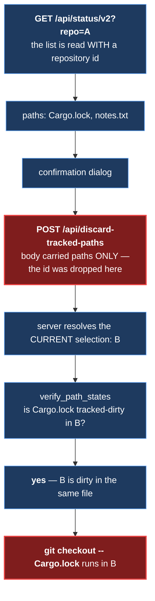
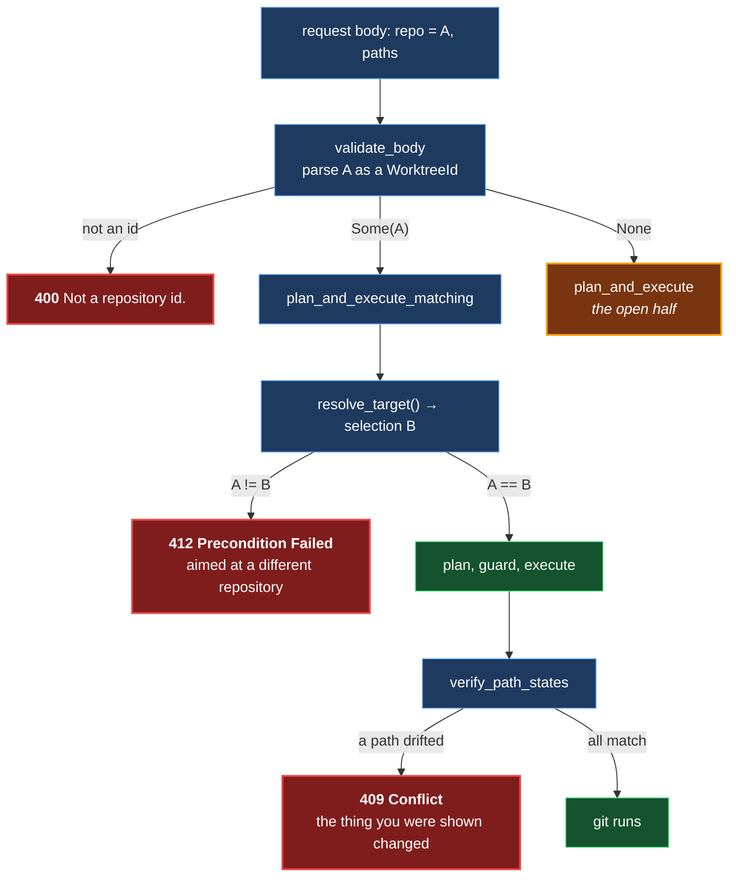
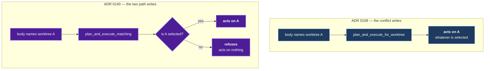

# ADR 0140 — A destructive write carries the repository it was built against

- **Status:** Proposed — server half implemented and mutation-proved three ways failing differently; the wire field is optional until the browser client can supply it, which is tracked by #733 and is not in this change
- **Date:** 2026-09-07
- **Issue:** #721; refs #711, #709, #707
- **Extends:** [ADR 0038](0038-worktree-destructive-operations.md) — its §3 introduced `verify_path_states` as a deliberately redundant *per-path* re-verification, which is accurate; what this ADR corrects is the reading that grew around it. Nothing in 0038 is retracted.
- **Related:** [ADR 0109](0109-a-conflict-write-names-the-repository-it-mutates.md) (the required-`repo` precedent this deliberately diverges from in one respect), [ADR 0016](0016-shared-write-planner.md) (every git write flows through one funnel), [ADR 0119](0119-a-guarantee-that-holds-only-on-the-success-arm-is-not-a-guarantee.md) (why the open half is written down rather than assumed)

## Context

`POST /api/discard-tracked-paths` (`git checkout -- <paths>`) and
`POST /api/delete-untracked-paths` (`git clean -f -- <paths>`) carried a body of
`paths` and nothing else. Both resolve their repository from the session's
current selection, and both are re-checked immediately before git runs by
`planner::verify_path_states`, which asks one question of the repository
selected **now**:

> is this path tracked-dirty / untracked **here**?

That guard was being described — in this repository's own comments, and in the
issue that filed it — as protection against acting on a stale reply. It is not.
It is a **conditional path-state recheck**, and the condition is the path's
*kind*, not its *provenance*.

The two outcomes it can produce are not the same claim:

| The carried list | The live repository | Answer |
|---|---|---|
| `Cargo.lock`, from A | not dirty in B | **refused, 409** — the case everyone pictures |
| `Cargo.lock`, from A | tracked-dirty in B too | **passes** — the name collides, the kind matches |

The second row is not contrived. Two linked worktrees of one repository — which
this application creates by design and switches between — are routinely dirty in
the same files, and share every path name they have. A colliding untracked
filename behaves identically.

**What is and is not true today.** #711 (PR #719) closed the client-side route
that *produced* stale lists: a status reading is resolved through
`reading_is_current` before its paths can reach `discardable_tracked_paths` /
`deletable_untracked_paths`, so no known route reaches these endpoints with a
list from another repository. This ADR is not filed against a live exploit. It
is filed because the server-side recheck **cannot** be the backstop it was
described as, would not catch a future caller that reintroduced one, and — this
is the part that costs — a false description of a guard is what lets the next
person delete the guard that is actually load-bearing.

## Decision

### 1. The request carries the repository the list was derived from

`WorktreePathsRequest` gains `repo`: the opaque `WorktreeId`, the same id the
`GET /api/status/v2?repo=` read that produced the list was called with. Never a
filesystem path — the server resolves it against its own catalog and can only
ever name something it itself registered ([ADR 0109](0109-a-conflict-write-names-the-repository-it-mutates.md)'s
posture, unchanged).

### 2. A mismatch is a **precondition failure**, not a conflict

`412` and `409` are deliberately different answers, and collapsing them would
destroy the distinction this whole change exists to draw:

- **412 — "you are aiming at a different repository than the one you are looking
  at."** Re-sending will not help. Something about the session's selection and
  the list on screen has come apart.
- **409 — "the thing you were shown has changed."** Ordinary, self-healing, and
  it names the path. Look again and try.

That distinction is part of the typed error-envelope wire contract, not only
the HTTP status line. `ErrorCode::PreconditionFailed` serializes as
`precondition_failed`, maps to and from `412`, and the server's response layer
therefore preserves it when wrapping a handler's plain-text refusal. Before
this correction, `ErrorCode::from_status` flattened `412` into `bad_request`
through its unrecognized-4xx fallback. The browser still drops both the typed
code and terminal status while building `WriteReceipt` and `Settlement`; #733
tracks carrying the distinction through that client half and branching on it.

The refusal text names neither repository. The client already knows which one it
asked for, and a refusal must not become a way to learn what else this server
serves.

### 3. The selector is a **precondition on the selection**, not an address

This is the one place #721 diverges from [ADR 0109](0109-a-conflict-write-names-the-repository-it-mutates.md),
and the divergence is the decision.

Going where the id points is right for conflict resolution: those reads are
independently addressable, and the user is working a list of files rather than
looking at a repository. It is wrong here. These two operations are driven from
a context menu on the repository on screen, `DeleteUntrackedPaths` has no undo
anywhere in this codebase, and *quietly destroying files in a repository that is
not on screen* is a worse failure than *refusing and making the user look
again*.

### 4. The comparison happens where the target is resolved, not in the handler

The selection is a per-session cell that another request from the same session
can move ([#588](https://github.com/tom2025b/Git-Vista/issues/588)). A handler
that compared before calling into the planner would be comparing against a value
the planner then re-reads — a window, however small, in exactly the shape this
issue is about. So `MutationTarget::SelectionMatching` compares against the very
`state::resolve_target()` result the operation is then planned and executed
against. It is the same reasoning `plan_and_execute_proving` records for its own
drop proof: a check made anywhere but the point of use is a check about a
different world.

### 5. The name is corrected wherever it was wrong

`verify_path_states` is documented, in its own doc comment, as the **conditional
path-state recheck** it is, with both outcomes spelled out and the collision
named. No test catches a false documentation claim; only a reader does, so the
correction is part of the change rather than a follow-up.

## What this does NOT close

`repo` is **optional**, and an omitted selector still acts on the current
selection exactly as before.

The browser client cannot supply it yet. The path list travels from the pinned
status reading through an `OperationKind::DiscardTrackedPaths { paths }` carrier
that has no room for a scope, so `api::discard_tracked_paths_request` sends
`repo: None`. Reading a *live* repository id at send time was considered and
rejected outright: it would always match the selection and therefore prove
nothing, which is worse than no check because it reads like one. The scope that
matters is the one captured when the list was built.

The browser client also does not yet retain the new `precondition_failed` code:
`WriteReceipt` and `Settlement` discard it before the UI can react. That is the
separate client half tracked by #733; this change stops at the protocol and
server envelope boundary.

Making the field required means widening `OperationKind` and the confirmation
that constructs it, in client files outside this change's scope. Until then:

- the gap is stated on the DTO, on both client request builders, and in the
  planner;
- `an_omitted_selector_still_acts_on_the_selection_and_that_is_the_open_half`
  pins it as a live, failing-if-changed fact rather than an assumption — the
  test that must be **deleted and replaced by its opposite** when the field
  becomes required;
- `planner_funnel_census` still proves both handlers reach `plan_and_execute` in
  their own bodies. When the `None` arm goes, that census row wants widening to
  require `plan_and_execute_matching` instead, or it will keep passing for the
  wrong reason.

## Alternatives considered

**Make `repo` required now, matching ADR 0109 exactly.** The right end state,
and rejected only on timing: the shipped UI sends no selector, so every discard
and delete would answer `400` the moment this merged. A protocol change that
breaks the only client is not a protocol change, it is an outage.

**Refuse with `409`, reusing the drift code.** One fewer status code, and it
erases the distinction. A client cannot then tell "look again, the file moved"
from "you are pointed at the wrong repository", and the second is the one that
must not be retried.

**Act on the named worktree (`plan_and_execute_for_worktree`).** Already built,
already proved, and one line away. Rejected in §3: it converts a stale tab into
a remote deletion in a repository the user is not looking at.

**Compare in the handler before calling the planner.** Simpler, and reintroduces
a check-then-act window against a mutable per-session selection. Rejected in §4.

**Carry the selector inside `GitOperation::DiscardTrackedPaths`.** It is not
part of the operation's identity — "discard these paths" is what the user asked
for; which repository the *request* was built against is a precondition on
running it. Folding it in would make two otherwise-identical discards hash
differently for idempotency, the same argument `DropProof` records for staying
outside `GitOperation::DropStash`.

**Carry the repository generation/epoch as well.** Deferred, not rejected. The
generation answers "has this repository changed since you looked", which is what
`enforce_fresh` already gates on for the whole worktree; the identity question
is the one that had no answer at all. Adding both in one change would have made
it impossible to say which half the mutation proofs covered.

## Consequences

- The wire grows one optional field. Old bodies remain valid; `deny_unknown_fields`
  still refuses anything else.
- A third `MutationTarget` variant, and a third public planner entry point. All
  three delegate into the one gated block, so the read-only gate, the
  idempotency-key requirement, admission, the staleness gate and the durable
  terminal record are unchanged for every path.
- `412` joins this server's vocabulary as the wire code
  `precondition_failed`. It is the first use.
- The two handlers each spell their own two arms rather than sharing a dispatch
  helper — matching #71's standing rule that these two operations are never one
  function parameterised by a difference, and keeping each route's
  `plan_and_execute` call in its own body where `planner_funnel_census` reads it.
- Until the client half lands, the protection is available and unused. That is
  stated in three places in the code and pinned by a test, because an
  unadvertised gap is how a guard gets believed.

## How it was proved

The test that carries the claim is
`handlers::discard::tests::a_colliding_path_name_from_a_sibling_worktree_is_refused`.
Its fixture is deliberately the hardest case rather than the easiest:

- **two linked worktrees of ONE repository** — same `RepositoryId`, different
  `WorktreeId`. Two unrelated repositories cannot express the difference between
  "compare the repository" and "compare the worktree" at all, so a fixture built
  from them would call a coarser, broken check correct;
- **both dirty in the same two path names** (`a.txt` tracked, `scratch.txt`
  untracked), asserted equal by `git status --porcelain` before anything is
  sent — so `verify_path_states` provably cannot tell them apart, and identity
  is the only thing left that can refuse;
- the premises are **asserted, not assumed**: same repository, different
  worktree, identical porcelain;
- it drives the real handler through `operations::with_key`, so the body's
  `repo`, `validate_body`'s parse, the entry point the handler chooses and the
  planner's comparison are all under test;
- `a_matching_selector_runs_and_touches_only_the_selected_worktree` is the
  positive control. Without it every assertion above would hold on a server that
  refused these endpoints unconditionally.

Three mutations, chosen to fail differently. All **caught**, each by the same
test failing with a `200 OK` that names the file it destroyed in the wrong
worktree:

| # | Shape | Mutation | Verdict |
|---|---|---|---|
| 1 | remove the mechanism | `if entry.handle.worktree != expected` → `if false && …` | caught |
| 2 | weaken the mechanism | compare "is this a registered worktree?" instead of "is it the selected one?" | caught |
| 3 | sever the wiring | the handler's `Some(worktree)` arm calls `plan_and_execute` instead of `plan_and_execute_matching` | caught |

Arm 2 is the one the fixture was designed for: a check weakened from *identity*
to *membership* is exactly the plausible wrong implementation, and only a
two-worktrees-of-one-repository fixture can see it.

All three arms live in natively compiled server code that `cargo test -p
git-vista-server --bins` builds and runs — no `cfg`, no target filter, nothing
proved over code the run never compiled ([ADR 0115](0115-a-mutation-proof-cannot-see-what-it-does-not-run.md)).

**Recorded honestly:** these were run by hand rather than through
`failure-atlas`'s `mutation_check`. That tool clones `HEAD`, and the session
that wrote this change could not commit (see the branch's finish report), so a
clone would have tested the unmutated code and returned `not_applied`. Baseline
green was established first, each mutation was applied with a unique-match edit
that fails loudly if it does not apply, and the files were restored from
byte-exact backups with `git diff` confirming an empty result. The standing
exception ADR 0130 used for the same reason applies.
