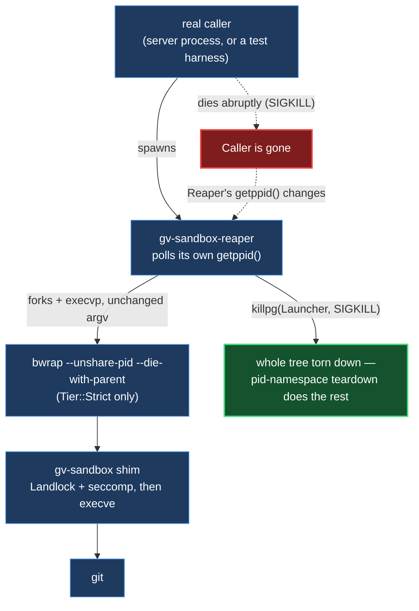

# ADR 0141 — A sandboxed process must not survive its own parent's death

- **Status:** Proposed — reaper implemented and mutation-proved for `Tier::Strict` only; `Tier::Network`'s separate, total absence of protection is tracked as #757 and is deliberately not fixed by this change (see "Scoped to `Tier::Strict` only" below — an earlier draft of this PR wrapped `Tier::Network` too, without a Network-tier acceptance test, and was corrected before landing). **Update, 2026-09-08:** #757 is now closed — see [ADR 0143](0143-network-tier-gets-the-same-parent-death-reaper-strict-already-has.md), which extends this same reaper to `Tier::Network` with its own acceptance tests. Left as written below rather than edited throughout: this section is the record of the decision as it stood at the time, and the "Scoped to `Tier::Strict` only" reasoning is exactly what ADR 0143 builds on, not a stale claim to correct.
- **Date:** 2026-09-08
- **Issue:** #728
- **Related:** [ADR 0029](0029-strict-tier-refuses-rather-than-downgrades.md) (INV-13's fail-closed posture for `bwrap`/the shim — this decision deliberately does *not* extend that posture to the reaper; see Consequences), [ADR 0038](0038-worktree-destructive-operations.md) (a prior process-lifetime guarantee this repository has had to correct once already)
- **Reviewed:** a headless review of the first version of this PR (2026-09-08) found three real issues, all fixed before landing — a startup race in the reaper itself, a Network-tier scoping/test gap, and an inaccurate framing of `PR_SET_PDEATHSIG`'s own semantics in this document. Each is addressed in place below, marked where the review caused the change, rather than filed as a follow-up.

## Context

`gv-sandbox` (`Tier::Strict`) spawns under `bwrap --unshare-pid --die-with-parent`
(INV-8). `--die-with-parent` protects against exactly one thing: bwrap's own
immediate parent dying while bwrap is still directly parented to it — the
kernel delivers `PR_SET_PDEATHSIG(SIGKILL)`, bwrap dies, and because
`--unshare-pid` makes bwrap PID 1 of its own namespace, the kernel then
unconditionally kills every other process in that namespace. That mechanism is
real and was verified empirically for this ADR (see "How it was proved"):
across 40+ trials, killing the direct OS parent of a bwrap invocation reliably
reaped the entire tree, including a double-forked `setsid` grandchild
deliberately detached from bwrap's own process group.

What that mechanism does **not** cover is a caller more than one hop away
dying — or, on 2026-09-07, whatever actually happened to two real processes:

| PID | Worktree | Temp fixture | State |
|---|---|---|---|
| 1507071 | `~/projects/gv-690` | `/tmp/.tmpPduvnt` (deleted) | PPID 2016 = `systemd --user`, 0% CPU, no children |
| 1599246 | `~/projects/gv-702` | `/tmp/.tmpnfNDb9` (deleted) | identical shape |

Both were `git -C <tmp>/repo status --short` against a directory that no
longer existed, reparented to `systemd --user`, never to complete. The cost is
diagnostic, not CPU: an orphan is indistinguishable from a live hang in
`pgrep` output, and it briefly read as a wedged lane when nothing was.

**Honest limit of this ADR's own reproduction, and a premise corrected by
review.** 40+ direct trials on this box's kernel and `bwrap` 0.11.1 did not
reproduce the failure via a plain single-hop SIGKILL of the process that
directly spawned bwrap. A headless review of the first version of this PR
pointed out, correctly, that this is expected: `PR_SET_PDEATHSIG` (which
`--die-with-parent` is built on) fires on the death of a process's *real,
immediate* parent regardless of when that death happens, including through
later reparenting elsewhere in the tree — bwrap's own immediate parent in the
normal case is the server process itself, one hop, and the empirical trials
correctly show that hop working. An earlier draft of this document read the
40+ trials as casting doubt on `--die-with-parent`'s ordinary operation; that
was not the right conclusion, and review naming the actual, narrower hole is
what this section now describes instead.

**The narrow hole `--die-with-parent` (and this ADR's own first design) both
have is a *startup* race, not an ongoing one:** the OS-level fork that creates
a process happens entirely before a single line of that process's own code can
run. If the real parent dies inside that exact window — between the fork and
the child's first executed instruction — the child is already reparented
before it ever gets to register anything, or (for a design that reads its
parent's identity from `getppid()` once at startup, as this reaper's own first
version did) before it ever gets to read a *correct* baseline. `bwrap` closes
this for its own case with a documented, narrow, immediately-after-registration
recheck; this reaper's own version of the same race, found by the same review,
is fixed below (see "Why the expected parent is passed in, not read").

Two explanations remain live for what actually produced the two found orphans,
and this ADR does not choose between them:

1. **`Tier::Network` has no protection of any kind.** `sandbox_argv_with_seccomp_profile`
   wraps only `Tier::Strict` in `bwrap`; `Tier::Network` runs the shim directly,
   with no pid namespace and no `--die-with-parent` at all. A Network-tier
   process orphaning on an abrupt parent death is not a race — it is the
   certain, unconditional outcome, every time. Because `execve` replaces the
   process image, a Network-tier orphan and an escaped Strict-tier one are
   byte-identical in `ps` output (`git -C ... status --short`, nothing naming
   bwrap or the shim), so the found evidence cannot distinguish the two by
   inspection alone. This is filed and tracked separately as #757, deliberately
   not folded into this change — see Consequences.
2. **The startup race just described**, for whatever process actually spawned
   bwrap that night — not reproduced here, and not ruled out either; a
   suspend/resume cycle (the issue's own provenance) is one plausible way to
   widen an otherwise-narrow window, and that path was not attempted (fifteen
   lanes were live on the machine at the time, and suspending it would have
   cost other people's in-flight work for an experiment this ADR did not need
   to run).

Regardless of which explains the two found orphans, #728's acceptance criteria
ask for a general property — "a sandboxed process whose parent dies abruptly is
reaped rather than reparented and left running" — that a single-hop kernel
guarantee for one tier does not fully deliver on its own, since a design that
merely mirrors `--die-with-parent`'s ordinary case (as this ADR's own first
draft did) inherits its startup race too, and neither covers `Tier::Network`
at all.

## Decision

### 1. A standalone reaper binary, not a change to the shim or to `bwrap`'s flags

`gv-sandbox-reaper` is a new `[[bin]]` target (`crates/git-vista-server/src/bin/gv-sandbox-reaper/main.rs`),
autodiscovered by Cargo the same way `gv-sandbox` already is — no `Cargo.toml`
entry needed for either. Invoked as
`gv-sandbox-reaper <expected-parent-pid> <program> <args…>`, it:

1. forks;
2. the child becomes its own process group leader, registers
   `PR_SET_PDEATHSIG(SIGKILL)` against the reaper itself (an ordinary,
   single-hop use — the reaper is its real, immediate parent, no reparenting
   involved in this specific guarantee), and `execvp`s `<program> <args…>`
   unchanged — from that point on it *is* the launcher the caller asked for,
   byte for byte, so nothing downstream (Landlock, seccomp, the pid namespace,
   the shim's `.exec()`-only invariant) changes at all;
3. the parent polls its own `getppid()`. If it ever differs from
   `<expected-parent-pid>` — the real caller's own pid, **passed in as an
   argument, not read later** (see "Why the expected parent is passed in, not
   read") — the real caller is gone. It kills the whole child process group
   with `SIGKILL` and exits.

**Step 2's `PR_SET_PDEATHSIG` registration was not in the first version of this
design, and its absence broke production behaviour that already existed.**
`git_output_bounded`/cancellation (`git_cmd.rs`) kill a running fetch/push by
calling `.kill()` on the `tokio::process::Child` the spawn produced — which,
before this ADR, *was* bwrap directly. Once the reaper sits in front of it,
that same `.kill()` lands on the reaper instead, and a reaper with no
protection of its own for this case dies immediately (`SIGKILL` cannot be
caught) without ever running its polling loop — leaving its own child, freshly
orphaned, completely unwatched. Three existing tests caught this on the first
`./dev gate` run of a poll-only version:
`cancelling_a_running_fetch_kills_the_child_and_says_nothing_moved`,
`cancelling_a_running_push_kills_the_child_and_the_remote_does_not_move`, and
`a_cancel_that_lands_after_the_ref_moved_reports_what_the_remote_accepted` all
went red with "the git \[fetch|push\] child survived the cancel." Registering
`PR_SET_PDEATHSIG` for the child closes this the same way `bwrap
--die-with-parent` already protects itself, applied one hop further out.

### Why the expected parent is passed in, not read

A headless review of the first version of this PR found a second, more
fundamental defect, independent of the cancellation issue above: **step 3's
baseline was self-observed** — the reaper called `getppid()` once, right after
`main` started, and used that as the value every later poll compared against.
That inherits exactly the startup race described in Context: the OS-level fork
that creates the reaper process happens entirely before a single line of the
reaper's own code can run. If the real caller died inside that window, the
reaper's first `getppid()` read would already reflect the *post-reparenting*
value — and every later comparison against that (wrong) baseline would read
"nothing has changed", forever. The launcher could survive unbounded: the
exact #728 shape, reintroduced one layer up, in the very mechanism built to
fix it. The review named the fix precisely: establish the expected-parent
identity **before** the reaper is even spawned, not by having it discover the
value later.

The fix: the caller now reads `std::process::id()` — its own pid — before it
spawns the reaper at all, and passes it as `gv-sandbox-reaper`'s first
argument. There is no race on a value a process reads about *itself* before it
does anything that could race it. Whatever the reaper's `getppid()` reads, at
any point after it starts running — however late that is, and however much has
already gone wrong before it got the chance to run — is compared against a
value that was correct before the race could begin.

Layered at `sandbox::spawn::command_from_argv` — the one place pure argv
becomes a real process — never inside `sandbox_argv` itself. INV-16's reviewed
argv shapes (the three exhaustively-tested outputs `sandbox_argv` can produce)
are byte-identical before and after this change; the reaper decides how that
argv is *launched*, not what it is. `wrap_with_reaper` detects "should this be
wrapped" structurally — by comparing the composed program against the resolved
`bwrap` path (`bwrap::bwrap_path()`) — rather than by threading a `Tier`
through the function, which keeps it correct for `CheckoutPolicy` without
needing to see through its private field, and keeps every INV-16 test
(`sandbox::argv`, and the separate `argv_boundary::sandbox_argv_shapes`
tripwire) passing unmodified.

### Scoped to `Tier::Strict` only

**This PR's first version wrapped every non-`git`-literal launcher — Strict
*and* Network tier alike — and review caught that this was wrong to ship
without more.** `Tier::Network`'s launcher has no pid namespace at all, so
`killpg` (rather than a single-target `kill`) is genuinely load-bearing for
its descendants in a way `Tier::Strict`'s kernel-enforced namespace teardown
makes moot (see "How it was proved" below for the mutation that exposed this).
This PR built no Network-tier acceptance test, so that load-bearing behaviour
shipped unproved. The detection is now `argv[0] == bwrap::bwrap_path()`
specifically — true only for `Tier::Strict` — rather than "not literally
`git`", so `Tier::Network`'s bare shim is left exactly as this ADR found it.
#757 owns extending this wrapper to `Tier::Network`, with that test written
first, not retrofitted after.

### 2. Polling `getppid()`, never `PR_SET_PDEATHSIG` on the reaper itself

`SIGKILL` cannot be caught. A watcher that registers its own death signal and
relies on receiving it cannot run any cleanup code when that signal actually
arrives — it is simply gone, and its child is exactly as orphaned as it would
have been with no watcher at all. `--die-with-parent` **is** exactly this
design, which is precisely why it cannot be the fix for its own failure mode.
The reaper registers nothing for itself; it only ever reads `getppid()`, a
plain syscall whose answer does not depend on any signal being delivered, to
it or to anything else, by whatever mechanism its real parent died.

### 3. Absence degrades quietly — this is deliberately NOT an INV-13-style refusal

`sandbox::reaper::reaper_path()` returns `Option<&Path>`, resolved once and
cached the same way `shim::shim_path`/`bwrap::bwrap_path` are, but a `None`
does not fail policy construction the way a missing `bwrap` does for `Tier::Strict`
(`ShimError::StrictUnavailable`). If the reaper binary cannot be found,
`wrap_with_reaper` returns the argv unwrapped: the caller gets exactly the
sandbox it had before this ADR — Landlock, seccomp, and (for `Tier::Strict`)
the bwrap namespaces are all still applied, unchanged. No capability is lost;
only the extra reaping guarantee this ADR adds is absent. That is a
deliberately different posture from `bwrap`/the shim, whose absence removes an
existing capability the declared tier promises — see Alternatives for why a
hard failure here was considered and rejected.

## Alternatives considered

**A pidfd the real caller holds, and reads to notice its own child's death (or
have some other process read).** Rejected: the caller is the thing that dies
in this scenario. A pidfd only helps a *surviving* watcher read something; if
the watcher is what died, nothing is left to read it. This is the same
fundamental shape `--die-with-parent`/`PR_SET_PDEATHSIG` already has, just
inverted.

**A supervising cgroup scope, reaped on teardown.** Strongest in principle — a
cgroup can be torn down from entirely outside the process tree it contains —
but it changes how every sandboxed process is launched, and has a real,
unresolved interaction risk with `--unshare-net`, which the browser test suite
depends on (a parallel effort at the time of this ADR). Deferred rather than
rejected outright: worth revisiting once that interaction is understood, but
too much blast radius to land inside #728's scope.

**Fail closed on a missing reaper, mirroring `ShimError::StrictUnavailable`.**
Considered and rejected. The reaper is defence in depth over a process-lifetime
property layered on top of Landlock, seccomp and the bwrap namespaces — never a
substitute for any of them, unlike `bwrap`/the shim, which **are** the declared
Strict-tier guarantee. Refusing every sandboxed operation on a host missing one
extra binary would turn a defence-in-depth improvement into a new single point
of failure for the whole sandbox, which is a worse trade than the bounded
polling window this ADR already accepts as a named residual.

**Fold `Tier::Network`'s total lack of protection into this same change.**
Rejected — see Context. It is a different, larger, unconditional gap (not a
race), independently reproducible, and deserves its own acceptance criteria
rather than riding in as a side effect of a fix aimed at `Tier::Strict`. Filed
as #757.

## Consequences

- A new `[[bin]]` target, `gv-sandbox-reaper`, autodiscovered by Cargo exactly
  like `gv-sandbox` already is (`tests/forces_reaper_build.rs` pulls it into
  the build plan the same way `tests/forces_shim_build.rs` already does for the
  shim).
- Every `Tier::Strict` sandboxed spawn now has one extra process in its tree
  (the reaper) when the binary is present. It never touches
  `stdin`/`stdout`/`stderr` (inherited transparently through `fork`, untouched)
  and propagates the launcher's exact exit status or terminating signal, so no
  existing caller's interpretation of a spawn's result changes.
- **Named residual:** a poll interval of 100ms means an orphan can be alive for
  up to that long after its real parent dies before the reaper notices and
  reaps it — bounded, measured, and stated here rather than hidden. The
  mechanism it replaces (`--die-with-parent` alone, one hop) had an *unbounded*
  residual, as the two processes that motivated this ADR demonstrate.
- `Tier::Network` remains completely unprotected by this change. #757 tracks it
  as its own decision, with its own acceptance criteria.
- `sandbox::spawn::full_argv` and `sandbox::spawn::wrap_with_reaper` are now
  `pub(crate)` (were both private to `spawn.rs`) so `sandbox::lifecycle`'s test
  fixture can build the exact composed argv production code builds, rather than
  duplicating that logic and risking the two drifting apart.

## How it was proved

Two acceptance tests, both in `sandbox::lifecycle`:

**`a_reaper_process_reaps_the_launcher_when_only_its_own_parent_is_sigkilled`**
builds the fixture Codex's review of this issue named as missing: every
SIGKILL test in this file before it (including
`strict_reaps_a_double_forked_setsid_orphan_that_the_network_tier_does_not`)
calls `child.start_kill()` on the composed launcher the test itself spawned —
proving the launcher's own pid-namespace teardown reaps an orphan when the
launcher is killed directly, and nothing about a caller dying one hop further
out. This test builds that missing hop for real: a **helper** process, made
via raw `fork`+`execvp` (not `Command::new` — see the test's own doc comment
for why: `argv_boundary.rs`'s tripwire requires any new such site to be
reviewed and allowlisted, and this fixture avoids adding one, since raw libc
calls fall outside what that scan matches) becomes the actual OS parent of the
composed launcher, built with the exact two calls production code makes
(`spawn::full_argv` then `spawn::wrap_with_reaper`, the latter run *inside*
the helper so `std::process::id()` captures the helper's own pid — an
early-caught bug in this very fixture, see its own doc comment). SIGKILLing
the **helper** — never the launcher, never the reaper — is the scenario #728
names.

**`a_reaper_process_reaps_a_launcher_orphaned_before_it_ever_ran`** is the
review's second test request: it forces the startup race described above
*deterministically*, with `SIGSTOP`/`SIGCONT`, rather than hoping a timing
window is hit (no amount of waiting for evidence, the way the first test does
with hook ticks, can land inside this window on purpose). A second-level
process raises `SIGSTOP` against itself before calling `execvp` at all; the
test confirms it is genuinely stopped (polling `/proc/<pid>/stat`, since the
test is not that process's parent and cannot `waitpid(..., WUNTRACED)` for
it), kills the real parent while it is still frozen, lets reparenting
complete, then `SIGCONT`s it. By the time any of `gv-sandbox-reaper`'s own
code runs, its true parent has been dead and gone for a full settle window.

The same `orphan_hook` fixture every other test in this file uses (a
double-forked `setsid` ticker plus a delayed marker, both deliberately
detached from the launcher's own process group) is the first test's
observation mechanism; the second checks directly whether the process that
became the reaper is still alive.

Three mutations were run against the final (post-review) code, `failure-atlas`'s
`mutation_check`, same `run_key` across all three, both acceptance tests as
targets for arms 1 and 3:

| # | Shape | Mutation | Verdict |
|---|---|---|---|
| 1 | remove the mechanism | the reparenting check (`current_ppid != expected_parent_pid`) replaced with `false` | **caught** (both tests) |
| 2 | weaken the mechanism, attempt 1 | `killpg` (the whole process group) replaced with `kill` on only the recorded launcher pid | **survived** |
| 3 | weaken the mechanism, attempt 2 | the comparison replaced with `current_ppid == 1` | **caught** (both tests) |

**Arm 2's `survived` is recorded honestly, not discarded.** Under
`Tier::Strict`, `child_pid` is bwrap's own pid *and* its own process-group
leader, with nothing else ever joining that group — so `kill(child_pid, …)`
and `killpg(child_pid, …)` send an identical signal to an identical, singleton
target, and bwrap being PID 1 of its own `--unshare-pid` namespace means the
kernel's own namespace teardown (not the choice between `kill`/`killpg`) is
what reaps everything inside it. This test's fixture cannot distinguish the
two calls for `Tier::Strict`, so arm 2 is not evidence the `killpg` call is
load-bearing for this tier — only that it is not *harmful*. **This survived
mutation is exactly what led to scoping the reaper to `Tier::Strict` only**
(see "Scoped to `Tier::Strict` only" above): under `Tier::Network`, which has
no pid namespace, `killpg` genuinely would be load-bearing, and shipping it
unproved for that tier is precisely the gap review caught. Arm 3 is this ADR's
second proof for the tier this PR actually covers, since it exercises a
genuinely different failure the fixture *can* see: a plausible, wrong
implementation of "am I orphaned" that happens to compile and read correctly,
and is wrong specifically because this host's real subreaper is `systemd
--user`, never literal PID 1 — the exact distinction #728's own evidence turns
on.

Both acceptance tests, and all mutation arms, live in
`crates/git-vista-server/src/bin/gv-sandbox-reaper/main.rs` and
`crates/git-vista-server/src/sandbox/lifecycle.rs`, natively compiled and run
by `cargo test -p git-vista-server` (the default target set, so
`tests/forces_reaper_build.rs` pulls the reaper binary into the build plan —
`--bins` alone does not) — no `cfg`, no target filter, nothing proved over
code the run never compiled.
