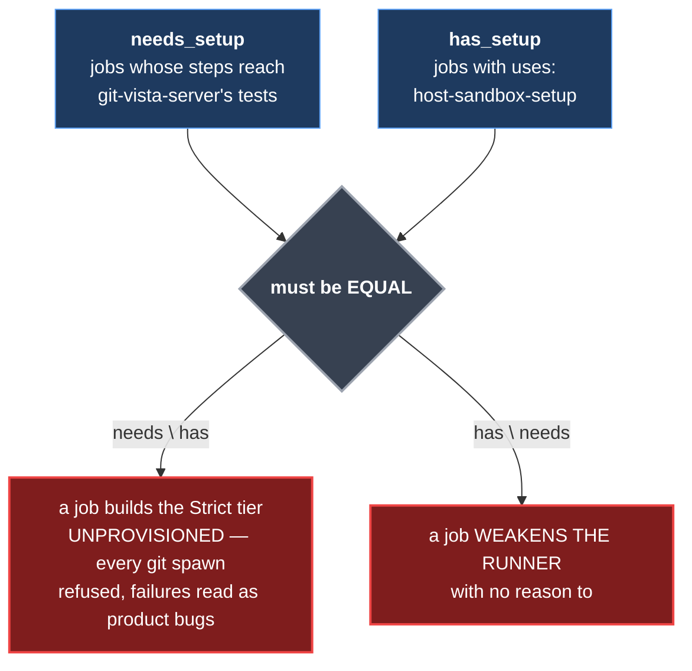
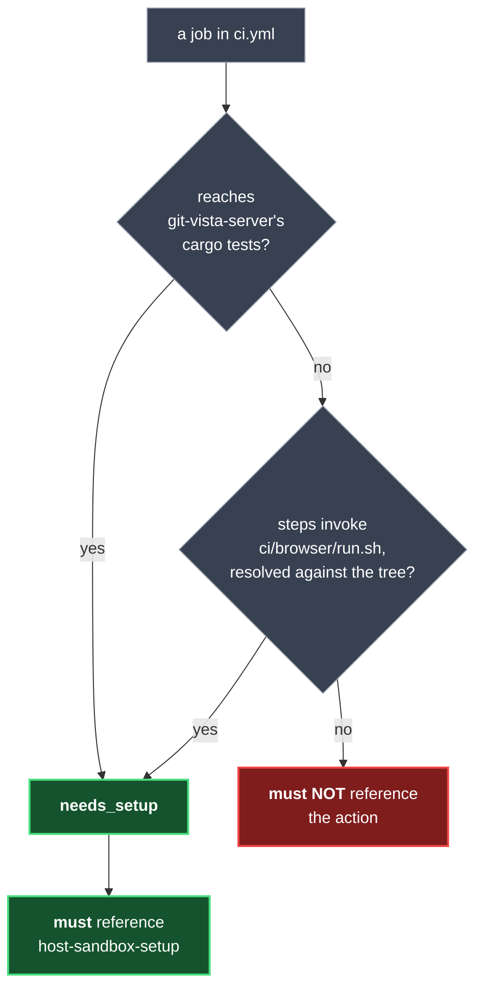
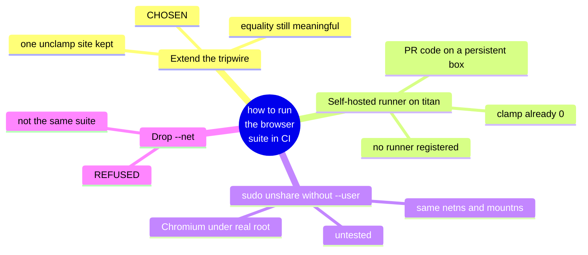
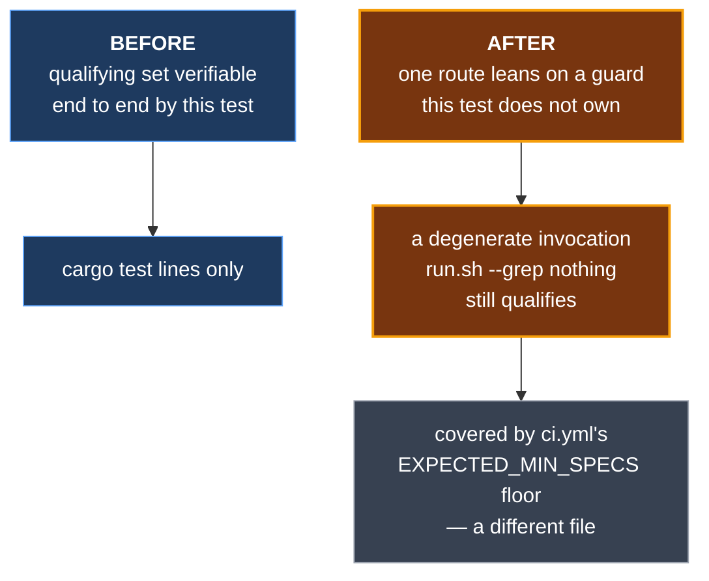

# ADR 0142 — A CI job may weaken the runner only for a named reason it still needs

- **Status:** Implemented — #754 adds the second qualifying route and the browser job that uses it.
- **Date:** 2026-09-08
- **Issue:** #754; refs #355, #66, #207
- **Extends:** [ADR 0029](0029-sandbox-tiers.md) — the Strict tier a host must be able to provide, and the refusal-rather-than-downgrade posture that makes provisioning load-bearing. Nothing in 0029 is retracted.
- **Related:** D6 Option A — the decision to lift the AppArmor clamp on CI runners *loudly* rather than fall through to a degraded run; its rationale is stated in `.github/actions/host-sandbox-setup/action.yml` itself, which also names the session design doc it came from. [ADR 0134](0134-two-censuses-that-must-agree-are-checked-against-each-other.md) (two halves of one relationship, checked against each other)

## Context

GitHub's `ubuntu-24.04` runner ships `kernel.apparmor_restrict_unprivileged_userns=1`. Under that clamp an unprivileged process cannot create a user namespace at all. `.github/actions/host-sandbox-setup` lifts it — deliberately, visibly, and failing loudly if the write does not take — because the sandbox's Strict tier cannot be constructed without it.

Lifting that clamp **weakens the runner**. It is acceptable only because GitHub-hosted runners are single-job ephemeral VMs, destroyed after the run. That is a property of the host, not of the repository, so the decision does not travel: the action's own file says not to copy it to a self-hosted or reused runner without revisiting.

Because the grant is real, the repository has always constrained *who may take it*. `escape_contract.rs`'s tripwire holds a **set equality** over `ci.yml`:



Equality rather than a subset is the point: the defect being fixed was two hand-maintained sides of one relationship drifting apart, and a subset check only ever sees one direction of that.

That rule was **binary** — a job provisions the host *iff* it runs this crate's Rust tests — and #754 met the first honest exception to it.

The browser suite (#355) is the only thing in CI that *runs* wasm; `cargo test` never compiles a line behind `#[cfg(target_arch = "wasm32")]`. It runs inside `unshare --user --map-root-user --net --mount`, because the server's listen port is a **compile-time constant** and `parse_bind_addr` refuses any other address on purpose — a test server cannot simply pick a free port. So it needs `user_namespaces`: the same capability the Strict tier needs, for a different reason.

Measured on CI run 34268833753, before any change:

```
kernel: 6.17.0-1022-azure                                  (ubuntu-24.04)
kernel.apparmor_restrict_unprivileged_userns = 1
unshare: write failed /proc/self/uid_map: Operation not permitted
```

The browser job therefore fell between the two halves of the equality — it needed the provisioning, and taking it would have fired the tripwire.

## Decision

**A second qualifying route, keyed on a named entrypoint, and nothing else changes.**

`needs_setup` becomes: jobs that reach this crate's Rust tests, **plus** jobs that actually invoke `ci/browser/run.sh`.



Four properties make this narrow rather than a hole:

1. **Keyed on an entrypoint, not a job name.** A name is cosmetic; renaming a job to `browser` must not buy it the right to weaken the runner. A job qualifies only by invoking the suite, and the invocation is resolved **against the tree** by `referenced_repo_scripts` — so prose, or a `.sh` token naming no real file, cannot qualify.
2. **`has_setup` is untouched.** The action remains the only permitted provisioning mechanism, and `ci.yml` still may not spell any `HOST_SETUP_TOKENS` in a step of its own. This widens *who may provision*, never *what provisioning is* or *where it lives*.
3. **The premise is asserted, not assumed.** `ci/browser/run.sh` must still contain `unshare`. The grant exists because the suite needs a namespace; if the script is rewritten so it does not, the privilege must be re-argued rather than inherited.
4. **The route is anti-vacuity checked.** If no job qualifies through it, the test fails by name — a qualifying route that qualifies nobody is a hole standing open for the next job that happens to mention the script.

## Alternatives considered



- **Drop `--net` and let the suite share the runner's loopback.** Refused outright. A suite without its network namespace is a different suite, and CI would stop testing what local runs test. This was never a candidate; it is recorded because it is the tempting one.
- **A self-hosted runner on titan**, where the clamp is already `0`. Needs no repository change at all — but no self-hosted runner is registered, and a self-hosted runner executing pull-request code is a materially different security surface from an ephemeral VM. That is a decision about infrastructure, not about this test.
- **`sudo unshare --net --mount` without `--user`.** Real root holds the capabilities outright, so the two namespaces the suite depends on would be identical and its isolation would not be reduced. Rejected as the primary route because it is untested and moves Chromium from a mapped root to a real one, where its own sandbox may behave differently; kept as the fallback if the tripwire's owner would rather not widen its model.
- **Widen the rule to "workflow jobs may reference host-provisioning actions."** This is the shape that would have turned the guard into a rubber stamp — it names a *category*, so any future job could qualify by adding a `uses:` line. Rejected explicitly.

## Consequences

**What is gained.** The browser suite can run in CI at all, which is the point: it is the only job that executes wasm, and two mechanisms already on `main` (#745's central mechanism, and ADR 0006's implementation) merged on a green CI that never exercised them.

**What it costs — and every widening of a guard costs something.**



1. **A degenerate invocation still qualifies.** A job running `ci/browser/run.sh --grep nothing` reads exactly like one running the whole suite: this test sees an *invocation*, not an *execution*. What covers that is `ci.yml`'s own `EXPECTED_MIN_SPECS` floor — a different guard, in a different file, which a later edit could weaken without this test noticing. Before #754 the qualifying set was one this test could verify end to end; now one of its two routes leans on a guard it does not own.
2. **A trailing comment can qualify a job.** `without_full_line_comments` strips whole-line `#` comments by design, so a token naming the entrypoint in a *trailing* comment survives the strip and resolves against the tree exactly like a real invocation. Found by an outside reviewer (a different model family) as a **surviving mutation**: add the `uses:` *and* a trailing comment naming the script, and a job that runs nothing qualifies. It is a property of scanning tokens rather than parsing invocations, shared with the older `cargo test` route — but this decision widened its reach, so it is recorded rather than left implicit. Accidental drift, a bare `uses:` with no such token, still fails; defeating this takes a deliberate comment.
3. **The set of jobs permitted to weaken the runner grew by one class.** That is the intent, not an accident — but it is strictly more than before.
4. **The tripwire does not read `run.sh`'s semantics**, only that it still contains `unshare`. A script that kept the token while ceasing to depend on a namespace would keep the privilege.

None of these is hidden: each is written into the test's own doc comment, next to the code that causes it.

**How the extension was proven.** A guard that is widened and not re-proven must be assumed broken. Four mutations, each caught, each failing through a *different* assertion:

| mutation | caught by |
|---|---|
| remove the new route (`if false`) | the named anti-vacuity assertion |
| widen it to always (`if true`) | the equality — four jobs dragged into `needs_setup` |
| give `audit` the action (the **original defect class**) | the equality — the other direction |
| strip `unshare` from `run.sh` | the premise assertion |

The third is the one that matters most: the case the tripwire was built for still fires, unchanged.

**Signed:** max · 2026-09-08T16:05:00-04:00
